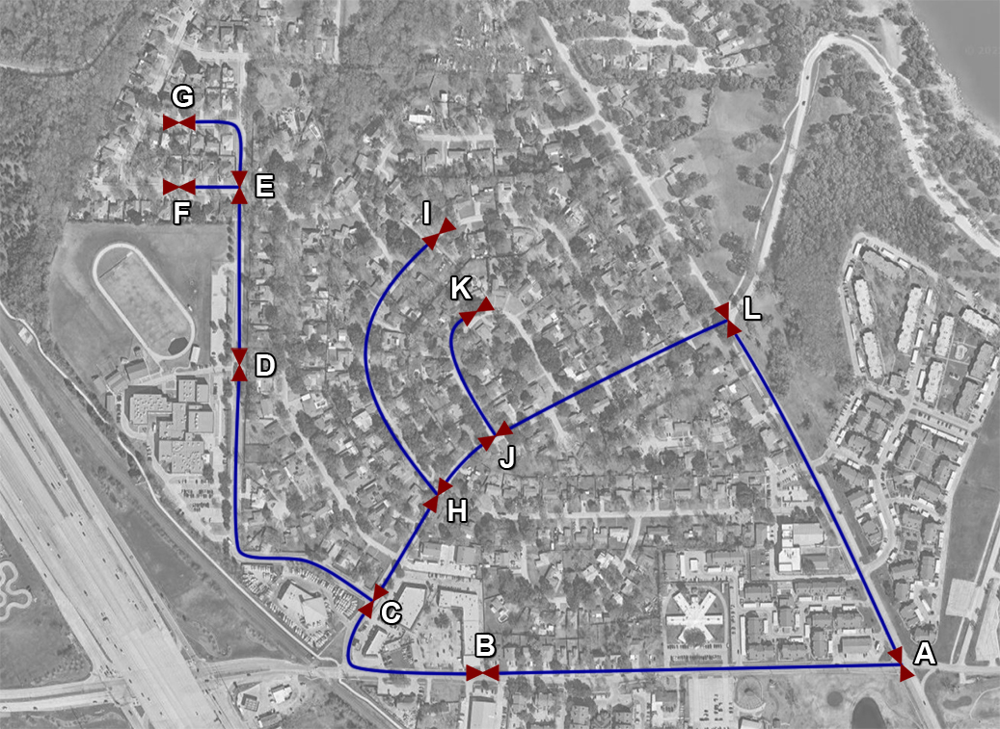
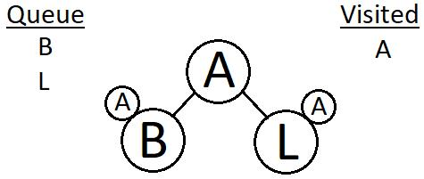
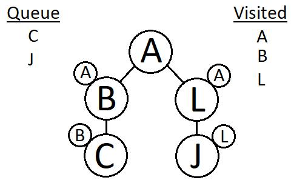
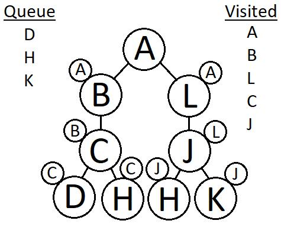
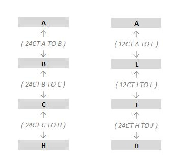
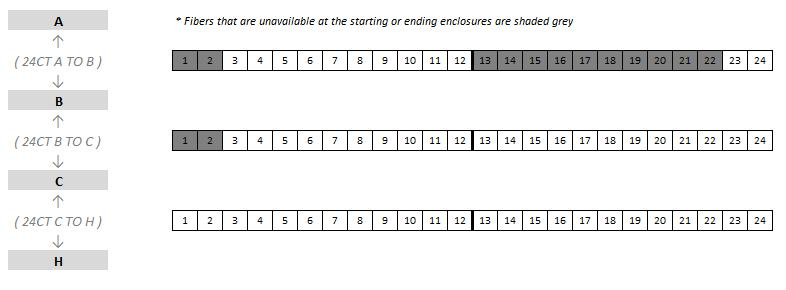

## Application Of The Breadth First Search Algorithm For Fiber Splicing
>**Prepared by:** David Rommel  
**Date:** 2025/03/29

### Abstract
This report is the accumulation of my personal research into adapting the Breadth 
First Search algorithm to find the shortest path between two splice enclosures.  My 
example parses data from a distribution splice report, however I feel the code can 
easily be ported over to a built-in utility in Magellan.  I feel a native implementation 
of this algorithm in Magellan would produce more efficient splicing, prevent user error, 
and vastly decrease design time.

### Breadth First Search Algorithm
I used a variation of the Breadth First Search Algorithm, which includes a visited 
queue for my macro.  First the user is prompted to select a starting enclosure and 
a destination.  Below is a theoretical map with enclosures named A through L.  A 
lasso would be drawn around this region in Magellan, and a distribution splice report 
would be created, which would include splicing information for these enclosures.

For this example, say we wanted to find the shortest path between enclosures A 
and H.  First the starting enclosure, enclosure A in this example, is added to 
the queue.  The algorithm will continue running until there is nothing left in 
the queue, or until the destination enclosure is reached.  For illustration 
purposes, the enclosures will be represented by circles encompassing the enclosure name.

From the distribution splice report, the splice report for enclosure A is analyzed.  The 
splice report for enclosure A contains two sheaths: one connecting enclosures A 
and B, and another connecting enclosures A and L.  There is a variable for each 
enclosure object that stores its parent enclosure(s).  These variables will be 
used to build the path from the destination enclosure to the starting enclosure 
at the end of the algorithm.  In the diagram below, the parents are indicated by 
a smaller circle encompassing the parent enclosure name.  The parents of B and L 
will be set to A.  A is then added to the visited list.  Enclosures on the visited 
list will not be added back to the queue.

The splice reports for enclosures B and L are then analyzed.  The splice report 
for enclosure B contains two sheaths: one connecting enclosures B and A, and another 
connecting enclosures B and C.  Since enclosure A is already in the visited list, 
only enclosure C will be added to the queue.  The splice report for enclosure L 
has two sheaths: one connecting enclosures L and A, and another connecting enclosures 
L and J.  Since enclosure A is already in the visited list, only enclosure J will 
be added to the queue.  The parent of enclosure C will be set to B, and the parent 
of enclosure J will be set to L.  Enclosures B and L are then removed from the 
queue and added to the visited list.

The splice reports for enclosures C and J are then analyzed.  The splice report 
for enclosure C contains three sheaths: one connecting enclosures C and B, another 
connecting enclosures C and D, and a third connecting enclosures C and H.  Since 
enclosure B is already in the visited list, only enclosures D and H are added to 
the queue.  The splice report for enclosure J contains three sheaths: one connecting 
enclosures J and L, another connecting enclosures J and H, and a third connecting 
enclosures J and K.  Since enclosure L is already on the visited list, only 
enclosures H and K are added to the queue.  The parent of enclosure D is set to C, 
the parent of enclosure H is set to C and J, and the parent of enclosure K is set 
to J.  Enclosures C and J are then removed from the queue and added to the visited list.

The algorithm can keep going until the queue is empty, or end at this point since 
the goal was reached.  Note that enclosure H has two parents, C and J.  There will 
be instances where there are two shortest paths of the same length so the parent 
variable will need to be stored as an array or collection.

To produce the path(s) between the two enclosures, start at the destination, which 
is H in this example, look for its parent(s), and keep going in that manner until 
the starting enclosure is reached.

>H → Parent is C → Parent of C is B → Parent B is A  
H → Parent is J → Parent of J is L → Parent of L is A

Note that enclosure H has two parents, C and J, which means there will at least be 
two paths.  Every time there are multiple parents for one of the enclosures an 
additional path object will be created.  Supporting multiple paths was probably 
the most difficult part of designing this macro.  Refer to the class module PathFinder 
and the sub routine CreatePath() for how I implemented this in VBA, by using nested 
loops and creating objects dynamically.  The result of this algorithm is that the 
two shortest paths between enclosures A and H are: A,B,C,H and A,L,J,H.

A limitation of this algorithm is that it will only return the shortest path with 
the least number of splices.  Fiber availability may require an alternate longer 
path, however in most instances the shortest path will be the most optimal.

After detecting the path(s) the macro will then produce a new workbook, showing 
the enclosures and the sheaths that connect them.  If there are multiple paths, 
they will be displayed in separate worksheets of the newly created workbook.  If 
there are multiple sheaths connecting two enclosures they will be displayed on 
separate lines, in parentheses, between the two enclosures.

In the most recent version of the macro I added the capability to display 
available fibers as well.

The buffer sizes are calculated from the splice reports, and displayed as heavy 
lines on the output.  The buffer sizes are all twelve for the three sheaths 
displayed on the previous page.  Fibers that are already spliced in the splice 
report are shaded gray, and available fibers are not shaded.

### Limitations of the Excel Implementation
The main limitation with relying solely on the distribution splice report is that 
the algorithm can only display fibers which are not spliced in the splice report as 
being available.  A Magellan port of this algorithm would also be able to trace the 
individual fibers that do not have sub-circuits on them, and if they terminate at an 
enclosure, and do not go to a device, then they could be marked available as 
well.  I also neglected to reference enclosures and sheaths by UUID when designing 
this macro.  Doing so would prevent errors in areas where there are identically 
named sheaths and/or enclosures.

### Conclusion
As I stated in the abstract, I feel this algorithm could be implemented in Magellan 
with relative ease.  It could be configured to either produce output similar to mine, 
to guide a designer in making the required splices, or advanced implementations could 
completely automate the majority of a fiber design.  An advanced implementation 
could even go so far as to generate a complete MOP, which could be used by construction 
to perform the splices in the field.  Having the splicing mostly automated would 
prevent designers from disconnecting fibers that they should not disconnect, limit 
unnecessary fiber changes, produce splicing consistent with what construction is 
expecting, and vastly reduce the time and skill required to complete fiber 
designs.  A specialized version of this algorithm could be created just for 
Fiber-To-The-Home extensions, and automatically perform splicing to the nearest 
splitter which has available ports.  This version would be particularly advantageous 
for construction, as the coordinator could use the utility in Magellan to show them 
what splicing to make in the field, negating the necessity of creating a design 
request for a simple extension or port activation. 
