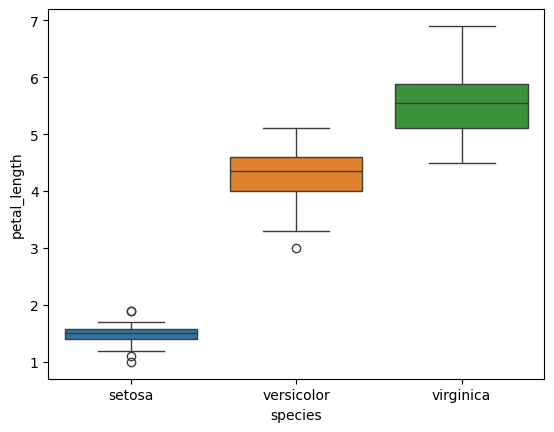

## Automatic Feature Selection For Multiple Regression

While I was working on the [Dallas-Fort Worth School Performance](https://github.com/DavidRommel/Portfolio/blob/main/Dallas_Fort_Worth_School_Performance/README.md) case study, I thought about how to devise an automated method of selecting the independent variables which would result in the highest adjusted r-squared value.  I could probably use lasso regression to accomplish this, but decided to try a brute force approach.  My function is rather CPU-intensive, since it creates regression models for each possible combination of the dependent variables.

For example:
* 3 possible dependent variables will result in 6 combinations
* 5 possible dependent variables will result in 30 combinations
* 10 possible dependent variables will result in 1022 combinations

For each of those combinations, a regression model is created and the adjusted r-squared value is calculated, then the correlation between each of the pairs of independent predictor variables is also calculated.  This can result in rather long processing times when you have many predictor variables.  I added progress indicators to give an indication of how much time is remaining for each of those proceedures.  It would take a substantial amount of time to calculate results for a dataset with many predictor variables though.

### Imports  
---

* The `anova_lm` function, from statsmodels, is used to determine whether a categorical and numerical variable are correlated with each other.
* The `chi2_contingency` function, from SciPy, is used to perform a Chi-square test for independence on two categorical variables, to determine whether they are correlated with each other.
* The `ols` function, from statsmodels, is use to model the regressions and calculate the adjusted r-squared value.
* The `combinations` function, from itertools, is used to generate all of the possible combinations of independent variables.  It is also used to generate all of the combinations of two independent variables for each combination.


```python
import numpy as np
import pandas as pd
import matplotlib.pyplot as plt
import seaborn as sns

from statsmodels.formula.api import ols
from statsmodels.stats.anova import anova_lm
from scipy.stats import chi2_contingency

from itertools import combinations
from pandas.api.types import is_numeric_dtype, is_categorical_dtype
```

### Function code
---


```python
def select_variables(X, y, min_threshold = 0.4, max_threshold = 0.4):
    '''
    Description
    
    Parameters
    ----------
    X : pandas.DataFrame
        A dataframe consisting of The independent predictor variables
    y : pandas.Series
        A series consisting of the dependent variable
    min_threshold : float, default: 0.4
        The minimum required correlation between an independent variable and the dependent variable
    max_threshold : float, default: 0.4
        The maximum allowed correlation between two independent variables

    Returns
    -------
    result_df : pandas.DataFrame
        A dataframe consisting of the independent variables, adjusted r-squared value, 
        and maximum correlation between the independent variables
    '''
    # Exit function if dependent variable is NOT numerical
    if (not is_numeric_dtype(y)):
        print('ERROR: Dependent variable \'{}\' must be numerical'.format(y.name))
        return None
    
    # Drop independent variables that are NOT numerical or categorical
    for col in X.columns:
        if (not isinstance(X[col].dtype, pd.CategoricalDtype)) & (not is_numeric_dtype(df[col])):
            X = X.drop(columns = [col])            
            print('WARNING: Independent variable \'{}\' was not numerical or categorical so it was dropped'.format(col))

    # Drop independent variables less than the min_threshold
    data = pd.concat([y,X], axis = 1)
    data.dropna(inplace=True)
    correlations = data.corr(numeric_only=True).abs().loc[y.name].drop(y.name)
    for i in correlations.index:
        if correlations.loc[i] < min_threshold:
            print('WARNING: Independent variable \'{}\' dropped ({:.3f} < {:.2f})'.format(i, correlations.loc[i], min_threshold))
            X = X.drop(columns = [i])
            data = data.drop(columns = [i])
    
    # create a list of all possible variable combinations
    variable_list = []
    for i in range(1, X.shape[0] + 1):
        for j in combinations(X.columns, i):
            variable_list.append(j)

    # calculate adjusted r-squared values for each variable combination
    print('Calculating adjusted R-squared values...')
    percent_multiplier = 100 / len(variable_list) # percent complete for each combination
    percent_complete = 0
    rsquared_values = []
    categorical_variables = []
    
    for f in variable_list:
        print('{:.2f}%'.format(percent_complete), end = '\r', flush = True) # display percentage complete
        
        # add C() to categorical variables for formula
        new_variables = []
        for col in f:
            if data[col].dtype == 'category':
                new_variables.append('C(' + col + ')')
                categorical_variables.append(col)
            else:
                new_variables.append(col)    
                
        # calculate adjusted r-squared value for variable combination
        ols_formula = y.name + ' ~ ' + ' + '.join(new_variables)
        OLS = ols(formula = ols_formula, data = data)
        model = OLS.fit()
        rsquared_values.append(model.rsquared_adj)
        percent_complete += percent_multiplier # percentage complete
        
    # build dataframe of the variable combinations and their adjusted r-squared values
    result_df = pd.DataFrame({'variables' : variable_list, 'r_squared' : rsquared_values})
    
    # filter out rows with an adjusted r-squared value of less than 0
    result_df = result_df[result_df['r_squared'] > 0].copy()

    # The set() removes duplicates, this set will be referenced to check if a variable is categorical
    categorical_variables = set(categorical_variables)
    
    # sort results from highest adjusted r-squared value to the lowest
    result_df = result_df.sort_values(by = ['r_squared'], ascending = False).reset_index(drop = True)

    
    # calculate the correlation between each independent variable for each formula row
    print('Calculating correlation between independent variables...')
    percent_multiplier = 100 / result_df.shape[0]
    percent_complete = 0
    correlation_list = [] # list of the lists of correlations between independent variables for each combination
    
    for i in range(result_df.shape[0]): # each combination of variables
        print('{:.2f}%'.format(percent_complete), end = '\r', flush = True)  # display percentage complete
        
        variable_correlation = [] # empty list to store the correlations between each independent variable
        for j in combinations(result_df.loc[i,'variables'],2): # create all possible combinations of two variables
            if (j[0] in categorical_variables) & (j[1] in categorical_variables): # both variables are categorical
                # Chi-square test for independence
                # check if two categorical variables are correlated
                result = chi2_contingency(pd.crosstab(data[j[0]], data[j[1]]))
                if result[1] < 0.05:
                    variable_correlation.append(1) # correlated
                else:
                    variable_correlation.append(0) # not correlated
            elif (j[0] in categorical_variables) | (j[1] in categorical_variables): # one variable is categorical
                # ANOVA test
                # check if a categorical and numerical independent variable are correlated
                if j[0] in categorical_variables:
                    ols_formula = ' ~ '.join([j[1], j[0]])
                else:
                    ols_formula = ' ~ '.join([j[0], j[1]])
                model = ols(formula = ols_formula, data = data).fit()
                results = anova_lm(model, typ = 2)
                p_value = results.loc[results.index[0],'PR(>F)']
                if p_value < 0.05:
                    variable_correlation.append(1) # correlated
                else:
                    variable_correlation.append(0) # not correlated
            else:
                # neither variables are categorical
                variable_correlation.append(data.loc[:, j].corr().abs().iloc[0,1].item()) # j is a combination of two columns
        correlation_list.append(variable_correlation)
        percent_complete += percent_multiplier # percentage complete
    print('        ') # remove last percentage from display
    
    # iterate though lists of correlations and calculate the maximum value from each nested list
    max_corr_list = []
    for i in correlation_list:
        if len(i) > 0:
            max_corr_list.append(max(i))
        else: # single variables will have an empty list
            max_corr_list.append(0)
    
    result_df['max_corr'] = max_corr_list

    # filter results that have a max correlation of greater than the threshold (0.4) and select the first record
    return result_df[result_df['max_corr'] <= max_threshold].reset_index(drop = True).copy()
```

### Testing Function
---
Before taking a more in-depth look at the individual components of the `select_variables()` function, I first wanted to show a few examples of its usage using common practice datasets.

In the `diamonds` dataset, all of the independent predictor variables were strongly correlated with each other.  The hypothesis tests for all of the combinations involving categorical variables resulted in a p-value of less than 0.05, indicating they were likely correlated.  Two of the independent variables, `depth` and `table`, were dropped because they had a correlation of less than 0.4 with the dependent variable, `price`.  The best variable to use for predicting `price` was determined to be the `carat` variable.


```python
df = sns.load_dataset('diamonds')
df_y = df['price'].copy()
df_x = df.drop(columns = ['price']).copy()
result = select_variables(df_x, df_y, 0.4, 0.4)
result
```

    WARNING: Independent variable 'depth' dropped (0.011 < 0.40)
    WARNING: Independent variable 'table' dropped (0.127 < 0.40)
    Calculating adjusted R-squared values...
    Calculating correlation between independent variables...
            

<table border="1" class="dataframe">
  <thead>
    <tr style="text-align: right;">
      <th></th>
      <th>variables</th>
      <th>r_squared</th>
      <th>max_corr</th>
    </tr>
  </thead>
  <tbody>
    <tr>
      <th>0</th>
      <td>(carat,)</td>
      <td>0.849328</td>
      <td>0.0</td>
    </tr>
    <tr>
      <th>1</th>
      <td>(x,)</td>
      <td>0.782222</td>
      <td>0.0</td>
    </tr>
    <tr>
      <th>2</th>
      <td>(y,)</td>
      <td>0.748949</td>
      <td>0.0</td>
    </tr>
    <tr>
      <th>3</th>
      <td>(z,)</td>
      <td>0.741746</td>
      <td>0.0</td>
    </tr>
    <tr>
      <th>4</th>
      <td>(color,)</td>
      <td>0.031168</td>
      <td>0.0</td>
    </tr>
    <tr>
      <th>5</th>
      <td>(clarity,)</td>
      <td>0.027024</td>
      <td>0.0</td>
    </tr>
    <tr>
      <th>6</th>
      <td>(cut,)</td>
      <td>0.012789</td>
      <td>0.0</td>
    </tr>
  </tbody>
</table>


For the the second test I used the penguins dataset.  The categorical variables in this dataset were saved as a string data type instead of a categorical data type.  This resulted in the `species`, `island`, and `sex` independent variables being dropped.  Based on the results of the function, the best variable to predict a penguins body mass was the flipper length.


```python
df = sns.load_dataset('penguins')
df_y = df['body_mass_g'].copy()
df_x = df.drop(columns = ['body_mass_g']).copy()
result = select_variables(df_x, df_y)
result
```

    WARNING: Independent variable 'species' was not numerical or categorical so it was dropped
    WARNING: Independent variable 'island' was not numerical or categorical so it was dropped
    WARNING: Independent variable 'sex' was not numerical or categorical so it was dropped
    Calculating adjusted R-squared values...
    Calculating correlation between independent variables...
            

<table border="1" class="dataframe">
  <thead>
    <tr style="text-align: right;">
      <th></th>
      <th>variables</th>
      <th>r_squared</th>
      <th>max_corr</th>
    </tr>
  </thead>
  <tbody>
    <tr>
      <th>0</th>
      <td>(flipper_length_mm,)</td>
      <td>0.758284</td>
      <td>0.000000</td>
    </tr>
    <tr>
      <th>1</th>
      <td>(bill_length_mm, bill_depth_mm)</td>
      <td>0.467727</td>
      <td>0.235053</td>
    </tr>
    <tr>
      <th>2</th>
      <td>(bill_length_mm,)</td>
      <td>0.352256</td>
      <td>0.000000</td>
    </tr>
    <tr>
      <th>3</th>
      <td>(bill_depth_mm,)</td>
      <td>0.220418</td>
      <td>0.000000</td>
    </tr>
  </tbody>
</table>


If the categorical columns are changed to the `category` data type, then they are no longer dropped by the function.  Once these changes are made, the combined `species` and `sex` variables account for 84.5% of the variance in the penguins body mass.


```python
df_x['species'] = df_x['species'].astype('category')
df_x['island'] = df_x['island'].astype('category')
df_x['sex'] = df_x['sex'].astype('category')
result = select_variables(df_x, df_y)
result
```

    Calculating adjusted R-squared values...
    Calculating correlation between independent variables...
            

<table border="1" class="dataframe">
  <thead>
    <tr style="text-align: right;">
      <th></th>
      <th>variables</th>
      <th>r_squared</th>
      <th>max_corr</th>
    </tr>
  </thead>
  <tbody>
    <tr>
      <th>0</th>
      <td>(species, sex)</td>
      <td>0.845396</td>
      <td>0.000000</td>
    </tr>
    <tr>
      <th>1</th>
      <td>(flipper_length_mm,)</td>
      <td>0.761373</td>
      <td>0.000000</td>
    </tr>
    <tr>
      <th>2</th>
      <td>(species,)</td>
      <td>0.672516</td>
      <td>0.000000</td>
    </tr>
    <tr>
      <th>3</th>
      <td>(island, sex)</td>
      <td>0.560820</td>
      <td>0.000000</td>
    </tr>
    <tr>
      <th>4</th>
      <td>(bill_length_mm, bill_depth_mm)</td>
      <td>0.464237</td>
      <td>0.228626</td>
    </tr>
    <tr>
      <th>5</th>
      <td>(island,)</td>
      <td>0.385319</td>
      <td>0.000000</td>
    </tr>
    <tr>
      <th>6</th>
      <td>(bill_length_mm,)</td>
      <td>0.345481</td>
      <td>0.000000</td>
    </tr>
    <tr>
      <th>7</th>
      <td>(bill_depth_mm,)</td>
      <td>0.220451</td>
      <td>0.000000</td>
    </tr>
    <tr>
      <th>8</th>
      <td>(sex,)</td>
      <td>0.178138</td>
      <td>0.000000</td>
    </tr>
  </tbody>
</table>


If the dependent variable is not a numeric data type, like in the example below, the function will display an error message and stop execution.


```python
df_y = df['species'].copy() # dependent variable
df_x = df.drop(columns = ['species']).copy()
result = select_variables(df_x, df_y)
result
```

    ERROR: Dependent variable 'species' must be numerical


The last example is using the `iris` dataset.  Like with the `penguins` dataset, the `species` column was saved as a string instead of a categorical data type.  After changing the column to the correct type, it ended up being the strongest predictor of an Iris plant's pedal length, explaining 94% of the variation.  It appears that the ANOVA tests concluded that the `species` variable was correlated with each of the other independent predictor variables, so it is not paired with any other variables.


```python
df = sns.load_dataset('iris')
df['species'] = df['species'].astype('category')

df_y = df['petal_length'].copy()
df_x = df.drop(columns = ['petal_length']).copy()
result = select_variables(df_x, df_y)
result
```

    Calculating adjusted R-squared values...
    Calculating correlation between independent variables...
            

<table border="1" class="dataframe">
  <thead>
    <tr style="text-align: right;">
      <th></th>
      <th>variables</th>
      <th>r_squared</th>
      <th>max_corr</th>
    </tr>
  </thead>
  <tbody>
    <tr>
      <th>0</th>
      <td>(species,)</td>
      <td>0.940574</td>
      <td>0.000000</td>
    </tr>
    <tr>
      <th>1</th>
      <td>(sepal_width, petal_width)</td>
      <td>0.932863</td>
      <td>0.366126</td>
    </tr>
    <tr>
      <th>2</th>
      <td>(petal_width,)</td>
      <td>0.926617</td>
      <td>0.000000</td>
    </tr>
    <tr>
      <th>3</th>
      <td>(sepal_length, sepal_width)</td>
      <td>0.865886</td>
      <td>0.117570</td>
    </tr>
    <tr>
      <th>4</th>
      <td>(sepal_length,)</td>
      <td>0.758333</td>
      <td>0.000000</td>
    </tr>
    <tr>
      <th>5</th>
      <td>(sepal_width,)</td>
      <td>0.178044</td>
      <td>0.000000</td>
    </tr>
  </tbody>
</table>


### Explaination of components of function
---

I will continue using the iris dataset to explain components of the `select_variables()` function.  Below are the values that would be passed to the function.
* `X` : A dataframe consisting of the independent predictor variables
* `y` : A series object consisting of the dependent variable
* `min_threshold` : The minimum required correlation between an independent variable and the dependent variable
* `max_threshold` : The maximum allowed correlation between two independent variables


```python
X = df_x
y = df_y
min_threshold = 0.4
max_threshold = 0.4
```

This first section of the function checks for the following:
* That the dependent variable is numerical
    * The return statement is commented out for this explaination
* That the independent variables are either numerical or categorical

It then checks the correlation of each of the independent variables with the dependent variable.  Independent variables whose correlation with the dependent variable is less than the `min_threshold` value, which has a default value of `0.4`, are dropped.  A warning is displayed for each of the variables that are dropped.  The `X` and `y` dataframes are combined into a single dataframe named `data` for use in the model creation later as well.

Finally, a list containing all of the possible combinations between the independent variables is created.


```python
# Exit function if dependent variable is NOT numerical
if (not is_numeric_dtype(y)):
    print('ERROR: Dependent variable \'{}\' must be numerical'.format(y.name))
    #return None

# Drop independent variables that are NOT numerical or categorical
for col in X.columns:
    if (not isinstance(X[col].dtype, pd.CategoricalDtype)) & (not is_numeric_dtype(df[col])):
        X = X.drop(columns = [col])            
        print('WARNING: Independent variable \'{}\' was not numerical or categorical so it was dropped'.format(col))

# Drop independent variables less than the min_threshold
data = pd.concat([y,X], axis = 1)
data.dropna(inplace=True)
correlations = data.corr(numeric_only=True).abs().loc[y.name].drop(y.name)
for i in correlations.index:
    if correlations.loc[i] < min_threshold:
        print('WARNING: Independent variable \'{}\' dropped ({:.3f} < {:.2f})'.format(i, correlations.loc[i], min_threshold))
        X = X.drop(columns = [i])
        data = data.drop(columns = [i])

# create a list of all possible variable combinations
variable_list = []
for i in range(1, X.shape[0] + 1):
    for j in combinations(X.columns, i):
        variable_list.append(j)
```

There were only four independent variables, which result in the following possible combinations.


```python
print('Independent variables: {}\n'.format(', '.join(df_x.columns)))
for i in variable_list:
    print(', '.join(i))
```

    Independent variables: sepal_length, sepal_width, petal_width, species
    
    sepal_length
    sepal_width
    petal_width
    species
    sepal_length, sepal_width
    sepal_length, petal_width
    sepal_length, species
    sepal_width, petal_width
    sepal_width, species
    petal_width, species
    sepal_length, sepal_width, petal_width
    sepal_length, sepal_width, species
    sepal_length, petal_width, species
    sepal_width, petal_width, species
    sepal_length, sepal_width, petal_width, species


The next section of code calculates the adjusted r-squared value for each of the combinations.  The `ols()` formula requires that categorical variables be enclosed in `C()` so there is a section to do that for those variables.  

The formula for each independent variable combination, from the `variable_list` above, is then created.  An ordinary least squares regression is then modeled for each formula and the adjusted r-squared value for each combination is saved to a list.  

Once all of adjusted r-squared values are calculated a dataframe consisting of those results is created.  The rows with an adjusted r-squared value of less than zero are filtered out and the dataframe is sorted by the adjusted r-squared values, so that the variable combinations with the highest value are at the top of the dataframe.


```python
# calculate adjusted r-squared values for each variable combination
print('Calculating adjusted R-squared values...')
percent_multiplier = 100 / len(variable_list) # percent complete for each combination
percent_complete = 0
rsquared_values = []
categorical_variables = []

for f in variable_list:
    print('{:.2f}%'.format(percent_complete), end = '\r', flush = True) # display percentage complete
    
    # add C() to categorical variables for formula
    new_variables = []
    for col in f:
        if data[col].dtype == 'category':
            new_variables.append('C(' + col + ')')
            categorical_variables.append(col)
        else:
            new_variables.append(col)    
            
    # calculate adjusted r-squared value for variable combination
    ols_formula = y.name + ' ~ ' + ' + '.join(new_variables)
    OLS = ols(formula = ols_formula, data = data)
    model = OLS.fit()
    rsquared_values.append(model.rsquared_adj)
    percent_complete += percent_multiplier # percentage complete
    
# build dataframe of the variable combinations and their adjusted r-squared values
result_df = pd.DataFrame({'variables' : variable_list, 'r_squared' : rsquared_values})

# filter out rows with an adjusted r-squared value of less than 0
result_df = result_df[result_df['r_squared'] > 0].copy()

# The set() removes duplicates, this set will be referenced to check if a variable is categorical
categorical_variables = set(categorical_variables)

# sort results from highest adjusted r-squared value to the lowest
result_df = result_df.sort_values(by = ['r_squared'], ascending = False).reset_index(drop = True)
```

    Calculating adjusted R-squared values...
    93.33%

The following is what the dataframe looks like so far.


```python
result_df
```


<table border="1" class="dataframe">
  <thead>
    <tr style="text-align: right;">
      <th></th>
      <th>variables</th>
      <th>r_squared</th>
    </tr>
  </thead>
  <tbody>
    <tr>
      <th>0</th>
      <td>(sepal_length, sepal_width, petal_width, species)</td>
      <td>0.977850</td>
    </tr>
    <tr>
      <th>1</th>
      <td>(sepal_length, petal_width, species)</td>
      <td>0.977232</td>
    </tr>
    <tr>
      <th>2</th>
      <td>(sepal_length, species)</td>
      <td>0.974379</td>
    </tr>
    <tr>
      <th>3</th>
      <td>(sepal_length, sepal_width, species)</td>
      <td>0.974246</td>
    </tr>
    <tr>
      <th>4</th>
      <td>(sepal_length, sepal_width, petal_width)</td>
      <td>0.967354</td>
    </tr>
    <tr>
      <th>5</th>
      <td>(sepal_width, petal_width, species)</td>
      <td>0.955634</td>
    </tr>
    <tr>
      <th>6</th>
      <td>(petal_width, species)</td>
      <td>0.954210</td>
    </tr>
    <tr>
      <th>7</th>
      <td>(sepal_width, species)</td>
      <td>0.948712</td>
    </tr>
    <tr>
      <th>8</th>
      <td>(sepal_length, petal_width)</td>
      <td>0.947823</td>
    </tr>
    <tr>
      <th>9</th>
      <td>(species,)</td>
      <td>0.940574</td>
    </tr>
    <tr>
      <th>10</th>
      <td>(sepal_width, petal_width)</td>
      <td>0.932863</td>
    </tr>
    <tr>
      <th>11</th>
      <td>(petal_width,)</td>
      <td>0.926617</td>
    </tr>
    <tr>
      <th>12</th>
      <td>(sepal_length, sepal_width)</td>
      <td>0.865886</td>
    </tr>
    <tr>
      <th>13</th>
      <td>(sepal_length,)</td>
      <td>0.758333</td>
    </tr>
    <tr>
      <th>14</th>
      <td>(sepal_width,)</td>
      <td>0.178044</td>
    </tr>
  </tbody>
</table>


The next section of code checks the correlation between each of the pairs of independent variables.  I conducted a chi-square test for independence for checking if two categorical variables are correlated with each other.  If the p-value was less than 0.05 for the test then I concluded that the two categorical variables were correlated with each other.


```python
# calculate the correlation between each independent variable for each formula row
#print('Calculating correlation between independent variables...')
percent_multiplier = 100 / result_df.shape[0]
percent_complete = 0
correlation_list = [] # list of the lists of correlations between independent variables for each combination

for i in range(result_df.shape[0]): # each combination of variables
    #print('{:.2f}%'.format(percent_complete), end = '\r', flush = True)  # display percentage complete
    variable_correlation = [] # empty list to store the correlations between each independent variable
    for j in combinations(result_df.loc[i,'variables'],2): # create all possible combinations of two variables
        if (j[0] in categorical_variables) & (j[1] in categorical_variables): # both variables are categorical
            # Chi-square test for independence
            # check if two categorical variables are correlated
            result = chi2_contingency(pd.crosstab(data[j[0]], data[j[1]]))
            if result[1] < 0.05:
                variable_correlation.append(1) # correlated
            else:
                variable_correlation.append(0) # not correlated
        elif (j[0] in categorical_variables) | (j[1] in categorical_variables): # one variable is categorical
            # ANOVA test
            # check if a categorical and numerical independent variable are correlated
            if j[0] in categorical_variables:
                ols_formula = ' ~ '.join([j[1], j[0]])
            else:
                ols_formula = ' ~ '.join([j[0], j[1]])
            model = ols(formula = ols_formula, data = data).fit()
            results = anova_lm(model, typ = 2)
            p_value = results.loc[results.index[0],'PR(>F)']
            if p_value < 0.05:
                variable_correlation.append(1) # correlated
            else:
                variable_correlation.append(0) # not correlated
        else:
            # neither variables are categorical
            variable_correlation.append(data.loc[:, j].corr().abs().iloc[0,1].item()) # j is a combination of two columns
    correlation_list.append(variable_correlation)
    percent_complete += percent_multiplier # percentage complete
```

The code above creates the correlation between each of the pairs of independent variables for each row.  This is not added to the dataframe in the function, however below it is added for clarity.


```python
df2 = pd.concat([result_df, pd.DataFrame({'variable_correlation' : correlation_list})], axis = 1)
df2
```


<table border="1" class="dataframe">
  <thead>
    <tr style="text-align: right;">
      <th></th>
      <th>variables</th>
      <th>r_squared</th>
      <th>variable_correlation</th>
    </tr>
  </thead>
  <tbody>
    <tr>
      <th>0</th>
      <td>(sepal_length, sepal_width, petal_width, species)</td>
      <td>0.977850</td>
      <td>[0.11756978413300088, 0.8179411262715758, 1, 0...</td>
    </tr>
    <tr>
      <th>1</th>
      <td>(sepal_length, petal_width, species)</td>
      <td>0.977232</td>
      <td>[0.8179411262715758, 1, 1]</td>
    </tr>
    <tr>
      <th>2</th>
      <td>(sepal_length, species)</td>
      <td>0.974379</td>
      <td>[1]</td>
    </tr>
    <tr>
      <th>3</th>
      <td>(sepal_length, sepal_width, species)</td>
      <td>0.974246</td>
      <td>[0.11756978413300088, 1, 1]</td>
    </tr>
    <tr>
      <th>4</th>
      <td>(sepal_length, sepal_width, petal_width)</td>
      <td>0.967354</td>
      <td>[0.11756978413300088, 0.8179411262715758, 0.36...</td>
    </tr>
    <tr>
      <th>5</th>
      <td>(sepal_width, petal_width, species)</td>
      <td>0.955634</td>
      <td>[0.3661259325364377, 1, 1]</td>
    </tr>
    <tr>
      <th>6</th>
      <td>(petal_width, species)</td>
      <td>0.954210</td>
      <td>[1]</td>
    </tr>
    <tr>
      <th>7</th>
      <td>(sepal_width, species)</td>
      <td>0.948712</td>
      <td>[1]</td>
    </tr>
    <tr>
      <th>8</th>
      <td>(sepal_length, petal_width)</td>
      <td>0.947823</td>
      <td>[0.8179411262715758]</td>
    </tr>
    <tr>
      <th>9</th>
      <td>(species,)</td>
      <td>0.940574</td>
      <td>[]</td>
    </tr>
    <tr>
      <th>10</th>
      <td>(sepal_width, petal_width)</td>
      <td>0.932863</td>
      <td>[0.3661259325364377]</td>
    </tr>
    <tr>
      <th>11</th>
      <td>(petal_width,)</td>
      <td>0.926617</td>
      <td>[]</td>
    </tr>
    <tr>
      <th>12</th>
      <td>(sepal_length, sepal_width)</td>
      <td>0.865886</td>
      <td>[0.11756978413300088]</td>
    </tr>
    <tr>
      <th>13</th>
      <td>(sepal_length,)</td>
      <td>0.758333</td>
      <td>[]</td>
    </tr>
    <tr>
      <th>14</th>
      <td>(sepal_width,)</td>
      <td>0.178044</td>
      <td>[]</td>
    </tr>
  </tbody>
</table>


Here is the first row of the previous dataframe expanded for illustrative purposes.  Many of the independent variables are highly correlated with each other, violating the no multicollinearity assumption for multiple regression, so this would not be a good combination of variables to use for a multiple regression model.


```python
c_list = []
for i in combinations(df2.loc[0, 'variables'],2):
    c_list.append(i)
pd.DataFrame({'combination' : c_list, 'correlation' : df2.loc[0, 'variable_correlation']})
```


<table border="1" class="dataframe">
  <thead>
    <tr style="text-align: right;">
      <th></th>
      <th>combination</th>
      <th>correlation</th>
    </tr>
  </thead>
  <tbody>
    <tr>
      <th>0</th>
      <td>(sepal_length, sepal_width)</td>
      <td>0.117570</td>
    </tr>
    <tr>
      <th>1</th>
      <td>(sepal_length, petal_width)</td>
      <td>0.817941</td>
    </tr>
    <tr>
      <th>2</th>
      <td>(sepal_length, species)</td>
      <td>1.000000</td>
    </tr>
    <tr>
      <th>3</th>
      <td>(sepal_width, petal_width)</td>
      <td>0.366126</td>
    </tr>
    <tr>
      <th>4</th>
      <td>(sepal_width, species)</td>
      <td>1.000000</td>
    </tr>
    <tr>
      <th>5</th>
      <td>(petal_width, species)</td>
      <td>1.000000</td>
    </tr>
  </tbody>
</table>


The last part of my code takes the maximum value from the correlations between each pair of independent variables and creates a new column with that value.  The values which have a maximum independent variable correlation of greater than the `max_threshold` value, which is the default of `0.4` here, are filtered out.  

I commented out the return statement from the function and replaced it with assignment to a new variable.  This final dataframe is what is returned from the actual function.


```python
max_corr_list = []
for i in correlation_list:
    if len(i) > 0:
        max_corr_list.append(max(i))
    else: # single variables will have an empty list
        max_corr_list.append(0)

result_df['max_corr'] = max_corr_list

# filter results that have a max correlation of greater than the threshold (0.4) and select the first record
#return result_df[result_df['max_corr'] <= max_threshold].reset_index(drop = True).copy()
return_df = result_df[result_df['max_corr'] <= max_threshold].reset_index(drop = True).copy()
```


```python
return_df
```


<table border="1" class="dataframe">
  <thead>
    <tr style="text-align: right;">
      <th></th>
      <th>variables</th>
      <th>r_squared</th>
      <th>max_corr</th>
    </tr>
  </thead>
  <tbody>
    <tr>
      <th>0</th>
      <td>(species,)</td>
      <td>0.940574</td>
      <td>0.000000</td>
    </tr>
    <tr>
      <th>1</th>
      <td>(sepal_width, petal_width)</td>
      <td>0.932863</td>
      <td>0.366126</td>
    </tr>
    <tr>
      <th>2</th>
      <td>(petal_width,)</td>
      <td>0.926617</td>
      <td>0.000000</td>
    </tr>
    <tr>
      <th>3</th>
      <td>(sepal_length, sepal_width)</td>
      <td>0.865886</td>
      <td>0.117570</td>
    </tr>
    <tr>
      <th>4</th>
      <td>(sepal_length,)</td>
      <td>0.758333</td>
      <td>0.000000</td>
    </tr>
    <tr>
      <th>5</th>
      <td>(sepal_width,)</td>
      <td>0.178044</td>
      <td>0.000000</td>
    </tr>
  </tbody>
</table>


```python
df['species'].value_counts()
```


    species
    setosa        50
    versicolor    50
    virginica     50
    Name: count, dtype: int64


When the first combination is modeled, the `species` of an Iris plant accounts for 94.1% of the variation in `petal_length`.  Holding other variables constant:  
* A `setosa` species is expected to have a petal length of `1.4620`
* A `versicolor` species is expected to have a petal length of `2.7980` more than a `setosa`
    * 1.4620 + 2.7980 = `4.26`
* A `virginica` species is expected to have a petal length of `4.0900` more than a `setosa`
    * 1.4620 + 4.0900 = `5.552`


```python
OLS = ols(formula = 'petal_length ~ species', data = df)
model = OLS.fit()
model.summary()
```


<table class="simpletable">
<caption>OLS Regression Results</caption>
<tr>
  <th>Dep. Variable:</th>      <td>petal_length</td>   <th>  R-squared:         </th> <td>   0.941</td>
</tr>
<tr>
  <th>Model:</th>                   <td>OLS</td>       <th>  Adj. R-squared:    </th> <td>   0.941</td>
</tr>
<tr>
  <th>Method:</th>             <td>Least Squares</td>  <th>  F-statistic:       </th> <td>   1180.</td>
</tr>
<tr>
  <th>Date:</th>             <td>Fri, 07 Nov 2025</td> <th>  Prob (F-statistic):</th> <td>2.86e-91</td>
</tr>
<tr>
  <th>Time:</th>                 <td>20:39:48</td>     <th>  Log-Likelihood:    </th> <td> -84.847</td>
</tr>
<tr>
  <th>No. Observations:</th>      <td>   150</td>      <th>  AIC:               </th> <td>   175.7</td>
</tr>
<tr>
  <th>Df Residuals:</th>          <td>   147</td>      <th>  BIC:               </th> <td>   184.7</td>
</tr>
<tr>
  <th>Df Model:</th>              <td>     2</td>      <th>                     </th>     <td> </td>   
</tr>
<tr>
  <th>Covariance Type:</th>      <td>nonrobust</td>    <th>                     </th>     <td> </td>   
</tr>
</table>
<table class="simpletable">
<tr>
            <td></td>               <th>coef</th>     <th>std err</th>      <th>t</th>      <th>P>|t|</th>  <th>[0.025</th>    <th>0.975]</th>  
</tr>
<tr>
  <th>Intercept</th>             <td>    1.4620</td> <td>    0.061</td> <td>   24.023</td> <td> 0.000</td> <td>    1.342</td> <td>    1.582</td>
</tr>
<tr>
  <th>species[T.versicolor]</th> <td>    2.7980</td> <td>    0.086</td> <td>   32.510</td> <td> 0.000</td> <td>    2.628</td> <td>    2.968</td>
</tr>
<tr>
  <th>species[T.virginica]</th>  <td>    4.0900</td> <td>    0.086</td> <td>   47.521</td> <td> 0.000</td> <td>    3.920</td> <td>    4.260</td>
</tr>
</table>
<table class="simpletable">
<tr>
  <th>Omnibus:</th>       <td> 4.394</td> <th>  Durbin-Watson:     </th> <td>   1.997</td>
</tr>
<tr>
  <th>Prob(Omnibus):</th> <td> 0.111</td> <th>  Jarque-Bera (JB):  </th> <td>   5.366</td>
</tr>
<tr>
  <th>Skew:</th>          <td> 0.122</td> <th>  Prob(JB):          </th> <td>  0.0683</td>
</tr>
<tr>
  <th>Kurtosis:</th>      <td> 3.894</td> <th>  Cond. No.          </th> <td>    3.73</td>
</tr>
</table><br/><br/>Notes:<br/>[1] Standard Errors assume that the covariance matrix of the errors is correctly specified.  
<br/><br/>

When boxplots of the different petal lengths grouped by `species` are plotted, this seems to back up the model results.  The `species` of an Iris plant is a strong predictor of its `petal_length`.


```python
sns.boxplot(data = df, y = 'petal_length', hue = 'species')
plt.show()
```


    

    

