# Dallas-Fort Worth School Clustering


```python
import numpy as np
import pandas as pd
import matplotlib.pyplot as plt
import seaborn as sns

from sklearn.cluster import KMeans
from sklearn.metrics import silhouette_score
from sklearn.preprocessing import StandardScaler
```

### Prepare Datasets
---

#### Join `CSTAF` Datasets
---


```python
Collin_CSTAF = pd.read_csv('datasets/Collin_CSTAF.csv')
Dallas_CSTAF = pd.read_csv('datasets/Dallas_CSTAF.csv')
Denton_CSTAF = pd.read_csv('datasets/Denton_CSTAF.csv')
Ellis_CSTAF = pd.read_csv('datasets/Ellis_CSTAF.csv')
Hood_CSTAF = pd.read_csv('datasets/Hood_CSTAF.csv')
Hunt_CSTAF = pd.read_csv('datasets/Hunt_CSTAF.csv')
Johnson_CSTAF = pd.read_csv('datasets/Johnson_CSTAF.csv')
Kaufman_CSTAF = pd.read_csv('datasets/Kaufman_CSTAF.csv')
Parker_CSTAF = pd.read_csv('datasets/Parker_CSTAF.csv')
Rockwall_CSTAF = pd.read_csv('datasets/Rockwall_CSTAF.csv')
Somervell_CSTAF = pd.read_csv('datasets/Somervell_CSTAF.csv')
Tarrant_CSTAF = pd.read_csv('datasets/Tarrant_CSTAF.csv')
Wise_CSTAF = pd.read_csv('datasets/Wise_CSTAF.csv')

CSTAF = pd.concat([Collin_CSTAF, Dallas_CSTAF, Denton_CSTAF, Ellis_CSTAF, Hood_CSTAF, Hunt_CSTAF, Johnson_CSTAF,
                   Kaufman_CSTAF, Parker_CSTAF, Rockwall_CSTAF, Somervell_CSTAF, Tarrant_CSTAF, Wise_CSTAF], axis = 0)

del [Collin_CSTAF, Dallas_CSTAF, Denton_CSTAF, Ellis_CSTAF, Hood_CSTAF, Hunt_CSTAF, Johnson_CSTAF, 
     Kaufman_CSTAF, Parker_CSTAF, Rockwall_CSTAF, Somervell_CSTAF, Tarrant_CSTAF, Wise_CSTAF]
```


```python
rename_dict = {
    'CAMPNAME' : 'campname', 
    'CAMPUS' : 'campus', 
    'CPSAMIFC' : 'campus_2024_staff_all_staff_minority_full_time_equiv_count', 
    'CPSAMIFP' : 'campus_2024_staff_all_staff_minority_full_time_equiv_percent', 
    'CPSATOFC' : 'campus_2024_staff_all_staff_total_full_time_equiv_count', 
    'CPSBTOFC' : 'campus_2024_staff_librarian_total_full_time_equiv_count', 
    'CPSBTOPC' : 'campus_2024_staff_librarian_total_part_time_equiv_count', 
    'CPSETOFC' : 'campus_2024_staff_educ_aide_total_full_time_equiv_count', 
    'CPSETOFP' : 'campus_2024_staff_educ_aide_total_full_time_equiv_percent', 
    'CPSHEXPA' : 'campus_2024_staff_principal_experience_average', 
    'CPSHTENA' : 'campus_2024_staff_principal_tenure_average', 
    'CPSLEXPA' : 'campus_2024_staff_assistant_principal_experience_average', 
    'CPSLTENA' : 'campus_2024_staff_assistant_principal_tenure_average', 
    'CPSOTOFC' : 'campus_2024_staff_contract_serv_total_full_time_equiv_count', 
    'CPSPTOFC' : 'campus_2024_staff_professional_total_full_time_equiv_count', 
    'CPSPTOFP' : 'campus_2024_staff_professional_total_full_time_equiv_percent', 
    'CPSRTOFC' : 'campus_2024_staff_counselor_total_full_time_equiv_count', 
    'CPSRTOPC' : 'campus_2024_staff_counselor_total_part_time_equiv_count', 
    'CPSSTOFC' : 'campus_2024_staff_school_admin_total_full_time_equiv_count', 
    'CPSSTOFP' : 'campus_2024_staff_school_admin_total_full_time_equiv_percent', 
    'CPSSTOSA' : 'campus_2024_staff_school_admin_total_base_salary_average', 
    'CPST00FC' : 'campus_2024_staff_teacher_beginning_full_time_equiv_count', 
    'CPST00FP' : 'campus_2024_staff_teacher_beginning_full_time_equiv_percent', 
    'CPST00SA' : 'campus_2024_staff_teacher_beginning_base_salary_average', 
    'CPST01FC' : 'campus_2024_staff_teacher_1_5_years_full_time_equiv_count', 
    'CPST01FP' : 'campus_2024_staff_teacher_1_5_years_full_time_equiv_percent', 
    'CPST01SA' : 'campus_2024_staff_teacher_1_5_years_base_salary_average', 
    'CPST06FC' : 'campus_2024_staff_teacher_6_10_years_full_time_equiv_count', 
    'CPST06FP' : 'campus_2024_staff_teacher_6_10_years_full_time_equiv_percent', 
    'CPST06SA' : 'campus_2024_staff_teacher_6_10_years_base_salary_average', 
    'CPST11FC' : 'campus_2024_staff_teacher_11_20_years_full_time_equiv_count', 
    'CPST11FP' : 'campus_2024_staff_teacher_11_20_years_full_time_equiv_percent', 
    'CPST11SA' : 'campus_2024_staff_teacher_11_20_years_base_salary_average', 
    'CPST21FC' : 'campus_2024_staff_teacher_21_30_years_full_time_equiv_count', 
    'CPST21FP' : 'campus_2024_staff_teacher_21_30_years_full_time_equiv_percent', 
    'CPST21SA' : 'campus_2024_staff_teacher_21_30_years_base_salary_average', 
    'CPST30FC' : 'campus_2024_staff_teacher_greater_30_years_full_time_equiv_count', 
    'CPST30FP' : 'campus_2024_staff_teacher_greater_30_years_full_time_equiv_percent', 
    'CPST30SA' : 'campus_2024_staff_teacher_greater_30_years_base_salary_average', 
    'CPSTASFC' : 'campus_2024_staff_teacher_asian_full_time_equiv_count', 
    'CPSTASFP' : 'campus_2024_staff_teacher_asian_full_time_equiv_percent', 
    'CPSTBAFC' : 'campus_2024_staff_teacher_ba_degree_full_time_equiv_count', 
    'CPSTBAFP' : 'campus_2024_staff_teacher_ba_degree_full_time_equiv_percent', 
    'CPSTBIFC' : 'campus_2024_staff_teacher_bilingual_program_full_time_equiv_count', 
    'CPSTBIFP' : 'campus_2024_staff_teacher_bilingual_program_full_time_equiv_percent', 
    'CPSTBLFC' : 'campus_2024_staff_teacher_african_american_full_time_equiv_count', 
    'CPSTBLFP' : 'campus_2024_staff_teacher_african_american_full_time_equiv_percent', 
    'CPSTCOFC' : 'campus_2024_staff_teacher_compensatory_program_full_time_equiv_count', 
    'CPSTCOFP' : 'campus_2024_staff_teacher_compensatory_program_full_time_equiv_percent', 
    'CPSTEXPA' : 'campus_2024_staff_teacher_experience_average', 
    'CPSTFEFC' : 'campus_2024_staff_teacher_female_full_time_equiv_count', 
    'CPSTFEFP' : 'campus_2024_staff_teacher_female_full_time_equiv_percent', 
    'CPSTGIFC' : 'campus_2024_staff_teacher_gifted_talented_program_full_time_equiv_count', 
    'CPSTGIFP' : 'campus_2024_staff_teacher_gifted_talented_program_full_time_equiv_percent', 
    'CPSTHIFC' : 'campus_2024_staff_teacher_hispanic_full_time_equiv_count', 
    'CPSTHIFP' : 'campus_2024_staff_teacher_hispanic_full_time_equiv_percent', 
    'CPSTINFC' : 'campus_2024_staff_teacher_american_indian_full_time_equiv_count', 
    'CPSTINFP' : 'campus_2024_staff_teacher_american_indian_full_time_equiv_percent', 
    'CPSTKIDR' : 'campus_2024_staff_teacher_student_ratio', 
    'CPSTMAFC' : 'campus_2024_staff_teacher_male_full_time_equiv_count', 
    'CPSTMAFP' : 'campus_2024_staff_teacher_male_full_time_equiv_percent', 
    'CPSTMSFC' : 'campus_2024_staff_teacher_ms_degree_full_time_equiv_count', 
    'CPSTMSFP' : 'campus_2024_staff_teacher_ms_degree_full_time_equiv_percent', 
    'CPSTNOFC' : 'campus_2024_staff_teacher_no_degree_full_time_equiv_count', 
    'CPSTNOFP' : 'campus_2024_staff_teacher_no_degree_full_time_equiv_percent', 
    'CPSTOPFC' : 'campus_2024_staff_teacher_other_full_time_equiv_count', 
    'CPSTOPFP' : 'campus_2024_staff_teacher_other_full_time_equiv_percent', 
    'CPSTPHFC' : 'campus_2024_staff_teacher_ph_degree_full_time_equiv_count', 
    'CPSTPHFP' : 'campus_2024_staff_teacher_ph_degree_full_time_equiv_percent', 
    'CPSTPIFC' : 'campus_2024_staff_teacher_pacific_islander_full_time_equiv_count', 
    'CPSTPIFP' : 'campus_2024_staff_teacher_pacific_islander_full_time_equiv_percent', 
    'CPSTREFC' : 'campus_2024_staff_teacher_regular_program_full_time_equiv_count', 
    'CPSTREFP' : 'campus_2024_staff_teacher_regular_program_full_time_equiv_percent', 
    'CPSTSPFC' : 'campus_2024_staff_teacher_special_education_full_time_equiv_count', 
    'CPSTSPFP' : 'campus_2024_staff_teacher_special_education_full_time_equiv_percent', 
    'CPSTTENA' : 'campus_2024_staff_teacher_tenure_average', 
    'CPSTTOFC' : 'campus_2024_staff_teacher_total_full_time_equiv_count', 
    'CPSTTOFP' : 'campus_2024_staff_teacher_total_full_time_equiv_percent', 
    'CPSTTOSA' : 'campus_2024_staff_teacher_total_base_salary_average', 
    'CPSTTWFC' : 'campus_2024_staff_teacher_two_or_more_races_full_time_equiv_count', 
    'CPSTTWFP' : 'campus_2024_staff_teacher_two_or_more_races_full_time_equiv_percent', 
    'CPSTVOFC' : 'campus_2024_staff_teacher_career_technical_prgms_full_time_equiv_count', 
    'CPSTVOFP' : 'campus_2024_staff_teacher_career_technical_prgms_full_time_equiv_percent', 
    'CPSTWHFC' : 'campus_2024_staff_teacher_white_full_time_equiv_count', 
    'CPSTWHFP' : 'campus_2024_staff_teacher_white_full_time_equiv_percent', 
    'CPSUTOFC' : 'campus_2024_staff_support_total_full_time_equiv_count', 
    'CPSUTOFP' : 'campus_2024_staff_support_total_full_time_equiv_percent', 
    'CPSUTOSA' : 'campus_2024_staff_support_total_base_salary_average'
}
```


```python
CSTAF = CSTAF.rename(columns = rename_dict)
```

#### Join `CSTUD` Datasets
---


```python
Collin_CSTUD = pd.read_csv('datasets/Collin_CSTUD.csv')
Dallas_CSTUD = pd.read_csv('datasets/Dallas_CSTUD.csv')
Denton_CSTUD = pd.read_csv('datasets/Denton_CSTUD.csv')
Ellis_CSTUD = pd.read_csv('datasets/Ellis_CSTUD.csv')
Hood_CSTUD = pd.read_csv('datasets/Hood_CSTUD.csv')
Hunt_CSTUD = pd.read_csv('datasets/Hunt_CSTUD.csv')
Johnson_CSTUD = pd.read_csv('datasets/Johnson_CSTUD.csv')
Kaufman_CSTUD = pd.read_csv('datasets/Kaufman_CSTUD.csv')
Parker_CSTUD = pd.read_csv('datasets/Parker_CSTUD.csv')
Rockwall_CSTUD = pd.read_csv('datasets/Rockwall_CSTUD.csv')
Somervell_CSTUD = pd.read_csv('datasets/Somervell_CSTUD.csv')
Tarrant_CSTUD = pd.read_csv('datasets/Tarrant_CSTUD.csv')
Wise_CSTUD = pd.read_csv('datasets/Wise_CSTUD.csv')

CSTUD = pd.concat([Collin_CSTUD, Dallas_CSTUD, Denton_CSTUD, Ellis_CSTUD, Hood_CSTUD, Hunt_CSTUD, Johnson_CSTUD,
                   Kaufman_CSTUD, Parker_CSTUD, Rockwall_CSTUD, Somervell_CSTUD, Tarrant_CSTUD, Wise_CSTUD], axis = 0)

del [Collin_CSTUD, Dallas_CSTUD, Denton_CSTUD, Ellis_CSTUD, Hood_CSTUD, Hunt_CSTUD, Johnson_CSTUD, 
     Kaufman_CSTUD, Parker_CSTUD, Rockwall_CSTUD, Somervell_CSTUD, Tarrant_CSTUD, Wise_CSTUD]
```


```python
rename_dict = {
    'CAMPNAME' : 'campname', 
    'CAMPUS' : 'county_district_campus_number', 
    'CPCTENGA' : 'campus_2024_class_size_sec_english_avg_size', 
    'CPCTFLAA' : 'campus_2024_class_size_sec_for_lng_avg_size', 
    'CPCTG01A' : 'campus_2024_class_size_grade_1_avg_size', 
    'CPCTG02A' : 'campus_2024_class_size_grade_2_avg_size', 
    'CPCTG03A' : 'campus_2024_class_size_grade_3_avg_size', 
    'CPCTG04A' : 'campus_2024_class_size_grade_4_avg_size', 
    'CPCTG05A' : 'campus_2024_class_size_grade_5_avg_size', 
    'CPCTG06A' : 'campus_2024_class_size_grade_6_avg_size', 
    'CPCTGKGA' : 'campus_2024_class_size_kindergarten_avg_size', 
    'CPCTGMEA' : 'campus_2024_class_size_mixed_elem_avg_size', 
    'CPCTMATA' : 'campus_2024_class_size_sec_math_avg_size', 
    'CPCTSCIA' : 'campus_2024_class_size_sec_sci_avg_size', 
    'CPCTSOCA' : 'campus_2024_class_size_sec_soc_stud_avg_size', 
    'CPEMALLC' : 'campus_2024_student_membership_2023_mobility_all_students_count', 
    'CPEMALLP' : 'campus_2024_student_membership_2023_mobility_all_students_percent', 
    'CPEMASIC' : 'campus_2024_student_membership_2023_mobility_asian_count', 
    'CPEMASIP' : 'campus_2024_student_membership_2023_mobility_asian_percent', 
    'CPEMBLAC' : 'campus_2024_student_membership_2023_mobility_african_american_count', 
    'CPEMBLAP' : 'campus_2024_student_membership_2023_mobility_african_american_percent', 
    'CPEMECOC' : 'campus_2024_student_membership_2023_mobility_econ_disadv_count', 
    'CPEMECOP' : 'campus_2024_student_membership_2023_mobility_econ_disadv_percent', 
    'CPEMECOT' : 'campus_2024_student_membership_2023_mobility_econ_disadv_denominator', 
    'CPEMHISC' : 'campus_2024_student_membership_2023_mobility_hispanic_count', 
    'CPEMHISP' : 'campus_2024_student_membership_2023_mobility_hispanic_percent', 
    'CPEMINDC' : 'campus_2024_student_membership_2023_mobility_american_indian_count', 
    'CPEMINDP' : 'campus_2024_student_membership_2023_mobility_american_indian_percent', 
    'CPEMLEPC' : 'campus_2024_student_membership_2023_mobility_eb_el_count', 
    'CPEMLEPP' : 'campus_2024_student_membership_2023_mobility_eb_el_percent', 
    'CPEMLEPT' : 'campus_2024_student_membership_2023_mobility_eb_el_denominator', 
    'CPEMPCIC' : 'campus_2024_student_membership_2023_mobility_pacific_islander_count', 
    'CPEMPCIP' : 'campus_2024_student_membership_2023_mobility_pacific_islander_percent', 
    'CPEMSPEC' : 'campus_2024_student_membership_2023_mobility_special_ed_count', 
    'CPEMSPEP' : 'campus_2024_student_membership_2023_mobility_special_ed_percent', 
    'CPEMSPET' : 'campus_2024_student_membership_2023_mobility_special_ed_denominator', 
    'CPEMTWOC' : 'campus_2024_student_membership_2023_mobility_two_or_more_races_count', 
    'CPEMTWOP' : 'campus_2024_student_membership_2023_mobility_two_or_more_races_percent', 
    'CPEMWHIC' : 'campus_2024_student_membership_2023_mobility_white_count', 
    'CPEMWHIP' : 'campus_2024_student_membership_2023_mobility_white_percent', 
    'CPERRA1R' : 'campus_2023_retention_regular_ed_01_rate', 
    'CPERRA2R' : 'campus_2023_retention_regular_ed_02_rate', 
    'CPERRA3R' : 'campus_2023_retention_regular_ed_03_rate', 
    'CPERRA4R' : 'campus_2023_retention_regular_ed_04_rate', 
    'CPERRA5R' : 'campus_2023_retention_regular_ed_05_rate', 
    'CPERRA6R' : 'campus_2023_retention_regular_ed_06_rate', 
    'CPERRA7R' : 'campus_2023_retention_regular_ed_07_rate', 
    'CPERRA8R' : 'campus_2023_retention_regular_ed_08_rate', 
    'CPERRA9R' : 'campus_2023_retention_regular_ed_09_rate', 
    'CPERRAKR' : 'campus_2023_retention_regular_ed_kg_rate', 
    'CPERSA1R' : 'campus_2023_retention_special_ed_01_rate', 
    'CPERSA2R' : 'campus_2023_retention_special_ed_02_rate', 
    'CPERSA3R' : 'campus_2023_retention_special_ed_03_rate', 
    'CPERSA4R' : 'campus_2023_retention_special_ed_04_rate', 
    'CPERSA5R' : 'campus_2023_retention_special_ed_05_rate', 
    'CPERSA6R' : 'campus_2023_retention_special_ed_06_rate', 
    'CPERSA7R' : 'campus_2023_retention_special_ed_07_rate', 
    'CPERSA8R' : 'campus_2023_retention_special_ed_08_rate', 
    'CPERSA9R' : 'campus_2023_retention_special_ed_09_rate', 
    'CPERSAKR' : 'campus_2023_retention_special_ed_kg_rate', 
    'CPET504C' : 'campus_2024_student_membership_section_504_count', 
    'CPET504P' : 'campus_2024_student_membership_section_504_percent', 
    'CPETALLC' : 'campus_2024_student_membership_all_students_count', 
    'CPETASIC' : 'campus_2024_student_membership_asian_count', 
    'CPETASIP' : 'campus_2024_student_membership_asian_percent', 
    'CPETATTC' : 'campus_2024_student_membership_2022_23_attrition_all_students_count', 
    'CPETATTD' : 'campus_2024_student_membership_2022_23_attrition_all_students_denominator', 
    'CPETATTP' : 'campus_2024_student_membership_2022_23_attrition_all_students_percent', 
    'CPETBILC' : 'campus_2024_student_membership_bilingual_esl_count', 
    'CPETBILP' : 'campus_2024_student_membership_bilingual_esl_percent', 
    'CPETBLAC' : 'campus_2024_student_membership_african_american_count', 
    'CPETBLAP' : 'campus_2024_student_membership_african_american_percent', 
    'CPETDISC' : 'campus_2023_daep_count', 
    'CPETDISP' : 'campus_2023_daep_percent', 
    'CPETDSLC' : 'campus_2024_student_membership_dyslexia_count', 
    'CPETDSLP' : 'campus_2024_student_membership_dyslexia_percent', 
    'CPETECOC' : 'campus_2024_student_membership_econ_disadv_count', 
    'CPETECOP' : 'campus_2024_student_membership_econ_disadv_percent', 
    'CPETFEMC' : 'campus_2024_student_membership_female_count', 
    'CPETFEMP' : 'campus_2024_student_membership_female_percent', 
    'CPETFOSC' : 'campus_2024_student_membership_foster_care_count', 
    'CPETFOSP' : 'campus_2024_student_membership_foster_care_percent', 
    'CPETG01C' : 'campus_2024_student_membership_01_count', 
    'CPETG01P' : 'campus_2024_student_membership_01_percent', 
    'CPETG02C' : 'campus_2024_student_membership_02_count', 
    'CPETG02P' : 'campus_2024_student_membership_02_percent', 
    'CPETG03C' : 'campus_2024_student_membership_03_count', 
    'CPETG03P' : 'campus_2024_student_membership_03_percent', 
    'CPETG04C' : 'campus_2024_student_membership_04_count', 
    'CPETG04P' : 'campus_2024_student_membership_04_percent', 
    'CPETG05C' : 'campus_2024_student_membership_05_count', 
    'CPETG05P' : 'campus_2024_student_membership_05_percent', 
    'CPETG06C' : 'campus_2024_student_membership_06_count', 
    'CPETG06P' : 'campus_2024_student_membership_06_percent', 
    'CPETG07C' : 'campus_2024_student_membership_07_count', 
    'CPETG07P' : 'campus_2024_student_membership_07_percent', 
    'CPETG08C' : 'campus_2024_student_membership_08_count', 
    'CPETG08P' : 'campus_2024_student_membership_08_percent', 
    'CPETG09C' : 'campus_2024_student_membership_09_count', 
    'CPETG09P' : 'campus_2024_student_membership_09_percent', 
    'CPETG10C' : 'campus_2024_student_membership_10_count', 
    'CPETG10P' : 'campus_2024_student_membership_10_percent', 
    'CPETG11C' : 'campus_2024_student_membership_11_count', 
    'CPETG11P' : 'campus_2024_student_membership_11_percent', 
    'CPETG12C' : 'campus_2024_student_membership_12_count', 
    'CPETG12P' : 'campus_2024_student_membership_12_percent', 
    'CPETGEEC' : 'campus_2024_student_membership_ee_count', 
    'CPETGEEP' : 'campus_2024_student_membership_ee_percent', 
    'CPETGIFC' : 'campus_2024_student_membership_gifted_talented_count', 
    'CPETGIFP' : 'campus_2024_student_membership_gifted_talented_percent', 
    'CPETGKNC' : 'campus_2024_student_membership_kg_count', 
    'CPETGKNP' : 'campus_2024_student_membership_kg_percent', 
    'CPETGP3C' : 'campus_2024_student_membership_pk_ages_3_and_under_count', 
    'CPETGP3P' : 'campus_2024_student_membership_pk_ages_3_and_under_percent', 
    'CPETGP4C' : 'campus_2024_student_membership_pk_ages_4_and_over_count', 
    'CPETGP4P' : 'campus_2024_student_membership_pk_ages_4_and_over_percent', 
    'CPETGPKC' : 'campus_2024_student_membership_pk_count', 
    'CPETGPKP' : 'campus_2024_student_membership_pk_percent', 
    'CPETHISC' : 'campus_2024_student_membership_hispanic_count', 
    'CPETHISP' : 'campus_2024_student_membership_hispanic_percent', 
    'CPETHOMC' : 'campus_2024_student_membership_homeless_count', 
    'CPETHOMP' : 'campus_2024_student_membership_homeless_percent', 
    'CPETIMMC' : 'campus_2024_student_membership_immigrant_count', 
    'CPETIMMP' : 'campus_2024_student_membership_immigrant_percent', 
    'CPETINDC' : 'campus_2024_student_membership_american_indian_count', 
    'CPETINDP' : 'campus_2024_student_membership_american_indian_percent', 
    'CPETLEPC' : 'campus_2024_student_membership_eb_el_count', 
    'CPETLEPP' : 'campus_2024_student_membership_eb_el_percent', 
    'CPETMALC' : 'campus_2024_student_membership_male_count', 
    'CPETMALP' : 'campus_2024_student_membership_male_percent', 
    'CPETMIGC' : 'campus_2024_student_membership_migrant_count', 
    'CPETMIGP' : 'campus_2024_student_membership_migrant_percent', 
    'CPETMLCC' : 'campus_2024_student_membership_military_connected_count', 
    'CPETMLCP' : 'campus_2024_student_membership_military_connected_percent', 
    'CPETNEDC' : 'campus_2024_student_membership_non_educationally_disadv_count', 
    'CPETNEDP' : 'campus_2024_student_membership_non_educationally_disadv_percent', 
    'CPETPCIC' : 'campus_2024_student_membership_pacific_islander_count', 
    'CPETPCIP' : 'campus_2024_student_membership_pacific_islander_percent', 
    'CPETRSKC' : 'campus_2024_student_membership_at_risk_count', 
    'CPETRSKP' : 'campus_2024_student_membership_at_risk_percent', 
    'CPETSAUC' : 'campus_2024_student_membership_autism_count', 
    'CPETSAUP' : 'campus_2024_student_membership_autism_percent', 
    'CPETSBHC' : 'campus_2024_student_membership_behavioral_disabilities_count', 
    'CPETSBHP' : 'campus_2024_student_membership_behavioral_disabilities_percent', 
    'CPETSIMC' : 'campus_2024_student_membership_total_students_with_disabilities_count', 
    'CPETSINC' : 'campus_2024_student_membership_intellectual_disabilities_count', 
    'CPETSINP' : 'campus_2024_student_membership_intellectual_disabilities_percent', 
    'CPETSNOC' : 'campus_2024_student_membership_non_categorical_early_childhood_count', 
    'CPETSNOP' : 'campus_2024_student_membership_non_categorical_early_childhood_percent', 
    'CPETSPEC' : 'campus_2024_student_membership_special_ed_count', 
    'CPETSPEP' : 'campus_2024_student_membership_special_ed_percent', 
    'CPETSPHC' : 'campus_2024_student_membership_physical_disabilities_count', 
    'CPETSPHP' : 'campus_2024_student_membership_physical_disabilities_percent', 
    'CPETTT1C' : 'campus_2024_student_membership_title_i_count', 
    'CPETTT1P' : 'campus_2024_student_membership_title_i_percent', 
    'CPETTWOC' : 'campus_2024_student_membership_two_or_more_races_count', 
    'CPETTWOP' : 'campus_2024_student_membership_two_or_more_races_percent', 
    'CPETWHIC' : 'campus_2024_student_membership_white_count', 
    'CPETWHIP' : 'campus_2024_student_membership_white_percent', 
    'CPST06SA' : 'campus_2024_staff_teacher_6_10_years_base_salary_average', 
    'CPST11SA' : 'campus_2024_staff_teacher_11_20_years_base_salary_average', 
    'CPST30SA' : 'campus_2024_staff_teacher_greater_30_years_base_salary_average', 
    'DISTNAME' : 'district_name', 
    'DISTRICT' : '6_digit_county_district_number', 
    'CPNTALLC' : 'campus_2022_23_total_students_count', 
    'CPNTALLP' : 'campus_2022_23_total_students_percent', 
    'CPNTASIC' : 'campus_2022_23_asian_students_count', 
    'CPNTASIP' : 'campus_2022_23_asian_students_percent', 
    'CPNTBILC' : 'campus_2022_23_bilingual_esl_education_students_count', 
    'CPNTBILP' : 'campus_2022_23_bilingual_esl_education_students_percent', 
    'CPNTBLAC' : 'campus_2022_23_african_american_students_count', 
    'CPNTBLAP' : 'campus_2022_23_african_american_students_percent', 
    'CPNTDSLC' : 'campus_2022_23_students_with_dyslexia_count', 
    'CPNTDSLP' : 'campus_2022_23_students_with_dyslexia_percent', 
    'CPNTECOC' : 'campus_2022_23_economically_disadvantaged_students_count', 
    'CPNTECOP' : 'campus_2022_23_economically_disadvantaged_students_percent', 
    'CPNTFEMC' : 'campus_2022_23_female_students_count', 
    'CPNTFEMP' : 'campus_2022_23_female_students_percent', 
    'CPNTFOSC' : 'campus_2022_23_foster_care_students_count', 
    'CPNTFOSP' : 'campus_2022_23_foster_care_students_percent', 
    'CPNTG01C' : 'campus_2022_23_grade_1_students_count', 
    'CPNTG01P' : 'campus_2022_23_grade_1_students_percent', 
    'CPNTG02C' : 'campus_2022_23_grade_2_students_count', 
    'CPNTG02P' : 'campus_2022_23_grade_2_students_percent', 
    'CPNTG03C' : 'campus_2022_23_grade_3_students_count', 
    'CPNTG03P' : 'campus_2022_23_grade_3_students_percent', 
    'CPNTG04C' : 'campus_2022_23_grade_4_students_count', 
    'CPNTG04P' : 'campus_2022_23_grade_4_students_percent', 
    'CPNTG05C' : 'campus_2022_23_grade_5_students_count', 
    'CPNTG05P' : 'campus_2022_23_grade_5_students_percent', 
    'CPNTG06C' : 'campus_2022_23_grade_6_students_count', 
    'CPNTG06P' : 'campus_2022_23_grade_6_students_percent', 
    'CPNTG07C' : 'campus_2022_23_grade_7_students_count', 
    'CPNTG07P' : 'campus_2022_23_grade_7_students_percent', 
    'CPNTG08C' : 'campus_2022_23_grade_8_students_count', 
    'CPNTG08P' : 'campus_2022_23_grade_8_students_percent', 
    'CPNTG09C' : 'campus_2022_23_grade_9_students_count', 
    'CPNTG09P' : 'campus_2022_23_grade_9_students_percent', 
    'CPNTG10C' : 'campus_2022_23_grade_10_students_count', 
    'CPNTG10P' : 'campus_2022_23_grade_10_students_percent', 
    'CPNTG11C' : 'campus_2022_23_grade_11_students_count', 
    'CPNTG11P' : 'campus_2022_23_grade_11_students_percent', 
    'CPNTG12C' : 'campus_2022_23_grade_12_students_count', 
    'CPNTG12P' : 'campus_2022_23_grade_12_students_percent', 
    'CPNTGEEC' : 'campus_2022_23_early_childhood_education_students_count', 
    'CPNTGEEP' : 'campus_2022_23_early_childhood_education_students_percent', 
    'CPNTGIFC' : 'campus_2022_23_gifted_talented_education_students_count', 
    'CPNTGIFP' : 'campus_2022_23_gifted_talented_education_students_percent', 
    'CPNTGKNC' : 'campus_2022_23_kindergarten_students_count', 
    'CPNTGKNP' : 'campus_2022_23_kindergarten_students_percent', 
    'CPNTGPKC' : 'campus_2022_23_pre_kindergarten_students_count', 
    'CPNTGPKP' : 'campus_2022_23_pre_kindergarten_students_percent', 
    'CPNTHISC' : 'campus_2022_23_hispanic_students_count', 
    'CPNTHISP' : 'campus_2022_23_hispanic_students_percent', 
    'CPNTHOMC' : 'campus_2022_23_homeless_students_count', 
    'CPNTHOMP' : 'campus_2022_23_homeless_students_percent', 
    'CPNTIMMC' : 'campus_2022_23_immigrant_students_count', 
    'CPNTIMMP' : 'campus_2022_23_immigrant_students_percent', 
    'CPNTINDC' : 'campus_2022_23_american_indian_students_count', 
    'CPNTINDP' : 'campus_2022_23_american_indian_students_percent', 
    'CPNTLEPC' : 'campus_2022_23_emergent_bilingual_english_learner_students_count', 
    'CPNTLEPP' : 'campus_2022_23_emergent_bilingual_english_learner_students_percent', 
    'CPNTMALC' : 'campus_2022_23_male_students_count', 
    'CPNTMALP' : 'campus_2022_23_male_students_percent', 
    'CPNTMIGC' : 'campus_2022_23_migrant_students_count', 
    'CPNTMIGP' : 'campus_2022_23_migrant_students_percent', 
    'CPNTMLCC' : 'campus_2022_23_military_connected_students_count', 
    'CPNTMLCP' : 'campus_2022_23_military_connected_students_percent', 
    'CPNTNEDC' : 'campus_2022_23_non_educationally_disadvantaged_students_count', 
    'CPNTNEDP' : 'campus_2022_23_non_educationally_disadvantaged_students_percent', 
    'CPNTPCIC' : 'campus_2022_23_pacific_islander_students_count', 
    'CPNTPCIP' : 'campus_2022_23_pacific_islander_students_percent', 
    'CPNTRSKC' : 'campus_2022_23_at_risk_students_count', 
    'CPNTRSKP' : 'campus_2022_23_at_risk_students_percent', 
    'CPNTSPEC' : 'campus_2022_23_special_education_students_count', 
    'CPNTSPEP' : 'campus_2022_23_special_education_students_percent', 
    'CPNTTT1C' : 'campus_2022_23_title_i_students_count', 
    'CPNTTT1P' : 'campus_2022_23_title_i_students_percent', 
    'CPNTTWOC' : 'campus_2022_23_two_or_more_races_students_count', 
    'CPNTTWOP' : 'campus_2022_23_two_or_more_races_students_percent', 
    'CPNTWHIC' : 'campus_2022_23_white_students_count', 
    'CPNTWHIP' : 'campus_2022_23_white_students_percent'
}
```


```python
CSTUD = CSTUD.rename(columns = rename_dict)
```

#### Create `state_school_id` field
---


```python
# CSTUD
CSTUD.dropna(subset = ['6_digit_county_district_number', 'county_district_campus_number'], inplace = True)

CSTUD['6_digit_county_district_number'] = CSTUD['6_digit_county_district_number'].astype(int).astype(str)
CSTUD['county_district_campus_number'] = CSTUD['county_district_campus_number'].astype(int).astype(str)

CSTUD['state_school_id'] = ('TX-'+ CSTUD['6_digit_county_district_number'].str.zfill(6) + 
                                         '-' + CSTUD['county_district_campus_number'].str.zfill(9))

# CSTAF
CSTAF.dropna(subset = ['DISTRICT', 'campus'], inplace = True)

CSTAF['DISTRICT'] = CSTAF['DISTRICT'].astype(int).astype(str)
CSTAF['campus'] = CSTAF['campus'].astype(int).astype(str)

CSTAF['state_school_id'] = ('TX-'+ CSTAF['DISTRICT'].str.zfill(6) + 
                                         '-' + CSTAF['campus'].str.zfill(9))

```


```python
CSTUD = CSTUD.drop(columns = CSTUD.iloc[:,np.r_[0:4, 153:157, 205:207]].columns)
CSTAF = CSTAF.drop(columns = CSTAF.iloc[:,np.r_[0:4]].columns)
```

#### Combine `dfw_high_school_scores` with student and staff datasets
---


```python
dfw_high_school_scores = pd.read_csv('datasets/dfw_high_school_scores.csv')
df = dfw_high_school_scores.merge(CSTAF, on = 'state_school_id', how = 'inner')
df = df.merge(CSTUD, on = 'state_school_id', how = 'inner')
```

#### Clean combined dataset
---


```python
# convert from string objects to numeric data
df[df.iloc[:,np.r_[5:325]].columns] = df[df.iloc[:,np.r_[5:325]].columns].apply(pd.to_numeric, errors = 'coerce')
```


```python
# remove columns with the majority of the values missing
missing_values = df.isna().sum(axis = 0).reset_index()
remove_columns = missing_values[missing_values[0] >= 250]['index'].values
df = df.drop(columns = remove_columns)
```


```python
# display remaining columns with missing values
missing_values = df.isna().sum(axis = 0).reset_index()
remove_columns = missing_values[missing_values[0] > 0]['index'].values
print(remove_columns)
```

    ['campus_2024_staff_support_total_base_salary_average'
     'campus_2024_staff_teacher_beginning_base_salary_average'
     'campus_2024_staff_teacher_6_10_years_base_salary_average'
     'campus_2024_staff_teacher_21_30_years_base_salary_average'
     'campus_2024_staff_teacher_greater_30_years_base_salary_average'
     'campus_2023_retention_regular_ed_09_rate'
     'campus_2023_retention_special_ed_09_rate'
     'campus_2024_student_membership_2022_23_attrition_all_students_count'
     'campus_2024_student_membership_2022_23_attrition_all_students_denominator'
     'campus_2024_student_membership_2022_23_attrition_all_students_percent'
     'campus_2024_class_size_sec_english_avg_size'
     'campus_2024_class_size_sec_math_avg_size'
     'campus_2024_class_size_sec_sci_avg_size'
     'campus_2024_class_size_sec_soc_stud_avg_size'
     'campus_2024_class_size_sec_for_lng_avg_size']


```python
# drop all columns except for the average class sizes
df = df.drop(columns = remove_columns[:10])
```


```python
# display high schools with missing class size data
for i in df[df.isna().any(axis = 1)]['campus'].values:
    print(i)
```

    Early College H S
    School Of Science And Engineering
    Marvin E Robinson School Of Business And Mgmt
    School Of Health Professions
    Rosie Sorrells Education And Social Services H S
    Judge Barefoot Sanders Law Magnet
    The Lagrone Academy
    Celeste H S
    Poolville H S
    Arlington Collegiate H S
    Arlington College And Career H S
    Eastern Hills H S
    Grapevine-Colleyville Collegiate Academy At Tcc Ne
    Tccse Early College H S At Timberview


```python
# drop the high schools listed above
df = df.drop(index = (df[df.isna().any(axis = 1)].index)).reset_index(drop = True)
```

### Clustering schools
---


```python
df_subset = df.iloc[:,np.r_[4, 102, 103]].copy()

for col in df_subset.columns:
    print(col)
```

    number_of_students
    campus_2024_student_membership_eb_el_percent
    campus_2024_student_membership_econ_disadv_percent


```python
fig, axes = plt.subplots(1,3, figsize = (15,4))

sns.scatterplot(data = df, x = 'number_of_students', y = 'overall_score', ax = axes[0])
axes[0].set_xlabel('Number of Students')
axes[0].set_ylabel('Overall Score')

sns.scatterplot(data = df, x = 'campus_2024_student_membership_eb_el_percent', y = 'overall_score', ax = axes[1])
axes[1].set_xlabel('Emergent Bilingual Students %')
axes[1].set_ylabel('Overall Score')

sns.scatterplot(data = df, x = 'campus_2024_student_membership_econ_disadv_percent', y = 'overall_score', ax = axes[2])
axes[2].set_xlabel('Economically Disadvantaged Students %')
axes[2].set_ylabel('Overall Score')

plt.show()
```


    
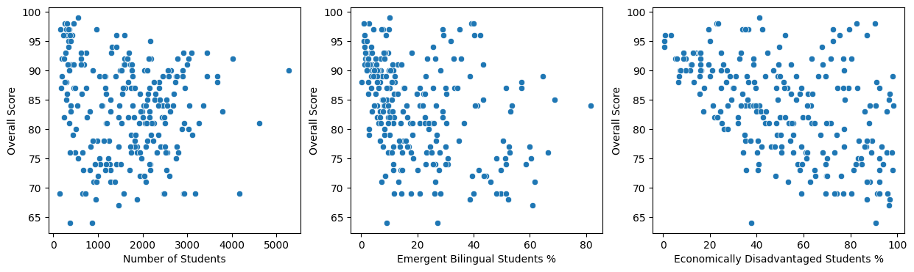
    


#### Scale data
---


```python
df_subset_scaled = StandardScaler().fit_transform(df_subset)
```


```python
pd.DataFrame(df_subset_scaled, columns = df_subset.columns).head(10)
```


<div>
<style scoped>
    .dataframe tbody tr th:only-of-type {
        vertical-align: middle;
    }

    .dataframe tbody tr th {
        vertical-align: top;
    }

    .dataframe thead th {
        text-align: right;
    }
</style>
<table border="1" class="dataframe">
  <thead>
    <tr style="text-align: right;">
      <th></th>
      <th>number_of_students</th>
      <th>campus_2024_student_membership_eb_el_percent</th>
      <th>campus_2024_student_membership_econ_disadv_percent</th>
    </tr>
  </thead>
  <tbody>
    <tr>
      <th>0</th>
      <td>3.720118</td>
      <td>-0.786730</td>
      <td>-1.548607</td>
    </tr>
    <tr>
      <th>1</th>
      <td>0.031056</td>
      <td>-0.631974</td>
      <td>-1.450145</td>
    </tr>
    <tr>
      <th>2</th>
      <td>-0.181219</td>
      <td>-0.518883</td>
      <td>-0.200441</td>
    </tr>
    <tr>
      <th>3</th>
      <td>-0.505816</td>
      <td>-0.834348</td>
      <td>-1.226713</td>
    </tr>
    <tr>
      <th>4</th>
      <td>-1.012804</td>
      <td>-0.417697</td>
      <td>0.087370</td>
    </tr>
    <tr>
      <th>5</th>
      <td>0.343287</td>
      <td>-0.596261</td>
      <td>-1.060086</td>
    </tr>
    <tr>
      <th>6</th>
      <td>0.382444</td>
      <td>-0.965295</td>
      <td>-1.612985</td>
    </tr>
    <tr>
      <th>7</th>
      <td>0.510222</td>
      <td>-1.084338</td>
      <td>-1.783400</td>
    </tr>
    <tr>
      <th>8</th>
      <td>0.068153</td>
      <td>-0.965295</td>
      <td>-1.533459</td>
    </tr>
    <tr>
      <th>9</th>
      <td>0.467973</td>
      <td>-1.042673</td>
      <td>-1.393340</td>
    </tr>
  </tbody>
</table>
</div>


#### Determine optimal number of clusters
---


```python
inertia = []
sil_score = []
for i in range(2,11):
    kms = KMeans(n_clusters = i, random_state = 42)
    kms.fit(df_subset_scaled)
    inertia.append(kms.inertia_)
    sil_score.append(silhouette_score(df_subset_scaled, kms.labels_))
```


```python
fig, axes = plt.subplots(1,2, figsize = (10,4))

sns.lineplot(x = [i for i in range(2, 11)], y = inertia, marker = 'o', ax = axes[0])
axes[0].set_xlabel('Number of Clusters')
axes[0].set_ylabel('Inertia')
axes[0].set_title('Elbow Plot')

sns.lineplot(x = [i for i in range(2,11)], y = sil_score, marker = 'o', ax = axes[1])
axes[1].set_xlabel('Number of Clusters')
axes[1].set_ylabel('Silhouette Score')
axes[1].set_title('Silhouette Plot')

plt.tight_layout()
plt.show()
```


    
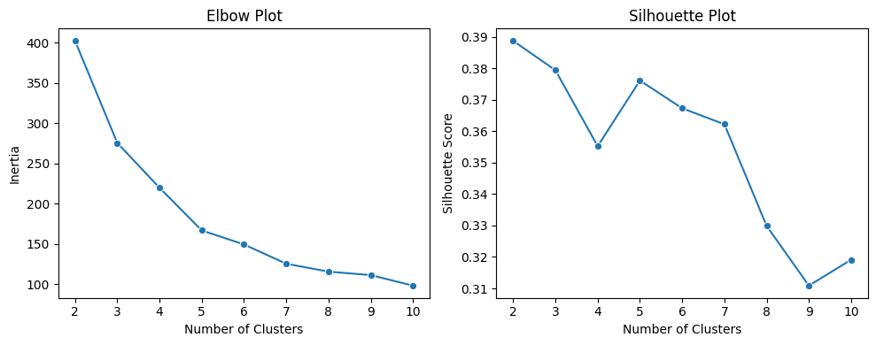
    


```python
kmeans3 = KMeans(n_clusters=3, random_state = 42)
kmeans3.fit(df_subset_scaled)

kmeans5 = KMeans(n_clusters=5, random_state = 42)
kmeans5.fit(df_subset_scaled)

df1 = pd.DataFrame({'cluster_3' : kmeans3.labels_})
df = pd.concat([df,df1], axis = 1)

df2 = pd.DataFrame({'cluster_5' : kmeans5.labels_})
df = pd.concat([df,df2], axis = 1)
```


```python
df['cluster_3_lewisville'] = df['cluster_3'] == df.loc[df['campus'] == 'Lewisville H S', 'cluster_3'].iloc[0]
df['cluster_5_lewisville'] = df['cluster_5'] == df.loc[df['campus'] == 'Lewisville H S', 'cluster_5'].iloc[0]
```


```python
blue = sns.color_palette()[0]
grey = sns.color_palette()[7]

custom_palette = [grey, blue]

fig, axes = plt.subplots(3,2, figsize = (10,12))

sns.scatterplot(data = df, x = 'number_of_students', y = 'overall_score', 
                hue = 'cluster_3_lewisville', palette = custom_palette, legend = None, ax = axes[0,0])
axes[0,0].set_xlabel('Number of Students')
axes[0,0].set_ylabel('Overall Score')
axes[0,0].set_title('3 Clusters')

sns.scatterplot(x = [df.loc[df['campus'] == 'Lewisville H S', 'number_of_students'].iloc[0]],
                y = [df.loc[df['campus'] == 'Lewisville H S', 'overall_score'].iloc[0]], 
                marker = 'x', 
                color = blue, 
                s = 300, 
                ax = axes[0,0])

sns.scatterplot(data = df, x = 'campus_2024_student_membership_eb_el_percent', y = 'overall_score', 
                hue = 'cluster_3_lewisville', palette = custom_palette, legend = None, ax = axes[1,0])
axes[1,0].set_xlabel('Emergent Bilingual Students %')
axes[1,0].set_ylabel('Overall Score')

sns.scatterplot(x = [df.loc[df['campus'] == 'Lewisville H S', 'campus_2024_student_membership_eb_el_percent'].iloc[0]],
                y = [df.loc[df['campus'] == 'Lewisville H S', 'overall_score'].iloc[0]], 
                marker = 'x', 
                color = blue, 
                s = 300, 
                ax = axes[1,0])


sns.scatterplot(data = df, x = 'campus_2024_student_membership_econ_disadv_percent', y = 'overall_score', 
                hue = 'cluster_3_lewisville', palette = custom_palette, legend = None, ax = axes[2,0])
axes[2,0].set_xlabel('Economically Disadvantaged Students %')
axes[2,0].set_ylabel('Overall Score')

sns.scatterplot(x = [df.loc[df['campus'] == 'Lewisville H S', 'campus_2024_student_membership_econ_disadv_percent'].iloc[0]],
                y = [df.loc[df['campus'] == 'Lewisville H S', 'overall_score'].iloc[0]], 
                marker = 'x', 
                color = blue, 
                s = 300, 
                ax = axes[2,0])

### 5 clusters
sns.scatterplot(data = df, x = 'number_of_students', y = 'overall_score', 
                hue = 'cluster_5_lewisville', palette = custom_palette, legend = None, ax = axes[0,1])
axes[0,1].set_xlabel('Number of Students')
axes[0,1].set_ylabel('Overall Score')
axes[0,1].set_title('5 Clusters')

sns.scatterplot(x = [df.loc[df['campus'] == 'Lewisville H S', 'number_of_students'].iloc[0]],
                y = [df.loc[df['campus'] == 'Lewisville H S', 'overall_score'].iloc[0]], 
                marker = 'x', 
                color = blue, 
                s = 300, 
                ax = axes[0,1])

sns.scatterplot(data = df, x = 'campus_2024_student_membership_eb_el_percent', y = 'overall_score', 
                hue = 'cluster_5_lewisville', palette = custom_palette, legend = None, ax = axes[1,1])
axes[1,1].set_xlabel('Emergent Bilingual Students %')
axes[1,1].set_ylabel('Overall Score')

sns.scatterplot(x = [df.loc[df['campus'] == 'Lewisville H S', 'campus_2024_student_membership_eb_el_percent'].iloc[0]],
                y = [df.loc[df['campus'] == 'Lewisville H S', 'overall_score'].iloc[0]], 
                marker = 'x', 
                color = blue, 
                s = 300, 
                ax = axes[1,1])

sns.scatterplot(data = df, x = 'campus_2024_student_membership_econ_disadv_percent', y = 'overall_score', 
                hue = 'cluster_5_lewisville', palette = custom_palette, legend = None, ax = axes[2,1])
axes[2,1].set_xlabel('Economically Disadvantaged Students %')
axes[2,1].set_ylabel('Overall Score')

sns.scatterplot(x = [df.loc[df['campus'] == 'Lewisville H S', 'campus_2024_student_membership_econ_disadv_percent'].iloc[0]],
                y = [df.loc[df['campus'] == 'Lewisville H S', 'overall_score'].iloc[0]], 
                marker = 'x', 
                color = blue, 
                s = 300, 
                ax = axes[2,1])

plt.show()
```


    
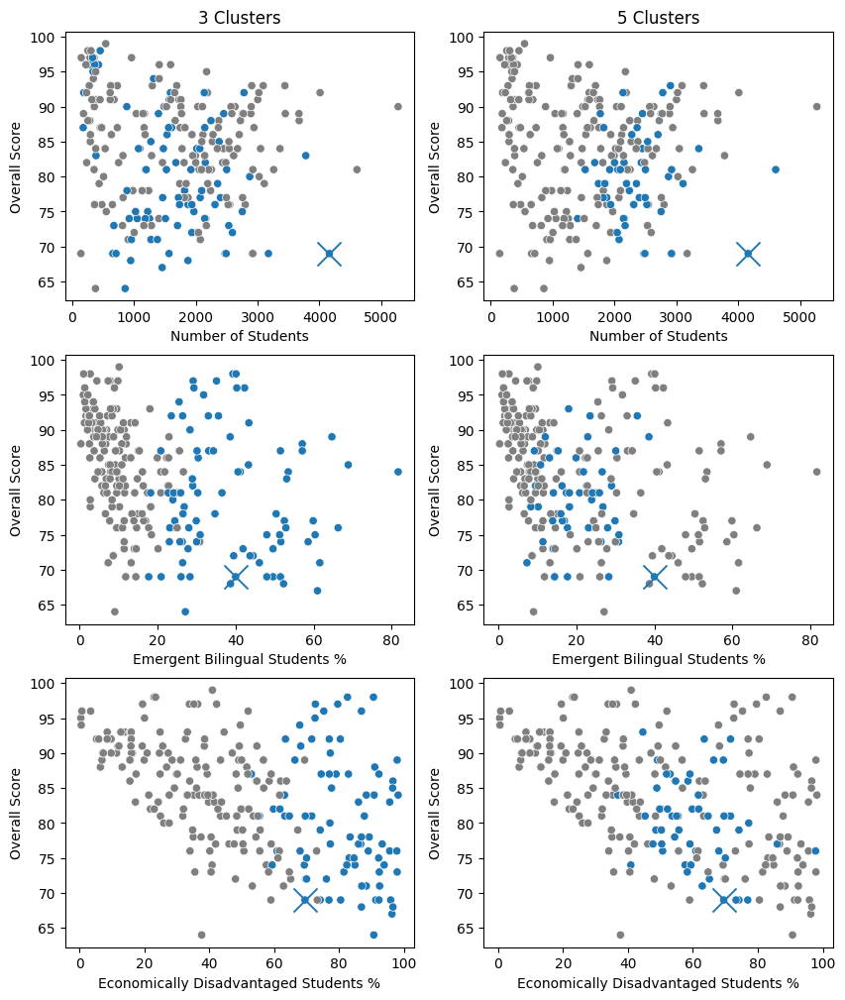
    


### Analyze schools in Lewisville High School's Cluster
---


```python
lewisville_cluster = df[df['cluster_5'] == df.loc[df['campus'] == 'Lewisville H S', 'cluster_5'].iloc[0]].reset_index(drop = True).copy()
```


```python
lewisville_cluster_sorted = lewisville_cluster.sort_values(by = ['overall_score'], ascending = False).reset_index(drop = True)
```


```python
print('Lewisville High School ranks number {} out of {} schools in this cluster'
    .format(lewisville_cluster_sorted[lewisville_cluster_sorted['campus'] == 'Lewisville H S'].reset_index().iloc[0,0],
            lewisville_cluster_sorted.shape[0]))
```

    Lewisville High School ranks number 48 out of 51 schools in this cluster


```python
lewisville_cluster_sorted.tail(10).loc[:,['campus', 
                                          'overall_score', 
                                          'number_of_students', 
                                          'campus_2024_student_membership_eb_el_percent', 
                                          'campus_2024_student_membership_econ_disadv_percent']]
```


<div>
<style scoped>
    .dataframe tbody tr th:only-of-type {
        vertical-align: middle;
    }

    .dataframe tbody tr th {
        vertical-align: top;
    }

    .dataframe thead th {
        text-align: right;
    }
</style>
<table border="1" class="dataframe">
  <thead>
    <tr style="text-align: right;">
      <th></th>
      <th>campus</th>
      <th>overall_score</th>
      <th>number_of_students</th>
      <th>campus_2024_student_membership_eb_el_percent</th>
      <th>campus_2024_student_membership_econ_disadv_percent</th>
    </tr>
  </thead>
  <tbody>
    <tr>
      <th>41</th>
      <td>Shepton H S</td>
      <td>74.0</td>
      <td>1404</td>
      <td>30.8</td>
      <td>40.9</td>
    </tr>
    <tr>
      <th>42</th>
      <td>Paschal H S</td>
      <td>74.0</td>
      <td>2146</td>
      <td>26.3</td>
      <td>59.4</td>
    </tr>
    <tr>
      <th>43</th>
      <td>Red Oak H S</td>
      <td>74.0</td>
      <td>2163</td>
      <td>11.4</td>
      <td>57.6</td>
    </tr>
    <tr>
      <th>44</th>
      <td>Brewer H S</td>
      <td>73.0</td>
      <td>2172</td>
      <td>14.0</td>
      <td>58.3</td>
    </tr>
    <tr>
      <th>45</th>
      <td>Desoto H S</td>
      <td>72.0</td>
      <td>2045</td>
      <td>8.6</td>
      <td>65.1</td>
    </tr>
    <tr>
      <th>46</th>
      <td>Cedar Hill H S</td>
      <td>71.0</td>
      <td>2075</td>
      <td>7.3</td>
      <td>62.9</td>
    </tr>
    <tr>
      <th>47</th>
      <td>Lamar H S</td>
      <td>69.0</td>
      <td>2475</td>
      <td>28.3</td>
      <td>76.9</td>
    </tr>
    <tr>
      <th>48</th>
      <td>Lewisville H S</td>
      <td>69.0</td>
      <td>4161</td>
      <td>40.0</td>
      <td>69.5</td>
    </tr>
    <tr>
      <th>49</th>
      <td>North Crowley H S</td>
      <td>69.0</td>
      <td>2923</td>
      <td>14.4</td>
      <td>73.3</td>
    </tr>
    <tr>
      <th>50</th>
      <td>Crowley H S</td>
      <td>69.0</td>
      <td>2492</td>
      <td>17.7</td>
      <td>74.2</td>
    </tr>
  </tbody>
</table>
</div>


```python
fig,axes = plt.subplots(1,2, figsize = (10,4))
sns.boxplot(data = lewisville_cluster_sorted, x = 'overall_score', ax = axes[0])
axes[0].set_title("Lewisville High School's Cluster")
axes[0].set_xlabel('Overall Score')
axes[0].set_xticks([i for i in range(60,105,5)])
axes[0].set_xlim(60,100)
sns.boxplot(data = df, x = 'overall_score', ax = axes[1])
axes[1].set_title('All High Schools')
axes[1].set_xlabel('Overall Score')
axes[1].set_xticks([i for i in range(60,105,5)])
axes[1].set_xlim(60,100)
plt.show()
```


    
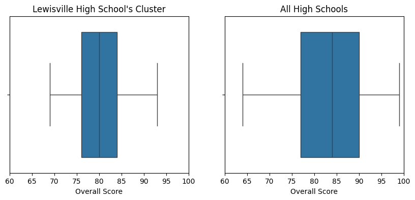
    


```python
print('Average overall score for all high schools: {:.2f}'.format(df['overall_score'].mean()))
print("Average overall score for all high schools in Lewisville High School's cluster: {:.2f}"
    .format(lewisville_cluster_sorted['overall_score'].mean()))
```

    Average overall score for all high schools: 83.50
    Average overall score for all high schools in Lewisville High School's cluster: 79.98


```python
lewisville_cluster_sorted['quantile'] = pd.qcut(lewisville_cluster_sorted['overall_score'], q = 5, labels = [1,2,3,4,5])
```


```python
quantile_scores = lewisville_cluster_sorted.groupby(by = ['quantile'], observed = True, as_index = False).agg({'overall_score' : 'mean'})

custom_palette = [blue, grey, grey, grey, blue]

plt.figure(figsize = (6,4))
sns.barplot(data = quantile_scores, x = 'quantile', y = 'overall_score', hue = 'quantile', palette = custom_palette, legend = None)
plt.title("Overall score quantiles\nfor schools in Lewisville High School's cluster")
plt.xlabel('Quantile')
plt.ylabel('Overall Score')
plt.show()
```


    
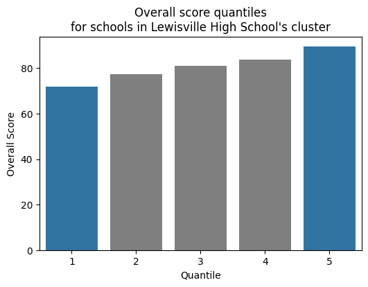
    


```python
df4 = lewisville_cluster_sorted[lewisville_cluster_sorted['quantile'].isin([1,5])].copy()
df4['quantile'] = df4['quantile'].map({1 : 'Bad', 5 : 'Good'})
df4 = df4.rename(columns = {'quantile' : 'performance'})
```

#### Class size differences between well and poor performing schools in this cluster
---


```python
class_size_performance = df4.groupby(by = 'performance', 
                                     observed = True, 
                                     as_index = False).agg({'campus_2024_class_size_sec_english_avg_size' : 'mean',
                                                            'campus_2024_class_size_sec_math_avg_size' : 'mean',
                                                            'campus_2024_class_size_sec_sci_avg_size' : 'mean',
                                                            'campus_2024_class_size_sec_soc_stud_avg_size' : 'mean',
                                                            'campus_2024_class_size_sec_for_lng_avg_size' : 'mean'})

class_size_performance = pd.melt(frame = class_size_performance, id_vars = ['performance'],
                                 value_vars = class_size_performance.columns[np.r_[1:6]],
                                 var_name = 'metric', value_name = 'value', ignore_index = True)
```


```python
for i in range(class_size_performance.shape[0]):
    i_val = class_size_performance.iloc[i, 1]
    if i_val.find('english') != -1 :
        class_size_performance.iloc[i, 1] = 'English'
    elif i_val.find('math') != -1:
        class_size_performance.iloc[i, 1] = 'Math'
    elif i_val.find('sci') != -1:
        class_size_performance.iloc[i, 1] = 'Science'
    elif i_val.find('soc_stud') != -1:
        class_size_performance.iloc[i, 1] = 'Social Studies'
    elif i_val.find('for_lng') != -1:
        class_size_performance.iloc[i, 1] = 'Foreign Language'        
```


```python
custom_palette = [grey, blue]
plt.figure(figsize = (8,6))
ax = sns.barplot(data = class_size_performance, x = 'value', y = 'metric', hue = 'performance', palette = custom_palette)
plt.title("Class size comparison between good and bad performing \nschools from Lewisville High School's cluster")
plt.legend(loc = ('upper right'), 
           bbox_to_anchor=(1.275,1.0175),
          title = 'School Performance')
plt.xlabel('Class Size')
ax.set_xticks([i for i in range(0,24)])
plt.ylabel(None)

# plot Lewisville High School's values
ax.plot(df4.loc[df4['campus'] == 'Lewisville H S', 'campus_2024_class_size_sec_english_avg_size'], 0, 
        color = 'black', marker = '|', markersize = 25)

ax.plot(df4.loc[df4['campus'] == 'Lewisville H S', 'campus_2024_class_size_sec_math_avg_size'], 1, 
        color = 'black', marker = '|', markersize = 25)

ax.plot(df4.loc[df4['campus'] == 'Lewisville H S', 'campus_2024_class_size_sec_sci_avg_size'], 2, 
        color = 'black', marker = '|', markersize = 25)

ax.plot(df4.loc[df4['campus'] == 'Lewisville H S', 'campus_2024_class_size_sec_soc_stud_avg_size'], 3, 
        color = 'black', marker = '|', markersize = 25)

ax.plot(df4.loc[df4['campus'] == 'Lewisville H S', 'campus_2024_class_size_sec_for_lng_avg_size'], 4, 
        color = 'black', marker = '|', markersize = 25)

plt.show()
```


    
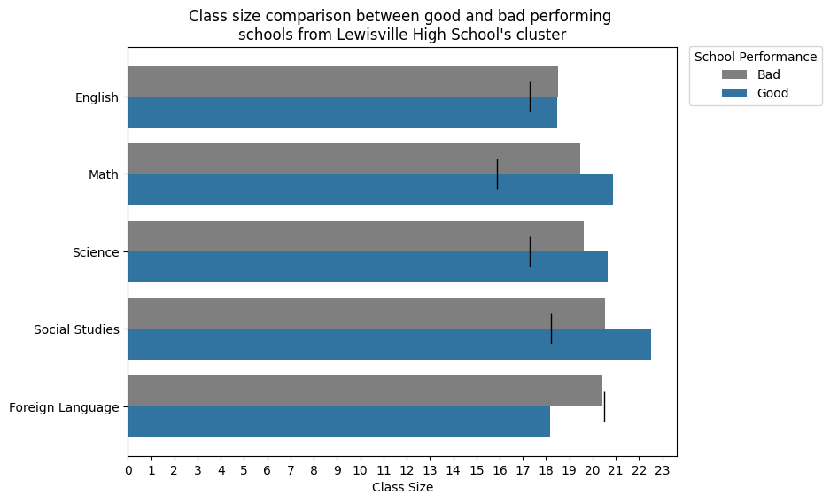
    


#### Student teacher ratio differences between well and poor performing schools in this cluster
---


```python
teacher_student_ratio = (df4.groupby(by = 'performance', as_index = False, observed = True)
                            .agg({'campus_2024_staff_teacher_student_ratio' : 'mean'}))
```


```python
ax = sns.barplot(data =  teacher_student_ratio, x = 'performance', 
            y = 'campus_2024_staff_teacher_student_ratio', 
            hue = 'performance',
            legend = None,
            palette = custom_palette)

ax.plot(0, df4.loc[df4['campus'] == 'Lewisville H S', 'campus_2024_staff_teacher_student_ratio'],
        color = 'black', marker = '_', markersize = 50)


plt.title("Student-teacher ratio comparison between good and bad \nperforming schools from Lewisville High School's cluster")
plt.xlabel('School Performance')
plt.ylabel('Average Students Per Teacher')
plt.show()
```


    
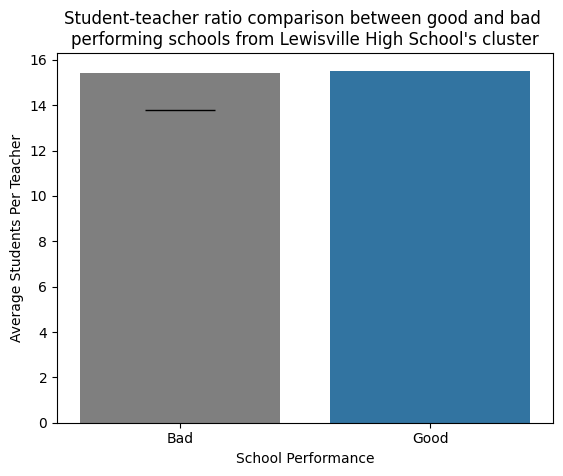
    


#### Teacher education differences between well and poor performing schools in this cluster
---


```python
teacher_education = df4.groupby(by = 'performance',
                                observed = True, 
                                as_index = False).agg({'campus_2024_staff_teacher_ba_degree_full_time_equiv_percent' : 'mean',
                                                       'campus_2024_staff_teacher_ms_degree_full_time_equiv_percent' : 'mean',
                                                       'campus_2024_staff_teacher_ph_degree_full_time_equiv_percent' : 'mean'})
teacher_education = pd.melt(frame = teacher_education, 
                            id_vars = ['performance'],
                            value_vars = teacher_education.columns[np.r_[1:4]],
                            var_name = 'degree', 
                            value_name = 'percent', 
                            ignore_index = True)
```


```python
for i in range(teacher_education.shape[0]):
    i_val = teacher_education.iloc[i, 1]
    if i_val.find('ba_degree') != -1 :
        teacher_education.iloc[i, 1] = 'Bachelors Degree'
    elif i_val.find('ms_degree') != -1:
        teacher_education.iloc[i, 1] = 'Masters Degree'
    elif i_val.find('ph_degree') != -1:
        teacher_education.iloc[i, 1] = 'Doctoral Degree'
```


```python
plt.figure(figsize = (8,6))

ax = sns.barplot(data = teacher_education, x = 'percent', y = 'degree', hue = 'performance', palette = custom_palette)
plt.title("Teacher education comparison between good and bad \nperforming schools from Lewisville High School's cluster")
plt.legend(loc = ('upper right'), 
           bbox_to_anchor=(1.275,1.0175),
          title = 'School Performance')
plt.xlabel('Percent of teachers')
# ax.set_xticks([i for i in range(0,24)])
plt.ylabel(None)

# plot Lewisville High School's values
ax.plot(df4.loc[df4['campus'] == 'Lewisville H S', 'campus_2024_staff_teacher_ba_degree_full_time_equiv_percent'], 0, 
        color = 'black', marker = '|', markersize = 25)

ax.plot(df4.loc[df4['campus'] == 'Lewisville H S', 'campus_2024_staff_teacher_ms_degree_full_time_equiv_percent'], 1, 
        color = 'black', marker = '|', markersize = 25)

ax.plot(df4.loc[df4['campus'] == 'Lewisville H S', 'campus_2024_staff_teacher_ph_degree_full_time_equiv_percent'], 2, 
        color = 'black', marker = '|', markersize = 25)

plt.show()
```


    
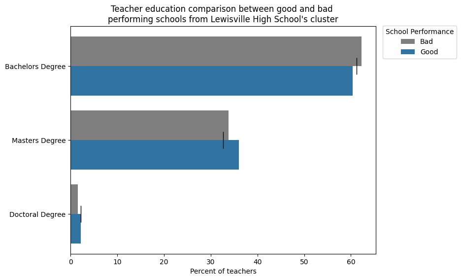
    


#### Teacher experience differences between well and poor performing schools in this cluster
---


```python
teacher_experience = df4.groupby(by = 'performance',
                                observed = True, 
                                as_index = False).agg({'campus_2024_staff_teacher_1_5_years_full_time_equiv_percent' : 'mean',
                                                       'campus_2024_staff_teacher_6_10_years_full_time_equiv_percent' : 'mean',
                                                       'campus_2024_staff_teacher_11_20_years_full_time_equiv_percent' : 'mean',
                                                       'campus_2024_staff_teacher_21_30_years_full_time_equiv_percent' : 'mean',
                                                       'campus_2024_staff_teacher_greater_30_years_full_time_equiv_percent' : 'mean'})

teacher_experience = pd.melt(frame = teacher_experience, 
                             id_vars = ['performance'],
                             value_vars = teacher_experience.columns[np.r_[1:6]],
                             var_name = 'years_experience', 
                             value_name = 'percent', 
                             ignore_index = True)
```


```python
for i in range(teacher_experience.shape[0]):
    i_val = teacher_experience.iloc[i, 1]
    if i_val.find('1_5_years') != -1 :
        teacher_experience.iloc[i, 1] = '1 to 5'
    elif i_val.find('6_10_years') != -1:
        teacher_experience.iloc[i, 1] = '6 to 10'
    elif i_val.find('11_20_years') != -1:
        teacher_experience.iloc[i, 1] = '11 to 20'
    elif i_val.find('21_30_years') != -1:
        teacher_experience.iloc[i, 1] = '21 to 30'
    elif i_val.find('greater_30_years') != -1:
        teacher_experience.iloc[i, 1] = '30 or more'
```


```python
plt.figure(figsize = (8,6))

ax = sns.barplot(data = teacher_experience, x = 'percent', y = 'years_experience', hue = 'performance', palette = custom_palette)
plt.title("Teacher experience comparison between good and bad \nperforming schools from Lewisville High School's cluster")
plt.legend(loc = ('upper right'), 
           bbox_to_anchor=(1.275,1.0175),
          title = 'School Performance')
plt.xlabel('Percent of teachers')
plt.ylabel('Years of experience')

# plot Lewisville High School's values
ax.plot(df4.loc[df4['campus'] == 'Lewisville H S', 'campus_2024_staff_teacher_1_5_years_full_time_equiv_percent'], 0, 
        color = 'black', marker = '|', markersize = 25)

ax.plot(df4.loc[df4['campus'] == 'Lewisville H S', 'campus_2024_staff_teacher_6_10_years_full_time_equiv_percent'], 1, 
        color = 'black', marker = '|', markersize = 25)

ax.plot(df4.loc[df4['campus'] == 'Lewisville H S', 'campus_2024_staff_teacher_11_20_years_full_time_equiv_percent'], 2, 
        color = 'black', marker = '|', markersize = 25)

ax.plot(df4.loc[df4['campus'] == 'Lewisville H S', 'campus_2024_staff_teacher_21_30_years_full_time_equiv_percent'], 3, 
        color = 'black', marker = '|', markersize = 25)

ax.plot(df4.loc[df4['campus'] == 'Lewisville H S', 'campus_2024_staff_teacher_greater_30_years_full_time_equiv_percent'], 4, 
        color = 'black', marker = '|', markersize = 25)

plt.show()
```


    
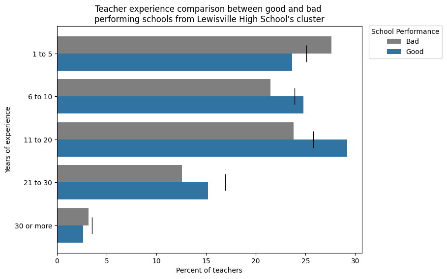
    


#### Principal and assistant principal differences between well and poor performing schools in this cluster
---


```python
principal_assistant_principal = df4.groupby(by = 'performance',
                                            observed = True, 
                                            as_index = False).agg({'campus_2024_staff_principal_experience_average' : 'mean',
                                                                   'campus_2024_staff_principal_tenure_average' : 'mean',
                                                                   'campus_2024_staff_assistant_principal_experience_average' : 'mean',
                                                                   'campus_2024_staff_assistant_principal_tenure_average' : 'mean'})

principal_assistant_principal = pd.melt(frame = principal_assistant_principal, 
                                        id_vars = ['performance'],
                                        value_vars = principal_assistant_principal.columns[np.r_[1:5]],
                                        var_name = 'metric', 
                                        value_name = 'years', 
                                        ignore_index = True)
```


```python
principal_assistant_principal['metric'] = principal_assistant_principal['metric'].str.replace('_', ' ').str.title().str[18:-8]
```


```python
plt.figure(figsize = (8,6))

ax = sns.barplot(data = principal_assistant_principal, x = 'years', y = 'metric', hue = 'performance', palette = custom_palette)
plt.title("Principal and Assistant Principal comparison between good and \nbad performing schools from Lewisville High School's cluster")
plt.legend(loc = ('upper right'), 
           bbox_to_anchor=(1.275,1.0175),
          title = 'School Performance')
plt.xlabel('Years')
plt.ylabel(None)

# plot Lewisville High School's values
ax.plot(df4.loc[df4['campus'] == 'Lewisville H S', 'campus_2024_staff_principal_experience_average'], 0, 
        color = 'black', marker = '|', markersize = 25)

ax.plot(df4.loc[df4['campus'] == 'Lewisville H S', 'campus_2024_staff_principal_tenure_average'], 1, 
        color = 'black', marker = '|', markersize = 25)

ax.plot(df4.loc[df4['campus'] == 'Lewisville H S', 'campus_2024_staff_assistant_principal_experience_average'], 2, 
        color = 'black', marker = '|', markersize = 25)

ax.plot(df4.loc[df4['campus'] == 'Lewisville H S', 'campus_2024_staff_assistant_principal_tenure_average'], 3, 
        color = 'black', marker = '|', markersize = 25)

plt.show()
```


    
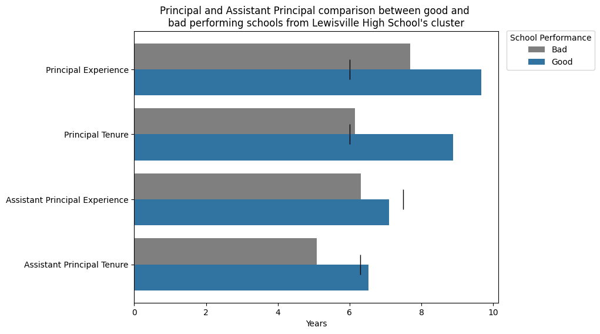
    


#### Teacher salary differences between well and poor performing schools in this cluster
---


```python
teacher_salary = df4.groupby(by = 'performance',
                             observed = True, 
                             as_index = False).agg({'campus_2024_staff_teacher_1_5_years_base_salary_average' : 'mean',
                                                    'campus_2024_staff_teacher_11_20_years_base_salary_average' : 'mean'})


teacher_salary = pd.melt(frame = teacher_salary, 
                         id_vars = ['performance'],
                         value_vars = teacher_salary.columns[np.r_[1:3]],
                         var_name = 'years_experience', 
                         value_name = 'salary', 
                         ignore_index = True)
```


```python
for i in range(teacher_salary.shape[0]):
    i_val = teacher_salary.iloc[i, 1]
    if i_val.find('1_5_years') != -1 :
        teacher_salary.iloc[i, 1] = '1 to 5'
    elif i_val.find('11_20_years') != -1:
        teacher_salary.iloc[i, 1] = '11 to 20'
```


```python
plt.figure(figsize = (8,6))

ax = sns.barplot(data = teacher_salary, y = 'salary', x = 'years_experience', hue = 'performance', palette = custom_palette)
plt.title("Teacher salary comparison between good and bad \nperforming schools from Lewisville High School's cluster")
plt.legend(loc = ('upper right'), 
           bbox_to_anchor=(1.275,1.0175),
          title = 'School Performance')
plt.xlabel('Years of Experience')
plt.ylabel('Salary')

# plot Lewisville High School's values
ax.plot(0,df4.loc[df4['campus'] == 'Lewisville H S', 'campus_2024_staff_teacher_1_5_years_base_salary_average'],  
        color = 'black', marker = '_', markersize = 50)

ax.plot(1,df4.loc[df4['campus'] == 'Lewisville H S', 'campus_2024_staff_teacher_11_20_years_base_salary_average'],  
        color = 'black', marker = '_', markersize = 50)

plt.show()
```


    
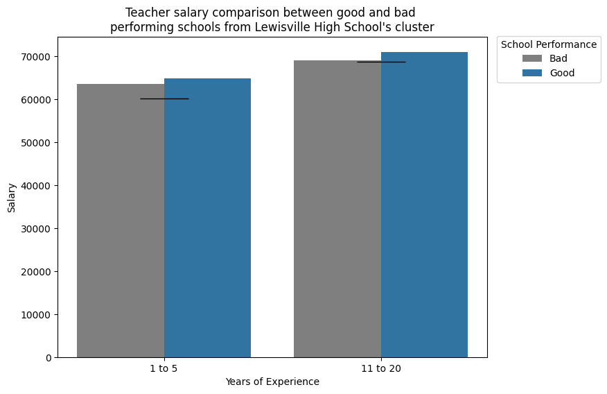
    


#### Special programs differences between well and poor performing schools in this cluster
---


```python
special_programs = df4.groupby(by = 'performance',
                               observed = True, 
                               as_index = False).agg({'campus_2024_staff_teacher_career_technical_prgms_full_time_equiv_percent' : 'mean',
                                                      'campus_2024_staff_teacher_bilingual_program_full_time_equiv_percent' : 'mean',
                                                      'campus_2024_staff_teacher_compensatory_program_full_time_equiv_percent' : 'mean',
                                                      'campus_2024_staff_teacher_gifted_talented_program_full_time_equiv_percent' : 'mean',
                                                      'campus_2024_staff_teacher_special_education_full_time_equiv_percent' : 'mean'})

special_programs = pd.melt(frame = special_programs, 
                           id_vars = ['performance'],
                           value_vars = special_programs.columns[np.r_[1:6]],
                           var_name = 'program', 
                           value_name = 'percent_teachers', 
                           ignore_index = True)
```


```python
replace_dict = {
    'campus_2024_staff_teacher_career_technical_prgms_full_time_equiv_percent' : 'Career Technical Programs',
    'campus_2024_staff_teacher_bilingual_program_full_time_equiv_percent' : 'Bilingual Program',
    'campus_2024_staff_teacher_compensatory_program_full_time_equiv_percent' : 'Compensatory Program',
    'campus_2024_staff_teacher_gifted_talented_program_full_time_equiv_percent' : 'Gifted and Talented Program',
    'campus_2024_staff_teacher_special_education_full_time_equiv_percent' : 'Special Education'   
}

special_programs['program'] = special_programs['program'].replace(replace_dict)
```


```python
plt.figure(figsize = (8,6))

ax = sns.barplot(data = special_programs, x = 'percent_teachers', y = 'program', hue = 'performance', palette = custom_palette)
plt.title("Special programs comparison between good and bad \nperforming schools from Lewisville High School's cluster")
plt.legend(loc = ('upper right'), 
           bbox_to_anchor=(1.275,1.0175),
          title = 'School Performance')
plt.xlabel('Percentage of Teachers')
plt.ylabel(None)

# plot Lewisville High School's values
ax.plot(df4.loc[df4['campus'] == 'Lewisville H S', 'campus_2024_staff_teacher_career_technical_prgms_full_time_equiv_percent'], 0, 
        color = 'black', marker = '|', markersize = 25)

ax.plot(df4.loc[df4['campus'] == 'Lewisville H S', 'campus_2024_staff_teacher_bilingual_program_full_time_equiv_percent'], 1, 
        color = 'black', marker = '|', markersize = 25)

ax.plot(df4.loc[df4['campus'] == 'Lewisville H S', 'campus_2024_staff_teacher_compensatory_program_full_time_equiv_percent'], 2, 
        color = 'black', marker = '|', markersize = 25)

ax.plot(df4.loc[df4['campus'] == 'Lewisville H S', 'campus_2024_staff_teacher_gifted_talented_program_full_time_equiv_percent'], 3, 
        color = 'black', marker = '|', markersize = 25)

ax.plot(df4.loc[df4['campus'] == 'Lewisville H S', 'campus_2024_staff_teacher_special_education_full_time_equiv_percent'], 4, 
        color = 'black', marker = '|', markersize = 25)

plt.show()
```   
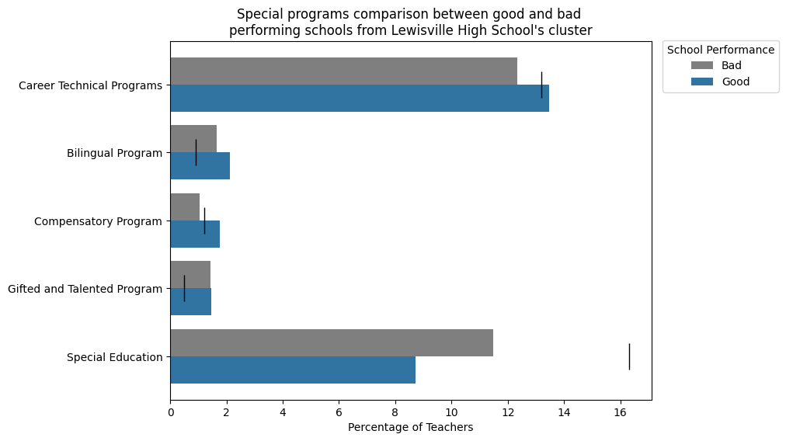
    
