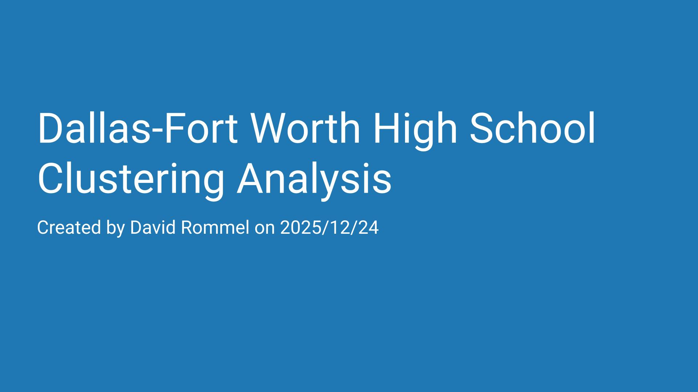

## Dallas-Fort Worth High School Clustering Analysis

This project used unsupervised machine learning to cluster Dallas-Fort Worth area high schools based on the number of students and certain demographics.  I then explored the cluster that my old high school, Lewisville High School, resides in.  I wanted to know if socioeconomic factors are the main contributors to Lewisville High School's low scores.  By clustering similar schools together, my goal was to gain a better understanding of how similar schools are performing and identify specific areas where I believe the school can improve.  

Instead of explaining this project alongside the code, like I did with the previous projects, I decided to create a short presentation discussing the model I built and the insights I gained from the analysis.

**Click the following image to view the video:**

**To view the code for this project click the following link:**  
[Markdown for Jupyter Notebook](https://github.com/DavidRommel/Portfolio/blob/main/Dallas_Fort_Worth_High_School_Clustering_Analysis/Notebook/README.md)
