## Dallas-Fort Worth Area High School Performance

For this case study, I attempted to identify school and socioeconomic variables that impacted high school performance scores.  I first explored variables related to the individual schools, such as data about the teachers and school size.  I then took a broader view and examined average high school performance from a city level.  I attempted to identify various socioeconomic factors that correlated with an increase or decrease in high school performance scores.

My goal in all of this was to develop a multiple regression model, which utilized multiple predictor variables to accurately predict what the average high school score for a city should be.  This model could then be used to make better, less biased, comparisons between different cities, and identify those cities whose schools are under-performing, as well as those who are performing above expectations.

### Analyzing how staffing data impacts school performance
---


```python
import numpy as np
import pandas as pd
import matplotlib.pyplot as plt
import seaborn as sns

import statsmodels.api as sm
from statsmodels.formula.api import ols
```

To begin my analysis, on what variables impact a high school's overall performance score, I first explored data related to the staff of the individual schools.

I gathered the data from multiple sources:
* **school_staff_information**
    * [The Texas Academic Performance Reports](https://rptsvr1.tea.texas.gov/perfreport/tapr/2024/index.html)    
* **school_ratings**
    * [Performance Reporting Division at Texas Education Agency](https://tea.texas.gov/texas-schools/accountability/academic-accountability/performance-reporting/2023-accountability-rating-system)
* **high_school_information**
    * [National Center for Education Statistics](https://nces.ed.gov/)

For the `school_staff_information` and `school_ratings` datasets, I combined the `district_number` and `campus_number` fields into a `state_school_id` field.  This was necessary because the campus numbers are repeated in different districts.  The combination of both fields are required to successfully identify a school.

The `state_school_id` field needed to be 19 characters, and based on the length of the `district_number` and `campus_number` fields this sometimes required adding an additional zero to the beginning of the numbers.

After I added the `state_school_id` field to the `school_staff_information` dataset, I checked the schools from this dataset that could not be found in the `high_school_information` dataset.  These missing schools are displayed below the code block.


```python
# load high_school_information.csv and school_staff_information.csv and school_ratings.csv
high_school_information = pd.read_csv('datasets/high_school_information.csv')
school_staff_information = pd.read_csv('datasets/school_staff_information.csv')
school_ratings = pd.read_csv('datasets/school_ratings.csv')

# create state_school_id field for school_staff_information dataframe
state_school_ids = []
for i in range(school_staff_information.shape[0]):
    state_school_id = 'TX-'    
    if school_staff_information.loc[i, 'district_number'] < 100000:
        state_school_id += '0'
    state_school_id += school_staff_information.loc[i, 'district_number'].astype(str)
    state_school_id += '-'
    if school_staff_information.loc[i, 'campus_number'] < 100000000:
        state_school_id += '0'
    state_school_id += school_staff_information.loc[i, 'campus_number'].astype(str)
    state_school_ids.append(state_school_id)
school_staff_information['state_school_id'] = state_school_ids

# check for schools from the high school list that are missing in the school_staff_information dataset
high_school_information[~high_school_information['state_school_id'].isin(school_staff_information['state_school_id'])]['school_name']
```


    24                                      WALNUT GROVE H S
    25                                        WELLINGTON H S
    29                       BOOKER T WASHINGTON SPVA MAGNET
    51            INNOVATION DESIGN ENTREPRENEURSHIP ACADEMY
    53                                JACK E SINGLEY ACADEMY
    56                     JUDGE BAREFOOT SANDERS LAW MAGNET
    58                KATHLYN JOY GILLIAM COLLEGIATE ACADEMY
    59                                KIPP OAK CLIFF ACADEMY
    65         MARVIN E ROBINSON SCHOOL OF BUSINESS AND MGMT
    84                    SCHOOL FOR THE TALENTED AND GIFTED
    85                          SCHOOL OF HEALTH PROFESSIONS
    86                     SCHOOL OF SCIENCE AND ENGINEERING
    95               TRINIDAD GARZA EARLY COLLEGE AT MT VIEW
    155    GRAPEVINE-COLLEYVILLE COLLEGIATE ACADEMY AT TC...
    159                  IM TERRELL ACADEMY FOR STEM AND VPA
    164                      MANSFIELD FRONTIER STEM ACADEMY
    185                          TEXAS ACADEMY OF BIOMEDICAL
    Name: school_name, dtype: object


Creating the `state_school_id` in the `school_ratings` dataset was slightly more complicated because they had three different lengths of the district and campus number fields.  This necessitated adding an additional `elif` statement to the code for both the `district_number` and the `campus_number` sections.  The `campus_number` field was also saved as a float for some reason in this dataset and had to be converted to an integer.  There were also rows with either of the numbers missing that had to be removed.  

In the end only one school from the `high_school_information` dataset was not found in this `school_ratings` dataset.  `WALNUT GROVE H S` was not found in the `school_staff_information` dataset either so it is not an issue.


```python
# remove rows with missing district or campus numbers
school_ratings.dropna(subset=['district_number', 'campus_number'], inplace = True)
school_ratings.reset_index(inplace = True)

# campus number was saved as a float
school_ratings['campus_number'] = school_ratings['campus_number'].astype(int)

# district number have lengths of 4,5,6
# campus number have lengths of 7,8,9
# create state_school_id field for school_ratings dataframe
state_school_ids = []
for i in range(school_ratings.shape[0]):
    state_school_id = 'TX-'
    if school_ratings.loc[i, 'district_number'] < 10000:
        state_school_id += '00'
    elif school_ratings.loc[i, 'district_number'] < 100000:
        state_school_id += '0'
    state_school_id += school_ratings.loc[i, 'district_number'].astype(str)
    state_school_id += '-'
    if school_ratings.loc[i, 'campus_number'] < 10000000:
        state_school_id += '00'
    elif school_ratings.loc[i, 'campus_number'] < 100000000:
        state_school_id += '0'
    state_school_id += school_ratings.loc[i, 'campus_number'].astype(str)
    state_school_ids.append(state_school_id)

school_ratings['state_school_id'] = state_school_ids

high_school_information[~high_school_information['state_school_id'].isin(school_ratings['state_school_id'])]['school_name']
```


    24    WALNUT GROVE H S
    Name: school_name, dtype: object


The `high_school_information` dataset was only needed for information on the cities where the schools were located.  The `city` field will be used later to link census information, from the cities where schools are located, with the school data.  

From the `school_ratings` dataset, I selected the `number_of_students` and `overall_score` fields.  The `overall_score` field will be my main measure of school performance.


```python
high_school_information_subset = high_school_information[['state_school_id', 'city']]
school_ratings_subset = school_ratings[['state_school_id', 'number_of_students', 'overall_score']]
```

I joined the three data sets using the `state_school_id` field as the primary key.  I used an `inner` join so only the records that exist in all three datasets are combined into the final dataset.  Once all of the tables were joined, the result was `175` high schools.


```python
df = high_school_information_subset.merge(school_ratings_subset, on = 'state_school_id', how = 'inner')
df = df.merge(school_staff_information, on = 'state_school_id', how = 'inner')
print('Number of high schools in combined dataset: {}'.format(df.shape[0]))
```

    Number of high schools in combined dataset: 175


#### Analyzing teacher salaries and school performance
---
First I wanted to examine whether there is any correlation between average teacher salaries and the overall scores of the high schools.


```python
df_subset = df[['overall_score', 'teacher_total_base_salary_average', 'teacher_beginning_base_salary_average', 
                'teacher_1-5_years_base_salary_average', 'teacher_6-10_years_base_salary_average', 
                'teacher_11-20_years_base_salary_average','teacher_21-30_years_base_salary_average', 
                'teacher_>_30_years_base_salary_average']].copy()

# Convert data from strings to integers
df_subset[df_subset.columns] = df_subset[df_subset.columns].apply(pd.to_numeric, errors = 'coerce')
df_subset[df_subset.columns] = df_subset[df_subset.columns].astype('Int64')
```

When I created scatterplots of the teachers' average salaries based on tenure and the overall score of the high school, there appeared to be no correlation between higher salaries and better school performance.


```python
fig, axes = plt.subplots(2, 4, figsize = (10,5))
ax_r = 0 # sub-plot current row
ax_c = 0 # sub-plot current column

column_list = list(df_subset.columns)[1:] # drop overall_score

# plot scatterplot for each salary
for col in column_list:
    if ax_c == 4: # increment to next row of sub-plot
        ax_r = 1
        ax_c = 0
    sns.scatterplot(data = df_subset, x = col, y = 'overall_score', ax=axes[ax_r,ax_c], s = 10)
    # scale text so that everything is visible
    axes[ax_r,ax_c].set_ylabel(axes[ax_r,ax_c].get_ylabel(), fontsize=7)
    axes[ax_r,ax_c].set_xlabel(axes[ax_r,ax_c].get_xlabel(), fontsize=7)
    axes[ax_r,ax_c].tick_params(axis = 'both', labelsize = 6, rotation = 15)
    ax_c += 1 # increment to next column for sub-plot

plt.tight_layout()
plt.show()
```


    
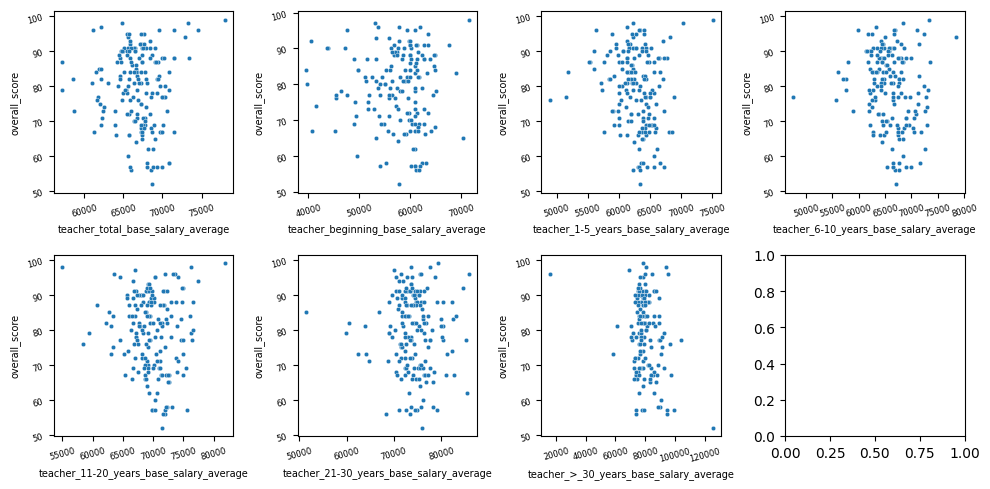
    


To better visualize the correlation between the teacher's salaries and the overall scores of the high schools, I created a correlation matrix.  There ended up being very little correlation between teachers salaries and the overall score of the high schools.  

It is strange to note that all of the correlations are negative, seeming to indicate that the more high schools pay their teachers the worse the schools overall scores are.  This is most noticeable for schools that pay the most to teachers with more than 30-years of experience.  If you look at the scatter-plot above, in the second row and third column, there is an outlier that pays teachers with 30-years of experience over \$120,000 and the schools overall score is around 50.  There is another data point that only pays them \$20,000 but somehow had a score in the high 90s.  If those two outliers were removed the correlation between these two variables would be far closer to zero.


```python
sns.heatmap(df_subset.corr(numeric_only = True, method = 'pearson'), annot = True, cmap = 'Reds')
plt.show()
```


    
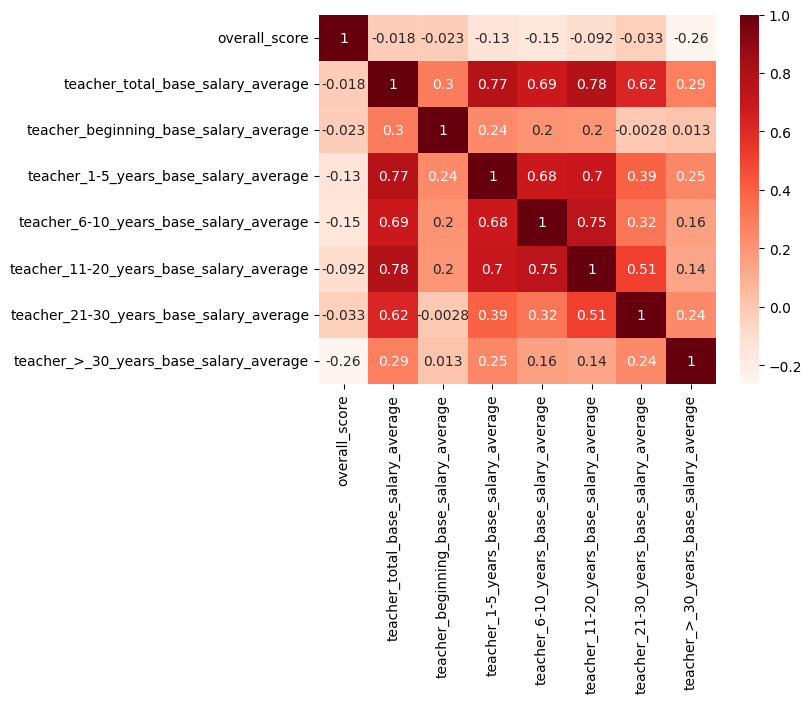
    


#### Analyzing teacher-student ratio and school performance
---
I next proceeded to look for evidence that a smaller class size, with a lower student-teacher ratio, is linked to a better overall school score.

When a regression plot is created, the regression line shows that schools with more students per teacher are actually performing better than those with less students per teacher.  I believe the outliers may be contributing to this counter-intuitive result.


```python
df_subset = df[['overall_score', 'teacher_student_ratio']].copy()

# convert from string to numeric
df_subset[df_subset.columns] = df_subset[df_subset.columns].apply(pd.to_numeric, errors = 'coerce')

sns.regplot(data = df_subset, x = 'teacher_student_ratio', y = 'overall_score', ci = None)
plt.xlabel('Teacher Student Ratio')
plt.ylabel('Overall Score')
plt.show()
```


    
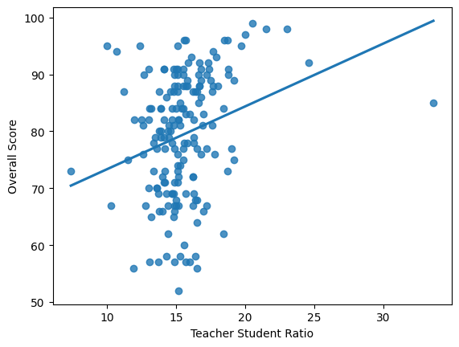
    


The box plot shows multiple outliers which may be affecting the regression line.


```python
fig, axes = plt.subplots(1, 2, figsize = (10,4))
sns.boxplot(data = df_subset, x = 'teacher_student_ratio', ax = axes[0])
sns.histplot(data = df_subset, x = 'teacher_student_ratio', ax = axes[1])
plt.show()
```


    
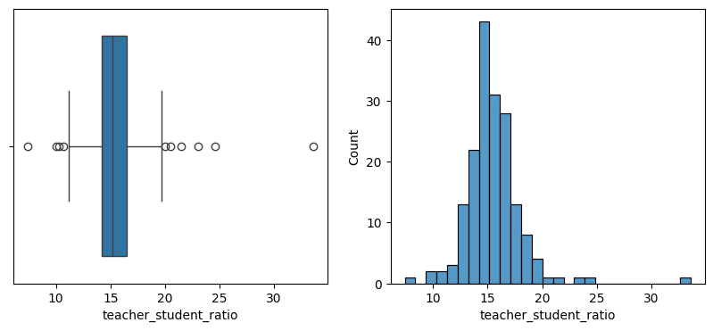
    


I decided to try dropping the schools where the `teacher_student_ratio` value was more than three standard deviations from the mean.


```python
teacher_student_ratio_std = df_subset['teacher_student_ratio'].std()
teacher_student_ratio_mean = df_subset['teacher_student_ratio'].mean()

df_inliers = df_subset[(df_subset['teacher_student_ratio'] < teacher_student_ratio_mean + (3 * teacher_student_ratio_std)) & 
                       (df_subset['teacher_student_ratio'] > teacher_student_ratio_mean - (3 * teacher_student_ratio_std))]

fig, axes = plt.subplots(1, 2, figsize = (10,4))
sns.boxplot(data = df_inliers, x = 'teacher_student_ratio', ax = axes[0])
sns.histplot(data = df_inliers, x = 'teacher_student_ratio', ax = axes[1])
plt.show()
```


    
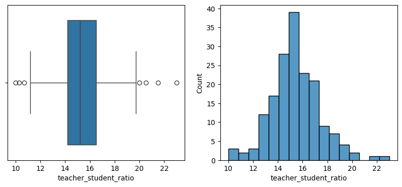
    


Dropping the values where the `teacher_student_ratio` was less than 1.5 times the interquartile range (IQR) from the first quartile, and more than 1.5 times the IQR from the third quartile did a better job of getting rid of the outliers.


```python
#quantiles
percentile25 = df_subset['teacher_student_ratio'].quantile(0.25)
percentile75 = df_subset['teacher_student_ratio'].quantile(0.75)
iqr = percentile75 - percentile25
lower_limit = percentile25 - (1.5 * iqr)
upper_limit = percentile75 + (1.5 * iqr)

df_inliers = df_subset[(df_subset['teacher_student_ratio'] > lower_limit) & (df_subset['teacher_student_ratio'] < upper_limit)]
fig, axes = plt.subplots(1, 2, figsize = (10,4))
sns.boxplot(data = df_inliers, x = 'teacher_student_ratio', ax = axes[0])
sns.histplot(data = df_inliers, x = 'teacher_student_ratio', ax = axes[1])
plt.show()
```


    

    


After removing the outliers, the student-teacher ratios roughly follows a normal distribution according to the empirical rule.  Though not quite 68-95-99.7, the data is close enough to be treated as being normally distributed.


```python
df_inliers_std = df_inliers['teacher_student_ratio'].std()
df_inliers_mean = df_inliers['teacher_student_ratio'].mean()

# calculate the percentage of schools with student-teacher ratios 1,2, and 3 standard deviations from the mean
count_list = []
for i in range(1,4):
    count_list.append(df_inliers[(df_inliers['teacher_student_ratio'] <= df_inliers_mean + (i * df_inliers_std)) & 
    (df_inliers['teacher_student_ratio'] >= df_inliers_mean - (i * df_inliers_std))].shape[0]/df_inliers.shape[0]*100)
print('---After removing outliers from the teacher_student_ratio field---')
print('{:.2f}% of schools have a student-teacher ratio between {:.2f} and {:.2f}'.format(count_list[0], 
                                                                                         df_inliers_mean - (1*df_inliers_std),
                                                                                         df_inliers_mean + (1*df_inliers_std)))
print('{:.2f}% of schools have a student-teacher ratio between {:.2f} and {:.2f}'.format(count_list[1], 
                                                                                         df_inliers_mean - (2*df_inliers_std),
                                                                                         df_inliers_mean + (2*df_inliers_std)))
print('{:.2f}% of schools have a student-teacher ratio between {:.2f} and {:.2f}'.format(count_list[2], 
                                                                                         df_inliers_mean - (3*df_inliers_std),
                                                                                         df_inliers_mean + (3*df_inliers_std)))

      
```

    ---After removing outliers from the teacher_student_ratio field---
    71.52% of schools have a student-teacher ratio between 13.69 and 17.02
    92.73% of schools have a student-teacher ratio between 12.03 and 18.68
    100.00% of schools have a student-teacher ratio between 10.37 and 20.34


Even after dropping the outliers though, the regression plot still indicated that schools with **more** students per teacher tend to have a **higher** overall score.  This seems to go against common sense, that having less students per teacher affords the teachers more time to allocate to each student, which should in theory result in higher overall school scores.


```python
sns.regplot(data = df_inliers, x = 'teacher_student_ratio', y = 'overall_score', ci = None)
plt.xlabel('Teacher Student Ratio')
plt.ylabel('Overall Score')
plt.show()
```


    
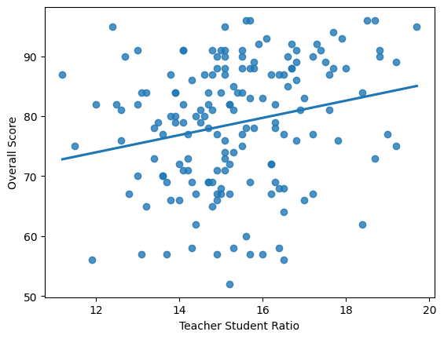
    


For curiosity's sake, I decided to model this regression to identify how much the overall score of a high school increases for every one additional student per teacher.

The R-squared value indicates that only 5.1% of the variation in the overall score of the high schools is explained by the student-teacher ratio.  The p-value is less than 0.05, so the coefficients are statistically significant.  According to the model, for every increase in a school's student-teacher ratio by one student, the school's overall score increases by 1.4386 points.  There is a 95-percent confidence level that this coefficient is between 0.478 and 2.399.

This model wouldn't pass the linearity assumption though, since there is no clear correlation between the data points on the scatter plot.  That and the rather low r-squared value means this probably wouldn't be a useful independent variable to predict a high school's overall score.


```python
OLS = ols(formula = 'overall_score ~ teacher_student_ratio', data = df_inliers)
model = OLS.fit()
model.summary()
```


<table class="simpletable">
<caption>OLS Regression Results</caption>
<tr>
  <th>Dep. Variable:</th>      <td>overall_score</td>  <th>  R-squared:         </th> <td>   0.051</td>
</tr>
<tr>
  <th>Model:</th>                   <td>OLS</td>       <th>  Adj. R-squared:    </th> <td>   0.045</td>
</tr>
<tr>
  <th>Method:</th>             <td>Least Squares</td>  <th>  F-statistic:       </th> <td>   8.741</td>
</tr>
<tr>
  <th>Date:</th>             <td>Mon, 03 Nov 2025</td> <th>  Prob (F-statistic):</th>  <td>0.00357</td>
</tr>
<tr>
  <th>Time:</th>                 <td>20:46:05</td>     <th>  Log-Likelihood:    </th> <td> -618.80</td>
</tr>
<tr>
  <th>No. Observations:</th>      <td>   165</td>      <th>  AIC:               </th> <td>   1242.</td>
</tr>
<tr>
  <th>Df Residuals:</th>          <td>   163</td>      <th>  BIC:               </th> <td>   1248.</td>
</tr>
<tr>
  <th>Df Model:</th>              <td>     1</td>      <th>                     </th>     <td> </td>   
</tr>
<tr>
  <th>Covariance Type:</th>      <td>nonrobust</td>    <th>                     </th>     <td> </td>   
</tr>
</table>
<table class="simpletable">
<tr>
            <td></td>               <th>coef</th>     <th>std err</th>      <th>t</th>      <th>P>|t|</th>  <th>[0.025</th>    <th>0.975]</th>  
</tr>
<tr>
  <th>Intercept</th>             <td>   56.7062</td> <td>    7.514</td> <td>    7.547</td> <td> 0.000</td> <td>   41.869</td> <td>   71.544</td>
</tr>
<tr>
  <th>teacher_student_ratio</th> <td>    1.4386</td> <td>    0.487</td> <td>    2.957</td> <td> 0.004</td> <td>    0.478</td> <td>    2.399</td>
</tr>
</table>
<table class="simpletable">
<tr>
  <th>Omnibus:</th>       <td> 9.893</td> <th>  Durbin-Watson:     </th> <td>   1.495</td>
</tr>
<tr>
  <th>Prob(Omnibus):</th> <td> 0.007</td> <th>  Jarque-Bera (JB):  </th> <td>   8.985</td>
</tr>
<tr>
  <th>Skew:</th>          <td>-0.502</td> <th>  Prob(JB):          </th> <td>  0.0112</td>
</tr>
<tr>
  <th>Kurtosis:</th>      <td> 2.454</td> <th>  Cond. No.          </th> <td>    145.</td>
</tr>
</table><br/><br/>Notes:<br/>[1] Standard Errors assume that the covariance matrix of the errors is correctly specified.  
<br/><br/>


#### Analyzing teachers' education and school performance
---
The next aspect I wanted to analyze using the `school_staff_information` dataset, was whether hiring more teachers with advanced degrees correlates with a better overall school score.


```python
df_subset = df[['overall_score', 'teacher_no_degree_full_time_equiv_percent', 'teacher_ba_degree_full_time_equiv_percent', 
                'teacher_ms_degree_full_time_equiv_percent', 'teacher_ph_degree_full_time_equiv_percent',]].copy()

# Convert data from strings to integers
df_subset[df_subset.columns] = df_subset[df_subset.columns].apply(pd.to_numeric, errors = 'coerce')
```

The correlation matrix show a slight positive correlation between the percentage of teachers with masters degrees and school performance.


```python
sns.heatmap(df_subset.corr(numeric_only = True, method = 'pearson'), annot = True, cmap = 'Reds')
plt.show()
```


    
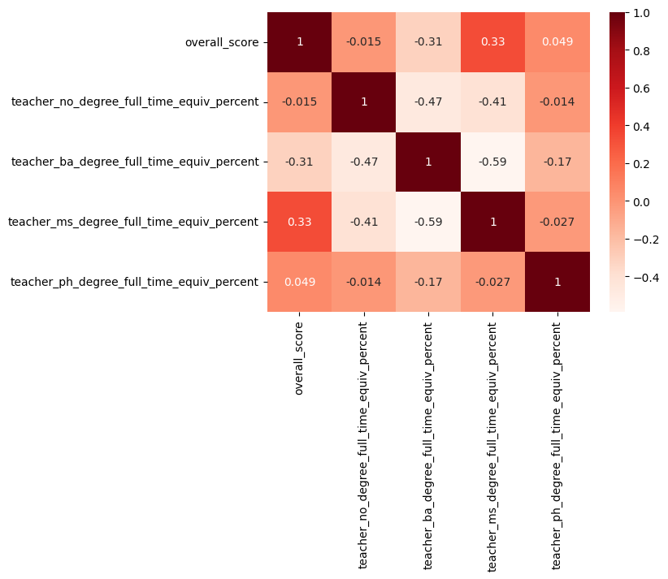
    


The scatter-plot doesn't really show a clear linear relationship between the two variables.  

It does seem apparent though, from the regression plot below, that schools in which over 50-percent of the teachers hold master's degrees tend to have an overall score between 90 and 100-percent.  Though the data supporting this hypothesis is limited, this may be an indicator that schools should hire more teachers with advanced degrees or provide incentives for teachers to further their education.


```python
sns.regplot(data = df_subset, x = 'teacher_ms_degree_full_time_equiv_percent', y = 'overall_score', ci = None)
plt.show()
```


    
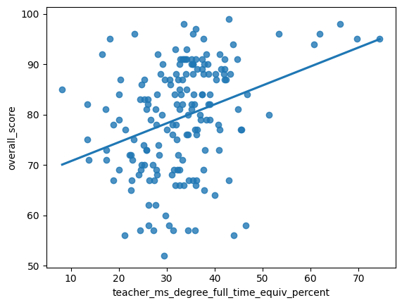
    


The R-squared value, in the model below, indicates that 11.1% of the variation in the high school's overall score can be explained by the percentage of teachers that possess master's degrees.  The p-values for the coefficients are both less than 5%, indicating that the coefficients are statistically significant.  According to the results, for every one-percent increase in teachers with master's degrees the school's overall score increases by 0.3763 points.  

Though slightly better than the student-teacher ratio as a predictor, the percentage of teachers with master's degrees still would probably not be a good variable to use for predicting a school's overall score.  The scatter-plot doesn't really show a clear linear relationship between the variables, so it wouldn't pass the linearity assumption for linear regression models.


```python
OLS = ols(formula = 'overall_score ~ teacher_ms_degree_full_time_equiv_percent', data = df_subset)
model = OLS.fit()
model.summary()
```


<table class="simpletable">
<caption>OLS Regression Results</caption>
<tr>
  <th>Dep. Variable:</th>      <td>overall_score</td>  <th>  R-squared:         </th> <td>   0.111</td>
</tr>
<tr>
  <th>Model:</th>                   <td>OLS</td>       <th>  Adj. R-squared:    </th> <td>   0.105</td>
</tr>
<tr>
  <th>Method:</th>             <td>Least Squares</td>  <th>  F-statistic:       </th> <td>   21.50</td>
</tr>
<tr>
  <th>Date:</th>             <td>Mon, 03 Nov 2025</td> <th>  Prob (F-statistic):</th> <td>6.95e-06</td>
</tr>
<tr>
  <th>Time:</th>                 <td>20:46:05</td>     <th>  Log-Likelihood:    </th> <td> -655.72</td>
</tr>
<tr>
  <th>No. Observations:</th>      <td>   175</td>      <th>  AIC:               </th> <td>   1315.</td>
</tr>
<tr>
  <th>Df Residuals:</th>          <td>   173</td>      <th>  BIC:               </th> <td>   1322.</td>
</tr>
<tr>
  <th>Df Model:</th>              <td>     1</td>      <th>                     </th>     <td> </td>   
</tr>
<tr>
  <th>Covariance Type:</th>      <td>nonrobust</td>    <th>                     </th>     <td> </td>   
</tr>
</table>
<table class="simpletable">
<tr>
                      <td></td>                         <th>coef</th>     <th>std err</th>      <th>t</th>      <th>P>|t|</th>  <th>[0.025</th>    <th>0.975]</th>  
</tr>
<tr>
  <th>Intercept</th>                                 <td>   66.9745</td> <td>    2.796</td> <td>   23.956</td> <td> 0.000</td> <td>   61.456</td> <td>   72.493</td>
</tr>
<tr>
  <th>teacher_ms_degree_full_time_equiv_percent</th> <td>    0.3763</td> <td>    0.081</td> <td>    4.637</td> <td> 0.000</td> <td>    0.216</td> <td>    0.537</td>
</tr>
</table>
<table class="simpletable">
<tr>
  <th>Omnibus:</th>       <td> 7.552</td> <th>  Durbin-Watson:     </th> <td>   1.404</td>
</tr>
<tr>
  <th>Prob(Omnibus):</th> <td> 0.023</td> <th>  Jarque-Bera (JB):  </th> <td>   7.884</td>
</tr>
<tr>
  <th>Skew:</th>          <td>-0.504</td> <th>  Prob(JB):          </th> <td>  0.0194</td>
</tr>
<tr>
  <th>Kurtosis:</th>      <td> 2.744</td> <th>  Cond. No.          </th> <td>    124.</td>
</tr>
</table><br/><br/>Notes:<br/>[1] Standard Errors assume that the covariance matrix of the errors is correctly specified.  
<br/><br/>

#### Analyzing teachers' experience and school performance
---
The next relationship that I wanted to explore using the `school_staff_information` dataset, was how the teachers' average years of experience correlated with a high school's overall score.


```python
df_subset = df[['overall_score', 'teacher_1-5_years_full_time_equiv_percent', 'teacher_6-10_years_full_time_equiv_percent', 
                'teacher_11-20_years_full_time_equiv_percent', 'teacher_21-30_years_full_time_equiv_percent', 
                'teacher_>_30_years_full_time_equiv_percent']].copy()

# Convert data from strings to integers
df_subset[df_subset.columns] = df_subset[df_subset.columns].apply(pd.to_numeric, errors = 'coerce')
```

* The correlation matrix showed a negative correlation between the percentage of teachers with 1-5 years experience and a schools overall score.
* Employing teachers with 6-10 years of experience didn't really seem to impact a schools overall score.
* Teachers with 11-20 years of experience seemed to have the most impact on a schools overall score.
* Teachers with 21-30 years of experience still had a significant impact, though not as much as teachers with 11-20 years.
* Teachers with greater than 30 years of experience didn't really seem to impact a schools overall score.

This data would suggest focusing on hiring people with 11-20 years of experience, and avoiding hiring too many teachers with less than 6 years of experience.  Most teachers appear to peak in performance at around 11-20 years of experience then start to decline.


```python
sns.heatmap(df_subset.corr(numeric_only = True, method = 'pearson'), annot = True, cmap = 'Reds')
plt.show()
```


    
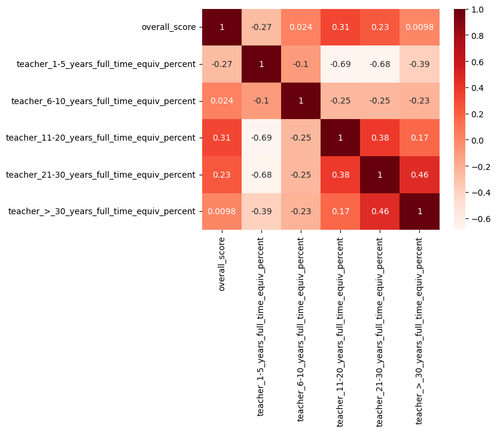
    


#### Analyzing school size impacts school performance
---
Before moving on to census data, and analyzing school performance at a city level, the last factor I wanted to examine was whether smaller high schools have better overall scores than larger high schools.


```python
df_subset = df[['number_of_students', 'overall_score']].copy()
df_subset[df_subset.columns] = df_subset[df_subset.columns].apply(pd.to_numeric, errors = 'coerce')
```

There is a slight negative correlation, indicating that smaller high schools tend to have higher overall scores than smaller high schools.


```python
fig, axes = plt.subplots(1, 2, figsize = (10,4))
sns.regplot(data = df_subset, x = 'number_of_students', y = 'overall_score', ci = None, ax = axes[0])
sns.heatmap(df_subset.corr(numeric_only = True, method = 'pearson'), 
            annot = True, cmap = 'Reds', ax = axes[1])
plt.show()
```


    
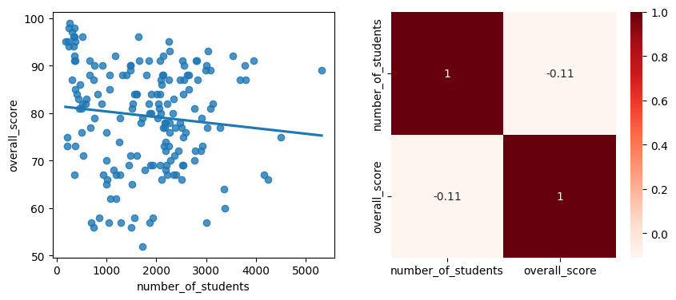
    


When the regression is modeled, the p-value for the number of students coefficient (0.149) is greater than 0.05, indicating that the predictor variable is not statistically significant.  There is not enough evidence to suggest that there is a relationship between the number of students in a high school and the school's overall score.


```python
OLS = ols(formula = 'overall_score ~ number_of_students', data = df_subset)
model = OLS.fit()
model.summary()
```


<table class="simpletable">
<caption>OLS Regression Results</caption>
<tr>
  <th>Dep. Variable:</th>      <td>overall_score</td>  <th>  R-squared:         </th> <td>   0.012</td>
</tr>
<tr>
  <th>Model:</th>                   <td>OLS</td>       <th>  Adj. R-squared:    </th> <td>   0.006</td>
</tr>
<tr>
  <th>Method:</th>             <td>Least Squares</td>  <th>  F-statistic:       </th> <td>   2.098</td>
</tr>
<tr>
  <th>Date:</th>             <td>Mon, 03 Nov 2025</td> <th>  Prob (F-statistic):</th>  <td> 0.149</td> 
</tr>
<tr>
  <th>Time:</th>                 <td>20:46:06</td>     <th>  Log-Likelihood:    </th> <td> -664.92</td>
</tr>
<tr>
  <th>No. Observations:</th>      <td>   175</td>      <th>  AIC:               </th> <td>   1334.</td>
</tr>
<tr>
  <th>Df Residuals:</th>          <td>   173</td>      <th>  BIC:               </th> <td>   1340.</td>
</tr>
<tr>
  <th>Df Model:</th>              <td>     1</td>      <th>                     </th>     <td> </td>   
</tr>
<tr>
  <th>Covariance Type:</th>      <td>nonrobust</td>    <th>                     </th>     <td> </td>   
</tr>
</table>
<table class="simpletable">
<tr>
           <td></td>             <th>coef</th>     <th>std err</th>      <th>t</th>      <th>P>|t|</th>  <th>[0.025</th>    <th>0.975]</th>  
</tr>
<tr>
  <th>Intercept</th>          <td>   81.5273</td> <td>    1.669</td> <td>   48.842</td> <td> 0.000</td> <td>   78.233</td> <td>   84.822</td>
</tr>
<tr>
  <th>number_of_students</th> <td>   -0.0012</td> <td>    0.001</td> <td>   -1.449</td> <td> 0.149</td> <td>   -0.003</td> <td>    0.000</td>
</tr>
</table>
<table class="simpletable">
<tr>
  <th>Omnibus:</th>       <td>10.960</td> <th>  Durbin-Watson:     </th> <td>   1.523</td>
</tr>
<tr>
  <th>Prob(Omnibus):</th> <td> 0.004</td> <th>  Jarque-Bera (JB):  </th> <td>   8.885</td>
</tr>
<tr>
  <th>Skew:</th>          <td>-0.457</td> <th>  Prob(JB):          </th> <td>  0.0118</td>
</tr>
<tr>
  <th>Kurtosis:</th>      <td> 2.382</td> <th>  Cond. No.          </th> <td>4.18e+03</td>
</tr>
</table><br/><br/>Notes:<br/>[1] Standard Errors assume that the covariance matrix of the errors is correctly specified.<br/>[2] The condition number is large, 4.18e+03. This might indicate that there are<br/>strong multicollinearity or other numerical problems.  
<br/><br/>

### Analyzing how socioeconomic factors impact school performance
---
For the next part of my analysis I chose to aggregate schools by the cities they reside in, then use census data to examine whether there are any strong predictors of a schools performance.

I used the `high_school_information_subset` and `school_ratings_subset` subsets that I created earlier.  Since all the census information uses title case for the cities, I converted the cities in the `high_school_information_subset` to that case so that I could join the datasets.  

I joined the two datasets, then grouped by the cities, and calculated the average overall score for all of the high schools that reside in each city.  The first 10 rows of this data frame are shown below the code block.


```python
high_school_information_subset = high_school_information_subset.copy()

# change case of city from uppercase to title case for subsequent joining with census data
high_school_information_subset['city'] = high_school_information_subset['city'].str.title()

# join the two datasets
city_scores = high_school_information_subset.merge(school_ratings_subset, on = 'state_school_id', how = 'inner')

# convert overall_score from a string to a numeric value
city_scores['overall_score'] = city_scores['overall_score'].apply(pd.to_numeric, errors = 'coerce')

# group and aggregate the data by city
city_scores = (city_scores.groupby('city', observed = True, as_index = False)
                          .agg({'overall_score' : 'mean'})
                          .reset_index(drop = True))

# return the first 10 rows of the new dataset
city_scores.head(10)
```

<table border="1" class="dataframe">
  <thead>
    <tr style="text-align: right;">
      <th></th>
      <th>city</th>
      <th>overall_score</th>
    </tr>
  </thead>
  <tbody>
    <tr>
      <th>0</th>
      <td>Allen</td>
      <td>89.0</td>
    </tr>
    <tr>
      <th>1</th>
      <td>Anna</td>
      <td>88.0</td>
    </tr>
    <tr>
      <th>2</th>
      <td>Arlington</td>
      <td>79.5</td>
    </tr>
    <tr>
      <th>3</th>
      <td>Aubrey</td>
      <td>85.5</td>
    </tr>
    <tr>
      <th>4</th>
      <td>Azle</td>
      <td>81.0</td>
    </tr>
    <tr>
      <th>5</th>
      <td>Blue Ridge</td>
      <td>87.0</td>
    </tr>
    <tr>
      <th>6</th>
      <td>Carrollton</td>
      <td>76.5</td>
    </tr>
    <tr>
      <th>7</th>
      <td>Cedar Hill</td>
      <td>83.0</td>
    </tr>
    <tr>
      <th>8</th>
      <td>Celina</td>
      <td>85.0</td>
    </tr>
    <tr>
      <th>9</th>
      <td>Colleyville</td>
      <td>84.0</td>
    </tr>
  </tbody>
</table>


* When aggregated, 50-percent of the citys' average high school scores fall between 76 and 88.
* The lowest score is 66, and the highest is 96.

This seems to be a good range of values for analysis.


```python
city_scores['overall_score'].describe()
```


    count    56.000000
    mean     81.942024
    std       7.551006
    min      66.000000
    25%      76.000000
    50%      83.000000
    75%      88.000000
    max      96.000000
    Name: overall_score, dtype: float64


#### Analyzing how household income diversity correlates to school performance
---
When I initially decided to undertake this case study, I had a hypothesis that a higher household income diversity, meaning that the household incomes are mostly evenly distributed between low income and high income households, would result in lower school scores.  Likewise cities with a lower household income diversity, would theoretically have higher school scores.  

My thoughts behind this relate to the practice of school redistricting, and how most cities tend to place children from lower-income areas in lower quality elementary and middle-schools, while children from higher income areas are often placed in better schools.  When these children all come together into a single high school, my theory is that the lower quality schooling afforded to the disadvantaged children will result in lower overall scores for the high schools.

The census data had too many income brackets for an appropriate analysis, so I grouped the fields into the following groups:
* Households making under \$50,000
    * Lower class
* Households making between \$50,000 and \$149,999
    * Middle class
* Households making \$150,000 or more
    * Upper class


```python
household_income = pd.read_csv('datasets/household_income.csv')

# group salaries and convert to percentages
household_income['under_50000'] = (household_income['less_than_10000'] + household_income['10000_to_14999'] + 
                                   household_income['15000_to_19999'] + household_income['20000_to_24999'] + 
                                   household_income['25000_to_29999'] + household_income['30000_to_34999'] + 
                                   household_income['35000_to_39999'] + household_income['40000_to_44999'] + 
                                   household_income['45000_to_49999'])

household_income['50000_to_149999'] = (household_income['50000_to_59999'] + household_income['60000_to_74999'] + 
                                             household_income['75000_to_99999'] + household_income['100000_to_124999'] + 
                                             household_income['125000_to_149999'])

household_income['150000_or_more'] = (household_income['150000_to_199999'] + household_income['200000_or_more'])

# select fields
household_income = household_income[['city', 'under_50000' , '50000_to_149999', '150000_or_more']].copy()
```

I decided to use a common formula, called the **Simpson's Diversity Index**, to calculate the diversity of the individual city's household incomes.  

$\LARGE 1 - {\sum \frac{n_i(n_i - 1)}{N(N-1)}}$
* $n_i$ is the number of households in a single income bracket
* $N$ is the total number of households in the community
* The score ranges from 0 to 1
* A lower score means the city has a low diversity of household incomes, and is dominated by one or a few income brackets.
* A higher score means the city has a high diversity of household incomes, and the households are relatively evenly distributed between multiple income brackets.


```python
def simpsons_diversity_index(counts):
    total_individuals = sum(counts)
    if total_individuals < 2:
        return 0.0
    sum_ni_ni_minus_1 = sum(c * (c - 1) for c in counts)
    denominator = total_individuals * (total_individuals - 1)
    simpsons_dominance = sum_ni_ni_minus_1 / denominator
    return 1 - simpsons_dominance
```

After applying the formula to the dataset there was a good range of values, ranging from `0.325649` to `0.665497` to use for analysis.


```python
diversity_index = []
for i in range(household_income.shape[0]):
    diversity_index.append(simpsons_diversity_index(household_income.iloc[i, 1:5].values))
household_income['income_diversity_index'] = diversity_index
household_income['income_diversity_index'].describe()
```


    count    134.000000
    mean       0.573046
    std        0.059541
    min        0.325649
    25%        0.538932
    50%        0.591558
    75%        0.614280
    max        0.665497
    Name: income_diversity_index, dtype: float64


Here are the cities that scored as having the highest and lowest amount of diversity between household incomes respectably.


```python
household_income[(household_income['income_diversity_index'] == household_income['income_diversity_index'].min()) | 
                 (household_income['income_diversity_index'] == household_income['income_diversity_index'].max())]
```


<table border="1" class="dataframe">
  <thead>
    <tr style="text-align: right;">
      <th></th>
      <th>city</th>
      <th>under_50000</th>
      <th>50000_to_149999</th>
      <th>150000_or_more</th>
      <th>income_diversity_index</th>
    </tr>
  </thead>
  <tbody>
    <tr>
      <th>31</th>
      <td>Westminster</td>
      <td>128</td>
      <td>102</td>
      <td>123</td>
      <td>0.665497</td>
    </tr>
    <tr>
      <th>131</th>
      <td>Westover Hills</td>
      <td>18</td>
      <td>48</td>
      <td>278</td>
      <td>0.325649</td>
    </tr>
  </tbody>
</table>


I joined this `household_income` dataset with the `city_scores` dataset, which contained the school overall scores aggregated by city.


```python
df = city_scores.merge(household_income, on = 'city', how = 'inner')
```

The data does show a slight correlation to support my initial hypothesis, that cities with a more diverse distribution of household incomes have a lower overall score for their high schools.  There is not as much of a linear relationship as I was initially hoping for though.

The correlation matrix shows a very low correlation between these two variables.  The household income distribution of a city is not as strong of a predictor of high school performance as I initially thought.


```python
fig, axes = plt.subplots(1, 2, figsize = (10,4))
sns.regplot(data = df, x = 'income_diversity_index', y = 'overall_score', ci = None, ax = axes[0])
sns.heatmap(df[['overall_score', 'income_diversity_index']].corr(numeric_only = True, method = 'pearson'), 
            annot = True, cmap = 'Reds', ax = axes[1])
plt.show()
```


    
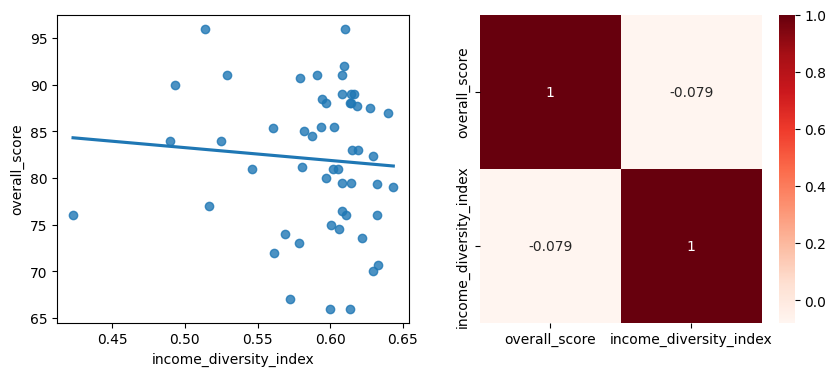
    


#### Analyzing how the percentage of households that earn less than \$50,000 correlates to school performance
---
Continuing with the topic of household incomes, I next decided to explore whether there was any correlation between the percent of households earning less than \$50,000 and the average overall score of the high schools in the cities.  

The regression plot and correlation matrix both show a predictable negative correlation between these two variables.  As the percentage of people in a city who earn less than \$50,000 increases, the high school scores for the city tend to decrease.


```python
df['under_50000_pct'] = (df['under_50000'] / (df['under_50000'] + df['50000_to_149999'] + df['150000_or_more'])) * 100

fig, axes = plt.subplots(1, 2, figsize = (10,4))
sns.regplot(data = df, x = 'under_50000_pct', y = 'overall_score', ax = axes[0], ci = None)
sns.heatmap(df[['overall_score', 'under_50000_pct']].corr(numeric_only = True, method = 'pearson'), 
            annot = True, cmap = 'Reds', ax = axes[1])
plt.show()
```


    
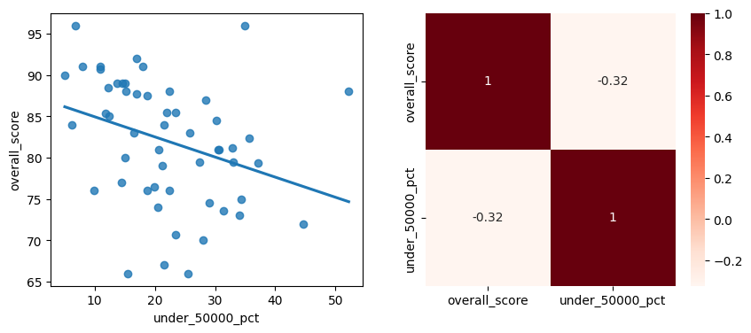
    


One note of interest in the scatter-plot above is the city Farmersville.
* They have over 50-percent of their population earning less than \$50,000, yet still managed to have an average overall high school score in the high 80s.
* Even though the city being relatively small may explain how they are able to achieve such a high score, this city may be worth exploring further to understand why their high schools are performing better than they predictably should be.


```python
df[df['under_50000_pct'] > 50]
```

<table border="1" class="dataframe">
  <thead>
    <tr style="text-align: right;">
      <th></th>
      <th>city</th>
      <th>overall_score</th>
      <th>under_50000</th>
      <th>50000_to_149999</th>
      <th>150000_or_more</th>
      <th>income_diversity_index</th>
      <th>under_50000_pct</th>
    </tr>
  </thead>
  <tbody>
    <tr>
      <th>15</th>
      <td>Farmersville</td>
      <td>88.0</td>
      <td>738</td>
      <td>346</td>
      <td>330</td>
      <td>0.613687</td>
      <td>52.192362</td>
    </tr>
  </tbody>
</table>


When the regression is modeled:
* About 10.4% of the variation in the high schools overall scores for a city can be attributed to the percentage of people earning less than \$50,000 in the city.
* For every one percent increase in the number of people earning less than \$50,000, the average overall score of the high schools in the city decreases by roughly -0.2436.
* If there were no individuals earning less than \$50,000 in the city, then the average predicted overall score for the high schools in the city would be 87.3739.


```python
OLS = ols(formula = 'overall_score ~ under_50000_pct', data = df)
model = OLS.fit()
model.summary()
```


<table class="simpletable">
<caption>OLS Regression Results</caption>
<tr>
  <th>Dep. Variable:</th>      <td>overall_score</td>  <th>  R-squared:         </th> <td>   0.104</td>
</tr>
<tr>
  <th>Model:</th>                   <td>OLS</td>       <th>  Adj. R-squared:    </th> <td>   0.087</td>
</tr>
<tr>
  <th>Method:</th>             <td>Least Squares</td>  <th>  F-statistic:       </th> <td>   5.933</td>
</tr>
<tr>
  <th>Date:</th>             <td>Mon, 03 Nov 2025</td> <th>  Prob (F-statistic):</th>  <td>0.0184</td> 
</tr>
<tr>
  <th>Time:</th>                 <td>20:46:06</td>     <th>  Log-Likelihood:    </th> <td> -178.80</td>
</tr>
<tr>
  <th>No. Observations:</th>      <td>    53</td>      <th>  AIC:               </th> <td>   361.6</td>
</tr>
<tr>
  <th>Df Residuals:</th>          <td>    51</td>      <th>  BIC:               </th> <td>   365.5</td>
</tr>
<tr>
  <th>Df Model:</th>              <td>     1</td>      <th>                     </th>     <td> </td>   
</tr>
<tr>
  <th>Covariance Type:</th>      <td>nonrobust</td>    <th>                     </th>     <td> </td>   
</tr>
</table>
<table class="simpletable">
<tr>
         <td></td>            <th>coef</th>     <th>std err</th>      <th>t</th>      <th>P>|t|</th>  <th>[0.025</th>    <th>0.975]</th>  
</tr>
<tr>
  <th>Intercept</th>       <td>   87.3739</td> <td>    2.416</td> <td>   36.166</td> <td> 0.000</td> <td>   82.524</td> <td>   92.224</td>
</tr>
<tr>
  <th>under_50000_pct</th> <td>   -0.2436</td> <td>    0.100</td> <td>   -2.436</td> <td> 0.018</td> <td>   -0.444</td> <td>   -0.043</td>
</tr>
</table>
<table class="simpletable">
<tr>
  <th>Omnibus:</th>       <td> 1.451</td> <th>  Durbin-Watson:     </th> <td>   1.886</td>
</tr>
<tr>
  <th>Prob(Omnibus):</th> <td> 0.484</td> <th>  Jarque-Bera (JB):  </th> <td>   1.016</td>
</tr>
<tr>
  <th>Skew:</th>          <td>-0.338</td> <th>  Prob(JB):          </th> <td>   0.602</td>
</tr>
<tr>
  <th>Kurtosis:</th>      <td> 3.055</td> <th>  Cond. No.          </th> <td>    59.1</td>
</tr>
</table><br/><br/>Notes:<br/>[1] Standard Errors assume that the covariance matrix of the errors is correctly specified.  
<br/><br/>

Even though there isn't really a clear linear relationship, between the average overall score of the high schools in a city and the percentage of people who earn less than \$50,000, I decided to check if the model fulfilled the other linear regression assumptions anyways.

**Normality Assumption**  
* The residuals from the model appear to be approximately normally distributed based on the histogram of the residuals and the Quantile-Quantile plot of the residuals.
* The model appears to satisfy this assumption.


```python
residuals = model.resid

fig, axes = plt.subplots(1, 2, figsize = (10,4))
sns.histplot(residuals, ax = axes[0])
axes[0].set_xlabel("Residual Value")
axes[0].set_title("Histogram of Residuals")
sm.qqplot(residuals, line = 's', ax = axes[1])
axes[1].set_title('Q-Q plot of Residuals')
plt.show()
```


    
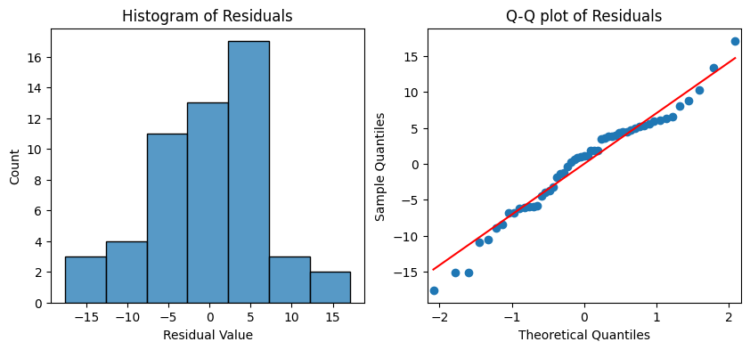
    


**Homoscedasticity assumption**
* The data points in the plot below have a cloud-like resemblance and do not seem to follow any pattern.
* The model appears to satisfy this assumption.


```python
fitted_values = model.predict(df['under_50000_pct'])

sns.scatterplot(x=fitted_values, y=residuals)
plt.axhline(0)
plt.xlabel("Fitted Values")
plt.ylabel("Residuals")
plt.show()
```


    
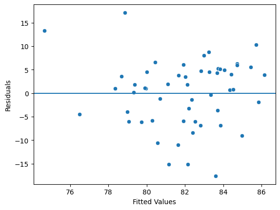
    


Even though ideally there should be more correlation between the two variables, and more of a linear pattern observed on the scatter plot, the data does fulfill the other assumptions for linear regression models.  The percentage of individuals in a city earning less than $50,000 may be a useful independent variable in predicting the average overall score of high schools in a city if it is combined with other variables in a multiple regression model.

**Predicting under-performing schools**  

This simple model could be used to predict schools that are under-performing.  The model could be used to predict what the average overall score of the high schools in the cities should be, based on the percentage of people earning less than \$50,000.  The predicted score could then be subtracted from the actual score, to identify the amount that high school performance in a city differed from what the model predicted it should be.  This could allow us to account for the economic inequality between cities, and allow for better comparisons of school performance across different cities.


```python
df['predicted_score'] = model.predict(df['under_50000_pct'])
df['score_difference'] = df['overall_score'] - df['predicted_score']
```

These would be the bottom 10 **lowest** performing cities, while accounting for the percentage of individuals earning less than $50,000.


```python
df.sort_values(by = ['score_difference'])[['city', 'under_50000_pct', 'overall_score',
                                           'predicted_score', 'score_difference']].head(10)
```


<table border="1" class="dataframe">
  <thead>
    <tr style="text-align: right;">
      <th></th>
      <th>city</th>
      <th>under_50000_pct</th>
      <th>overall_score</th>
      <th>predicted_score</th>
      <th>score_difference</th>
    </tr>
  </thead>
  <tbody>
    <tr>
      <th>32</th>
      <td>Little Elm</td>
      <td>15.519200</td>
      <td>66.000000</td>
      <td>83.593718</td>
      <td>-17.593718</td>
    </tr>
    <tr>
      <th>31</th>
      <td>Lewisville</td>
      <td>25.501027</td>
      <td>66.000000</td>
      <td>81.162357</td>
      <td>-15.162357</td>
    </tr>
    <tr>
      <th>11</th>
      <td>Crowley</td>
      <td>21.451717</td>
      <td>67.000000</td>
      <td>82.148683</td>
      <td>-15.148683</td>
    </tr>
    <tr>
      <th>44</th>
      <td>Richardson</td>
      <td>23.508054</td>
      <td>70.666667</td>
      <td>81.647803</td>
      <td>-10.981136</td>
    </tr>
    <tr>
      <th>29</th>
      <td>Lake Worth</td>
      <td>27.941997</td>
      <td>70.000000</td>
      <td>80.567788</td>
      <td>-10.567788</td>
    </tr>
    <tr>
      <th>41</th>
      <td>Ponder</td>
      <td>9.854015</td>
      <td>76.000000</td>
      <td>84.973637</td>
      <td>-8.973637</td>
    </tr>
    <tr>
      <th>47</th>
      <td>Saginaw</td>
      <td>20.439889</td>
      <td>74.000000</td>
      <td>82.395142</td>
      <td>-8.395142</td>
    </tr>
    <tr>
      <th>28</th>
      <td>Krum</td>
      <td>14.467652</td>
      <td>77.000000</td>
      <td>83.849853</td>
      <td>-6.849853</td>
    </tr>
    <tr>
      <th>27</th>
      <td>Kennedale</td>
      <td>18.692206</td>
      <td>76.000000</td>
      <td>82.820841</td>
      <td>-6.820841</td>
    </tr>
    <tr>
      <th>17</th>
      <td>Fort Worth</td>
      <td>31.402328</td>
      <td>73.560000</td>
      <td>79.724925</td>
      <td>-6.164925</td>
    </tr>
  </tbody>
</table>


These would be the top 10 **highest** performing cities, while accounting for the percentage of individuals earning less than \$50,000.


```python
df.sort_values(by = ['score_difference'], ascending = False)[['city', 'under_50000_pct', 'overall_score',
                                                              'predicted_score', 'score_difference']].head(10)
```


<table border="1" class="dataframe">
  <thead>
    <tr style="text-align: right;">
      <th></th>
      <th>city</th>
      <th>under_50000_pct</th>
      <th>overall_score</th>
      <th>predicted_score</th>
      <th>score_difference</th>
    </tr>
  </thead>
  <tbody>
    <tr>
      <th>23</th>
      <td>Hurst</td>
      <td>34.960397</td>
      <td>96.000000</td>
      <td>78.858255</td>
      <td>17.141745</td>
    </tr>
    <tr>
      <th>15</th>
      <td>Farmersville</td>
      <td>52.192362</td>
      <td>88.000000</td>
      <td>74.660914</td>
      <td>13.339086</td>
    </tr>
    <tr>
      <th>33</th>
      <td>Lucas</td>
      <td>6.791483</td>
      <td>96.000000</td>
      <td>85.719605</td>
      <td>10.280395</td>
    </tr>
    <tr>
      <th>52</th>
      <td>Wylie</td>
      <td>16.943991</td>
      <td>92.000000</td>
      <td>83.246669</td>
      <td>8.753331</td>
    </tr>
    <tr>
      <th>49</th>
      <td>Sunnyvale</td>
      <td>18.010550</td>
      <td>91.000000</td>
      <td>82.986878</td>
      <td>8.013122</td>
    </tr>
    <tr>
      <th>5</th>
      <td>Blue Ridge</td>
      <td>28.491620</td>
      <td>87.000000</td>
      <td>80.433912</td>
      <td>6.566088</td>
    </tr>
    <tr>
      <th>10</th>
      <td>Coppell</td>
      <td>10.912251</td>
      <td>91.000000</td>
      <td>84.715873</td>
      <td>6.284127</td>
    </tr>
    <tr>
      <th>1</th>
      <td>Anna</td>
      <td>22.426363</td>
      <td>88.000000</td>
      <td>81.911280</td>
      <td>6.088720</td>
    </tr>
    <tr>
      <th>16</th>
      <td>Flower Mound</td>
      <td>10.858395</td>
      <td>90.666667</td>
      <td>84.728991</td>
      <td>5.937676</td>
    </tr>
    <tr>
      <th>51</th>
      <td>Trophy Club</td>
      <td>7.984950</td>
      <td>91.000000</td>
      <td>85.428901</td>
      <td>5.571099</td>
    </tr>
  </tbody>
</table>


**Model accuracy**  

Given that the percentage of individuals earning less than \$50,000 only accounted for 10.4 percent of the variation in the average overall high school score for the cities, it probably would not be fair to use this model to gauge school performance.

#### Analyzing how housing prices correlates to school performance
---
A socioeconomic factor related to household income, would be the value of homes in a city.  It would make sense to assume that the more expensive homes there are in an area, the better the schooling should be.

Since there were too many housing price categories in the census data for a meaningful analysis, I decided to group them into the following fields.
* Entry Level: Below \$300,000
* Mid Price: \$300,000 to \$500,000
* High Price: \$500,000 to \$750,000
* Luxury: Above \$750,000 


```python
value_of_owner_occupied_housing_units = pd.read_csv('datasets/value_of_owner_occupied_housing_units.csv')

# Group house values
value_of_owner_occupied_housing_units['entry_level'] = value_of_owner_occupied_housing_units[['less_than_10000', '10000_to_14999', 
                                                                                              '15000_to_19999','20000_to_24999', 
                                                                                              '25000_to_29999', '30000_to_34999', 
                                                                                              '35000_to_39999','40000_to_49999', 
                                                                                              '50000_to_59999', '60000_to_69999', 
                                                                                              '70000_to_79999','80000_to_89999', 
                                                                                              '90000_to_99999', '100000_to_124999',
                                                                                              '125000_to_149999', '150000_to_174999', 
                                                                                              '175000_to_199999','200000_to_249999', 
                                                                                              '250000_to_299999']].sum(axis = 1)
value_of_owner_occupied_housing_units['mid_level'] = value_of_owner_occupied_housing_units[['300000_to_399999', 
                                                                                            '400000_to_499999']].sum(axis = 1)
value_of_owner_occupied_housing_units['high_level'] = value_of_owner_occupied_housing_units['500000_to_749999']
value_of_owner_occupied_housing_units['luxury'] = value_of_owner_occupied_housing_units[['750000_to_999999', '1000000_to_1499999', 
                                                                                         '1500000_to_1999999', 
                                                                                         '2000000_or_more']].sum(axis = 1)
```

Instead of working with percentages, like in the previous examples, I decided to standardize all of the values as if each of the cities had the same population.  


```python
total_mean = value_of_owner_occupied_housing_units['total'].mean().astype(int)

value_of_owner_occupied_housing_units['entry_level'] = ((value_of_owner_occupied_housing_units['entry_level'] / 
                                                         value_of_owner_occupied_housing_units['total']) * total_mean).astype(int)

value_of_owner_occupied_housing_units['mid_level'] = ((value_of_owner_occupied_housing_units['mid_level'] / 
                                                       value_of_owner_occupied_housing_units['total']) * total_mean).astype(int)

value_of_owner_occupied_housing_units['high_level'] = ((value_of_owner_occupied_housing_units['high_level'] / 
                                                        value_of_owner_occupied_housing_units['total']) * total_mean).astype(int)

value_of_owner_occupied_housing_units['luxury'] = ((value_of_owner_occupied_housing_units['luxury'] / 
                                                    value_of_owner_occupied_housing_units['total']) * total_mean).astype(int)
```

Like before, I then joined this data with the dataset containing the high school scores aggregated by city.


```python
value_of_owner_occupied_housing_units = value_of_owner_occupied_housing_units[['city', 'entry_level', 'mid_level', 
                                                                               'high_level', 'luxury']].copy()

df = city_scores.merge(value_of_owner_occupied_housing_units, on = 'city', how = 'inner')
```

When I created a correlation matrix for these values, I noticed that the number of houses \$500,000 and up in a city had the strongest positive correlation with high school scores among the variables examined so far.  Likewise the number of houses less than \$300,000 in a city had a substantial negative correlation with high school scores.


```python
sns.heatmap(df.corr(numeric_only = True, method = 'pearson'), annot = True, cmap = 'Reds')
plt.show()
```


    
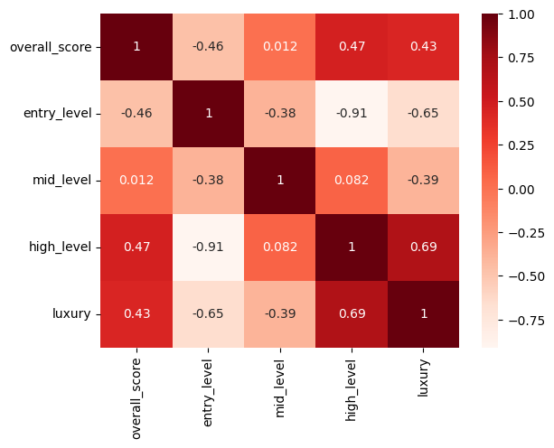
    


I decided to combine the high-end and luxury house categories into a single field.  This category encompasses all houses in the city that are greater than \$500,000.  This combined field showed the highest correlation with the high school scores thus far.


```python
df['high_luxury'] = df['high_level'] + df['luxury']

fig, axes = plt.subplots(1, 2, figsize = (10,4))
sns.regplot(data = df, x = 'high_luxury', y = 'overall_score', ax = axes[0], ci = None)
sns.heatmap(df[['overall_score', 'high_luxury']].corr(numeric_only = True, method = 'pearson'), 
            annot = True, cmap = 'Reds', ax = axes[1])
plt.show()
```


    

    


According to the model below: 
* The R-squared value is the highest so far, indicating that the number of homes greater than \$500,000 in a city contributes to 23.9 percent of the variation in the average high school score for the city.
* For every additional home that has a value of more than \$500,000 in the city, the average high school score in the city increases by 0.0015 points.
* If there were no homes with a value of \$500,000 in the city, then the predicted average high school score would be 78.3876.


```python
OLS = ols(formula = 'overall_score ~ high_luxury', data = df)
model = OLS.fit()
model.summary()
```


<table class="simpletable">
<caption>OLS Regression Results</caption>
<tr>
  <th>Dep. Variable:</th>      <td>overall_score</td>  <th>  R-squared:         </th> <td>   0.239</td>
</tr>
<tr>
  <th>Model:</th>                   <td>OLS</td>       <th>  Adj. R-squared:    </th> <td>   0.224</td>
</tr>
<tr>
  <th>Method:</th>             <td>Least Squares</td>  <th>  F-statistic:       </th> <td>   16.05</td>
</tr>
<tr>
  <th>Date:</th>             <td>Mon, 03 Nov 2025</td> <th>  Prob (F-statistic):</th> <td>0.000201</td>
</tr>
<tr>
  <th>Time:</th>                 <td>20:46:07</td>     <th>  Log-Likelihood:    </th> <td> -174.46</td>
</tr>
<tr>
  <th>No. Observations:</th>      <td>    53</td>      <th>  AIC:               </th> <td>   352.9</td>
</tr>
<tr>
  <th>Df Residuals:</th>          <td>    51</td>      <th>  BIC:               </th> <td>   356.9</td>
</tr>
<tr>
  <th>Df Model:</th>              <td>     1</td>      <th>                     </th>     <td> </td>   
</tr>
<tr>
  <th>Covariance Type:</th>      <td>nonrobust</td>    <th>                     </th>     <td> </td>   
</tr>
</table>
<table class="simpletable">
<tr>
       <td></td>          <th>coef</th>     <th>std err</th>      <th>t</th>      <th>P>|t|</th>  <th>[0.025</th>    <th>0.975]</th>  
</tr>
<tr>
  <th>Intercept</th>   <td>   78.3876</td> <td>    1.283</td> <td>   61.108</td> <td> 0.000</td> <td>   75.812</td> <td>   80.963</td>
</tr>
<tr>
  <th>high_luxury</th> <td>    0.0015</td> <td>    0.000</td> <td>    4.006</td> <td> 0.000</td> <td>    0.001</td> <td>    0.002</td>
</tr>
</table>
<table class="simpletable">
<tr>
  <th>Omnibus:</th>       <td> 0.807</td> <th>  Durbin-Watson:     </th> <td>   1.654</td>
</tr>
<tr>
  <th>Prob(Omnibus):</th> <td> 0.668</td> <th>  Jarque-Bera (JB):  </th> <td>   0.466</td>
</tr>
<tr>
  <th>Skew:</th>          <td>-0.228</td> <th>  Prob(JB):          </th> <td>   0.792</td>
</tr>
<tr>
  <th>Kurtosis:</th>      <td> 3.054</td> <th>  Cond. No.          </th> <td>4.83e+03</td>
</tr>
</table><br/><br/>Notes:<br/>[1] Standard Errors assume that the covariance matrix of the errors is correctly specified.<br/>[2] The condition number is large, 4.83e+03. This might indicate that there are<br/>strong multicollinearity or other numerical problems.  
<br/><br/>

**Normality Assumption**  

The residuals appear to be normally distributed, satisfying this assumption.


```python
residuals = model.resid

fig, axes = plt.subplots(1, 2, figsize = (10,4))
sns.histplot(residuals, ax = axes[0])
axes[0].set_xlabel("Residual Value")
axes[0].set_title("Histogram of Residuals")
sm.qqplot(residuals, line = 's', ax = axes[1])
axes[1].set_title('Q-Q plot of Residuals')
plt.show()
```


    
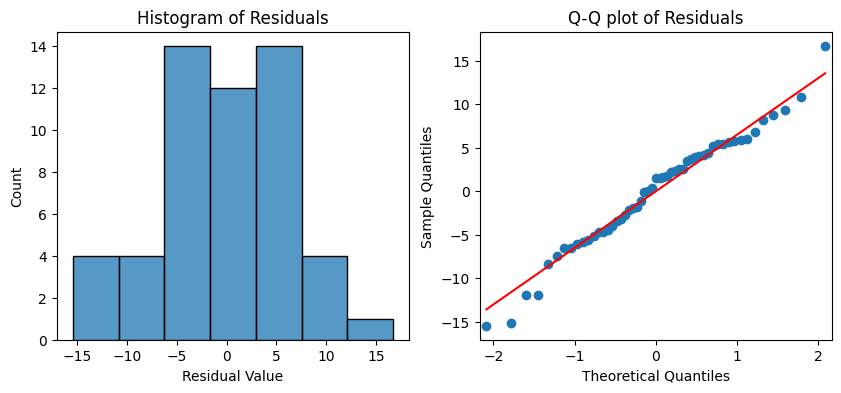
    


**Homoscedasticity assumption**  

The data points in the plot below have a cloud-like resemblance, satisfying this assumption.


```python
fitted_values = model.predict(df['high_luxury'])

sns.scatterplot(x=fitted_values, y=residuals)
plt.axhline(0)
plt.xlabel("Fitted Values")
plt.ylabel("Residuals")
plt.show()
```


    
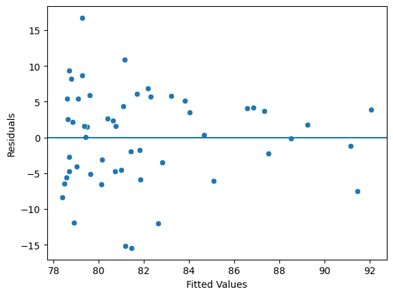
    


The number of homes in a city with a value of more than \$500,000 appears to be the strongest predictor so far for the city's average high school score.  This will be an ideal variable to use in a multiple regression model.  

**Predicting under-performing schools**  

Like before, I wanted to use this model to identify the cities with under-performing high schools, whose predicted scores were greater than their actual scores.

The following are the bottom 10 **lowest** performing cities, while accounting for the number of houses greater than $500,000 in the city.  The first five cities in this list were in the bottom 5, though in a slightly different order, according to the previous model as well.


```python
df['predicted_score'] = model.predict(df['high_luxury'])
df['score_difference'] = df['overall_score'] - df['predicted_score']

df.sort_values(by = ['score_difference']).head(10)
```


<table border="1" class="dataframe">
  <thead>
    <tr style="text-align: right;">
      <th></th>
      <th>city</th>
      <th>overall_score</th>
      <th>entry_level</th>
      <th>mid_level</th>
      <th>high_level</th>
      <th>luxury</th>
      <th>high_luxury</th>
      <th>predicted_score</th>
      <th>score_difference</th>
    </tr>
  </thead>
  <tbody>
    <tr>
      <th>31</th>
      <td>Lewisville</td>
      <td>66.000000</td>
      <td>3594</td>
      <td>4877</td>
      <td>1595</td>
      <td>452</td>
      <td>2047</td>
      <td>81.451553</td>
      <td>-15.451553</td>
    </tr>
    <tr>
      <th>32</th>
      <td>Little Elm</td>
      <td>66.000000</td>
      <td>2603</td>
      <td>6042</td>
      <td>1599</td>
      <td>273</td>
      <td>1872</td>
      <td>81.189611</td>
      <td>-15.189611</td>
    </tr>
    <tr>
      <th>44</th>
      <td>Richardson</td>
      <td>70.666667</td>
      <td>2290</td>
      <td>5386</td>
      <td>2256</td>
      <td>585</td>
      <td>2841</td>
      <td>82.640020</td>
      <td>-11.973354</td>
    </tr>
    <tr>
      <th>11</th>
      <td>Crowley</td>
      <td>67.000000</td>
      <td>7529</td>
      <td>2651</td>
      <td>283</td>
      <td>55</td>
      <td>338</td>
      <td>78.893505</td>
      <td>-11.893505</td>
    </tr>
    <tr>
      <th>29</th>
      <td>Lake Worth</td>
      <td>70.000000</td>
      <td>9454</td>
      <td>1064</td>
      <td>0</td>
      <td>0</td>
      <td>0</td>
      <td>78.387583</td>
      <td>-8.387583</td>
    </tr>
    <tr>
      <th>9</th>
      <td>Colleyville</td>
      <td>84.000000</td>
      <td>370</td>
      <td>1409</td>
      <td>3972</td>
      <td>4766</td>
      <td>8738</td>
      <td>91.466709</td>
      <td>-7.466709</td>
    </tr>
    <tr>
      <th>17</th>
      <td>Fort Worth</td>
      <td>73.560000</td>
      <td>6051</td>
      <td>3318</td>
      <td>758</td>
      <td>389</td>
      <td>1147</td>
      <td>80.104424</td>
      <td>-6.544424</td>
    </tr>
    <tr>
      <th>22</th>
      <td>Haltom City</td>
      <td>72.000000</td>
      <td>9064</td>
      <td>1392</td>
      <td>35</td>
      <td>26</td>
      <td>61</td>
      <td>78.478888</td>
      <td>-6.478888</td>
    </tr>
    <tr>
      <th>21</th>
      <td>Grapevine</td>
      <td>79.000000</td>
      <td>1626</td>
      <td>4403</td>
      <td>3487</td>
      <td>1000</td>
      <td>4487</td>
      <td>85.103770</td>
      <td>-6.103770</td>
    </tr>
    <tr>
      <th>27</th>
      <td>Kennedale</td>
      <td>76.000000</td>
      <td>3969</td>
      <td>4228</td>
      <td>1815</td>
      <td>504</td>
      <td>2319</td>
      <td>81.858686</td>
      <td>-5.858686</td>
    </tr>
  </tbody>
</table>


#### Analyzing how the percentage of owners vs. renters of housing correlates to school performance
---
Continuing with the topic of housing, I wanted to explore whether a high percentage of renters in a city has a negative correlation with high school performance.


```python
ownership_of_occupied_units = pd.read_csv('datasets/ownership_of_occupied_units.csv')
```


```python
ownership_of_occupied_units['renter_occupied_pct'] = ((ownership_of_occupied_units['renter_occupied'] / 
                                                       ownership_of_occupied_units ['total']) * 100)

df = city_scores.merge(ownership_of_occupied_units, on = 'city', how = 'inner')
```

The percentage of households who rented, as opposed to owning their housing, had a strong negative correlation with the overall score of high schools in the city.


```python
fig, axes = plt.subplots(1, 2, figsize = (10,4))
sns.regplot(data = df, x = 'renter_occupied_pct', y = 'overall_score', ax = axes[0], ci = None)
sns.heatmap(df[['overall_score', 'renter_occupied_pct']].corr(numeric_only = True, method = 'pearson'), 
            annot = True, cmap = 'Reds', ax = axes[1])
plt.show()
```


    
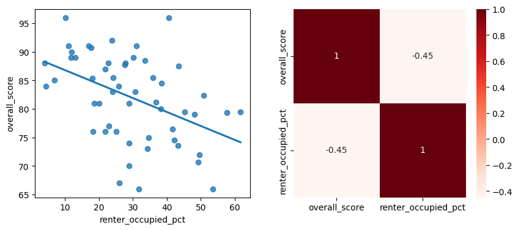
    


According to the model below:
* The percentage of households who rented their housing accounted for 20-percent of the variation in the high school scores for the city.
* For every additional one percent of individuals who rent their housing, the average high school scores for the city decreases by -0.2442 points.


```python
OLS = ols(formula = 'overall_score ~ renter_occupied_pct', data = df)
model = OLS.fit()
model.summary()
```


<table class="simpletable">
<caption>OLS Regression Results</caption>
<tr>
  <th>Dep. Variable:</th>      <td>overall_score</td>  <th>  R-squared:         </th> <td>   0.200</td>
</tr>
<tr>
  <th>Model:</th>                   <td>OLS</td>       <th>  Adj. R-squared:    </th> <td>   0.185</td>
</tr>
<tr>
  <th>Method:</th>             <td>Least Squares</td>  <th>  F-statistic:       </th> <td>   12.77</td>
</tr>
<tr>
  <th>Date:</th>             <td>Mon, 03 Nov 2025</td> <th>  Prob (F-statistic):</th> <td>0.000780</td>
</tr>
<tr>
  <th>Time:</th>                 <td>20:46:07</td>     <th>  Log-Likelihood:    </th> <td> -175.79</td>
</tr>
<tr>
  <th>No. Observations:</th>      <td>    53</td>      <th>  AIC:               </th> <td>   355.6</td>
</tr>
<tr>
  <th>Df Residuals:</th>          <td>    51</td>      <th>  BIC:               </th> <td>   359.5</td>
</tr>
<tr>
  <th>Df Model:</th>              <td>     1</td>      <th>                     </th>     <td> </td>   
</tr>
<tr>
  <th>Covariance Type:</th>      <td>nonrobust</td>    <th>                     </th>     <td> </td>   
</tr>
</table>
<table class="simpletable">
<tr>
           <td></td>              <th>coef</th>     <th>std err</th>      <th>t</th>      <th>P>|t|</th>  <th>[0.025</th>    <th>0.975]</th>  
</tr>
<tr>
  <th>Intercept</th>           <td>   89.2096</td> <td>    2.222</td> <td>   40.150</td> <td> 0.000</td> <td>   84.749</td> <td>   93.670</td>
</tr>
<tr>
  <th>renter_occupied_pct</th> <td>   -0.2442</td> <td>    0.068</td> <td>   -3.574</td> <td> 0.001</td> <td>   -0.381</td> <td>   -0.107</td>
</tr>
</table>
<table class="simpletable">
<tr>
  <th>Omnibus:</th>       <td> 0.836</td> <th>  Durbin-Watson:     </th> <td>   2.022</td>
</tr>
<tr>
  <th>Prob(Omnibus):</th> <td> 0.658</td> <th>  Jarque-Bera (JB):  </th> <td>   0.730</td>
</tr>
<tr>
  <th>Skew:</th>          <td>-0.277</td> <th>  Prob(JB):          </th> <td>   0.694</td>
</tr>
<tr>
  <th>Kurtosis:</th>      <td> 2.849</td> <th>  Cond. No.          </th> <td>    77.4</td>
</tr>
</table><br/><br/>Notes:<br/>[1] Standard Errors assume that the covariance matrix of the errors is correctly specified.  
<br/><br/>

**Model Assumptions**  

The Normality and Homoscedasticity assumptions for linear regression models both seem to be satisfied.


```python
residuals = model.resid

fig, axes = plt.subplots(1, 2, figsize = (10,4))
sns.histplot(residuals, ax = axes[0])
axes[0].set_xlabel("Residual Value")
axes[0].set_title("Histogram of Residuals")
sm.qqplot(residuals, line = 's', ax = axes[1])
axes[1].set_title('Q-Q plot of Residuals')
plt.show()
```


    
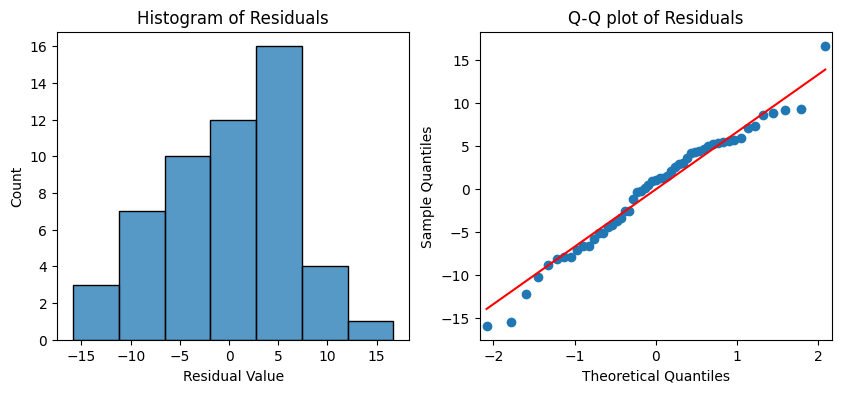
    


```python
fitted_values = model.predict(df['renter_occupied_pct'])

sns.scatterplot(x=fitted_values, y=residuals)
plt.axhline(0)
plt.xlabel("Fitted Values")
plt.ylabel("Residuals")
plt.show()
```


    
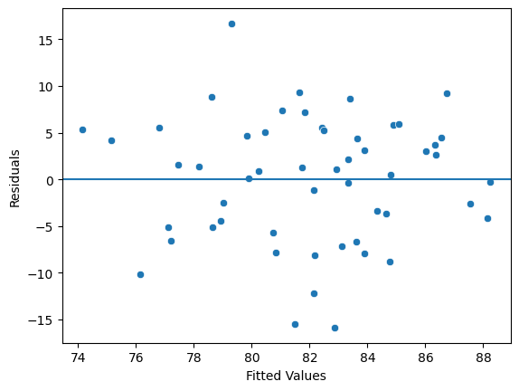
    


This would be an interesting predictor variable to pair with the amount of houses greater than \$500,000.  There might be multicollinearity between those two variables though, so the correlation between them will need to be checked.

#### Analyzing how educational attainment correlates to school performance
---
Another socioeconomic factor that I wanted to explore was whether household educational attainment, in particular whether an individual possesses a bachelor's degree or higher, is correlated with high school scores.


```python
 educational_attainment = pd.read_csv('datasets/educational_attainment.csv')
```


```python
educational_attainment['bachelors_or_higher_pct'] = (educational_attainment[['male_bachelors_degree', 'male_masters_degree', 
                                                                            'male_professional_school_degree', 'male_doctorate_degree', 
                                                                            'female_bachelors_degree', 'female_masters_degree', 
                                                                            'female_professional_school_degree', 
                                                                            'female_doctorate_degree']].sum(axis = 1) / 
                                                     educational_attainment['total'] * 100)

educational_attainment_subset = educational_attainment[['city', 'bachelors_or_higher_pct']].copy()
df = city_scores.merge(educational_attainment_subset, on = 'city', how = 'inner')
```

There appeared to be a positive correlation between the percentage of people who have a bachelor's degree or higher and the average high school score for the city.


```python
fig, axes = plt.subplots(1, 2, figsize = (10,4))
sns.regplot(data = df, x = 'bachelors_or_higher_pct', y = 'overall_score', ax = axes[0], ci = None)
sns.heatmap(df[['overall_score', 'bachelors_or_higher_pct']].corr(numeric_only = True, method = 'pearson'), 
            annot = True, cmap = 'Reds', ax = axes[1])
plt.show()
```


    
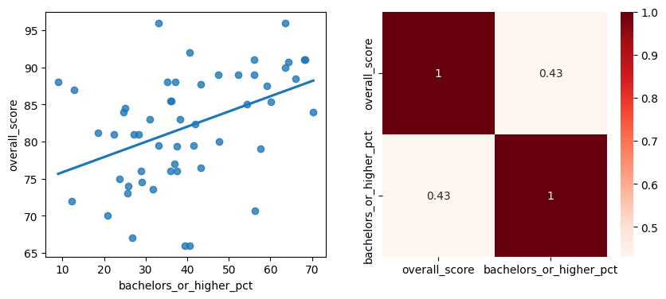
    


The model indicated that 18.6 percent of the variation in the overall high school scores can be explained by the percentage of people in the city with a bachelor's degree or higher.  For every one percent increase in individuals with a bachelor's degrees or higher, the average high school score for the city increased by 0.2048 points.  If no one in the city possessed a bachelor's degree or higher, then the predicted high school score for the city would be 73.8064.


```python
OLS = ols(formula = 'overall_score ~ bachelors_or_higher_pct', data = df)
model = OLS.fit()
model.summary()
```


<table class="simpletable">
<caption>OLS Regression Results</caption>
<tr>
  <th>Dep. Variable:</th>      <td>overall_score</td>  <th>  R-squared:         </th> <td>   0.186</td>
</tr>
<tr>
  <th>Model:</th>                   <td>OLS</td>       <th>  Adj. R-squared:    </th> <td>   0.170</td>
</tr>
<tr>
  <th>Method:</th>             <td>Least Squares</td>  <th>  F-statistic:       </th> <td>   11.63</td>
</tr>
<tr>
  <th>Date:</th>             <td>Mon, 03 Nov 2025</td> <th>  Prob (F-statistic):</th>  <td>0.00127</td>
</tr>
<tr>
  <th>Time:</th>                 <td>20:46:07</td>     <th>  Log-Likelihood:    </th> <td> -176.27</td>
</tr>
<tr>
  <th>No. Observations:</th>      <td>    53</td>      <th>  AIC:               </th> <td>   356.5</td>
</tr>
<tr>
  <th>Df Residuals:</th>          <td>    51</td>      <th>  BIC:               </th> <td>   360.5</td>
</tr>
<tr>
  <th>Df Model:</th>              <td>     1</td>      <th>                     </th>     <td> </td>   
</tr>
<tr>
  <th>Covariance Type:</th>      <td>nonrobust</td>    <th>                     </th>     <td> </td>   
</tr>
</table>
<table class="simpletable">
<tr>
             <td></td>                <th>coef</th>     <th>std err</th>      <th>t</th>      <th>P>|t|</th>  <th>[0.025</th>    <th>0.975]</th>  
</tr>
<tr>
  <th>Intercept</th>               <td>   73.8064</td> <td>    2.582</td> <td>   28.586</td> <td> 0.000</td> <td>   68.623</td> <td>   78.990</td>
</tr>
<tr>
  <th>bachelors_or_higher_pct</th> <td>    0.2048</td> <td>    0.060</td> <td>    3.411</td> <td> 0.001</td> <td>    0.084</td> <td>    0.325</td>
</tr>
</table>
<table class="simpletable">
<tr>
  <th>Omnibus:</th>       <td> 1.439</td> <th>  Durbin-Watson:     </th> <td>   1.773</td>
</tr>
<tr>
  <th>Prob(Omnibus):</th> <td> 0.487</td> <th>  Jarque-Bera (JB):  </th> <td>   0.977</td>
</tr>
<tr>
  <th>Skew:</th>          <td>-0.330</td> <th>  Prob(JB):          </th> <td>   0.613</td>
</tr>
<tr>
  <th>Kurtosis:</th>      <td> 3.080</td> <th>  Cond. No.          </th> <td>    118.</td>
</tr>
</table><br/><br/>Notes:<br/>[1] Standard Errors assume that the covariance matrix of the errors is correctly specified.  
<br/><br/>

**Model Assumptions**  

The Normality and Homoscedasticity assumptions for linear regression models both seem to be satisfied.


```python
residuals = model.resid

fig, axes = plt.subplots(1, 2, figsize = (10,4))
sns.histplot(residuals, ax = axes[0])
axes[0].set_xlabel("Residual Value")
axes[0].set_title("Histogram of Residuals")
sm.qqplot(residuals, line = 's', ax = axes[1])
axes[1].set_title('Q-Q plot of Residuals')
plt.show()
```


    
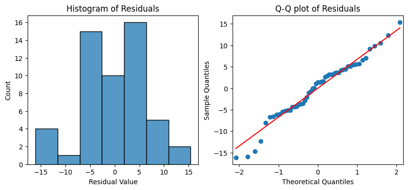
    


```python
fitted_values = model.predict(df['bachelors_or_higher_pct'])

sns.scatterplot(x=fitted_values, y=residuals)
plt.axhline(0)
plt.xlabel("Fitted Values")
plt.ylabel("Residuals")
plt.show()
```


    
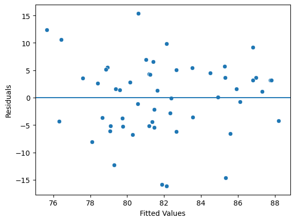
    


The percentage of individuals who possess a bachelor's degree or higher appears to be another predictor variable that may be worth including in the final multiple regression model.

#### Analyzing how the percentage of married families correlates to school performance
---
The final socioeconomic factor that I wanted to examine was whether the percentage of married families in a city has any correlation on high school scores.


```python
population_in_households = pd.read_csv('datasets/population_in_households.csv')
```


```python
population_in_households['married_pct'] = (population_in_households['in_married-couple_family'] / 
                                           population_in_households['total'] * 100)

population_in_households_subset = population_in_households[['city', 'married_pct']].copy()
df = city_scores.merge(population_in_households_subset, on = 'city', how = 'inner')
```

The percentage of married couples in a city is positively correlated to the average high school score for the city.


```python
fig, axes = plt.subplots(1, 2, figsize = (10,4))
sns.regplot(data = df, x = 'married_pct', y = 'overall_score', ax = axes[0], ci = None)
sns.heatmap(df[['overall_score', 'married_pct']].corr(numeric_only = True, method = 'pearson'), 
            annot = True, cmap = 'Reds', ax = axes[1])
plt.show()
```


    

    


According to the model below:
* The percentage of married couples in a city accounts for 18 percent of the variation in the overall score for high schools in the city.
* For every one-percent increase in married couples in the city, the average high school score increases by 0.2763 points.
* If there are no married couples in the city, the model predicts the average high school score would be 62.9306.


```python
OLS = ols(formula = 'overall_score ~ married_pct', data = df)
model = OLS.fit()
model.summary()
```


<table class="simpletable">
<caption>OLS Regression Results</caption>
<tr>
  <th>Dep. Variable:</th>      <td>overall_score</td>  <th>  R-squared:         </th> <td>   0.180</td>
</tr>
<tr>
  <th>Model:</th>                   <td>OLS</td>       <th>  Adj. R-squared:    </th> <td>   0.164</td>
</tr>
<tr>
  <th>Method:</th>             <td>Least Squares</td>  <th>  F-statistic:       </th> <td>   11.20</td>
</tr>
<tr>
  <th>Date:</th>             <td>Mon, 03 Nov 2025</td> <th>  Prob (F-statistic):</th>  <td>0.00154</td>
</tr>
<tr>
  <th>Time:</th>                 <td>20:46:07</td>     <th>  Log-Likelihood:    </th> <td> -176.45</td>
</tr>
<tr>
  <th>No. Observations:</th>      <td>    53</td>      <th>  AIC:               </th> <td>   356.9</td>
</tr>
<tr>
  <th>Df Residuals:</th>          <td>    51</td>      <th>  BIC:               </th> <td>   360.8</td>
</tr>
<tr>
  <th>Df Model:</th>              <td>     1</td>      <th>                     </th>     <td> </td>   
</tr>
<tr>
  <th>Covariance Type:</th>      <td>nonrobust</td>    <th>                     </th>     <td> </td>   
</tr>
</table>
<table class="simpletable">
<tr>
       <td></td>          <th>coef</th>     <th>std err</th>      <th>t</th>      <th>P>|t|</th>  <th>[0.025</th>    <th>0.975]</th>  
</tr>
<tr>
  <th>Intercept</th>   <td>   62.9306</td> <td>    5.777</td> <td>   10.894</td> <td> 0.000</td> <td>   51.333</td> <td>   74.528</td>
</tr>
<tr>
  <th>married_pct</th> <td>    0.2763</td> <td>    0.083</td> <td>    3.347</td> <td> 0.002</td> <td>    0.111</td> <td>    0.442</td>
</tr>
</table>
<table class="simpletable">
<tr>
  <th>Omnibus:</th>       <td> 0.825</td> <th>  Durbin-Watson:     </th> <td>   2.102</td>
</tr>
<tr>
  <th>Prob(Omnibus):</th> <td> 0.662</td> <th>  Jarque-Bera (JB):  </th> <td>   0.652</td>
</tr>
<tr>
  <th>Skew:</th>          <td>-0.268</td> <th>  Prob(JB):          </th> <td>   0.722</td>
</tr>
<tr>
  <th>Kurtosis:</th>      <td> 2.908</td> <th>  Cond. No.          </th> <td>    427.</td>
</tr>
</table><br/><br/>Notes:<br/>[1] Standard Errors assume that the covariance matrix of the errors is correctly specified.  
<br/><br/>

**Model Assumptions**  

The Normality and Homoscedasticity assumptions for linear regression models both seem to be satisfied.


```python
residuals = model.resid

fig, axes = plt.subplots(1, 2, figsize = (10,4))
sns.histplot(residuals, ax = axes[0])
axes[0].set_xlabel("Residual Value")
axes[0].set_title("Histogram of Residuals")
sm.qqplot(residuals, line = 's', ax = axes[1])
axes[1].set_title('Q-Q plot of Residuals')
plt.show()
```


    
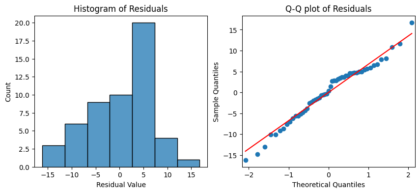
    


```python
fitted_values = model.predict(df['married_pct'])

sns.scatterplot(x=fitted_values, y=residuals)
plt.axhline(0)
plt.xlabel("Fitted Values")
plt.ylabel("Residuals")
plt.show()
```


    
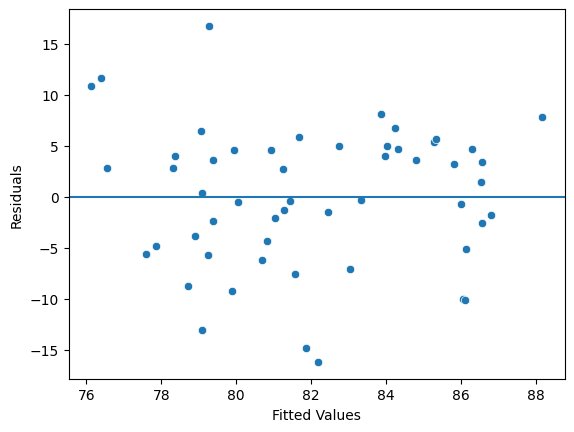
    


### Multiple Regression Model
---
In an attempt to build a model that better explains the variance in the average high school scores for different cities, I decided to combine several of the variables that correlated strongly with the overall scores of high schools.


```python
household_income = pd.read_csv('datasets/household_income.csv')
value_of_owner_occupied_housing_units = pd.read_csv('datasets/value_of_owner_occupied_housing_units.csv')
ownership_of_occupied_units = pd.read_csv('datasets/ownership_of_occupied_units.csv')
educational_attainment = pd.read_csv('datasets/educational_attainment.csv')
population_in_households = pd.read_csv('datasets/population_in_households.csv')
```

The code block below is the grouping and selecting that I performed on each of the census data sets in earlier sections.


```python
household_income['income_under_50K_pct'] = (household_income[['less_than_10000', '10000_to_14999', '15000_to_19999', 
                                                              '20000_to_24999', '25000_to_29999', '30000_to_34999', 
                                                              '35000_to_39999', '40000_to_44999', 
                                                              '45000_to_49999']].sum(axis = 1) / household_income['total'] * 100)
household_income_subset = household_income[['city', 'income_under_50K_pct']].copy()

value_of_owner_occupied_housing_units['housing_over_500K_pct'] = (value_of_owner_occupied_housing_units[['500000_to_749999', 
                                                                                                         '750000_to_999999', 
                                                                                                         '1000000_to_1499999', 
                                                                                                         '1500000_to_1999999', 
                                                                                                         '2000000_or_more']].sum(axis = 1) / 
                                                                    value_of_owner_occupied_housing_units['total'] * 100)
value_of_owner_occupied_housing_units_subset = value_of_owner_occupied_housing_units[['city', 'housing_over_500K_pct']].copy()

ownership_of_occupied_units['renter_occupied_pct'] = (ownership_of_occupied_units['renter_occupied'] / 
                                                      ownership_of_occupied_units['total'] * 100)
ownership_of_occupied_units_subset = ownership_of_occupied_units[['city', 'renter_occupied_pct']].copy()

educational_attainment['bachelors_or_higher_pct'] = (educational_attainment[['male_bachelors_degree', 'male_masters_degree', 
                                                                             'male_professional_school_degree', 'male_doctorate_degree', 
                                                                             'female_bachelors_degree', 'female_masters_degree', 
                                                                             'female_professional_school_degree', 
                                                                             'female_doctorate_degree']].sum(axis = 1) / 
                                                     educational_attainment['total'] * 100)
educational_attainment_subset = educational_attainment[['city', 'bachelors_or_higher_pct']].copy()

population_in_households['married_pct'] = (population_in_households['in_married-couple_family'] / 
                                           population_in_households['total'] * 100)
population_in_households_subset = population_in_households[['city', 'married_pct']].copy()
```

I joined all of the data sets using the `city` field as the primary key. The following is the first ten rows of this combined dataset after everything is joined.


```python
df = city_scores.merge(household_income_subset, on = 'city', how = 'inner')
df = df.merge(value_of_owner_occupied_housing_units_subset, on = 'city', how = 'inner')
df = df.merge(ownership_of_occupied_units_subset, on = 'city', how = 'inner')
df = df.merge(educational_attainment_subset, on = 'city', how = 'inner')
df = df.merge(population_in_households_subset, on = 'city', how = 'inner')
df.head(10)
```


<table border="1" class="dataframe">
  <thead>
    <tr style="text-align: right;">
      <th></th>
      <th>city</th>
      <th>overall_score</th>
      <th>income_under_50K_pct</th>
      <th>housing_over_500K_pct</th>
      <th>renter_occupied_pct</th>
      <th>bachelors_or_higher_pct</th>
      <th>married_pct</th>
    </tr>
  </thead>
  <tbody>
    <tr>
      <th>0</th>
      <td>Allen</td>
      <td>89.0</td>
      <td>15.010879</td>
      <td>34.594147</td>
      <td>30.167736</td>
      <td>56.147518</td>
      <td>77.416830</td>
    </tr>
    <tr>
      <th>1</th>
      <td>Anna</td>
      <td>88.0</td>
      <td>22.426363</td>
      <td>5.626888</td>
      <td>22.776320</td>
      <td>35.181204</td>
      <td>76.133492</td>
    </tr>
    <tr>
      <th>2</th>
      <td>Arlington</td>
      <td>79.5</td>
      <td>33.071477</td>
      <td>6.551773</td>
      <td>45.201840</td>
      <td>33.061194</td>
      <td>58.473362</td>
    </tr>
    <tr>
      <th>3</th>
      <td>Aubrey</td>
      <td>85.5</td>
      <td>23.443656</td>
      <td>7.684320</td>
      <td>24.113475</td>
      <td>35.977528</td>
      <td>58.384812</td>
    </tr>
    <tr>
      <th>4</th>
      <td>Azle</td>
      <td>81.0</td>
      <td>30.459194</td>
      <td>7.023977</td>
      <td>28.915179</td>
      <td>22.447911</td>
      <td>66.949528</td>
    </tr>
    <tr>
      <th>5</th>
      <td>Blue Ridge</td>
      <td>87.0</td>
      <td>28.491620</td>
      <td>2.500000</td>
      <td>21.787709</td>
      <td>12.765957</td>
      <td>47.753304</td>
    </tr>
    <tr>
      <th>6</th>
      <td>Carrollton</td>
      <td>76.5</td>
      <td>19.918134</td>
      <td>16.588267</td>
      <td>41.710570</td>
      <td>43.263060</td>
      <td>64.789586</td>
    </tr>
    <tr>
      <th>7</th>
      <td>Cedar Hill</td>
      <td>83.0</td>
      <td>25.781059</td>
      <td>12.667136</td>
      <td>30.632170</td>
      <td>30.938564</td>
      <td>59.492067</td>
    </tr>
    <tr>
      <th>8</th>
      <td>Celina</td>
      <td>85.0</td>
      <td>12.431401</td>
      <td>39.912954</td>
      <td>6.800286</td>
      <td>54.323662</td>
      <td>86.401805</td>
    </tr>
    <tr>
      <th>9</th>
      <td>Colleyville</td>
      <td>84.0</td>
      <td>6.272343</td>
      <td>83.072740</td>
      <td>4.387390</td>
      <td>70.320988</td>
      <td>85.514976</td>
    </tr>
  </tbody>
</table>


When examining many of the socioeconomic factors, unfortunately many of them are highly correlated with each other.  Using predictor variables that are too correlated with each other would violate the no multicollinearity assumption for multiple regression models.

* The percentage of people with a bachelor's degree or higher is strongly correlated with the percentage of housing in the city over \$500,000.
* The percentage of married couples is also strongly correlated with the percentage of housing in the city over \$500,000


```python
sns.heatmap(df.corr(numeric_only = True, method = 'pearson'), annot = True, cmap = 'Reds')
plt.show()
```


    
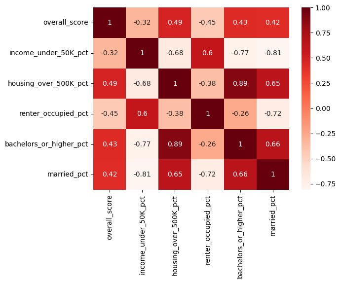
    


For my model I decided to use the percentage of housing over $500,000 and the percentage of individuals who rented housing as independent predictor variables.  These two variables don't seem to be too strongly correlated with each other, and they both are factors that a city has somewhat of a control over.

The R-squared value, in the model below, is higher than when only a single variable was used to predict the variance in the overall score of high schools.  Currently this model explains 32% of the variation in the overall score.

For every one percent increase in houses over \$500,000, holding other variables constant, you can expect the high school score to increase by 0.1203 points.  Likewise, for every one percent increase in renters, holding other variables constant, you can expect the school score to decrease by 0.1675 points.


```python
OLS = ols(formula = 'overall_score ~ housing_over_500K_pct + renter_occupied_pct', data = df)
model = OLS.fit()
model.summary()
```


<table class="simpletable">
<caption>OLS Regression Results</caption>
<tr>
  <th>Dep. Variable:</th>      <td>overall_score</td>  <th>  R-squared:         </th> <td>   0.320</td>
</tr>
<tr>
  <th>Model:</th>                   <td>OLS</td>       <th>  Adj. R-squared:    </th> <td>   0.293</td>
</tr>
<tr>
  <th>Method:</th>             <td>Least Squares</td>  <th>  F-statistic:       </th> <td>   11.78</td>
</tr>
<tr>
  <th>Date:</th>             <td>Mon, 03 Nov 2025</td> <th>  Prob (F-statistic):</th> <td>6.45e-05</td>
</tr>
<tr>
  <th>Time:</th>                 <td>20:46:08</td>     <th>  Log-Likelihood:    </th> <td> -171.49</td>
</tr>
<tr>
  <th>No. Observations:</th>      <td>    53</td>      <th>  AIC:               </th> <td>   349.0</td>
</tr>
<tr>
  <th>Df Residuals:</th>          <td>    50</td>      <th>  BIC:               </th> <td>   354.9</td>
</tr>
<tr>
  <th>Df Model:</th>              <td>     2</td>      <th>                     </th>     <td> </td>   
</tr>
<tr>
  <th>Covariance Type:</th>      <td>nonrobust</td>    <th>                     </th>     <td> </td>   
</tr>
</table>
<table class="simpletable">
<tr>
            <td></td>               <th>coef</th>     <th>std err</th>      <th>t</th>      <th>P>|t|</th>  <th>[0.025</th>    <th>0.975]</th>  
</tr>
<tr>
  <th>Intercept</th>             <td>   84.1814</td> <td>    2.673</td> <td>   31.489</td> <td> 0.000</td> <td>   78.812</td> <td>   89.551</td>
</tr>
<tr>
  <th>housing_over_500K_pct</th> <td>    0.1203</td> <td>    0.040</td> <td>    2.970</td> <td> 0.005</td> <td>    0.039</td> <td>    0.202</td>
</tr>
<tr>
  <th>renter_occupied_pct</th>   <td>   -0.1675</td> <td>    0.069</td> <td>   -2.439</td> <td> 0.018</td> <td>   -0.305</td> <td>   -0.030</td>
</tr>
</table>
<table class="simpletable">
<tr>
  <th>Omnibus:</th>       <td> 1.186</td> <th>  Durbin-Watson:     </th> <td>   1.718</td>
</tr>
<tr>
  <th>Prob(Omnibus):</th> <td> 0.553</td> <th>  Jarque-Bera (JB):  </th> <td>   0.499</td>
</tr>
<tr>
  <th>Skew:</th>          <td>-0.123</td> <th>  Prob(JB):          </th> <td>   0.779</td>
</tr>
<tr>
  <th>Kurtosis:</th>      <td> 3.406</td> <th>  Cond. No.          </th> <td>    124.</td>
</tr>
</table><br/><br/>Notes:<br/>[1] Standard Errors assume that the covariance matrix of the errors is correctly specified.  
<br/><br/>

#### Add aggregated teacher variables in attempt to improve model
---

In an attempt to obtain a higher adjusted R-squared value, I went back to the school staff dataset and used the two variables that I examined which had the strongest correlation with the overall score of high schools.  

I aggregated the staffing data by city, and then joined it with the census data.


```python
# join staff dataset with high school information dataset for information on city where school is located
school_staff_information_subset = high_school_information.merge(school_staff_information, on = 'state_school_id', how = 'inner')

# aggregate data by city
school_staff_information_subset = (school_staff_information_subset.groupby('city', as_index = False)
                                                                  .agg({'teacher_ms_degree_full_time_equiv_percent' : 'mean', 
                                                                        'teacher_11-20_years_full_time_equiv_percent' : 'mean'}))

# change city to title case to match census data
school_staff_information_subset['city'] = school_staff_information_subset['city'].str.title()

# remove dash from field name to prevent errors
school_staff_information_subset = school_staff_information_subset.rename(columns = {'teacher_11-20_years_full_time_equiv_percent' : 
                                                                                    'teacher_11_20_years_full_time_equiv_percent'})
```


```python
df2 = df.merge(school_staff_information_subset, on = 'city', how = 'inner')
```

When I added the percentage of teachers with master's degrees and the percentage of teachers with 11-20 years of experience to the model, it is now able to explain 50.9% of the variance in the overall scores of high schools.


```python
OLS = ols(formula = 'overall_score ~ housing_over_500K_pct + renter_occupied_pct + teacher_ms_degree_full_time_equiv_percent + teacher_11_20_years_full_time_equiv_percent', data = df2)
model = OLS.fit()
model.summary()
```


<table class="simpletable">
<caption>OLS Regression Results</caption>
<tr>
  <th>Dep. Variable:</th>      <td>overall_score</td>  <th>  R-squared:         </th> <td>   0.509</td>
</tr>
<tr>
  <th>Model:</th>                   <td>OLS</td>       <th>  Adj. R-squared:    </th> <td>   0.467</td>
</tr>
<tr>
  <th>Method:</th>             <td>Least Squares</td>  <th>  F-statistic:       </th> <td>   12.17</td>
</tr>
<tr>
  <th>Date:</th>             <td>Mon, 03 Nov 2025</td> <th>  Prob (F-statistic):</th> <td>7.24e-07</td>
</tr>
<tr>
  <th>Time:</th>                 <td>20:46:08</td>     <th>  Log-Likelihood:    </th> <td> -158.48</td>
</tr>
<tr>
  <th>No. Observations:</th>      <td>    52</td>      <th>  AIC:               </th> <td>   327.0</td>
</tr>
<tr>
  <th>Df Residuals:</th>          <td>    47</td>      <th>  BIC:               </th> <td>   336.7</td>
</tr>
<tr>
  <th>Df Model:</th>              <td>     4</td>      <th>                     </th>     <td> </td>   
</tr>
<tr>
  <th>Covariance Type:</th>      <td>nonrobust</td>    <th>                     </th>     <td> </td>   
</tr>
</table>
<table class="simpletable">
<tr>
                       <td></td>                          <th>coef</th>     <th>std err</th>      <th>t</th>      <th>P>|t|</th>  <th>[0.025</th>    <th>0.975]</th>  
</tr>
<tr>
  <th>Intercept</th>                                   <td>   62.1838</td> <td>    7.029</td> <td>    8.847</td> <td> 0.000</td> <td>   48.044</td> <td>   76.324</td>
</tr>
<tr>
  <th>housing_over_500K_pct</th>                       <td>    0.0902</td> <td>    0.036</td> <td>    2.488</td> <td> 0.016</td> <td>    0.017</td> <td>    0.163</td>
</tr>
<tr>
  <th>renter_occupied_pct</th>                         <td>   -0.1659</td> <td>    0.060</td> <td>   -2.750</td> <td> 0.008</td> <td>   -0.287</td> <td>   -0.045</td>
</tr>
<tr>
  <th>teacher_ms_degree_full_time_equiv_percent</th>   <td>    0.3476</td> <td>    0.134</td> <td>    2.595</td> <td> 0.013</td> <td>    0.078</td> <td>    0.617</td>
</tr>
<tr>
  <th>teacher_11_20_years_full_time_equiv_percent</th> <td>    0.3682</td> <td>    0.167</td> <td>    2.211</td> <td> 0.032</td> <td>    0.033</td> <td>    0.703</td>
</tr>
</table>
<table class="simpletable">
<tr>
  <th>Omnibus:</th>       <td> 5.197</td> <th>  Durbin-Watson:     </th> <td>   1.981</td>
</tr>
<tr>
  <th>Prob(Omnibus):</th> <td> 0.074</td> <th>  Jarque-Bera (JB):  </th> <td>   4.222</td>
</tr>
<tr>
  <th>Skew:</th>          <td>-0.669</td> <th>  Prob(JB):          </th> <td>   0.121</td>
</tr>
<tr>
  <th>Kurtosis:</th>      <td> 3.398</td> <th>  Cond. No.          </th> <td>    559.</td>
</tr>
</table><br/><br/>Notes:<br/>[1] Standard Errors assume that the covariance matrix of the errors is correctly specified.  
<br/><br/>

**Model Assumptions**  

The Normality and Homoscedasticity assumptions for linear regression models both seem to be satisfied.


```python
residuals = model.resid

fig, axes = plt.subplots(1, 2, figsize = (10,4))
sns.histplot(residuals, ax = axes[0])
axes[0].set_xlabel("Residual Value")
axes[0].set_title("Histogram of Residuals")
sm.qqplot(residuals, line = 's', ax = axes[1])
axes[1].set_title('Q-Q plot of Residuals')
plt.show()
```


    
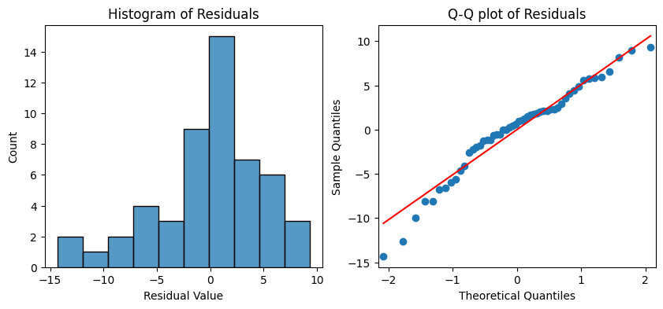
    


```python
fitted_values = model.predict(df2)

sns.scatterplot(x=fitted_values, y=residuals)
plt.axhline(0)
plt.xlabel("Fitted Values")
plt.ylabel("Residuals")
plt.show()
```


    
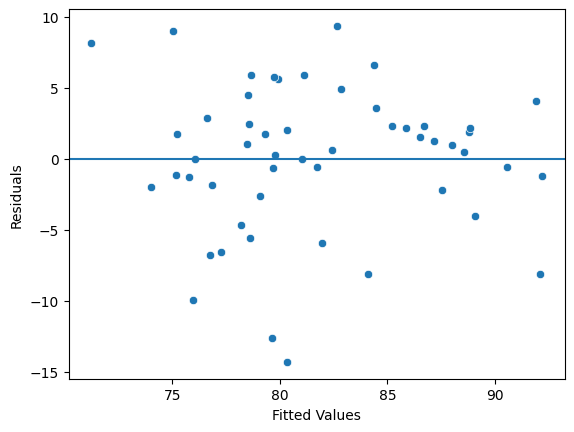
    


**No Multicollinearity Assumption**  

There is some correlation between the independent predictor variables that may be of concern.  None of these correlations are above 0.4 though, so for the sake of this case study I will say that the model passes this assumption.


```python
independent_variables = df2[['housing_over_500K_pct', 'renter_occupied_pct', 'teacher_ms_degree_full_time_equiv_percent', 
                             'teacher_11_20_years_full_time_equiv_percent']].copy()

sns.heatmap(independent_variables.corr(numeric_only = True, method = 'pearson'), annot = True, cmap = 'Reds')
plt.show()
         
```


    
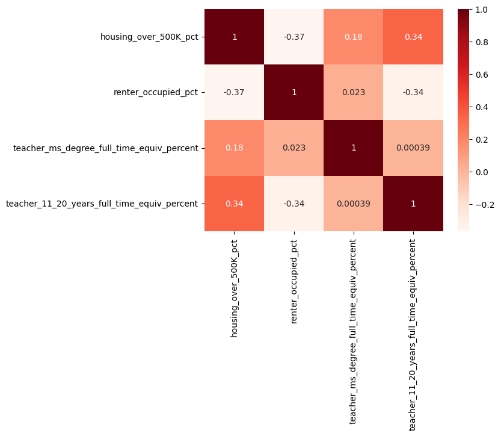
    


**Linearity Assumption**

None of the scatter-plots really showed a clear linear relationship between the independent variable and a high schools overall score.  Ideally the independent variables would have a higher correlation with the dependent variable.  For the sake of this case study though, I will say that the model passes this assumption.

**Model Validity**

It would have been ideal to be able to explain more than 50-percent of the variation in high school scores with the model.  My independent variables also probably should have been more correlated with the dependent variable than they were.  More school and student-related variables probably would have made the model a better predictor of school performance.

**Predicting school performance**  

Using this model, I calculated what the model predicted the average high school overall score should be, while taking into account the percentage of housing over \$500,000, the percentage of renters, the percentage of teachers with master's degrees, and the percentage of teachers with 11-20 years of experience.


```python
df2['predicted_score'] = model.predict(df2)
df2['score_difference'] = df2['overall_score'] - df2['predicted_score']
```

**Under-performing schools**

According to the model these are the bottom-10, most under-performing cities with regards to their high school scores.  The model predicted their high school scores should be higher than they actually ended up being.


```python
df2.sort_values(by = ['score_difference'])[['city', 'overall_score', 'predicted_score', 'score_difference']].head(10)
```


<table border="1" class="dataframe">
  <thead>
    <tr style="text-align: right;">
      <th></th>
      <th>city</th>
      <th>overall_score</th>
      <th>predicted_score</th>
      <th>score_difference</th>
    </tr>
  </thead>
  <tbody>
    <tr>
      <th>31</th>
      <td>Little Elm</td>
      <td>66.000000</td>
      <td>80.305817</td>
      <td>-14.305817</td>
    </tr>
    <tr>
      <th>11</th>
      <td>Crowley</td>
      <td>67.000000</td>
      <td>79.632698</td>
      <td>-12.632698</td>
    </tr>
    <tr>
      <th>30</th>
      <td>Lewisville</td>
      <td>66.000000</td>
      <td>75.939771</td>
      <td>-9.939771</td>
    </tr>
    <tr>
      <th>24</th>
      <td>Justin</td>
      <td>76.000000</td>
      <td>84.101796</td>
      <td>-8.101796</td>
    </tr>
    <tr>
      <th>9</th>
      <td>Colleyville</td>
      <td>84.000000</td>
      <td>92.086918</td>
      <td>-8.086918</td>
    </tr>
    <tr>
      <th>28</th>
      <td>Lake Worth</td>
      <td>70.000000</td>
      <td>76.753492</td>
      <td>-6.753492</td>
    </tr>
    <tr>
      <th>43</th>
      <td>Richardson</td>
      <td>70.666667</td>
      <td>77.245978</td>
      <td>-6.579311</td>
    </tr>
    <tr>
      <th>26</th>
      <td>Kennedale</td>
      <td>76.000000</td>
      <td>81.961635</td>
      <td>-5.961635</td>
    </tr>
    <tr>
      <th>29</th>
      <td>Lancaster</td>
      <td>73.000000</td>
      <td>78.615418</td>
      <td>-5.615418</td>
    </tr>
    <tr>
      <th>17</th>
      <td>Fort Worth</td>
      <td>73.560000</td>
      <td>78.194866</td>
      <td>-4.634866</td>
    </tr>
  </tbody>
</table>


**Schools that performed better than expected**
    
The following are the top-10 cities, where the high schools performed better than the model predicted.


```python
df2.sort_values(by = ['score_difference'], ascending = False)[['city', 'overall_score', 'predicted_score', 'score_difference']].head(10)
```


<table border="1" class="dataframe">
  <thead>
    <tr style="text-align: right;">
      <th></th>
      <th>city</th>
      <th>overall_score</th>
      <th>predicted_score</th>
      <th>score_difference</th>
    </tr>
  </thead>
  <tbody>
    <tr>
      <th>51</th>
      <td>Wylie</td>
      <td>92.00</td>
      <td>82.656192</td>
      <td>9.343808</td>
    </tr>
    <tr>
      <th>47</th>
      <td>Sanger</td>
      <td>84.00</td>
      <td>75.030046</td>
      <td>8.969954</td>
    </tr>
    <tr>
      <th>12</th>
      <td>Dallas</td>
      <td>79.36</td>
      <td>71.214432</td>
      <td>8.145568</td>
    </tr>
    <tr>
      <th>10</th>
      <td>Coppell</td>
      <td>91.00</td>
      <td>84.391571</td>
      <td>6.608429</td>
    </tr>
    <tr>
      <th>5</th>
      <td>Blue Ridge</td>
      <td>87.00</td>
      <td>81.101382</td>
      <td>5.898618</td>
    </tr>
    <tr>
      <th>19</th>
      <td>Garland</td>
      <td>84.50</td>
      <td>78.639857</td>
      <td>5.860143</td>
    </tr>
    <tr>
      <th>37</th>
      <td>North Richland Hills</td>
      <td>85.50</td>
      <td>79.741120</td>
      <td>5.758880</td>
    </tr>
    <tr>
      <th>3</th>
      <td>Aubrey</td>
      <td>85.50</td>
      <td>79.903559</td>
      <td>5.596441</td>
    </tr>
    <tr>
      <th>33</th>
      <td>Mansfield</td>
      <td>87.75</td>
      <td>82.834091</td>
      <td>4.915909</td>
    </tr>
    <tr>
      <th>7</th>
      <td>Cedar Hill</td>
      <td>83.00</td>
      <td>78.529935</td>
      <td>4.470065</td>
    </tr>
  </tbody>
</table>


### Summary
---
For my final regression model I used the following independent predictor variables:
* The percentage of houses over \$500,000 in the city
* The percentage of people renting housing in the city
* The percentage of teachers with master's degrees employed at the high schools
* The percentage of teachers with 11-20 years of experience employed at the high schools

This model was able to explain 50.9% of the variance in the average high school scores for the cities.

The following cities were at the bottom-10, with their high schools under-performing what the model predicted.
* Little Elm, Crowley, Lewisville, Justin, Colleyville, Lake Worth, Richardson, Kennedale, Lancaster, and Fort Worth
    * These schools should be performing better than they are according to the model.
    * Factors other than economic inequality appear to be affecting the schools in these cities.

The following cities were at the top-10, with their average high school scores exceeding what the model predicted.
* Wylie, Sanger, Dallas, Coppell, Blue Ridge, Garland, North Richland Hills, Aubrey, Mansfield, and Cedar Hill
    * The schools in these cities should be examined in more detail to understand why they are performing better than predicted.

Some other notes of interest gained through this case study are the following:
* Teacher salaries have very little correlation with school performance.
* The student-teacher ratio in my data actually showed a positive correlation, contrary to what I expected.
    * As there are more students per teacher, the school's overall score appeared to increase.
    * This went contrary to the popular belief that smaller class sizes should result in better education.
* The percentage of teachers with Master's degrees had a positive correlation with high school scores.
    * The percentage of teachers with Doctorate degrees did not show much of a correlation though.
* Having too many teachers with less than 6-years of experience negatively correlated with high school scores.
* Teachers seemed to contribute the most to high school scores at 11-20 years of experience, then started to decline after that and not really contribute much at all after 30 years.
* School size had very little correlation with school performance.
* Many of the socioeconomic variables were highly correlated with each other, limiting which ones I could ultimately use in the regression model.

The following socioeconomic variables showed a **positive** correlation with school performance:
* The percentage of housing over \$500,000
* The percentage of people with a bachelor's degree or higher
* The percentage of married couples

The following socioeconomic variables showed a **negative** correlation with school performance:
* The percentage of people with an income under \$50,000
* The percentage of people renting housing

The percentage of married couples in a city were **positively** correlated with:
* The percentage of people with a bachelor's degree or higher
* The percentage of housing over \$500,000

The percentage of married couples in a city were **negatively** correlated with:
* The percentage of people with an income under \$50,000
* The percentage of people renting housing

**Next Steps**  

This model can be used to provide a less biased method of comparing school performance across cities, since it accounts for socioeconomic factors that may hinder a school from being able to achieve a high score.

Focusing more on building houses greater than $500,000, and restricting the amount of new apartment complexes, could be one way to boost the high school scores in a city.  At the school level, encouraging teachers to further their education and providing them with incentives to obtain a master's degree may provide a better boost to school performance, rather than simply increasing salaries.  When hiring new teachers, hiring teachers with 11-20 years of experience seems to contribute the most to school performance.  There also appears to be no evidence that smaller class sizes result in better high school scores.

Additional variables could probably be added to this rather limited model in order to better explain the variance in high school scores.
