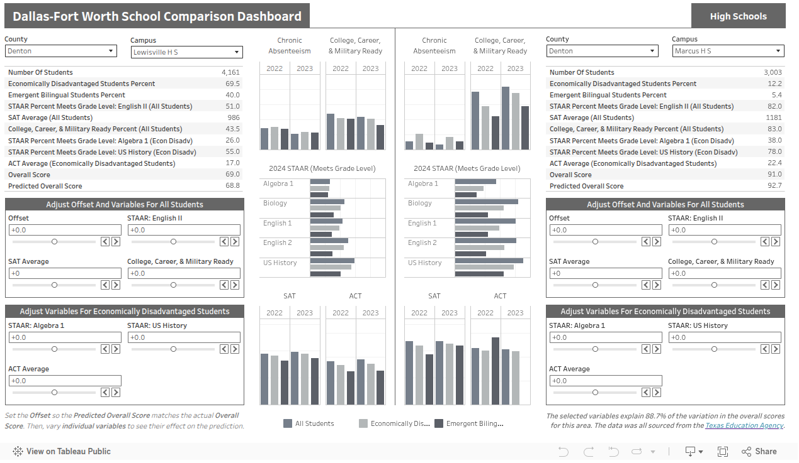
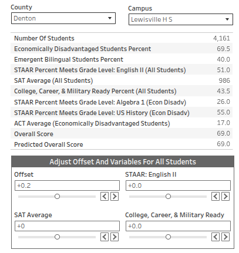
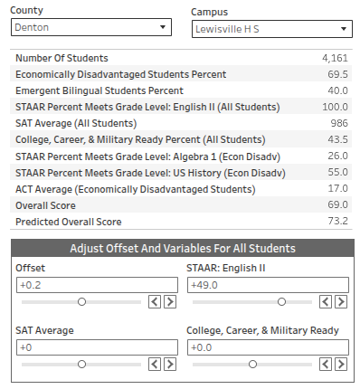
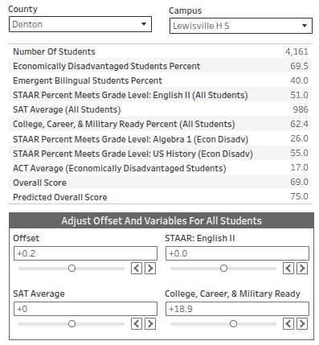
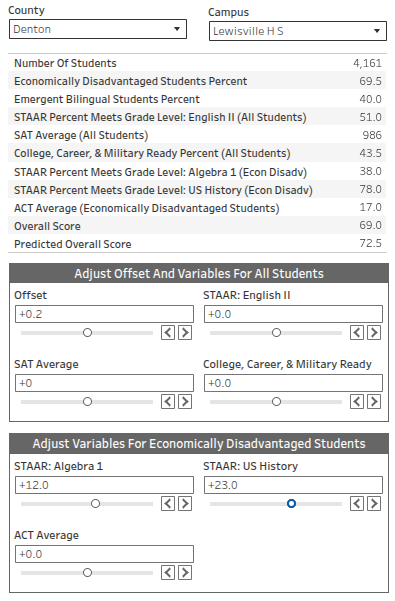
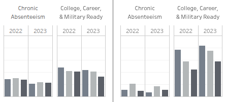
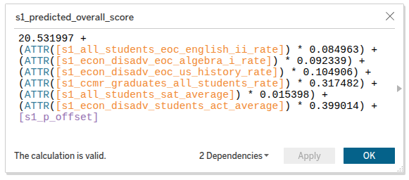
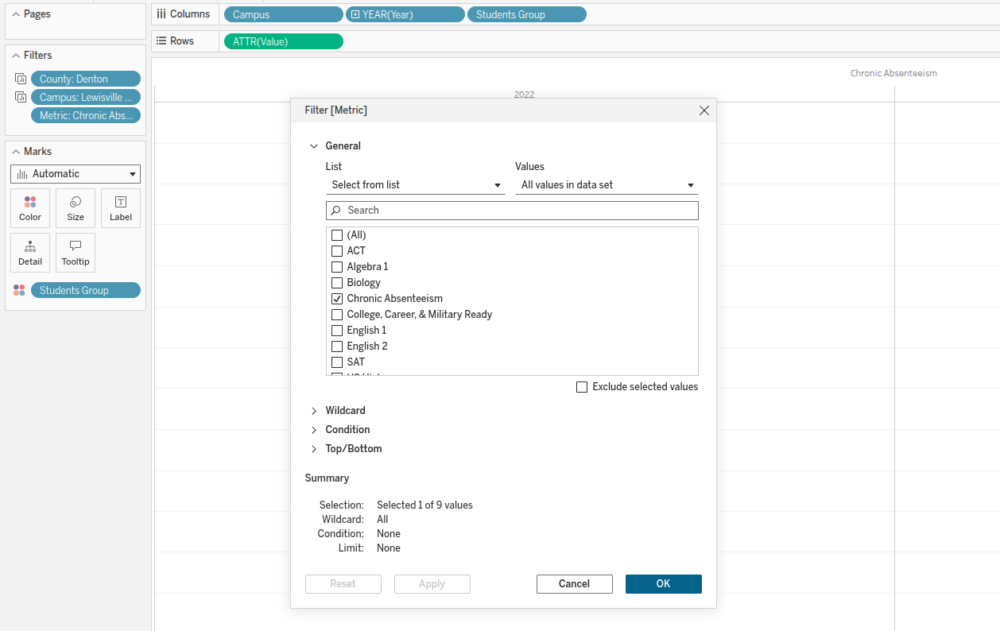
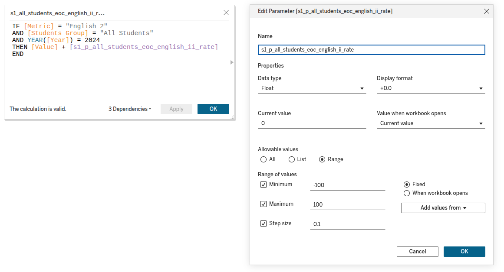

## Dallas-Fort Worth School Performance Revisited

I decided to revisit an earlier project that I completed on [Dallas-Fort Worth Area High School Performance](https://github.com/DavidRommel/Portfolio/blob/main/Dallas_Fort_Worth_School_Performance/README.md).  This time instead of focusing on the socioeconomic factors of the city, I decided to just explore variables related to a school's academic performance as a means of predicting the overall score for a school.  

According to the Texas Education Agency, a lot of variables go into calculating this score.  The score accounts for how well a school improves from one year to the next, how it compares with other schools in the area, and how certain student groups are performing.  Even though I did not go quite into that amount of detail with my regression model, it was able to explain 88.7% of the variation in the overall scores of the high schools in the Dallas-Fort Worth area, using just seven variables.  

Below is a screenshot of the dashboard.  The interactive dashboard can be found on [Tableau Public](https://public.tableau.com/views/Dallas-FortWorthSchoolComparisonDashboard/Dashboard1?:language=en-US&:sid=&:redirect=auth&:display_count=n&:origin=viz_share_link).



The above screenshot is of two schools in my area.  The school on the left is from a less-wealthy city, while the one on the right is located in a more affluent city.  The values for each of the sliders can be adjusted and the `Predicted Overall Score` will automatically update.  

First I adjusted the `Offset` parameter so that the `Predicted Overall Score` equaled the actual `Overall Score`.  This is so you can better see the effects of adjusting the other variables.  



If Lewisville High School wanted to increase their Overall Score to 75-percent, you could then explore by how much they would need to increase one of the variables to obtain that score.

Marcus High School has 82-percent of their students at least meeting grade level on the English 2 STAAR test, while Lewisville High School only as 51-percent.  This seems to indicate that improvements can be made in that area.

Unfortunately, even if they increase the percent of students at least meeting grade level on the English 2 STAAR test to 100-percent, the model only predicts their overall score would increase to 73.2.  This seems to indicate that it would be unrealistic for the school to focus all of their attention on increasing English 2 exam results, as a means of increasing their overall score.



As an alternative, getting more students *College, Career, & Military Ready* by the time they graduate may be a more effective means of increasing the school's overall score.  Increasing this by 18.9-percent seems feasible, since the resulting 62.4-percent would still be less than Marcus High School's 83-percent.



If you compare the two schools, one obvious point of difference is the percentage of economically disadvantaged students.  Lewisville High School has 69.5-percent while Marcus High School only has 12.2-percent.  This seems to indicate that a targeted approach towards that student group might be the most beneficial towards increasing the school's overall score.  

Even increasing those percentages so that they are identical to Marcus High School, which has far fewer economically disadvantaged students, only increases the overall score of the school by 3.5 points.  Regardless, since that student group is a majority of the student population, a targeted approach should still be part of the schools overall plan.



If you observe the graphs comparing the two schools, chronic absenteeism is something the school should definately address.  The percentage of chronically absent students is a strong predictor of a poorly performing school.  

Other than that, pretty much all across the board all of the metrics are lower for Lewisville High School than they are for Marcus High School.  That explains the significant difference in scores between the two schools.



In summary, this project was mostly just a test of applying a regression model to a Tableau dashboard for visualizing predictions.  Without knowing the exact formula that the Texas Education Agency uses to calculate the overall score, this limited model is not of much use in guiding school decision making.  Another fundamental problem with the model is the returns from targeting certain student groups will vary based on what percent of the overall student population they make up.  A school with 70-percent economically disadvantaged students will benefit far more from an approach targeted towards that student group, than a school with only 7-percent.  A more complex model would have taken into account the percentile a school falls into, and utilize different models for predicting wealthier and poorer school scores. Due to the nature of my chosen variables, there is a lot of correlation between them making it difficult to calculate accurate coefficients for each of them.  The dashboard is useful for quickly comparing the different high schools in the area though.

I will now briefly go over some of the work I did in Python to structure the data and build the regression model.

### Prepare Data
---
I downloaded all of the data from [2023–24 Texas Academic Performance Reports](https://rptsvr1.tea.texas.gov/perfreport/tapr/2024/index.html) on the Texas Education Agency's website.

The data was broken into categories, and for the sake of this case study I used the following datasets:
* **CSTAAR_EOC**
    * Approaches Grade Level, Meets Grade Level, and Masters Grade Level (EOC & SAT/ACT Accelerated Testers)
* **CDROP_ATT**
    * Attendance, Chronic Absenteeism, and Annual Dropout
* **CGRAD1**
    * College, Career, & Military Ready; College Ready, and TSI Criteria
* **CCAD**
    * College Admissions (SAT & ACT)
* [2025 Statewide Summary](https://tea.texas.gov/texas-schools/accountability/academic-accountability/performance-reporting/2025-accountability-rating-system)
    *  2018-2025 ratings and demographic information
    *  I used the **2024 State Summary** from that document

Since a lot of the code was repeated for each dataset I will just show the code for preparing the **CGRAD1** dataset.  

I download separate datasets for each of the counties in the Dallas-Fort Worth area.  I first combined all of these files into a single dataframe.


```python
Collin_CGRAD1 = pd.read_csv('datasets/Collin_CGRAD1.csv')
Dallas_CGRAD1 = pd.read_csv('datasets/Dallas_CGRAD1.csv')
Denton_CGRAD1 = pd.read_csv('datasets/Denton_CGRAD1.csv')
Ellis_CGRAD1 = pd.read_csv('datasets/Ellis_CGRAD1.csv')
Hood_CGRAD1 = pd.read_csv('datasets/Hood_CGRAD1.csv')
Hunt_CGRAD1 = pd.read_csv('datasets/Hunt_CGRAD1.csv')
Johnson_CGRAD1 = pd.read_csv('datasets/Johnson_CGRAD1.csv')
Kaufman_CGRAD1 = pd.read_csv('datasets/Kaufman_CGRAD1.csv')
Parker_CGRAD1 = pd.read_csv('datasets/Parker_CGRAD1.csv')
Rockwall_CGRAD1 = pd.read_csv('datasets/Rockwall_CGRAD1.csv')
Somervell_CGRAD1 = pd.read_csv('datasets/Somervell_CGRAD1.csv')
Tarrant_CGRAD1 = pd.read_csv('datasets/Tarrant_CGRAD1.csv')
Wise_CGRAD1 = pd.read_csv('datasets/Wise_CGRAD1.csv')

CGRAD1 = pd.concat([Collin_CGRAD1, Dallas_CGRAD1, Denton_CGRAD1, Ellis_CGRAD1, Hood_CGRAD1, Hunt_CGRAD1, Johnson_CGRAD1,
                   Kaufman_CGRAD1, Parker_CGRAD1, Rockwall_CGRAD1, Somervell_CGRAD1, Tarrant_CGRAD1, Wise_CGRAD1], axis = 0)

del [Collin_CGRAD1, Dallas_CGRAD1, Denton_CGRAD1, Ellis_CGRAD1, Hood_CGRAD1, Hunt_CGRAD1, Johnson_CGRAD1, 
     Kaufman_CGRAD1, Parker_CGRAD1, Rockwall_CGRAD1, Somervell_CGRAD1, Tarrant_CGRAD1, Wise_CGRAD1]
```

The column headers were all in an unreadable format, so I had to create a dictionary to rename the columns.  This is just a small portion of the dictionary to save space, the one for this dataset contained 179 entries.


```python
rename_dict = {
    "C20GJ22R": "campus_2022_associate_degree_graduates_two_or_more_races_rate",
    "C20GP22R": "campus_2022_college_career_military_ready_graduates_two_or_more_races_rate",
    "C20GP23R": "campus_2023_college_career_military_ready_graduates_two_or_more_races_rate",
    "C20GUA22R": "campus_2022_dual_credit_graduates_3_hrs_ela_or_math_or_9_hrs_any_subject_two_or_more_races_rate",
    "C20GUA23R": "campus_2023_dual_credit_graduates_3_hrs_ela_or_math_or_9_hrs_any_subject_two_or_more_races_rate",
    "C20GY22R": "campus_2022_apib_met_criteria_in_any_subject_graduates_two_or_more_races_rate",
    "C20GY23R": "campus_2023_apib_met_criteria_in_any_subject_graduates_two_or_more_races_rate",
    "C20GZ22R": "campus_2022_completion_of_onramps_course_graduates_two_or_more_races_rate",
    "C20GZ23R": "campus_2023_completion_of_onramps_course_graduates_two_or_more_races_rate",
    "C21GG22R": "campus_2022_associated_ccmr_college_ready_two_or_more_races_rate",
    "C21GG23R": "campus_2023_associated_ccmr_college_ready_two_or_more_races_rate",
    "C2CRB22R": "campus_2022_tsi_criteria_graduates_two_or_more_races_both_rate",
    "C2CRB23R": "campus_2023_tsi_criteria_graduates_two_or_more_races_both_rate",
    "C2CRE22R": "campus_2022_tsi_criteria_graduates_two_or_more_races_either_rate",
    "C2CRE23R": "campus_2023_tsi_criteria_graduates_two_or_more_races_either_rate",
    "C2CRM22R": "campus_2022_tsi_criteria_graduates_two_or_more_races_mathematics_rate",
    "C2CRM23R": "campus_2023_tsi_criteria_graduates_two_or_more_races_mathematics_rate",
    # additional rows
    "DISTNAME": "district_name",
    "DISTRICT": "6_digit_county_district_number"
}

CGRAD1 = CGRAD1.rename(columns = rename_dict)
```

To join all of the datasets together I created a `state_school_id` field consisting of the district and campus numbers.  I used the `zfill()` function to make sure each portion of the string was the correct length, adding zeros to the beginning of the numbers when needed.


```python
CGRAD1.dropna(subset = ['6_digit_county_district_number', 'campus'], inplace = True)
CGRAD1['6_digit_county_district_number'] = CGRAD1['6_digit_county_district_number'].astype(int).astype(str)
CGRAD1['campus'] = CGRAD1['campus'].astype(int).astype(str)
CGRAD1['state_school_id'] = ('TX-'+ CGRAD1['6_digit_county_district_number'].str.zfill(6) + 
                                         '-' + CGRAD1['campus'].str.zfill(9))
```

Each of the datasets contained far more fields than I was interested in, so I only selected a subset of those fields.


```python
CGRAD1 = CGRAD1.iloc[:, np.r_[179,4,14,16,18,28,30]].reset_index(drop = True).copy()
```


```python
# fields used from this dataset
for i in CGRAD1.columns:
    print(i)
```

    state_school_id
    campus_2023_college_career_military_ready_graduates_all_students_rate
    campus_2023_college_career_military_ready_graduates_econ_disadv_rate
    campus_2023_college_career_military_ready_graduates_ebel_rate
    campus_2022_college_career_military_ready_graduates_all_students_rate
    campus_2022_college_career_military_ready_graduates_econ_disadv_rate
    campus_2022_college_career_military_ready_graduates_ebel_rate


After changing all of the numeric columns from string objects to numeric values, I had to change the `-1` values to `null` values since that was how the dataset represented missing values.


```python
# Change rates to numeric
CGRAD1[CGRAD1.iloc[:,1:].columns] = CGRAD1[CGRAD1.iloc[:,1:].columns].apply(pd.to_numeric, errors = 'coerce')

# change negative rates to null values
for c in range(1, CGRAD1.shape[1]): # columns
    for r in range(CGRAD1.shape[0]): # rows
        if CGRAD1.iloc[r,c] < 0:
            CGRAD1.iloc[r,c] = np.nan
```


```python
CGRAD1 = CGRAD1.rename(columns = rename_dict)
```

I filtered the statewide summary dataset to just contain the high schools in the Dallas-Fort Worth counties.  I then joined all of the datasets together using the `state_school_id` field that I created for each of the datasets.


```python
df = dfw_high_school_scores.merge(CDROP_ATT, on = 'state_school_id', how = 'inner')
df = df.merge(CGRAD1, on = 'state_school_id', how = 'inner')
df = df.merge(CSTAAR_EOC, on = 'state_school_id', how = 'inner')
df = df.merge(CCAD, on = 'state_school_id', how = 'inner')
```

I used this combined dataset to calculate the optimal variables for the multiple regression model.

### Multiple Regression Model
---

I modified the `select_variables()` function, that I explained in depth in the [Automatic Feature Selection For Multiple Regression](https://github.com/DavidRommel/Portfolio/blob/main/Automatic_Feature_Selection_For_Multiple_Regression/README.md) section of my portfolio.

* For this project I wasn't interested in checking for multicollinearity between the independent predictor variables, so I removed that section.
* I also modified the function to only return combinations where all of the p-values of the coefficients were less than 0.05, and where none of the coefficients were negative.
    * Some of the combinations had negative coefficients for variables that were positively correlated with a school's overall score, which didn't make sense so I added a conditional statement to filter those out.
* I also reversed the variable combination list so that the combinations with the greatest numbers of variables were tested first.
* I added a clause to stop searching when 20 results were found, however the function ended up running for almost an hour on my machine, and ended up checking all of the possible combinations to find 20 that matched my criteria.


```python
def select_variables(X, y, min_threshold = 0.4):
    # Exit function if dependent variable is NOT numerical
    if (not is_numeric_dtype(y)):
        print('ERROR: Dependent variable \'{}\' must be numerical'.format(y.name))
        return None
    
    # Drop independent variables that are NOT numerical or categorical
    for col in X.columns:
        if (not isinstance(X[col].dtype, pd.CategoricalDtype)) & (not is_numeric_dtype(df[col])):
            X = X.drop(columns = [col])            
            print('WARNING: Independent variable \'{}\' was not numerical or categorical so it was dropped'.format(col))

    # Drop independent variables less than the min_threshold
    data = pd.concat([y,X], axis = 1)
    data.dropna(inplace=True)
    correlations = data.corr(numeric_only=True).abs().loc[y.name].drop(y.name)
    for i in correlations.index:
        if correlations.loc[i] < min_threshold:
            print('WARNING: Independent variable \'{}\' dropped ({:.3f} < {:.2f})'.format(i, correlations.loc[i], min_threshold))
            X = X.drop(columns = [i])
            data = data.drop(columns = [i])
    
    # create a list of all possible variable combinations
    variable_list = []
    for i in range(1, X.shape[1] + 1):
        for j in combinations(X.columns, i):
            variable_list.append(j)

    variable_list.reverse() # move combinations with most variables to the top    
          
    new_variable_list = []
    # calculate adjusted R-squared values for each variable combination
    print('Calculating adjusted R-squared values...')
    percent_multiplier = 100 / len(variable_list) # percent complete for each combination
    percent_complete = 0
    rsquared_values = []
    categorical_variables = []

    new_variable_list = []
    
    for f in variable_list:
        new_variables = []
        print('{:.2f}%'.format(percent_complete), end = '\r') # display percentage complete
        
        # add C() to categorical variables for formula        
        for col in f:
            if data[col].dtype == 'category':
                new_variables.append('C(' + col + ')')
                categorical_variables.append(col)
            else:
                new_variables.append(col)    
                
        # calculate adjusted R-squared value for variable combination
        ols_formula = y.name + ' ~ ' + ' + '.join(new_variables)
        OLS = ols(formula = ols_formula, data = data)
        model = OLS.fit()

        # all p-values are valid and all coefficients are positive
        if (model.pvalues.max() < 0.05) & (model.params.min() > 0):
            rsquared_values.append(model.rsquared_adj)
            new_variable_list.append(f)
            
        percent_complete += percent_multiplier # percentage complete
        if len(new_variable_list) == 20: # return top 20 results
            break
        
    # build dataframe of the variable combinations and their adjusted R-squared values
    result_df = pd.DataFrame({'variables' : new_variable_list, 'r_squared' : rsquared_values})
    
    # filter out rows with an adjusted R-squared value of less than 0
    result_df = result_df[result_df['r_squared'] > 0].sort_values(by = ['r_squared'], ascending = False).reset_index(drop = True).copy()
    
    return result_df
```

The following combination of variables was the result returned by the function with the highest adjusted R-squared value.  I decided to use these independent predictor variables for the final regression model.  

> Since this project was mostly just exploring how to integrate an multiple regression model with a Tableau dashboard, I wanted to have as many independent predictor variables as possible.  I attempted to build a model using student and staff data, but could not create a model with and adjusted R-squared value of more than 0.6, while accounting for correlation between the predictor variables.  For the sake of this project I decided to ignore the no multicollinearity assumption.  Many of the following variables are highly correlated with each other, making this not a valid model to predict the overall score of a high school.


```python
# dependent variable
df_y = df['overall_score']

# independent predictor variables
df_x = df[[
    'campus_2024_domain_1a_meets_grade_level_std_all_students_eoc_english_ii_rate', 
    'campus_2024_domain_1a_meets_grade_level_std_econ_disadv_eoc_algebra_i_rate', 
    'campus_2024_domain_1a_meets_grade_level_std_econ_disadv_eoc_us_history_rate', 
    'campus_2023_college_career_military_ready_graduates_all_students_rate', 
    'campus_2023_sat_all_students_sat_average', 
    'campus_2023_act_econ_disadv_students_act_average'
]]
```

These variables explained `88.7%` of the variation in the overall score for the high schools in this area.  All of the p-values were less than 0.05, indicating they were statistically significant.  All of the coefficients were positive as well, indicating that an increase in one of those variables results in an increase in the overall score for the school.


```python
ols_formula = df_y.name + ' ~ ' + ' + '.join(df_x.columns)
OLS = ols(formula = ols_formula, data = df)
model = OLS.fit()
model.summary()
```


<table class="simpletable">
<caption>OLS Regression Results</caption>
<tr>
  <th>Dep. Variable:</th>      <td>overall_score</td>  <th>  R-squared:         </th> <td>   0.891</td>
</tr>
<tr>
  <th>Model:</th>                   <td>OLS</td>       <th>  Adj. R-squared:    </th> <td>   0.887</td>
</tr>
<tr>
  <th>Method:</th>             <td>Least Squares</td>  <th>  F-statistic:       </th> <td>   198.4</td>
</tr>
<tr>
  <th>Date:</th>             <td>Sat, 15 Nov 2025</td> <th>  Prob (F-statistic):</th> <td>2.69e-67</td>
</tr>
<tr>
  <th>Time:</th>                 <td>00:16:58</td>     <th>  Log-Likelihood:    </th> <td> -363.71</td>
</tr>
<tr>
  <th>No. Observations:</th>      <td>   152</td>      <th>  AIC:               </th> <td>   741.4</td>
</tr>
<tr>
  <th>Df Residuals:</th>          <td>   145</td>      <th>  BIC:               </th> <td>   762.6</td>
</tr>
<tr>
  <th>Df Model:</th>              <td>     6</td>      <th>                     </th>     <td> </td>   
</tr>
<tr>
  <th>Covariance Type:</th>      <td>nonrobust</td>    <th>                     </th>     <td> </td>   
</tr>
</table>
<table class="simpletable">
<tr>
                                        <td></td>                                          <th>coef</th>     <th>std err</th>      <th>t</th>      <th>P>|t|</th>  <th>[0.025</th>    <th>0.975]</th>  
</tr>
<tr>
  <th>Intercept</th>                                                                    <td>   20.5320</td> <td>    2.968</td> <td>    6.917</td> <td> 0.000</td> <td>   14.665</td> <td>   26.399</td>
</tr>
<tr>
  <th>campus_2024_domain_1a_meets_grade_level_std_all_students_eoc_english_ii_rate</th> <td>    0.0850</td> <td>    0.024</td> <td>    3.530</td> <td> 0.001</td> <td>    0.037</td> <td>    0.133</td>
</tr>
<tr>
  <th>campus_2024_domain_1a_meets_grade_level_std_econ_disadv_eoc_algebra_i_rate</th>   <td>    0.0923</td> <td>    0.016</td> <td>    5.921</td> <td> 0.000</td> <td>    0.062</td> <td>    0.123</td>
</tr>
<tr>
  <th>campus_2024_domain_1a_meets_grade_level_std_econ_disadv_eoc_us_history_rate</th>  <td>    0.1049</td> <td>    0.026</td> <td>    3.991</td> <td> 0.000</td> <td>    0.053</td> <td>    0.157</td>
</tr>
<tr>
  <th>campus_2023_college_career_military_ready_graduates_all_students_rate</th>        <td>    0.3175</td> <td>    0.019</td> <td>   16.576</td> <td> 0.000</td> <td>    0.280</td> <td>    0.355</td>
</tr>
<tr>
  <th>campus_2023_sat_all_students_sat_average</th>                                     <td>    0.0154</td> <td>    0.003</td> <td>    4.616</td> <td> 0.000</td> <td>    0.009</td> <td>    0.022</td>
</tr>
<tr>
  <th>campus_2023_act_econ_disadv_students_act_average</th>                             <td>    0.3990</td> <td>    0.093</td> <td>    4.289</td> <td> 0.000</td> <td>    0.215</td> <td>    0.583</td>
</tr>
</table>
<table class="simpletable">
<tr>
  <th>Omnibus:</th>       <td> 0.782</td> <th>  Durbin-Watson:     </th> <td>   1.989</td>
</tr>
<tr>
  <th>Prob(Omnibus):</th> <td> 0.677</td> <th>  Jarque-Bera (JB):  </th> <td>   0.501</td>
</tr>
<tr>
  <th>Skew:</th>          <td> 0.125</td> <th>  Prob(JB):          </th> <td>   0.779</td>
</tr>
<tr>
  <th>Kurtosis:</th>      <td> 3.128</td> <th>  Cond. No.          </th> <td>1.36e+04</td>
</tr>
</table><br/><br/>Notes:<br/>[1] Standard Errors assume that the covariance matrix of the errors is correctly specified.<br/>[2] The condition number is large, 1.36e+04. This might indicate that there are<br/>strong multicollinearity or other numerical problems.
<br/><br/>


These were the values that I put into the calculated field in Tableau to get the predicted score.



### Pivot data for Tableau
---

Since I didn't want to create separate csv files for each of the different graphs in Tableau I needed to rearrange the data.  The combined dataset was in a wide format with each school on a separate row.


```python
df.head()
```


<table border="1" class="dataframe">
  <thead>
    <tr style="text-align: right;">
      <th></th>
      <th>state_school_id</th>
      <th>county</th>
      <th>campus</th>
      <th>school_type</th>
      <th>number_of_students</th>
      <th>percent_economically_disadvantaged</th>
      <th>percent_eb_el_students</th>
      <th>overall_score</th>
      <th>2023_campus_chronic_absenteeism_all_students_group_rate</th>
      <th>2023_campus_chronic_absenteeism_econ_disadv_group_rate</th>
      <th>...</th>
      <th>campus_2022_sat_econ_disadv_students_sat_average</th>
      <th>campus_2023_sat_all_students_sat_average</th>
      <th>campus_2023_sat_eb_el_students_sat_average</th>
      <th>campus_2023_sat_econ_disadv_students_sat_average</th>
      <th>campus_2022_act_all_students_act_average</th>
      <th>campus_2022_act_eb_el_students_act_average</th>
      <th>campus_2022_act_econ_disadv_students_act_average</th>
      <th>campus_2023_act_all_students_act_average</th>
      <th>campus_2023_act_eb_el_students_act_average</th>
      <th>campus_2023_act_econ_disadv_students_act_average</th>
    </tr>
  </thead>
  <tbody>
    <tr>
      <th>0</th>
      <td>TX-043901-043901001</td>
      <td>Collin</td>
      <td>Allen H S</td>
      <td>High School</td>
      <td>5273</td>
      <td>11.5</td>
      <td>6.9</td>
      <td>90.0</td>
      <td>17.6</td>
      <td>28.2</td>
      <td>...</td>
      <td>985.0</td>
      <td>1140.0</td>
      <td>886.0</td>
      <td>1008.0</td>
      <td>25.3</td>
      <td>14.0</td>
      <td>23.2</td>
      <td>25.3</td>
      <td>NaN</td>
      <td>23.0</td>
    </tr>
    <tr>
      <th>1</th>
      <td>TX-043901-043901002</td>
      <td>Collin</td>
      <td>Lowery Freshman Center</td>
      <td>High School</td>
      <td>1693</td>
      <td>14.1</td>
      <td>9.5</td>
      <td>93.0</td>
      <td>13.1</td>
      <td>22.1</td>
      <td>...</td>
      <td>NaN</td>
      <td>NaN</td>
      <td>NaN</td>
      <td>NaN</td>
      <td>NaN</td>
      <td>NaN</td>
      <td>NaN</td>
      <td>NaN</td>
      <td>NaN</td>
      <td>NaN</td>
    </tr>
    <tr>
      <th>2</th>
      <td>TX-043902-043902001</td>
      <td>Collin</td>
      <td>Anna H S</td>
      <td>High School</td>
      <td>1487</td>
      <td>47.1</td>
      <td>11.4</td>
      <td>90.0</td>
      <td>21.0</td>
      <td>25.5</td>
      <td>...</td>
      <td>987.0</td>
      <td>934.0</td>
      <td>821.0</td>
      <td>897.0</td>
      <td>21.0</td>
      <td>NaN</td>
      <td>19.1</td>
      <td>20.8</td>
      <td>NaN</td>
      <td>19.4</td>
    </tr>
    <tr>
      <th>3</th>
      <td>TX-043903-043903001</td>
      <td>Collin</td>
      <td>Celina H S</td>
      <td>High School</td>
      <td>1172</td>
      <td>20.0</td>
      <td>6.1</td>
      <td>89.0</td>
      <td>15.7</td>
      <td>25.9</td>
      <td>...</td>
      <td>1170.0</td>
      <td>1153.0</td>
      <td>NaN</td>
      <td>NaN</td>
      <td>22.9</td>
      <td>NaN</td>
      <td>17.4</td>
      <td>19.6</td>
      <td>13.2</td>
      <td>16.7</td>
    </tr>
    <tr>
      <th>4</th>
      <td>TX-043904-043904001</td>
      <td>Collin</td>
      <td>Farmersville H S</td>
      <td>High School</td>
      <td>680</td>
      <td>54.7</td>
      <td>13.1</td>
      <td>91.0</td>
      <td>12.3</td>
      <td>14.3</td>
      <td>...</td>
      <td>973.0</td>
      <td>1022.0</td>
      <td>NaN</td>
      <td>960.0</td>
      <td>22.5</td>
      <td>NaN</td>
      <td>22.3</td>
      <td>24.5</td>
      <td>NaN</td>
      <td>NaN</td>
    </tr>
  </tbody>
</table>
<p>5 rows × 47 columns</p>


In order to easily be able to create the graphs in Tableau, I pivoted it to a longer format, where different attributes of a school are on different rows.


```python
df_long = pd.melt(frame = df, id_vars = df.columns[np.r_[0:8]], 
                  value_vars = df.columns[np.r_[8:47]],
                  var_name = 'metric', value_name = 'value', ignore_index = True)
df_long.sort_values(by = ['county','campus', 'metric']).head(10)
```


<table border="1" class="dataframe">
  <thead>
    <tr style="text-align: right;">
      <th></th>
      <th>state_school_id</th>
      <th>county</th>
      <th>campus</th>
      <th>school_type</th>
      <th>number_of_students</th>
      <th>percent_economically_disadvantaged</th>
      <th>percent_eb_el_students</th>
      <th>overall_score</th>
      <th>metric</th>
      <th>value</th>
    </tr>
  </thead>
  <tbody>
    <tr>
      <th>786</th>
      <td>TX-043910-043910008</td>
      <td>Collin</td>
      <td>Academy H S</td>
      <td>High School</td>
      <td>298</td>
      <td>19.5</td>
      <td>4.4</td>
      <td>97.0</td>
      <td>2022_campus_chronic_absenteeism_all_students_g...</td>
      <td>13.9</td>
    </tr>
    <tr>
      <th>1039</th>
      <td>TX-043910-043910008</td>
      <td>Collin</td>
      <td>Academy H S</td>
      <td>High School</td>
      <td>298</td>
      <td>19.5</td>
      <td>4.4</td>
      <td>97.0</td>
      <td>2022_campus_chronic_absenteeism_econ_disadv_gr...</td>
      <td>16.4</td>
    </tr>
    <tr>
      <th>1292</th>
      <td>TX-043910-043910008</td>
      <td>Collin</td>
      <td>Academy H S</td>
      <td>High School</td>
      <td>298</td>
      <td>19.5</td>
      <td>4.4</td>
      <td>97.0</td>
      <td>2022_campus_chronic_absenteeism_ell_group_rate</td>
      <td>0</td>
    </tr>
    <tr>
      <th>27</th>
      <td>TX-043910-043910008</td>
      <td>Collin</td>
      <td>Academy H S</td>
      <td>High School</td>
      <td>298</td>
      <td>19.5</td>
      <td>4.4</td>
      <td>97.0</td>
      <td>2023_campus_chronic_absenteeism_all_students_g...</td>
      <td>13.7</td>
    </tr>
    <tr>
      <th>280</th>
      <td>TX-043910-043910008</td>
      <td>Collin</td>
      <td>Academy H S</td>
      <td>High School</td>
      <td>298</td>
      <td>19.5</td>
      <td>4.4</td>
      <td>97.0</td>
      <td>2023_campus_chronic_absenteeism_econ_disadv_gr...</td>
      <td>23.1</td>
    </tr>
    <tr>
      <th>533</th>
      <td>TX-043910-043910008</td>
      <td>Collin</td>
      <td>Academy H S</td>
      <td>High School</td>
      <td>298</td>
      <td>19.5</td>
      <td>4.4</td>
      <td>97.0</td>
      <td>2023_campus_chronic_absenteeism_ell_group_rate</td>
      <td>0.0</td>
    </tr>
    <tr>
      <th>8376</th>
      <td>TX-043910-043910008</td>
      <td>Collin</td>
      <td>Academy H S</td>
      <td>High School</td>
      <td>298</td>
      <td>19.5</td>
      <td>4.4</td>
      <td>97.0</td>
      <td>campus_2022_act_all_students_act_average</td>
      <td>24.0</td>
    </tr>
    <tr>
      <th>8629</th>
      <td>TX-043910-043910008</td>
      <td>Collin</td>
      <td>Academy H S</td>
      <td>High School</td>
      <td>298</td>
      <td>19.5</td>
      <td>4.4</td>
      <td>97.0</td>
      <td>campus_2022_act_eb_el_students_act_average</td>
      <td>NaN</td>
    </tr>
    <tr>
      <th>8882</th>
      <td>TX-043910-043910008</td>
      <td>Collin</td>
      <td>Academy H S</td>
      <td>High School</td>
      <td>298</td>
      <td>19.5</td>
      <td>4.4</td>
      <td>97.0</td>
      <td>campus_2022_act_econ_disadv_students_act_average</td>
      <td>21.5</td>
    </tr>
    <tr>
      <th>2304</th>
      <td>TX-043910-043910008</td>
      <td>Collin</td>
      <td>Academy H S</td>
      <td>High School</td>
      <td>298</td>
      <td>19.5</td>
      <td>4.4</td>
      <td>97.0</td>
      <td>campus_2022_college_career_military_ready_grad...</td>
      <td>87.4</td>
    </tr>
  </tbody>
</table>


I then split up the components of the `metric` column into separate columns.  This was so that I could create the necessary filters in Tableau.


```python
year_list = []
for i in df_long['metric']:
    if i.find('2022') != -1:
        year_list.append(2022)
    elif i.find('2023') != -1:
        year_list.append(2023)
    elif i.find('2024') != -1:
        year_list.append(2024)
df_long['year'] = year_list

students_group_list = []
for i in df_long['metric']:
    if i.find('all_students') != -1:
        students_group_list.append('All Students')
    elif i.find('econ_disadv') != -1:
        students_group_list.append('Economically Disadvantaged Students')
    elif i.find('ell_group') != -1:
        students_group_list.append('Emergent Bilingual Students')
    elif i.find('graduates_ebel') != -1: 
        students_group_list.append('Emergent Bilingual Students')
    elif i.find('eb_el') != -1: 
        students_group_list.append('Emergent Bilingual Students')

df_long['students_group'] = students_group_list

metric_list = []
for i in df_long['metric']:
    if i.find('chronic_absenteeism') != -1:
        metric_list.append('Chronic Absenteeism')
    
    elif i.find('college_career_military_ready_graduates') != -1:
        metric_list.append('College, Career, & Military Ready')
    
    elif i.find('english_i_') != -1:
        metric_list.append('English 1')
    elif i.find('english_ii_') != -1:
        metric_list.append('English 2')
    elif i.find('algebra_i') != -1:
        metric_list.append('Algebra 1')
    elif i.find('us_history') != -1:
        metric_list.append('US History')
    elif i.find('biology') != -1:
        metric_list.append('Biology')

    elif i.find('sat_average') != -1:
        metric_list.append('SAT')
    elif i.find('act_average') != -1:
        metric_list.append('ACT')
    
df_long['metric'] = metric_list
```

I finally converted the `value` field to a numeric value, instead of a string, then sorted the dataframe.  Below is what the final dataframe looks like.


```python
df_long['value'] = df_long['value'].apply(pd.to_numeric, errors = 'coerce')
df_long = df_long.sort_values(by = ['county', 'campus', 'metric', 'year', 'students_group']).reset_index(drop = True)
df_long.head(10)
```


<table border="1" class="dataframe">
  <thead>
    <tr style="text-align: right;">
      <th></th>
      <th>state_school_id</th>
      <th>county</th>
      <th>campus</th>
      <th>school_type</th>
      <th>number_of_students</th>
      <th>percent_economically_disadvantaged</th>
      <th>percent_eb_el_students</th>
      <th>overall_score</th>
      <th>metric</th>
      <th>value</th>
      <th>year</th>
      <th>students_group</th>
    </tr>
  </thead>
  <tbody>
    <tr>
      <th>0</th>
      <td>TX-043910-043910008</td>
      <td>Collin</td>
      <td>Academy H S</td>
      <td>High School</td>
      <td>298</td>
      <td>19.5</td>
      <td>4.4</td>
      <td>97.0</td>
      <td>ACT</td>
      <td>24.0</td>
      <td>2022</td>
      <td>All Students</td>
    </tr>
    <tr>
      <th>1</th>
      <td>TX-043910-043910008</td>
      <td>Collin</td>
      <td>Academy H S</td>
      <td>High School</td>
      <td>298</td>
      <td>19.5</td>
      <td>4.4</td>
      <td>97.0</td>
      <td>ACT</td>
      <td>21.5</td>
      <td>2022</td>
      <td>Economically Disadvantaged Students</td>
    </tr>
    <tr>
      <th>2</th>
      <td>TX-043910-043910008</td>
      <td>Collin</td>
      <td>Academy H S</td>
      <td>High School</td>
      <td>298</td>
      <td>19.5</td>
      <td>4.4</td>
      <td>97.0</td>
      <td>ACT</td>
      <td>NaN</td>
      <td>2022</td>
      <td>Emergent Bilingual Students</td>
    </tr>
    <tr>
      <th>3</th>
      <td>TX-043910-043910008</td>
      <td>Collin</td>
      <td>Academy H S</td>
      <td>High School</td>
      <td>298</td>
      <td>19.5</td>
      <td>4.4</td>
      <td>97.0</td>
      <td>ACT</td>
      <td>25.6</td>
      <td>2023</td>
      <td>All Students</td>
    </tr>
    <tr>
      <th>4</th>
      <td>TX-043910-043910008</td>
      <td>Collin</td>
      <td>Academy H S</td>
      <td>High School</td>
      <td>298</td>
      <td>19.5</td>
      <td>4.4</td>
      <td>97.0</td>
      <td>ACT</td>
      <td>NaN</td>
      <td>2023</td>
      <td>Economically Disadvantaged Students</td>
    </tr>
    <tr>
      <th>5</th>
      <td>TX-043910-043910008</td>
      <td>Collin</td>
      <td>Academy H S</td>
      <td>High School</td>
      <td>298</td>
      <td>19.5</td>
      <td>4.4</td>
      <td>97.0</td>
      <td>ACT</td>
      <td>NaN</td>
      <td>2023</td>
      <td>Emergent Bilingual Students</td>
    </tr>
    <tr>
      <th>6</th>
      <td>TX-043910-043910008</td>
      <td>Collin</td>
      <td>Academy H S</td>
      <td>High School</td>
      <td>298</td>
      <td>19.5</td>
      <td>4.4</td>
      <td>97.0</td>
      <td>Algebra 1</td>
      <td>25.0</td>
      <td>2024</td>
      <td>All Students</td>
    </tr>
    <tr>
      <th>7</th>
      <td>TX-043910-043910008</td>
      <td>Collin</td>
      <td>Academy H S</td>
      <td>High School</td>
      <td>298</td>
      <td>19.5</td>
      <td>4.4</td>
      <td>97.0</td>
      <td>Algebra 1</td>
      <td>27.0</td>
      <td>2024</td>
      <td>Economically Disadvantaged Students</td>
    </tr>
    <tr>
      <th>8</th>
      <td>TX-043910-043910008</td>
      <td>Collin</td>
      <td>Academy H S</td>
      <td>High School</td>
      <td>298</td>
      <td>19.5</td>
      <td>4.4</td>
      <td>97.0</td>
      <td>Algebra 1</td>
      <td>17.0</td>
      <td>2024</td>
      <td>Emergent Bilingual Students</td>
    </tr>
    <tr>
      <th>9</th>
      <td>TX-043910-043910008</td>
      <td>Collin</td>
      <td>Academy H S</td>
      <td>High School</td>
      <td>298</td>
      <td>19.5</td>
      <td>4.4</td>
      <td>97.0</td>
      <td>Biology</td>
      <td>83.0</td>
      <td>2024</td>
      <td>All Students</td>
    </tr>
  </tbody>
</table>


### Tableau
---

For the graphs, I filtered by the different metrics I created.  This was why I pivoted the data into a longer format, so that I could create all of the graphs from the same dataset.  The `year` field allowed me to display data for multiple years in the same graph.  I was also able to create a legend for the different student groups using the `students_group` field.



For the regression table, I created calculated fields to search for the specific values.  Each of these had an associated parameter, that was added to the calculated value at the end so that each could be adjusted by the parameter.



Separate worksheets, calculated fields, and parameters were created for the right pane as well.  One set of County and Campus filters were applied to the worksheets for the left pane, and another for the right pane.  Everything was then combined on the final dashboard.
