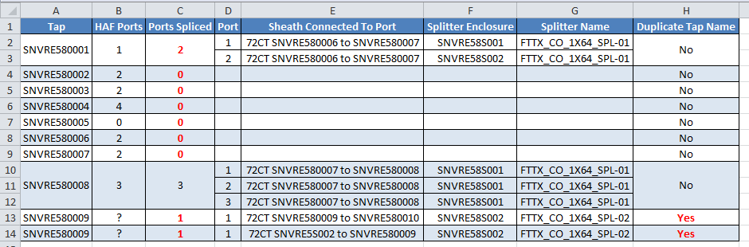

# Fiber-To-The-Home Tap Checker
## Overview Of Macro

This was another macro that I developed while working at Charter Communications.  One of 
the more complicated project types that I would work on as a designer was Fiber-To-The-Home 
(FTTH) greenfields.  

These projects involved drafting the following items into the software:

* aerial and underground support structures and span footages
* lot boundaries and parcels
* customer addresses
* an OLT (Optical Line Terminal) cabinet
  * which would generally feed the entire neighborhood
* a power supply
* splice enclosures
  * to house splitters, taps, and fiber optic connections
* fiber sheaths
* splitters
* taps
  * from which drop sheaths would connect to the individual customers
  * individual customers would be linked to the tap that was providing service to them in the software 
  
After everything was drafted, all of the splicing connections would be made in the software, 
so that the fiber technicians knew which splices to make in the field.  Typically, these 
designs took several days to complete and serviced several hundred customers.  A high attention 
to detail was required to ensure all of the equipment was spliced together correctly.


All of the splice enclosures, splitters, and taps needed to be spliced correctly so that 
everything traced back to the OLT, which would itself trace back to the hub.  Small splicing 
errors could cascade and result in many customers not having service.  Quality checking these 
projects was time consuming using our software, since you would have to click on hundreds 
of devices to verify the splicing.  Luckily our software generated useful Excel reports 
that I was able to parse using this macro.  This significantly sped up the quality 
check process, since something that would have taken hours to check manually could be 
verified in a matter of minutes with the macro.

The two reports, exported from our software, that were used by this macro were a trace 
report and a HAF report.  The trace report was run from the common of the DWDM(s) feeding 
the OLT.  This report would ripple through all of the devices connected to the OLT both 
upstream and downstream.  This means all of the taps and splitters would show up in this 
report.  The HAF report contained all of the addresses that were linked to the individual taps. 
This report would show which customers should be spliced to a tap, which could then be 
cross referenced with the trace report which shows which customers are actually spliced 
back to the OLT.  Any inconsistencies between these two reports would highlight splicing 
issues that need to be corrected.

A quick note before exploring the code.  Initially this macro was designed to check 
taps using only the trace report.  I later added functionality to check the HAF report as well. 
This led to a lot of duplicated code which I never ended up re-factoring.  The following
is the change log for this macro.

```vb
' v1.0      [2025.02.26]    Initial release
' v1.1      [2025.02.28]    Sorted taps in alphabetical order, filled in mising sequential taps.
' v1.2      [2025.03.03]    Refactored to reference header columns by variable instead of a static
'                           number in case format of trace report changes.  Detected duplicate tap
'                           names and displayed them in the results.  Checked Ports by referencing
'                           their UUID so that multiple trace reports can be on the same worksheet
'                           and duplicated ports wont be added to the tap.
' v1.3      [2025.03.04]    Added support to load a HAF report and display the ports linked to the
'                           tap in the HAF report alongside the ports spliced to the OLT.  The
'                           highest and lowest taps found in the HAF report will be added to the
'                           tap collection if they are not already present in the trace report and
'                           any missing sequential taps will be added as well.
'
' TODO      Code was duplicated to add support of only loading a trace report or adding a trace
'           report and a HAF report.  Logic can be used to detect if only a trace report was loaded
'           so there doesn't need to be two buttons in the worksheet.  Most of the duplicated code
'           can be refactored to use conditionals.
```

## Code Explanation
When the macro-enabled workbook is opened there are two buttons.  The `Open Trace Report`
button just checks taps using a trace report.  The `Open Trace and HAF Report` button 
was added later to parse the HAF report as well.


Each of these buttons launches a different `Main()` module.  The first button launches
this module.

```vb
Sub Main()
    Dim TraceReportObj As New TraceReport
    TraceReportObj.OpenTraceReport

    If Not TraceReportObj.Validate Then
        Exit Sub 'End application if a valid trace report was not selected
    End If

    TraceReportObj.Parse
End Sub
```

The second button launches the following module.

```vb
Sub Main() 'v1.3 Adds support for loading/parsing a trace report and a HAF report
    Dim TraceReportObj As New TraceReport
    If TraceReportObj.OpenTraceAndHAFReport = False Then
        MsgBox ("Trace Report and/or HAF Report not recognized")
        Exit Sub
    Else
        TraceReportObj.Parse
    End If

End Sub
```

They both instantiate the `TraceReport` class, however each calls a different method 
of that class to parse the report(s).

To get an idea of the output that the macro generates, here is the result from parsing 
a fictitious trace and HAF report, that I created for testing purposes.



The macro changes the font style to bold, and text color to red for any errors it 
finds to make them stand out. 

* In the above example, the HAF report indicates that only one port should be active
on tap `SNVRE580001`.  The trace report indicates that two ports from this tap trace 
back to the OLT.  Splicing too many ports to a tap, though uncommon, was an error 
I noticed occasionally.  Since OLTs are limited in the number of addresses they can 
service only active customers should be spliced back to the OLT.  
* Taps `SNVRE580002`, `SNVRE580003`, `SNVRE580004`, `SNVRE580006`, and `SNVRE580007` 
do not have any ports that trace back to the OLT, even though the HAF report indicates 
that there are customers connected to ports on those taps.  
* Usually the taps are sequentially named starting at 0001 and increment by one for 
each additional tap. `SNVRE580005` does not have any addresses linked to it 
in the software.  The designer may have forgotten to add a tap with this name, or to 
link addresses to it in the software. 
* Since UUIDs are used to detect taps in the trace report, the macro is able to detect
where two different taps share the same name.  Since the HAF report doesn't have a field
for UUID, it is unknown how many ports are supposed to be linked to each tap named 
`SNVRE580009`.  To indicate this ambiguity, the macro put a question mark in the 
`HAF Ports` column for the two taps named `SNVRE580009`.

### Port class
The `Port` class is a simple class that essentially just stores information about
particular tap ports.

```vb
Private m_PortNumber As Integer
Private m_Sheath As String
Private m_Splitter As String
Private m_SplitterEnclosure As String
Private m_PortUUID As String 'v1.2

Property Get PortNumber() As Integer
    PortNumber = m_PortNumber
End Property

Property Let PortNumber(value As Integer)
    m_PortNumber = value
End Property

Property Get PortUUID() As String
    PortUUID = m_PortUUID
End Property

Property Let PortUUID(value As String)
    m_PortUUID = value
End Property

Property Get Sheath() As String
    Sheath = m_Sheath
End Property

Property Let Sheath(value As String)
    m_Sheath = value
End Property

Property Get Splitter() As String
    Splitter = m_Splitter
End Property

Property Let Splitter(value As String)
    m_Splitter = value
End Property

Property Get SplitterEnclosure() As String
    SplitterEnclosure = m_SplitterEnclosure
End Property

Property Let SplitterEnclosure(value As String)
    m_SplitterEnclosure = value
End Property
```

### Tap class
The `Tap` class likewise mostly just stores information about the individual taps.
A collection of `Port` objects is stored in each instance of this class, which 
contain information on the individual ports.

```vb
Private m_TapUUID As String
Private m_TapName As String
Private m_Duplicate As Boolean
Private m_Ports As Collection 'Port objects
Private m_HAFPorts As Integer 'v1.3

Private Sub Class_Initialize()
    Set m_Ports = New Collection
End Sub

Property Get TapUUID() As String
    TapUUID = m_TapUUID
End Property

Property Let TapUUID(value As String)
    m_TapUUID = value
End Property

Property Get TapName() As String
    TapName = m_TapName
End Property

Property Let TapName(value As String)
    m_TapName = value
End Property

Property Get Duplicate() As Boolean
    Duplicate = m_Duplicate
End Property

Property Let Duplicate(value As Boolean)
    m_Duplicate = value
End Property

Public Sub AddPort(NewPort As Port)
    m_Ports.Add NewPort
End Sub

Public Function GetPorts() As Collection
    Set GetPorts = m_Ports
End Function

Property Get HAFPorts() As Integer
    'v1.3
    HAFPorts = m_HAFPorts
End Property

Property Let HAFPorts(value As Integer)
    'v1.3
    m_HAFPorts = value
End Property
```

### TraceReport class
All of the logic is stored in the `TraceReport` class.  Since I added the functionality to
parse a HAF report as an after thought, I added it to this class even though it really
deserves its own class.  If I were to re-factor this macro to make it cleaner and 
more future-proof that would be one of the changes I would make first.

At the top of this class, I have various variables to store the path, trace report, 
and HAF reports.  There is also a collection to store all of the taps in.  In the
1.2 update, I changed the logic to search for header row names instead of referencing 
the cells by column letter.  I figured this would make the macro more future-proof
in case the format of the trace report changed slightly.
```vb
Private m_Path As String
Private m_TraceReport As Workbook
Private m_HAFReport As Workbook
Private ws As Worksheet
Private m_Taps As Collection

'v1.2 Detect Trace Report header rows in case format of trace report changes
Private m_HeaderRow As Long
Private m_RightPortName As Long
Private m_RightDeviceName As Long
Private m_LeftEnclosureUUID As Long
Private m_LeftEnclosureName As Long
Private m_LeftDeviceName As Long
Private m_RightPortUUID As Long
Private m_LeftEnclosureType As Long
```

When the class is initialized in the `Main()` method the tap collection is 
initialized.  When the class is terminated at the end of the macro I made sure to
close the trace report and HAF report to free up memory.

```vb
Private Sub Class_Initialize()
    Set m_Taps = New Collection
End Sub

Private Sub Class_Terminate()
    If Not m_TraceReport Is Nothing Then
        m_TraceReport.Close (False)
    End If
    
    If Not m_HAFReport Is Nothing Then
        m_HAFReport.Close (False)
    End If
End Sub
```

For the sake of simplicity, I will only go over the functionality for parsing 
the trace and HAF reports, as opposed to only the trace report.

The following code launches a file picker dialog to select a HAF and Trace report. 
A loop iterates through the first two files selected in the dialog, and those paths 
are passed to the `IdentifyReport()` procedure to determine what type of file they are.

If a valid trace report and HAF report are detected, this function passes `True`
back to the `Main()` procedure and the reports are then parsed.  If either reports
fail to be detected, then the macro will terminate.

```vb
Function OpenTraceAndHAFReport() As Boolean
    'v1.3
    'Return true if a HAF Report and Trace Report were selected
    
    Dim fd As FileDialog, FileWasChosen As Boolean, iterator As Long, ReturnValue As Boolean

    Set fd = Application.FileDialog(msoFileDialogFilePicker)

    ReturnValue = True
    fd.Filters.Clear
    fd.Filters.Add "Excel Workbook", "*.xlsx"
    fd.Filters.Add "Excel Macro-Enabled Workbook", "*.xlsm" 'Only add the filter needed
    fd.Filters.Add "Excel 97- Excel 2003 Workbook", "*.xls"
    fd.FilterIndex = 1

    fd.AllowMultiSelect = True

    fd.InitialFileName = Environ("UserProfile") & "\Downloads"
    fd.Title = "Hold Ctrl and select a Trace and HAF Report"

    FileWasChosen = fd.Show

    If FileWasChosen = False Then
        Exit Function
    Else
        For iterator = 1 To fd.SelectedItems.Count
            If iterator > 2 Then 'Only check the first two selected files
                MsgBox ("Only the first two selected documents will be parsed")
                Exit For
            End If
            IdentifyReport fd.SelectedItems.Item(iterator)
        Next iterator
    End If
    
    If m_TraceReport Is Nothing Or m_HAFReport Is Nothing Then
        ReturnValue = False
    End If
    
    OpenTraceAndHAFReport = ReturnValue

End Function
```

Since each of the reports have a particular format, the `IdentifyReport()` procedure 
does some basic checking to determine if valid reports were loaded.  First it looks 
for the header row, which should be filled a certain color of grey.  Then it looks for 
a cell on that row with the value `PORT UUID`.  If this is found, then the `m_TraceReport` 
object is set to this workbook and the `DetectHeaderColumns` procedure is called to detect
the relevant header columns and store them to variables.

If the workbook is not determined to be a trace report, then logic is executed to see
if it is instead a HAF report.  This is done by searching for a cell on the first 
row with the value `COMMENT`.

If the temporary workbook being checked is neither a trace or HAF report, then it 
is closed so that it doesn't remain in memory after the macro terminates.

```vb
Sub IdentifyReport(PathString As String)
    'v1.3 Identifies the report type and sets the workbook variables
    Dim TempWorkbook As Workbook, HeaderRow As Long, RightPortUUID As Long, iterator As Long, WorkbookSet As Boolean
    Set TempWorkbook = GetObject(PathString)
    
    WorkbookSet = False
    
    HeaderRow = 0
    'Determine if trace report
    For iterator = 1 To TempWorkbook.Worksheets(1).Range("A1").SpecialCells(xlCellTypeLastCell).Row
        If TempWorkbook.Worksheets(1).Cells(iterator, 1).Interior.Color = 13882323 Then 'Search from top for first row filled grey
            HeaderRow = iterator
            Exit For
        End If
    Next iterator
    
    If HeaderRow <> 0 Then
        For iterator = TempWorkbook.Worksheets(1).Range("A1").SpecialCells(xlCellTypeLastCell).Column To 1 Step -1
            If CStr(TempWorkbook.Worksheets(1).Cells(HeaderRow, iterator).value) = "PORT UUID" Then
                Set m_TraceReport = TempWorkbook
                Set ws = m_TraceReport.Worksheets(1)
                m_Path = PathString
                WorkbookSet = True
                DetectHeaderColumns
                Exit For
            End If
        Next iterator
    End If
    
    'Determine if HAF report
    For iterator = TempWorkbook.Worksheets(1).Range("A1").SpecialCells(xlCellTypeLastCell).Column To 1 Step -1
        If CStr(TempWorkbook.Worksheets(1).Cells(1, iterator).value) = "COMMENT" Then
            Set m_HAFReport = TempWorkbook
            WorkbookSet = True
            Exit For
        End If
    Next iterator
    
    'Close TempWorkbook if it is not the trace or HAF report
    If WorkbookSet = False Then
        If Not TempWorkbook Is Nothing Then
            TempWorkbook.Close (False)
        End If
    End If
   
End Sub
```

The `DetectHeaderColumns()` procedure is used to search for the relevant header 
columns that will be required by the macro.

```vb
Sub DetectHeaderColumns()
    'v1.2 This sub-routine will detect the relevant header columns in case the format of the trace report changes
    Dim iterator As Long
    
    'Find header row
    'Macro will end if the header row is not found
    For iterator = 1 To ws.Range("A1").SpecialCells(xlCellTypeLastCell).Row
        If ws.Cells(iterator, 1).Interior.Color = 13882323 Then 'Search from top for first row filled grey
            m_HeaderRow = iterator
            Exit For
        End If
    Next iterator

    If m_HeaderRow <> 0 Then
        'Detect right Port Name column
        For iterator = ws.Range("A1").SpecialCells(xlCellTypeLastCell).Column To 1 Step -1
            If CStr(ws.Cells(m_HeaderRow, iterator).value) = "PORT NAME" Then
                m_RightPortName = iterator
                Exit For
            End If
        Next iterator

        'Detect right Device Name column
        For iterator = ws.Range("A1").SpecialCells(xlCellTypeLastCell).Column To 1 Step -1
            If CStr(ws.Cells(m_HeaderRow, iterator).value) = "DEVICE NAME" Then
                m_RightDeviceName = iterator
                Exit For
            End If
        Next iterator
        
        'Detect right Port UUID column
        For iterator = ws.Range("A1").SpecialCells(xlCellTypeLastCell).Column To 1 Step -1
            If CStr(ws.Cells(m_HeaderRow, iterator).value) = "PORT UUID" Then
                m_RightPortUUID = iterator
                Exit For
            End If
        Next iterator

        'Detect left Enclosure UUID column
        For iterator = 1 To ws.Range("A1").SpecialCells(xlCellTypeLastCell).Column
            If CStr(ws.Cells(m_HeaderRow, iterator).value) = "ENCLOSURE UUID" Then
                m_LeftEnclosureUUID = iterator
                Exit For
            End If
        Next iterator

        'Detect left Enclosure Name column
        For iterator = 1 To ws.Range("A1").SpecialCells(xlCellTypeLastCell).Column
            If CStr(ws.Cells(m_HeaderRow, iterator).value) = "ENCLOSURE NAME" Then
                m_LeftEnclosureName = iterator
                Exit For
            End If
        Next iterator

        'Detect left Device Name column
        For iterator = 1 To ws.Range("A1").SpecialCells(xlCellTypeLastCell).Column
            If CStr(ws.Cells(m_HeaderRow, iterator).value) = "DEVICE NAME" Then
                m_LeftDeviceName = iterator
                Exit For
            End If
        Next iterator
        
        'v1.31 Detect left Enclosure type column
        For iterator = 1 To ws.Range("A1").SpecialCells(xlCellTypeLastCell).Column
            If CStr(ws.Cells(m_HeaderRow, iterator).value) = "ENCLOSURE TYPE" Then
                m_LeftEnclosureType = iterator
                Exit For
            End If
        Next iterator
        
    End If
End Sub

```

The `Parse()` procedure iterates through each row of the trace report and identifies 
the ports.  A `Port` object is instantiated for each of the ports.  The `FindSplitter()` 
procedure is used to determine the row that the associated splitter is on.  The splitter
name and other attributes are saved to the `Port` object.

The `Port` objects are then associated to `Tap` objects.  These tap objects are added to
the `m_Taps` collection.

This procedure then basically calls the rest of the procedures, ultimately displaying
the new worksheet with the summarized results.

* `ParseHAF()`
* `AddHAFHighLow()`
* `SortCollection()`
* `SortPorts()`
* `AddMissingTaps()`
* `DisplayDataHAF()`


```vb
Sub Parse()
    Dim iterator As Long, TapSearchReturn As Long, FindSplitterReturn As Long, PortObj As Port, TapObj As Tap

    For iterator = m_HeaderRow + 1 To ws.Range("A1").SpecialCells(xlCellTypeLastCell).Row

        If Left(CStr(ws.Cells(iterator, m_RightPortName).value), 4) = "PORT" _
        And Mid(CStr(ws.Cells(iterator, m_RightPortName).value), 5, 1) <> "-" _
        And Len(CStr(ws.Cells(iterator, m_RightPortName).value)) <> 4 _
        And Mid(CStr(ws.Cells(iterator, m_RightPortName).value), 5, 1) <> " " _
        And CStr(ws.Cells(iterator, m_LeftEnclosureType).value) <> "CABINET" Then 'v1.3
            'PORT1 but not PORT-1 or just PORT or PORT with a space after it"
            'v1.31 Bug fix one test trace report used the same port naming for the OLT ports as the taps

            'Create Port object
            TapSearchReturn = SearchTap(CStr(ws.Cells(iterator, m_LeftEnclosureUUID).value))
            Set PortObj = New Port
            PortObj.PortNumber = CLng(Right(ws.Cells(iterator, m_RightPortName).value, Len(ws.Cells(iterator, m_RightPortName).value) - 4))
            PortObj.Sheath = CStr(ws.Cells(iterator, m_LeftDeviceName).value)
            PortObj.PortUUID = CStr(ws.Cells(iterator, m_RightPortUUID).value)

            'Find Row splitter is on
            FindSplitterReturn = FindSplitter(iterator)
            PortObj.Splitter = CStr(ws.Cells(FindSplitterReturn, m_RightDeviceName).value)
            PortObj.SplitterEnclosure = CStr(ws.Cells(FindSplitterReturn, m_LeftEnclosureName).value)

            'If tap doesn't exist create a new tap object, add port to its collection, and add to port collection
            If TapSearchReturn = 0 Then
                Set TapObj = New Tap
                TapObj.TapName = CStr(ws.Cells(iterator, m_LeftEnclosureName).value)
                TapObj.TapUUID = CStr(ws.Cells(iterator, m_LeftEnclosureUUID).value)
                'Don't need to check if port with matching UUID exists since tap doesn't exist
                TapObj.AddPort PortObj
                m_Taps.Add TapObj
            Else
                'Else add port to existing tap's port collection
                'v1.2 Search if port matching uuid exists
                If Not SearchPort(m_Taps.Item(TapSearchReturn), PortObj.PortUUID) Then
                    'Only add the port to the tap object if a port with the same UUID doesn't exist
                    m_Taps.Item(TapSearchReturn).AddPort PortObj
                End If
            End If
        End If
    Next iterator

    If Not (m_HAFReport Is Nothing) Then
        AddHAFHighLow 'Add the highest and lowest tap names from the HAF
    End If
    
    SortCollection m_Taps 'Sort the taps in alphabetical order
    SortPorts m_Taps 'Sorts the ports in numerical order
    
    AddMissingTaps m_Taps 'Add missing sequential taps that don't trace to the OLT
    DetectDuplicateTaps 'Search for duplicate tap names in collection
    
    If m_HAFReport Is Nothing Then
        DisplayData 'Display results in new workbook
    Else
        ParseHAF
        DisplayDataHAF
    End If

End Sub
```

The `ParseHAF()` procedure looks for a cell in the first row named `COMMENT`.  This 
column will contain the tap name that each address is linked to in the software.  This 
procedure then searches that column for each of the tap names found in the `m_Taps` 
collection and counts the number of times each tap name appears.  This information 
is then added to the `HAFPorts` attribute for the individual taps.

```vb
Sub ParseHAF()
    Dim iterator As Long, iterator2 As Long, CommentColumn As Integer, TapCount As Integer
    
    'Detect Comment column
    For iterator = m_HAFReport.Worksheets(1).Range("A1").SpecialCells(xlCellTypeLastCell).Column To 1 Step -1
        If CStr(m_HAFReport.Worksheets(1).Cells(1, iterator).value) = "COMMENT" Then
            CommentColumn = iterator
            Exit For
        End If
    Next iterator
    
    'Check if highest and lowest tap in collection
    
    'Iterate through tap list and count occurrences of tap name in COMMENT column
    For iterator = 1 To m_Taps.Count
        TapCount = 0
        For iterator2 = 2 To m_HAFReport.Worksheets(1).Range("A1").SpecialCells(xlCellTypeLastCell).Row
            If CStr(m_HAFReport.Worksheets(1).Cells(iterator2, CommentColumn).value) = m_Taps.Item(iterator).TapName Then
                TapCount = TapCount + 1
            End If
        Next iterator2
        m_Taps.Item(iterator).HAFPorts = TapCount
    Next iterator
End Sub
```

The `AddHAFHighLow()` procedure searches for the highest and lowest tap names found in the 
HAF report.  This procedure then makes sure that these taps exist in the `m_Taps` 
collection, and instantiates a new tap object and adds it to the collection if 
they do not exist.

```vb
Sub AddHAFHighLow()
    'v1.3 Search the highest and lowest taps in the haf report
    Dim LowName As String, HighName As String, LowInt As Integer, HighInt As Integer, iterator As Long, CommentColumn As Integer, TapString As String, TapFound As Boolean, TapObj As Tap
    
    'Detect Comment column
    For iterator = m_HAFReport.Worksheets(1).Range("A1").SpecialCells(xlCellTypeLastCell).Column To 1 Step -1
        If CStr(m_HAFReport.Worksheets(1).Cells(1, iterator).value) = "COMMENT" Then
            CommentColumn = iterator
            Exit For
        End If
    Next iterator
    
    LowInt = 999
    HighInt = 0
    
    For iterator = 2 To m_HAFReport.Worksheets(1).Range("A1").SpecialCells(xlCellTypeLastCell).Row
        TapString = CStr(m_HAFReport.Worksheets(1).Cells(iterator, CommentColumn).value)
        'v1.32 Prevent unlinked taps with an empty string in the comment column from causing crash
        If TapString <> "" Then
            If CInt(Right(TapString, 3)) > HighInt Then
                HighInt = CInt(Right(TapString, 3))
                HighName = TapString
            End If
            
            If CInt(Right(TapString, 3)) < LowInt Then
                LowInt = CInt(Right(TapString, 3))
                LowName = TapString
            End If
        End If
    Next iterator
    
    TapFound = False
    'Search for highest name found it HAF in trace report taps
    For iterator = 1 To m_Taps.Count
        If m_Taps.Item(iterator).TapName = HighName Then
            TapFound = True
            Exit For
        End If
    Next iterator
    
    If TapFound = False And TapString <> "" Then 'v1.32
        Set TapObj = New Tap
        TapObj.TapName = HighName
        m_Taps.Add TapObj
    End If
    
    TapFound = False
    'Search for lowest name found in HAF in trace report taps
    For iterator = 1 To m_Taps.Count
        If m_Taps.Item(iterator).TapName = LowName Then
            TapFound = True
            Exit For
        End If
    Next iterator
    
    If TapFound = False And TapString <> "" Then 'v1.32
        Set TapObj = New Tap
        TapObj.TapName = LowName
        m_Taps.Add TapObj
    End If
End Sub
```

The `SearchPort()` function checks to make sure that a `Port` object with a particular 
UUID does not already exist in the `Tap` object.

```vb
Function SearchPort(TapObj As Tap, PortUUID As String) As Boolean
    'v1.2 Returns true if port with matching UUID found in tap object, false if it is not found
    Dim iterator As Integer, ReturnValue As Boolean
    ReturnValue = False
    For iterator = 1 To TapObj.GetPorts.Count
        If TapObj.GetPorts.Item(iterator).PortUUID = PortUUID Then
            ReturnValue = True
            Exit For
        End If
    Next iterator
    SearchPort = ReturnValue
End Function
```

The `AddMissingTaps()` procedure adds missing sequential tap names to the `m_Taps`
collection.  Since taps should be named in incremental order there should not be
gaps in the numbering.  These are most likely taps that do not trace back to the
OLT.


```vb
Private Sub AddMissingTaps(TapCol As Collection)
    'v1.1 This sub-routine will iterate though the tap collection and add missing sequential tap names to the collection
    Dim iterator As Integer, TapObj As Tap, Tap1Int As Integer, Tap2Int As Integer, NumString As String, CurrentTapName As String, LastTapName As String

    iterator = 1
    CurrentTapName = TapCol.Item(iterator).TapName
    LastTapName = TapCol.Item(TapCol.Count).TapName

    Do While CurrentTapName <> LastTapName
        Tap1Int = CInt(Right(TapCol.Item(iterator).TapName, 3))
        Tap2Int = CInt(Right(TapCol.Item(iterator + 1).TapName, 3))
        
        If Tap2Int - Tap1Int <> 1 And Tap2Int - Tap1Int <> 0 _
        And Left(TapCol.Item(iterator).TapName, Len(TapCol.Item(iterator).TapName) - 4) = Left(TapCol.Item(iterator + 1).TapName, Len(TapCol.Item(iterator + 1).TapName) - 4) Then
            'If the difference between the two taps <> 1 there is a missing tap
            'If the difference between the two tap names is zero then the tap is duplicated
            'All but the last four characters of the tap names must match to create sequential missing taps
            'The last conditional accounts for different OLTs in the same trace report

            Set TapObj = New Tap
            'Create tap name string
            NumString = ""

            If Tap1Int + 1 < 100 Then
                NumString = NumString + "0"
            End If

            If Tap1Int + 1 < 10 Then
                NumString = NumString + "0"
            End If

            NumString = NumString + CStr(Tap1Int + 1)
            TapObj.TapName = Left(TapCol.Item(iterator).TapName, Len(TapCol.Item(iterator).TapName) - 3) + NumString
            'Add tap to collection
            TapCol.Add TapObj, After:=iterator
        End If

        iterator = iterator + 1
        CurrentTapName = TapCol.Item(iterator).TapName
    Loop

End Sub
```

The `FindSplitter()` function basically searches upwards in the trace report until
a string starting with `OUT-` is located.  This is the row that the splitter name
will be found on.

```vb
Function FindSplitter(RowNumber As Long) As Long
    'Returns the row number that the splitter was found on
    Dim iterator As Long, ReturnValue As Long

    For iterator = RowNumber To 1 Step -1
        If UCase(Left(CStr(ws.Cells(iterator, m_RightPortName).value), 4)) = "OUT-" Then
            ReturnValue = iterator
            Exit For
        End If
    Next iterator

    FindSplitter = iterator
End Function
```

The `SearchTap()` function searches the `m_Taps` collection for a particular tap 
UUID.  `0` is returned if the tap is not found.  If the tap is found, its index
in the tap collection is returned.

```vb
Function SearchTap(UUID As String) As Long
    'Returns 0 if tap not found, item number of tap collection if found
    Dim ReturnValue As Long, iterator As Long
    ReturnValue = False

    For iterator = 1 To m_Taps.Count
        If m_Taps.Item(iterator).TapUUID = UUID Then
            ReturnValue = iterator
            Exit For
        End If
    Next iterator

    SearchTap = ReturnValue
End Function
```

The `DetectDuplicateTaps()` procedure sets the `Duplicate` attribute of the individual 
`Tap` objects to either `True` or `False` based on whether it detects another tap 
with the same name in the `m_Taps` collection.

```vb
Sub DetectDuplicateTaps()
    'v1.2 Check for taps with duplicate names in the tap collection
    Dim iterator As Long

    For iterator = 1 To m_Taps.Count
        m_Taps.Item(iterator).Duplicate = False
        
        If iterator = 1 Then 'First tap in collection, check if next tap in collection has same name
            If m_Taps.Item(iterator).TapName = m_Taps.Item(iterator + 1).TapName Then
                m_Taps.Item(iterator).Duplicate = True
            End If
        ElseIf iterator = m_Taps.Count Then 'Last tap in collection, check if previous tap in collection has the same name
            If m_Taps.Item(iterator).TapName = m_Taps.Item(iterator - 1).TapName Then
                m_Taps.Item(iterator).Duplicate = True
            End If
        Else 'All other taps in collection, check if previous or next taps have the same name
            If m_Taps.Item(iterator).TapName = m_Taps.Item(iterator + 1).TapName Or m_Taps.Item(iterator).TapName = m_Taps.Item(iterator - 1).TapName Then
                m_Taps.Item(iterator).Duplicate = True
            End If
        End If
    Next iterator
End Sub
```

To make the taps appear in alphabetical order on the report, I implemented a basic
bubble sort algorithm to sort the `m_Taps` collection.

```vb
Private Sub SortCollection(TapCol As Collection)
    'v1.1 Simple bubble sort algorithm to sort a collection in alphabetical order
    Dim iterator1 As Integer, iterator2 As Integer, TapObj As Tap

    For iterator1 = 1 To TapCol.Count
        For iterator2 = iterator1 + 1 To TapCol.Count
            If UCase(TapCol.Item(iterator1).TapName) > UCase(TapCol.Item(iterator2).TapName) Or UCase(TapCol.Item(iterator1).TapName) = UCase(TapCol.Item(iterator2).TapName) Then
                Set TapObj = TapCol.Item(iterator2)
                TapCol.Remove iterator2
                TapCol.Add TapObj, Before:=iterator1
            End If
        Next iterator2
    Next iterator1
End Sub
```

Similar to the previous procedure, the `SortPorts()` procedure sorts the `Port` objects 
in alphabetical order so that they display in the correct order on the report.


```vb
Private Sub SortPorts(TapCol As Collection)
    'v1.1 Simple bubble sort algorithm to sort a collection in alphabetical order
    Dim iterator1 As Integer, iterator2 As Integer, PortObj As Port, TapObj As Tap

    For Each TapObj In TapCol
        If TapObj.GetPorts.Count > 1 Then
            For iterator1 = 1 To TapCol.Count
                For iterator2 = iterator1 + 1 To TapObj.GetPorts.Count
                    If TapObj.GetPorts.Item(iterator1).PortNumber > TapObj.GetPorts.Item(iterator2).PortNumber Then
                        Set PortObj = TapObj.GetPorts.Item(iterator2)
                        TapObj.GetPorts.Remove iterator2
                        TapObj.GetPorts.Add PortObj, Before:=iterator1
                    End If
                Next iterator2
            Next iterator1
        End If
    Next
End Sub
```

The `DisplayDataHAF()` procedure creates a new workbook and displays and formats the 
information for each tap.  I opted to create separate procedures for only parsing
a trace report, and for parsing a trace and HAF report.  A lot of the code is duplicated
between the two procedures, and should probably be re-factored to use conditional logic.

```vb
Sub DisplayDataHAF()
    'v1.3 This sub-routine will display the tap information in a new workbook
    Dim wk As Workbook, CurrentRow As Long, LastRow As Long, iterator1 As Long, iterator2 As Long, ShadedRows As Boolean

    Set wk = Workbooks.Add(1)

    wk.Worksheets(1).Name = "FTTH Tap Report"
    wk.Worksheets(1).Cells(1, 1).value = "Tap"
    wk.Worksheets(1).Cells(1, 2).value = "HAF Ports"
    wk.Worksheets(1).Cells(1, 3).value = "Ports Spliced"
    wk.Worksheets(1).Cells(1, 4).value = "Port"
    wk.Worksheets(1).Cells(1, 5).value = "Sheath Connected To Port"
    wk.Worksheets(1).Cells(1, 6).value = "Splitter Enclosure"
    wk.Worksheets(1).Cells(1, 7).value = "Splitter Name"
    wk.Worksheets(1).Cells(1, 8).value = "Duplicate Tap Name"

    CurrentRow = 2
    LastRow = CurrentRow
    ShadedRows = False

    For iterator1 = 1 To m_Taps.Count
        LastRow = CurrentRow
        wk.Worksheets(1).Cells(CurrentRow, 1).value = m_Taps.Item(iterator1).TapName
        
        If m_Taps.Item(iterator1).GetPorts.Count = 0 Or m_Taps.Item(iterator1).GetPorts.Count <> m_Taps.Item(iterator1).HAFPorts _
        Or m_Taps.Item(iterator1).Duplicate = True Then
            With wk.Worksheets(1).Cells(CurrentRow, 3)
                .value = m_Taps.Item(iterator1).GetPorts.Count
                .Font.Color = 255
                .Font.Bold = True
            End With
        Else
            wk.Worksheets(1).Cells(CurrentRow, 3).value = m_Taps.Item(iterator1).GetPorts.Count
        End If

        If m_Taps.Item(iterator1).Duplicate = True Then
            With wk.Worksheets(1).Cells(CurrentRow, 8)
                .value = "Yes"
                .Font.Color = 255
                .Font.Bold = True
            End With
            wk.Worksheets(1).Cells(CurrentRow, 2).value = "?"
        Else
            wk.Worksheets(1).Cells(CurrentRow, 8).value = "No"
            wk.Worksheets(1).Cells(CurrentRow, 2).value = m_Taps.Item(iterator1).HAFPorts
        End If

        For iterator2 = 1 To m_Taps.Item(iterator1).GetPorts.Count
            'Display ports
            wk.Worksheets(1).Cells(CurrentRow, 4).value = m_Taps.Item(iterator1).GetPorts.Item(iterator2).PortNumber
            wk.Worksheets(1).Cells(CurrentRow, 5).value = m_Taps.Item(iterator1).GetPorts.Item(iterator2).Sheath
            wk.Worksheets(1).Cells(CurrentRow, 6).value = m_Taps.Item(iterator1).GetPorts.Item(iterator2).SplitterEnclosure
            wk.Worksheets(1).Cells(CurrentRow, 7).value = m_Taps.Item(iterator1).GetPorts.Item(iterator2).Splitter
            CurrentRow = CurrentRow + 1
        Next iterator2

        'Iterate to next row for missing taps with no ports spliced
        If m_Taps.Item(iterator1).GetPorts.Count = 0 Then
            CurrentRow = CurrentRow + 1
        End If

        'Shade every other tap
        If ShadedRows = True Then
            If CurrentRow - LastRow <> 0 Then
                wk.Worksheets(1).Range(Cells(LastRow, 1), Cells(CurrentRow - 1, 8)).Interior.Color = 15853276
            Else
                wk.Worksheets(1).Range(Cells(CurrentRow, 1), Cells(CurrentRow, 8)).Interior.Color = 15853276
            End If
        End If

        'Merge columns 1, 2, and 7
        If CurrentRow - LastRow <> 0 Then
            wk.Worksheets(1).Range(Cells(LastRow, 1), Cells(CurrentRow - 1, 1)).Merge
            wk.Worksheets(1).Range(Cells(LastRow, 2), Cells(CurrentRow - 1, 2)).Merge
            wk.Worksheets(1).Range(Cells(LastRow, 3), Cells(CurrentRow - 1, 3)).Merge
            wk.Worksheets(1).Range(Cells(LastRow, 8), Cells(CurrentRow - 1, 8)).Merge
        End If

        ShadedRows = Not ShadedRows
    Next iterator1

    LastRow = CurrentRow

    'Format Data
    With wk.Worksheets(1).Range("A1:H" + CStr(LastRow - 1))
        .Borders.LineStyle = xlContinuous
        .Borders.Weight = xlThin
    End With

    With wk.Worksheets(1).Range("A1:H1")
        .Font.Color = 16777215
        .Font.Bold = True
        .Interior.Color = 12419407
    End With

    With wk.Worksheets(1).Columns("A:H")
        .EntireColumn.AutoFit
        .HorizontalAlignment = xlCenter
        .VerticalAlignment = xlVAlignCenter
    End With
End Sub
```
## Conclusion
Like with the `Sheath Name Checker` macro, which is also discussed in my portfolio, I created 
this macro mostly to reduce the time needed to quality check these massive Fiber-To-The-Home 
projects. This macro probably reduced the time needed to verify the splicing of a large 
Fiber-To-The-Home greenfield from a few hours to a matter of minutes.  I also used these 
macros to reduce errors in my own design process, leading to higher precision and fewer 
rejections. I shared these macros with other designers, as well as my supervisor and manager, 
which resulted in increased production and fewer rejections for those who used them. 
Seeing the benefits that these macros had, not only for me, but for other designers 
who I shared them with, led me to become more interested in data analysis, and 
explore it further as a possible career change.
