## Fast Food Restaurant Analysis
### Table of Contents
* [Overview](#overview)
* [Semantic Model](#semantic-model)
* [Data Analysis Expressions (DAX)](#data-analysis-expressions-dax)
	* [Bayesian Adjusted Rating](#bayesian-adjusted-rating)
	* [Weighted Quality Index](#weighted-quality-index)
	* [Metric Parameter Field](#metric-parameter-field)
	* [Selected Metric](#selected-metric)
	* [Dynamic Rank](#dynamic-rank)
	* [Dynamic Location Rank](#dynamic-location-rank)
	* [Dynamic Titles](#dynamic-titles)
	* [Adjusted Weighted Quality Index](#adjusted-weighted-quality-index)
	* [Health Value Index](#health-value-index)
	* [Net Health Score](#net-health-score)
	* [Weighted Health Value Index](#weighted-health-value-index)
	* [Weighted Net Health Score](#weighted-net-health-score)
* [Report Interactivity](#report-interactivity)

### Overview
I created this dashboard to assist in determining healthy items to purchase at nearby fast food restaurants.  Below is the initial page that loads when the report is opened.  I collected data on fifteen different fast food restaurants, which I occasionally frequent, and only collected data on their main products.  I did not include combos, meals, sides, or breakfast menu items.  My goal in this analysis was to be able to compare the overall healthiness of the food at the different locations, as well as be able to dive deeper into the individual locations and examine their products in depth.

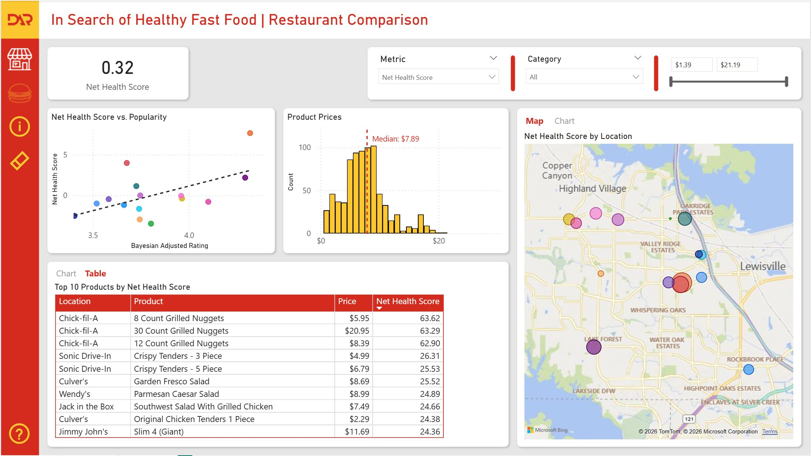

<br/>
There is a slicer at the top to determine which metric to analyze the different locations and products by.  I will explain these metrics more in depth later, but essentially **Net Health Score** refers to how healthy the product is, **Health Value Index** takes into account the price of the product and is basically how much health value you get for your money.  The two weighted metrics factor in the popularity of the restaurant into the two base metrics.

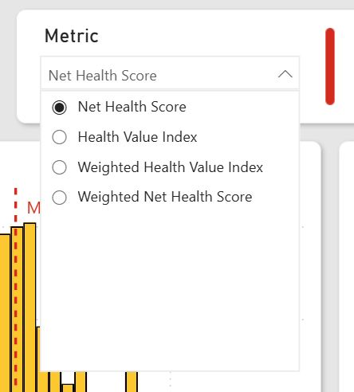

<br/>
There are two other slicers to filter the products by food category as well as price.

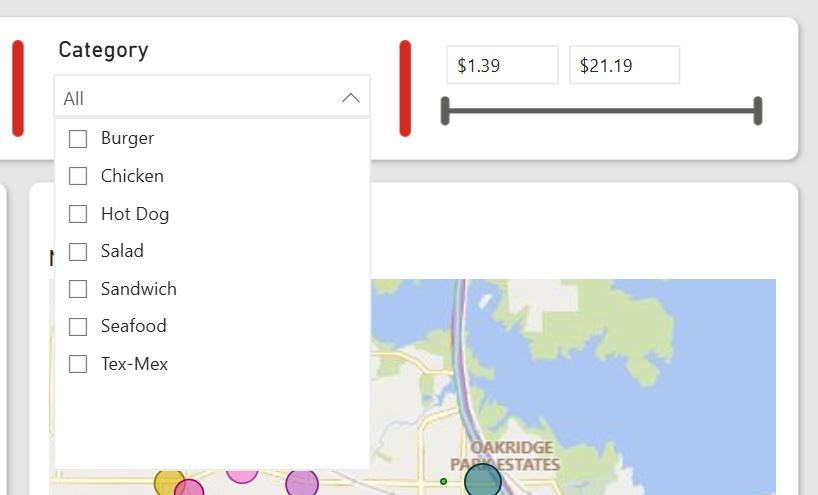

<br/>
Below the filters is where the user can view aggregated information for the different locations.  In the map the bubble size indicates the average metric for the different restaurants.  Bookmarks are utilized so that the user can toggle between displaying the data as a map or as a chart.

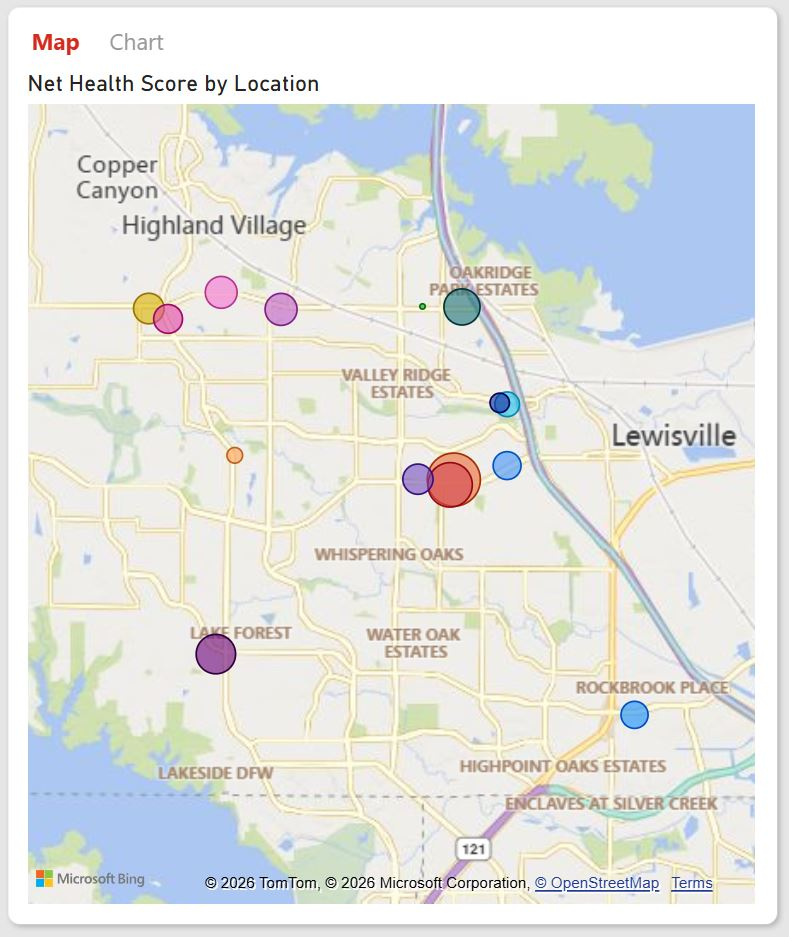
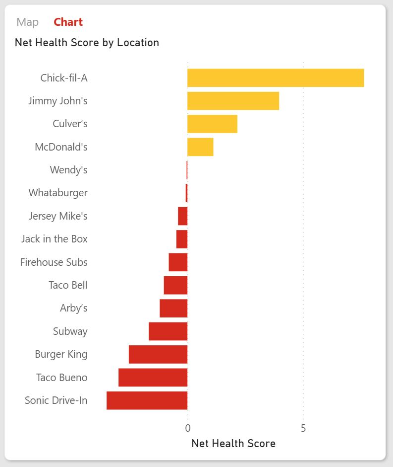

<br/>
When the user selects a location, the drill through button becomes active and the user can view detailed nutrition information for the restaurant by clicking the button.

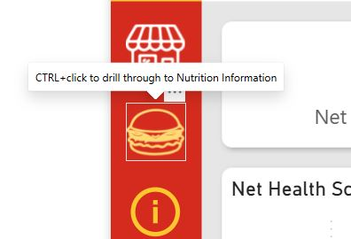

<br/>
I included a scatter plot to display the correlation between a restaurants popularity and the different metrics.  Each of the metrics shows a positive correlation with the restaurants popularity, indicating that more popular restaurants typically have healthier food on average.

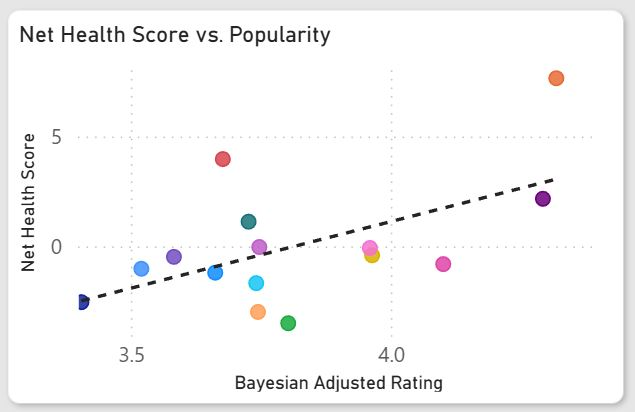

<br/>
To the right of the scatter plot is a histogram which shows the counts of the prices, grouped into one-dollar bin sizes.  This allows the user to quickly filter the data by a particular price range.

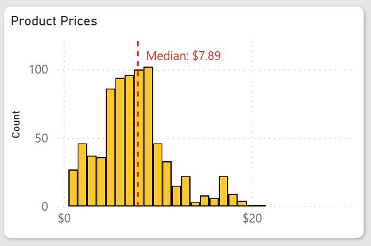

<br/>
At the bottom left the user can view the top 10 products ranked by the selected metric, as either a table or a chart.  All of the filters affect these visualizations, so for instance if a particular food category and price range was selected, it would display the top 10 products that satisfy those filters.

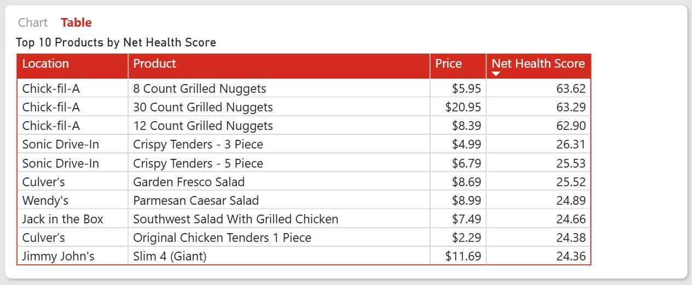
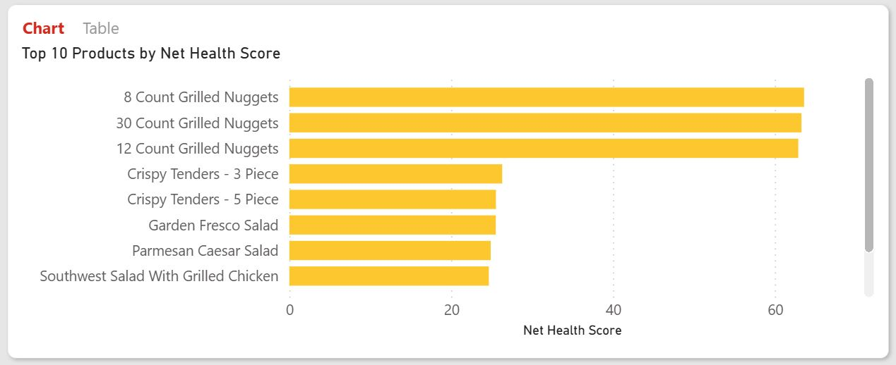

<br/>
Clicking the help icon in the lower left of the screen displays an overlay describing each of the features in the report.

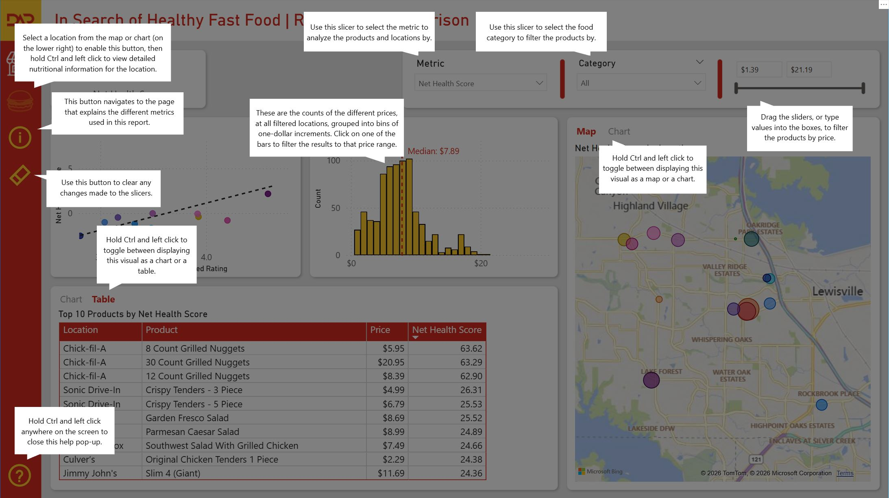

<br/>
When the user selects a location and click the drill through button, a detailed product menu appears so that the user can view nutrition information and analyze metrics for all items on the menu.  In addition to the same filters that appear on the main report page, the detailed product view page also includes information on the average price, the locations score on the selected metric, and how the restaurant ranks among the other restaurants on the selected metric.

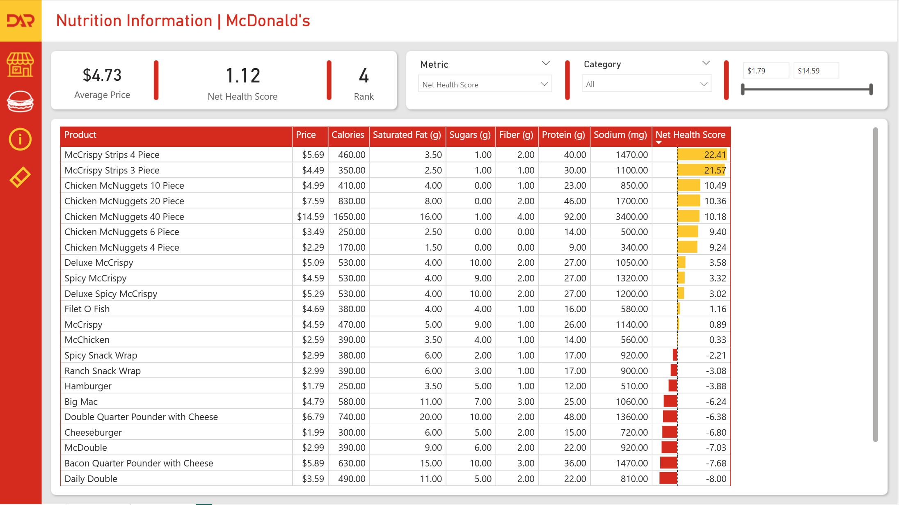

<br/>


Clicking on the info button displays more detailed information on the different metrics used in the report.

The **Net Health Score** and the **Health Value Index** both have the same numerator.  I multiplied the good good calories, protein in fiber, by their approximate calories per gram, and from this I subtracted the bad calories Sugar and Saturated fat, which I also multiplied by their approximate calories per gram.  I also penalize sodium by multiplying the value, converted from milligrams to grams, by a factor of twenty.  

For the **Net Health Score** I then divide the numerator by the **calories divided by 100** to obtain the final metric.  For the **Health Value Index** I divide the numerator by the product’s **total price**.

Since the different locations had different numbers of reviews, I calculated the **Bayesian Adjusted Rating** to make it so that the more reviews a location has, the closer the adjusted rating is to the location’s actual rating.  Likewise the less reviews a location has, the more the adjusted rating is pulled towards the average rating for the entire dataset.

Since I didn’t want the weighted scores to ignore the underlying metrics I then scaled the Bayesian Adjusted Rating so that the values fall between 0.7 and 1.3.  I used this **Weighted Quality Index** to calculate the final two metrics.

I then multiplied the Weighted Quality Index by the Net Health Score and the Health Value Index to obtain the **Weighted Net Health Score** and the **Weighted Health Value Index** metrics.

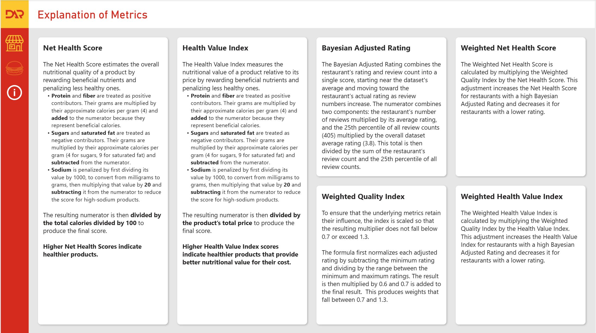

<br/>


### Semantic Model
Since I collected all of the data for this project and created the tables in Excel, I didn't need to modify the data in Power Query once it was imported. I mostly just promoted headers, since the data was exported as comma-separated values files, and changed data types.  Below is the model that I created for this project.  I probably could have combined the fact tables and avoided the one to one relationships.  Combining the Google and Location tables would have allowed me to use a single cross-filter direction instead of having to use Both.  The Metric table was a parameter field that I created to allow the user to change the metric being used for the different visualizations on the report pages.

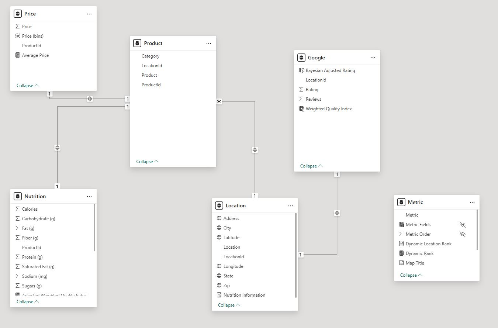

<br/>

### Data Analysis Expressions (DAX)
I had difficulty creating DAX measures for the Bayesian Adjusted Rating and the Weighted Quality Index.  I think the issue was due to the cross filter directions being set to both between the Google, Location, and Product tables.  In the end, and since the Google table was only fifteen rows long, I opted to use calculated columns for those metrics instead of measures.

<br/>

#### Bayesian Adjusted Rating

Since I created a calculated column for this metric, I didn’t need to modify the filter context to calculate this metric.  I used the 25th percentile of the dataset reviews count as the threshold to determine the point at which the adjusted rating should reflect the actual rating for the restaurant.  Restaurants below this threshold were pulled more towards the dataset mean instead of their actual rating.

```dax
Bayesian Adjusted Rating = 
VAR AverageRating = 
AVERAGE(
    Google[Rating]
)

VAR Percentile25 =
CONVERT(
    PERCENTILE.INC(
        Google[Reviews],
        0.25
    ),
    DOUBLE
)

RETURN
    DIVIDE(
		('Google'[Reviews] * 'Google'[Rating]) + (Percentile25 * AverageRating), 
		('Google'[Reviews] + Percentile25)
	)
```
<br />

#### Weighted Quality Index

The Weighted Quality Index calculated column scaled the Bayesian Adjusted Rating so that it fell between 0.7 and 1.3

```dax
Weighted Quality Index = 
VAR MinBayesian = MIN('Google'[Bayesian Adjusted Rating])
VAR MaxBayesian = MAX('Google'[Bayesian Adjusted Rating])
RETURN
    0.7 + 0.6 * DIVIDE(([Bayesian Adjusted Rating] - MinBayesian), (MaxBayesian - MinBayesian))
```
<br />

#### Metric Parameter Field
To enable the user to select a metric, I created a parameter field.

```dax
Metric = {
    ("Net Health Score", NAMEOF('Nutrition'[Net Health Score]), 0),
    ("Health Value Index", NAMEOF('Nutrition'[Health Value Index]), 1),    
    ("Weighted Health Value Index", NAMEOF('Nutrition'[Weighted Health Value Index]), 2),
    ("Weighted Net Health Score", NAMEOF('Nutrition'[Weighted Net Health Score]), 3)
}
```
<br />

#### Selected Metric
I had issues with some of my later DAX measures, so I created a helper function to return the actual measure based on the selected metric.

```dax
Selected Metric = 
VAR SelectedName = MAX('Metric'[Metric])
RETURN
    SWITCH(SelectedName,
    "Health Value Index", [Health Value Index],
    "Net Health Score", [Net Health Score],
    "Weighted Health Value Index", [Weighted Health Value Index],
    "Weighted Net Health Score", [Weighted Net Health Score],
    [Net Health Score])
```
<br />

#### Dynamic Rank
I created this measure so that I could filter the products on the main report page to only show the top 10 products based on the selected metric.

```dax
Dynamic Rank = 
RANKX(
    ALLSELECTED('Product'),
    [Selected Metric],
    ,
    DESC,
    Dense
)
```
<br />

#### Dynamic Location Rank
I had to create an additional measure that modifies the filter context differently to rank the different locations.

```dax
Dynamic Location Rank = 
RANKX(
    ALL('Location'),
    [Selected Metric],
    ,
    DESC,
    Dense
)
```
<br />

#### Dynamic Titles
I created several measures so that the titles of the various visualizations included the selected metric name.

```dax
Map Title = 
VAR SelectedName = MAX('Metric'[Metric])
RETURN
    SelectedName & " by Location"
```
<br />

```dax
Scatter Plot Title = 
VAR SelectedName = MAX('Metric'[Metric])
RETURN
    SelectedName & " vs. Popularity"
```
<br />
```dax
Top 10 Title = 
VAR SelectedName = MAX('Metric'[Metric])
RETURN
    "Top 10 Products by " & SelectedName
```
<br />

#### Adjusted Weighted Quality Index
Before applying the Weighted Quality Index to the Net Health Score or the Health Value Index, I had to modify it based on whether the base metric was positive or negative.  If the value was already negative multiplying it by a index less than one would make it get closer to zero instead of further from zero like intended.  I used some conditional logic to subtract the Weighted Quality Index from 2 when the metric was negative.  This achieved the desired result.  I had to use the `NOT ISBLANK()` function for situations where I had the visualization grouped by location and product otherwise the measure produced inaccurate results.
```dax
Adjusted Weighted Quality Index HVI = IF(
    NOT ISBLANK([Health Value Index]),
     IF([Health Value Index] < 0, SUMX('Google', 2 - [Weighted Quality Index]), SUMX('Google', [Weighted Quality Index])),
     BLANK()
)
```
<br />

```dax
Adjusted Weighted Quality Index NHS = IF(
    NOT ISBLANK([Net Health Score]),
     IF([Net Health Score] < 0, SUMX('Google', 2 - [Weighted Quality Index]), SUMX('Google', [Weighted Quality Index])),
     BLANK()
)
```
<br />

#### Health Value Index
This measure uses simple math which adds the good calories and subtracts the bad ones from the numerator then divides that result by the calories divided by 100.

```dax
Health Value Index = 
AVERAGEX(
    'Nutrition',
    DIVIDE((([Protein (g)] * 4) + ([Fiber (g)] * 4) - ([Sugars (g)] * 4) - ([Saturated Fat (g)] * 9) - ([Sodium (mg)] / 1000 * 20)), RELATED('Price'[Price])    
)
        )
```
<br />

#### Net Health Score
This measure is similar to the previous one, with the exception that the denominator is the products price.

```dax
Net Health Score = 
AVERAGEX(
    'Nutrition',
    DIVIDE(
        (([Protein (g)] * 4) + ([Fiber (g)] * 4) - ([Sugars (g)] * 4) - ([Saturated Fat (g)] * 9) - ([Sodium (mg)] / 1000 * 20)), 
        ([Calories] / 100)
    )
)       
```
<br />

#### Weighted Health Value Index
This measure uses an iterator to multiply the Adjusted Weighted Quality Index created earlier by the Health Value Index for each product.

```dax
Weighted Health Value Index = 
AVERAGEX(
    'Nutrition', 
    [Health Value Index] * [Adjusted Weighted Quality Index HVI]
)
```
<br />

#### Weighted Net Health Score
Like the previous measure, this measure multiplies the Adjusted Weighted Quality Index by the Net Health Score for each product in the Nutrition table.

```dax
Weighted Net Health Score = 
AVERAGEX(
    'Nutrition',
    [Net Health Score] * [Adjusted Weighted Quality Index NHS]
)
```
<br />

### Report Interactivity

To enable the help pop-up and the ability to toggle between different visualizations, I created different bookmarks that hide or show various elements.

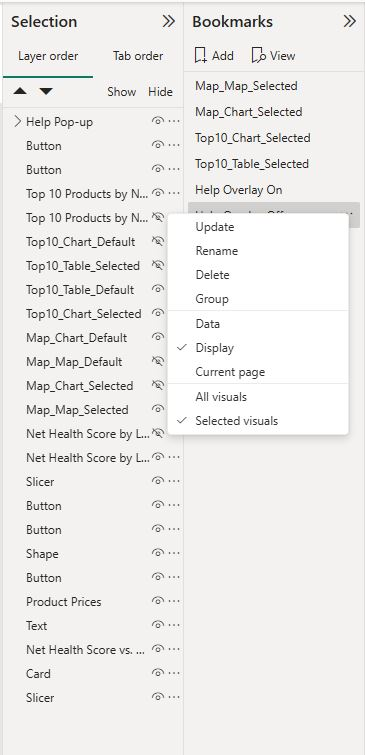

I added the Location field to the Drill through bucket on the Nutrition Information page to allow users to drill through to that page to view the detailed product information for the location.

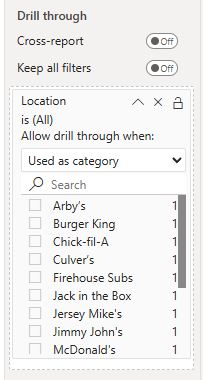

For the histogram, I created a new group for the Price field and grouped the prices into Bin sizes of one dollar.

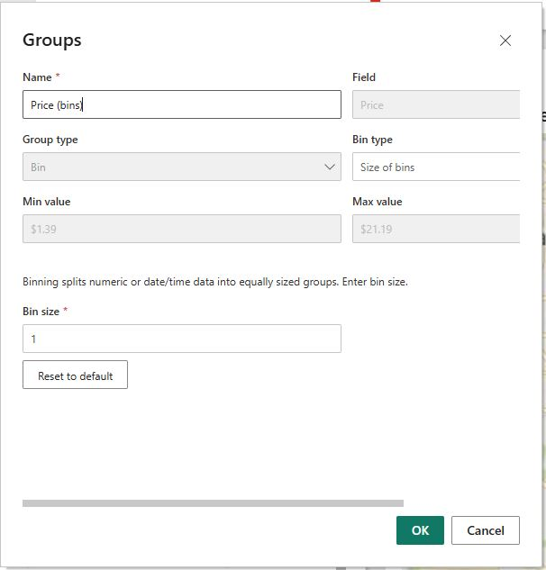
