Food Recall Exploratory Data Analysis
================
David Rommel
2025-07-22

## Food Recall Exploratory Data Analysis

The following document details an exploratory data analysis I conducted
on the food recall data from openFDA. I was mostly interested in
examining trends related to Salmonella and Listeria recalls. The
intended audience for this analysis would mainly be consumers, in order
to make informed purchasing decisions.

## Load Libraries

I used the `jsonlite` library to load and parse the json file, that the
openFDA API exported the data in. The `lubridate` library was used to
process dates. The `sf` library was used to create geographical maps.
The `wordcloud` library was used to create word clouds.

``` r
library("tidyverse")
library("jsonlite")
library("lubridate")
library("sf")
library("wordcloud")
```

## Prepare Data

The food recall data set was a single json document that could be
downloaded from [OpenFDA’s
website](https://open.fda.gov/apis/food/enforcement/download/).

``` r
dat <- "/home/user/Downloads/food-enforcement-0001-of-0001.json" %>% fromJSON()
df <- dat$results %>% as_tibble()
rm(dat)
```

### What is the time range of the data set?

This data set only covers a narrow range of dates. 50 percent of the
records fall between 2015 and 2021, and most of the data falls between
2010 and 2025 with very little data going back before 2010. For the sake
of this study I decided to just focus on the last 5 full years,
2020-2024.

``` r
quantile(ymd(df$recall_initiation_date), type = 1)
```

    ##           0%          25%          50%          75%         100% 
    ##  "212-12-07" "2014-12-23" "2017-05-03" "2021-03-11" "2025-06-10"

``` r
df %>% ggplot() + geom_boxplot(mapping = aes(x = ymd(recall_initiation_date))) + 
  labs(x = "Year")
```

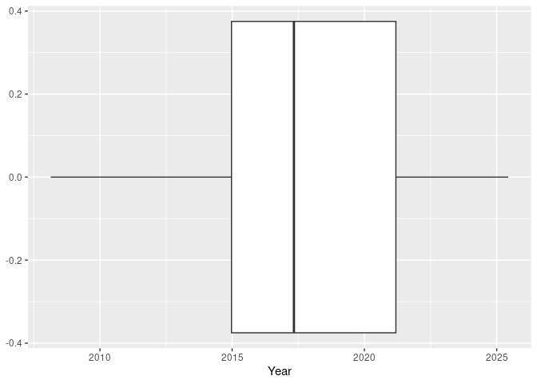<!-- -->

## Process Data

The data set contained many fields that were not relevant for my
analysis.

``` r
colnames(df)
```

    ##  [1] "status"                     "city"                      
    ##  [3] "state"                      "country"                   
    ##  [5] "classification"             "openfda"                   
    ##  [7] "product_type"               "event_id"                  
    ##  [9] "recalling_firm"             "address_1"                 
    ## [11] "address_2"                  "postal_code"               
    ## [13] "voluntary_mandated"         "initial_firm_notification" 
    ## [15] "distribution_pattern"       "recall_number"             
    ## [17] "product_description"        "product_quantity"          
    ## [19] "reason_for_recall"          "recall_initiation_date"    
    ## [21] "center_classification_date" "report_date"               
    ## [23] "code_info"                  "more_code_info"            
    ## [25] "termination_date"

The data set also contained a small proportion of recalls from countries
other than the United States. For this analysis I was only interested in
recalls originating within the United States.

``` r
df %>% count(country) %>% arrange(desc(n))
```

    ## # A tibble: 32 × 2
    ##    country                     n
    ##    <chr>                   <int>
    ##  1 United States           27166
    ##  2 Canada                    180
    ##  3 Israel                     86
    ##  4 France                     13
    ##  5 Taiwan                     13
    ##  6 Mexico                     11
    ##  7 India                      10
    ##  8 Chile                       8
    ##  9 Korea (the Republic of)     8
    ## 10 Spain                       6
    ## # ℹ 22 more rows

First I used the `ymd()` function to parse the dates into a usable
format. I filtered the date range to only include the years *2020-2024*.
I also filtered the country to show only the records generated within
the *United States*. I selected the fields that I was interested in, and
finally arranged the results by the *recall_initiation_date* field.

``` r
df <- df %>% mutate(recall_initiation_date = ymd(recall_initiation_date)) %>% 
  filter(year(recall_initiation_date) %in% c(2020:2024), 
         country == "United States") %>% 
  select(recall_number, recall_initiation_date, state, classification, 
         voluntary_mandated, recalling_firm, product_description, 
         reason_for_recall) %>% 
  arrange(recall_initiation_date)
```

### Add season field

I was interested in grouping and analyzing the data by season so I
created a new field using the `case_when()` function.

``` r
df <- df %>% mutate(season = case_when(
  month(recall_initiation_date) %in% c(3, 4, 5) ~ "Spring",
  month(recall_initiation_date) %in% c(6, 7, 8) ~ "Summer",
  month(recall_initiation_date) %in% c(9, 10, 11) ~ "Autumn",
  month(recall_initiation_date) %in% c(12, 1, 2) ~ "Winter")) %>% 
  relocate(season, .after = recall_initiation_date)
```

### Add region field

Instead of displaying an overcrowded graphic with data from all of the
individual states, I figured aggregating the data by region would be a
less cluttered way of plotting geographic trends.

``` r
df <- df %>% mutate(region = case_when(
  state %in% c("CT", "ME", "MA", "NH", "RI", "VT") ~ "New England",
  state %in% c("NJ", "NY", "PA") ~ "Mid-Atlantic",
  state %in% c("IL", "IN", "MI", "OH", "WI") ~ "East North Central",
  state %in% c("IA", "KS", "MN", "MO", "NE", "ND", "SD") ~ "West North Central",
  state %in% c("DE", "DC", "FL", "GA", "MD", "NC", "SC", "VA", "WV") ~ "South Atlantic",
  state %in% c("AL", "KY", "MS", "TN") ~ "East South Central",
  state %in% c("AR", "LA", "OK", "TX") ~ "West South Central",
  state %in% c("AZ", "CO", "ID", "MT", "NV", "NM", "UT", "WY") ~ "Mountain",
  state %in% c("AK", "CA", "HI", "OR", "WA") ~ "Pacific",
  .default = NA
)) %>% relocate(region, .before = state)
```

When I checked the results for NA values, I noticed that there were a
few recalls from Puerto Rico.

``` r
df %>% select(state, region) %>% filter(is.na(region))
```

    ## # A tibble: 22 × 2
    ##    state region
    ##    <chr> <chr> 
    ##  1 PR    <NA>  
    ##  2 PR    <NA>  
    ##  3 PR    <NA>  
    ##  4 PR    <NA>  
    ##  5 PR    <NA>  
    ##  6 PR    <NA>  
    ##  7 PR    <NA>  
    ##  8 PR    <NA>  
    ##  9 PR    <NA>  
    ## 10 PR    <NA>  
    ## # ℹ 12 more rows

Since I was just interested in the states, and not territories, of the
United States for this analysis, I filtered those results out.

``` r
df <- df %>% filter(!state == "PR")
```

### Add month and year columns

To make it easier to aggregate data by years and months, I created
separate fields using the `recall_initiation_date` field.

``` r
df <- df %>% mutate(recall_initiation_year = year(recall_initiation_date),
              recall_initiation_month = month(recall_initiation_date, label = TRUE)) %>% 
  relocate(recall_initiation_year:recall_initiation_month, .before = recall_initiation_date)
```

### Categorize data

To better be able to analyze the data, I decided to categorize the
`product_description` and `reason_for_recall` fields. I was originally
hoping Gemini or ChatGPT would be able to do this efficiently, however I
ended up having to mostly do this manually. Generative AI was very
inefficient at categorizing the product descriptions, and I pretty much
had to do all of those from scratch. It was better at categorizing the
`reason_for_recall` field, accurately categorizing probably 75% of the
data. I still manually checked through everything though. It tended to
miss undeclared allergens often.

Since I needed to join the categorized data with the existing data, I
needed something to function similarly to a primary key. The
`recall_number` field was unique for every record so I used that field.

``` r
df %>% select(recall_number) %>% count(recall_number) %>% filter(n > 1)
```

    ## # A tibble: 0 × 2
    ## # ℹ 2 variables: recall_number <chr>, n <int>

#### Categorize product_description into categories

I exported the `recall_number` and `product_description` fields into a
csv document that I imported into Google Sheets to manually categorize.
I set up data validation drop down lists for the different categories to
aid in categorizing the data.

``` r
write_csv(df %>% select(recall_number, product_description), 
          "/home/user/Desktop/product_description.csv")
```

After I categorized everything in Google Sheets, I removed the
`product_description` field from the categorized data and joined it with
the original data. I joined the two tables by the unique field that they
both had in common, the `recall_number` field.

``` r
df2 <- read_csv("/home/user/Desktop/product_description_categorized.csv")

df <- df %>% inner_join(df2, by = join_by(recall_number)) %>% 
  relocate(product_category, .after = product_description)
```

The products were categorized into the following categories. Many of the
products could have been categorized into multiple categories. I tended
to categorize the items based on the main component they consisted of.
For instance, within the *Prepared & Convenience Foods* category, if the
product description contained a particular protein such as Chicken, then
I categorized the product into the *Chicken & Poultry* category. I tried
to avoid placing items in the *Other* category as much as possible.
Regardless, since this data was manually categorized by me the analysis
will contain a certain amount of bias.

``` r
df %>% count(product_category) %>% print(n = nrow(df))
```

    ## # A tibble: 23 × 2
    ##    product_category                 n
    ##    <chr>                        <int>
    ##  1 Beans & Legumes                 40
    ##  2 Beef                            31
    ##  3 Beverages                      293
    ##  4 Chicken & Poultry              285
    ##  5 Dairy                          408
    ##  6 Dairy Alternatives               1
    ##  7 Eggs & Breakfast Foods          81
    ##  8 Fruits                         326
    ##  9 Grains & Bakery                702
    ## 10 Herbs                           31
    ## 11 Meat Alternatives                5
    ## 12 Nuts                           142
    ## 13 Oils & Vinegar                  10
    ## 14 Other                           82
    ## 15 Pork                            75
    ## 16 Prepared & Convenience Foods   305
    ## 17 Sauces & Condiments            361
    ## 18 Seafood                        301
    ## 19 Snacks & Sweets               1790
    ## 20 Soups                           40
    ## 21 Spices & Seasonings            317
    ## 22 Supplements                    677
    ## 23 Vegetables                    1084

#### Categorize reason_for_recall into categories

I exported the `recall_number` and `reason_for_recall` fields into a csv
document. I used a Generative AI program, called Google Gemini, to
initially categorize the data. I then imported those results into Google
Sheets, to manually verify and clean up the results.

``` r
write_csv(df %>% select(recall_number, reason_for_recall), 
          "/home/user/Desktop/reason_for_recall.csv")
```

Google Gemini actually produced fairly accurate results when I used the
following prompt:

> Act as a data analyst. reason_for_recall.csv contains a
> reason_for_recall column with a description of why individual food
> products were recalled. Categorize the reason_for_recall column into a
> new column named reason_for_recall_category. Divide the contamination
> category into the following categories: Listeria Contamination, E.
> coli Contamination, Salmonella Contamination, Other Biological
> Contamination, Chemical Contamination, Physical Contamination.

I still manually checked the results. There were quite a few instances
where Undeclared Allergens were not properly categorized. Many of the
reasons for contamination were not properly categorized either. All in
all though, the results provided by Google Gemini were far more usable
than the results I obtained when trying to categorize the product
descriptions.

Once the data was categorized, I joined it with the original data, by
again joining the `recall_number` field in both tables.

``` r
df2 <- read.csv("/home/user/Desktop/reason_for_recall_categorized.csv")
df <- df %>% inner_join(df2, by = join_by(recall_number))
```

The `reason_for_recall` field was categorized into the following
categories.

``` r
df %>% count(reason_for_recall_category) %>% print(n = nrow(df))
```

    ## # A tibble: 10 × 2
    ##    reason_for_recall_category         n
    ##    <chr>                          <int>
    ##  1 Chemical Contamination           182
    ##  2 E. coli Contamination             60
    ##  3 Listeria Contamination          1745
    ##  4 Other                             82
    ##  5 Other Biological Contamination   360
    ##  6 Physical Contamination           755
    ##  7 Processing Issues                365
    ##  8 Regulatory Non-Compliance        301
    ##  9 Salmonella Contamination        1192
    ## 10 Undeclared Allergens            2345

## Analyze Data

### How many recalls are FDA mandated verses firm initiated?

When I first browsed this data set, I noticed that the majority of
recalls were initiated by the firms themselves. There were a small
number of recalls that were mandated by the FDA though.

``` r
df %>% count(voluntary_mandated)
```

    ## # A tibble: 4 × 2
    ##   voluntary_mandated              n
    ##   <chr>                       <int>
    ## 1 ""                              2
    ## 2 "FDA Mandated"                 69
    ## 3 "N/A"                           4
    ## 4 "Voluntary: Firm initiated"  7312

When I searched for the firms that had FDA Mandated recalls only two
showed up in the results.

``` r
df %>% select(recalling_firm, voluntary_mandated) %>% 
  filter(voluntary_mandated == "FDA Mandated") %>% 
  count(recalling_firm)
```

    ## # A tibble: 2 × 2
    ##   recalling_firm                  n
    ##   <chr>                       <int>
    ## 1 ABH Nature's Products, Inc.     1
    ## 2 Sundial Herbal Products        68

I was interested in why *Sundial Herbal Products* was forced to recall
products 68 times. It turned out their products had an injunction placed
upon them, for making false claims on their labels and selling
unapproved drugs.

``` r
pull(df %>% filter(recalling_firm == "Sundial Herbal Products", voluntary_mandated == "FDA Mandated") %>% 
  select(reason_for_recall) %>% 
  group_by(reason_for_recall) %>% 
  count(), reason_for_recall)
```

    ## [1] "Recall required by Order of Permanent Injunction. The products are misbranded and deemed unapproved drugs based on labeling claims."

I then checked whether *Sundial Herbal Products* has a history of
recalls, or if the mentioned recalls were all part of a single event. As
it turns out all of the recalls happened on June 30, 2020.

``` r
df %>% filter(recalling_firm == "Sundial Herbal Products", voluntary_mandated == "FDA Mandated") %>% 
  summarize(earliest_recall = min(recall_initiation_date), latest_recall = max(recall_initiation_date))
```

    ## # A tibble: 1 × 2
    ##   earliest_recall latest_recall
    ##   <date>          <date>       
    ## 1 2020-06-30      2020-06-30

### How many food recalls of each classification were made during 2020-2024?

The U.S. Food and Drug Administration has three different
classifications for the severity of food recalls. These range from Class
I to Class III in order of decreasing severity. The data set contains
mostly severe Class I and II recalls that can result in serious adverse
health consequences. Since most of the recalls are firm initiated it
makes sense that there wouldn’t be too many Class III recalls, which are
unlikely to cause adverse health consequences. It is still a bit
concerning to see so many Class I recalls.

``` r
df %>% ggplot() + geom_bar(mapping = aes(x = classification), fill = "#045a8d") + 
  theme_minimal() +
  labs(title = "Number Of Food Recalls By Classification Type", 
       subtitle = "(January 2020 - December 2024)",
       caption = "openFDA Food Enforcement Reports",
       x = "Recall Classification Type", 
       y = "Number Of Recalls") + 
  theme(plot.margin = unit(c(0.5, 0.5, 0.5, 0.5), "cm"))
```

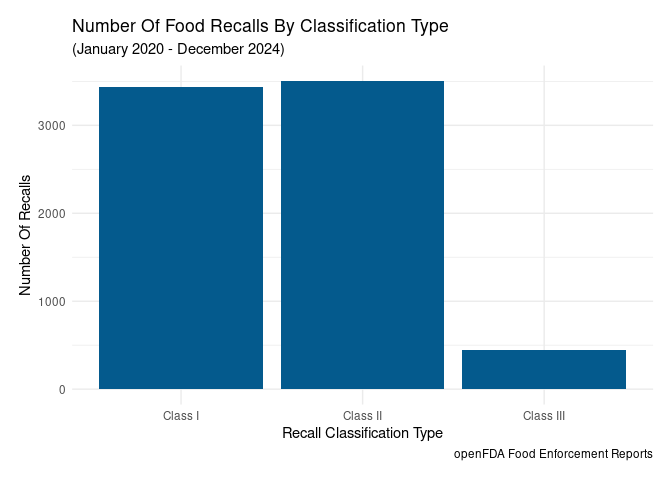<!-- -->

### How many food recalls occurred during 2020-2024?

Here are the food recalls broken down by year and recall category. The
data seems to show spikes in 2023 for many of the categories.

``` r
df %>% ggplot() + geom_bar(mapping = aes(x = recall_initiation_year), fill = "#045a8d") + 
  theme_light() +
  labs(title = "Number Of Food Recalls By Year", 
       subtitle = "(January 2020 - December 2024)",
       caption = "openFDA Food Enforcement Reports",
       x = "Year", 
       y = "Number Of Recalls") + 
  theme(plot.margin = unit(c(0.5, 0.5, 0.5, 0.5), "cm"),
        axis.text.x = element_text(angle = 90)) + 
  facet_wrap(~reason_for_recall_category)
```

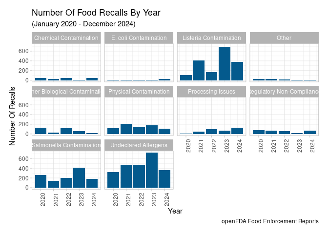<!-- -->

### Which states have the highest number of food recalls?

The geojson file that I used did not have a field with the abbreviated
state names. Since the data from openFDA abbreviated the state names I
added an abbreviation field to the geojson data.

``` r
my_sf <- read_sf("/home/user/Downloads/albers_composite_us_states.geojson")

df2 <- data.frame(abbreviation = c("AZ", "AR", "CA", "CO", "CT", "DC", "GA", "IL", 
                                   "IN", "LA", "MN", "MS", "MT", "NM", "ND", "OK", 
                                   "PA", "TN", "VA", "DE", "WV", "WI", "WY", "AL", 
                                   "FL", "ID", "KS", "MD", "NJ", "NC", "SC", "WA", 
                                   "VT", "UT", "IA", "KY", "ME", "MA", "MI", "MO", 
                                   "NE", "NV", "NH", "NY", "OH", "OR", "RI", "SD", 
                                   "TX", "AK", "HI"))

my_sf <- my_sf %>% cbind(df2) %>% relocate(abbreviation, .after = "NAME")
```

I created a new data frame that contained the total number of recalls
which occurred within each state. I then added that field to the geojson
file, so that I could vary the shading of the individual states
according to how many recalls occurred within them.

``` r
df2 <- df %>% group_by(state) %>% summarize(recalls = n())
my_sf2 <- my_sf %>% left_join(df2, by = join_by("abbreviation" == "state"))
```

I then plotted a map with the recall data. The darker blue the state is,
the more recalls occurred within that state. The results initially
surprised me, since I originally thought the recalls would originate
more in the rural areas, where agriculture is produced. Instead the
recalls for the most part appear to occur in the more populated states.
These are states where most of the companies’ headquarters are likely
located. California in particular had a surprising number of recalls
comparatively.

``` r
my_sf2 %>% ggplot() + geom_sf(mapping = aes(fill = recalls), color = "black", linewidth = 0.3) + 
  scale_color_gradient(
    low = "#f1eef6",
    high = "#045a8d",
    aesthetics = "fill"
  ) + 
  theme_void() + 
  labs(title = "Number Of Food Recalls By State", 
       subtitle = "(January 2020 - December 2024)", 
       caption = "openFDA Food Enforcement Reports", 
       fill = "Recalls") + 
  theme(plot.margin = unit(c(0.5, 0.5, 0.5, 0.5), "cm"))
```

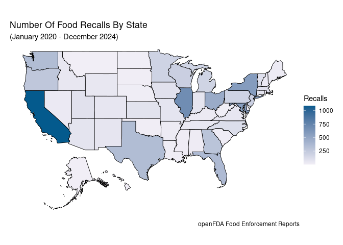<!-- -->

### Which regions have the highest number of food recalls?

Expanding on the previous map, I decided to group the states into
geographical regions. This time I displayed the data as the percentage
of total recalls that each region has. 45% of the recalls occurred in
two regions, while four regions accounted for 77% of the recalls.
California, being in the Pacific region, accounts for most of the
recalls within that region.

``` r
df2 <- df %>% group_by(region) %>% count() %>% ungroup() %>% 
  mutate(n_pct = (n/sum(n))*100, region = as.factor(region)) %>% 
  mutate(region = fct_reorder(region, n_pct))
  
df2 %>% ggplot() + geom_col(mapping = aes(x = n_pct, y = region, fill = region), 
                            show.legend = FALSE) + 
  geom_text(mapping = aes(x = n_pct + 0.8, y = region, 
                          label = paste0(round(n_pct, 0), "%"))) + 
  theme_minimal() + 
  labs(title = "Percentage Of Food Recalls By Region", 
       subtitle = "(January 2020 - December 2024)", 
       caption = "openFDA Food Enforcement Reports") + 
  theme(plot.margin = unit(c(0.5, 0.5, 0.5, 0.5), "cm"),
        panel.grid = element_blank(),
        axis.title.x = element_blank(),
        axis.text.x = element_blank(), 
        axis.title.y = element_blank())
```

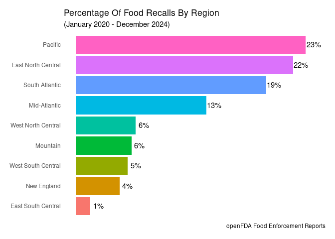<!-- -->

To see which states are part of which region, I went ahead and plotted a
map of the United States, with the regions in the same colors as the
above bar chart. I had to add the regions to the geojson file. To get
the colors to display the same as the above bar chart I had to convert
the `region` field to a factor, and order the levels by the percentages,
like I did with the previous chart.

``` r
my_sf2 <- my_sf %>% mutate(region = case_when(
  abbreviation %in% c("CT", "ME", "MA", "NH", "RI", "VT") ~ "New England",
  abbreviation %in% c("NJ", "NY", "PA") ~ "Mid-Atlantic",
  abbreviation %in% c("IL", "IN", "MI", "OH", "WI") ~ "East North Central",
  abbreviation %in% c("IA", "KS", "MN", "MO", "NE", "ND", "SD") ~ "West North Central",
  abbreviation %in% c("DE", "DC", "FL", "GA", "MD", "NC", "SC", "VA", "WV") ~ "South Atlantic",
  abbreviation %in% c("AL", "KY", "MS", "TN") ~ "East South Central",
  abbreviation %in% c("AR", "LA", "OK", "TX") ~ "West South Central",
  abbreviation %in% c("AZ", "CO", "ID", "MT", "NV", "NM", "UT", "WY") ~ "Mountain",
  abbreviation %in% c("AK", "CA", "HI", "OR", "WA") ~ "Pacific",
  .default = NA
)) %>% relocate(region, .before = abbreviation) %>% mutate(region = as.factor(region))

df3 <- df2 %>% select(region, n_pct)

my_sf2 <- my_sf2 %>% left_join(df3, by = "region") %>% mutate(region = fct_reorder(region, n_pct))

my_sf2 %>% ggplot() + geom_sf(mapping = aes(fill = region), color = "black", linewidth = 0.3) + 
  theme_void() + 
  labs(title = "United States Regions", 
       fill = "Region") + 
  theme(plot.margin = unit(c(0.5, 0.5, 0.5, 0.5), "cm"))
```

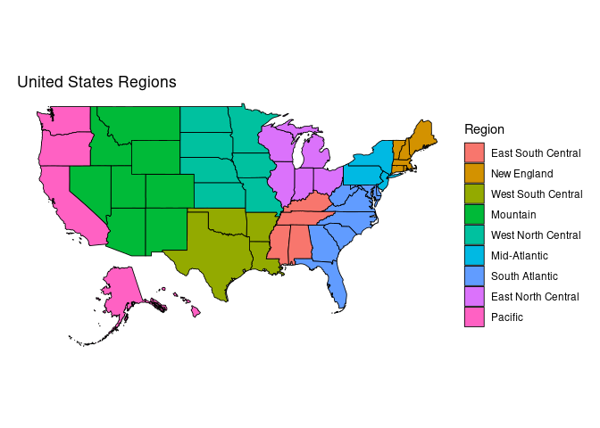<!-- -->

### Are certain states associated with certain types of food recalls?

I wanted to see if Salmonella and Listeria contamination occurs in
different states. California is still prominent in both of these
results. It is interesting though that Illinois tops the list for
Salmonella recalls, while Maryland tops the list for Listeria recalls.
Maryland is not present in the top 10 list for Salmonella, while
Illinois is in both lists. Texas, being a large state like California, I
would expect to be in the top 10 for both types of recalls, however they
were only in the Salmonella list. The following states were in both
lists: California, Illinois, New York, and Ohio. The following states
were only in one list: Connecticut, Florida, Kansas, Maryland, Michigan,
Minnesota, North Carolina, Pennsylvania, Texas, Vermont, Washington, and
Wisconsin.

``` r
(df %>% filter(reason_for_recall_category == "Salmonella Contamination") %>% 
  group_by(state) %>% count() %>% arrange(desc(n)))[c(1:10), ]
```

    ## # A tibble: 10 × 2
    ## # Groups:   state [10]
    ##    state     n
    ##    <chr> <int>
    ##  1 IL      341
    ##  2 CA      179
    ##  3 WA       76
    ##  4 PA       73
    ##  5 OH       71
    ##  6 NY       61
    ##  7 TX       61
    ##  8 KS       41
    ##  9 WI       41
    ## 10 MN       30

``` r
(df %>% filter(reason_for_recall_category == "Listeria Contamination") %>% 
  group_by(state) %>% count() %>% arrange(desc(n)))[c(1:10), ]
```

    ## # A tibble: 10 × 2
    ## # Groups:   state [10]
    ##    state     n
    ##    <chr> <int>
    ##  1 MD      492
    ##  2 CA      220
    ##  3 NY      200
    ##  4 OH      168
    ##  5 IL      166
    ##  6 VT       74
    ##  7 MI       60
    ##  8 NC       36
    ##  9 CT       35
    ## 10 FL       35

### Which products are recalled most frequently?

It surprised me that *Snacks & Sweets* topped the list of recalls by
quite a large margin.

``` r
df %>% count(product_category) %>% mutate(product_category = as.factor(product_category)) %>% 
  ggplot() + geom_col(mapping = aes(x = n, y = fct_reorder(product_category,n)), fill = "#045a8d") + 
  theme_minimal() +
  labs(title = "Mostly Frequently Recalled Product Categories", 
       subtitle = "(January 2020 - December 2024)",
       caption = "openFDA Food Enforcement Reports",
       x = "Number Of Recalls", 
       y = "Product Category") + 
  theme(plot.margin = unit(c(0.5, 0.5, 0.5, 0.5), "cm"))
```

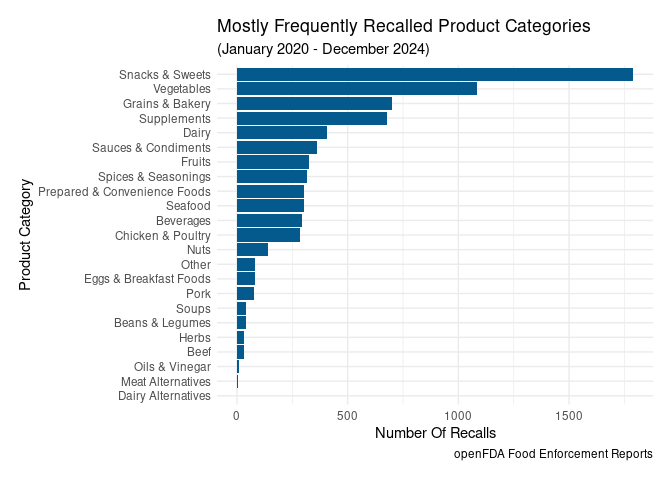<!-- -->

### Which companies recall products the most often?

Since companies usually recall multiple products at the same time,
counting the total number of recalls wouldn’t really provide an accurate
metric for measuring how often a firm has to recall their products. To
develop a better metric, I first grouped the data by a combined year and
month field. If you observe the data below *4 Earth Farms formerly Mcl
Fresh Inc* appears on two rows, since they had recalls in February of
2023 as well as November of 2024. I am not interested in how many
products they recalled in those two months, just the number of months in
which they had recalls.

``` r
df1 <- df %>% unite("year_month", c(recall_initiation_year, recall_initiation_month), sep = " ") %>% 
  group_by(recalling_firm, year_month) %>% count(recalling_firm)
df1
```

    ## # A tibble: 2,131 × 3
    ## # Groups:   recalling_firm, year_month [2,131]
    ##    recalling_firm                                 year_month     n
    ##    <chr>                                          <chr>      <int>
    ##  1 20-100 Delicious Seasoning LLC                 2023 Mar       1
    ##  2 4 Earth Farms formerly Mcl Fresh Inc           2023 Feb       1
    ##  3 4 Earth Farms formerly Mcl Fresh Inc           2024 Nov       9
    ##  4 4 J's Treats, LLC dba Bruttles Gourmet Candies 2023 Feb       1
    ##  5 5000 Years Foods, Inc.                         2021 Jul      10
    ##  6 6174 Industries, LLC                           2022 May       1
    ##  7 8TH AVE PHARMACY                               2024 Jan       1
    ##  8 A & C Best Food Trading                        2022 Mar       3
    ##  9 A & E Corrales LLC                             2022 Feb       1
    ## 10 A C Calderoni & Co. Inc.                       2022 Nov       1
    ## # ℹ 2,121 more rows

I then counted the number of times a firm’s name appeared in the
results, since each time the firm’s name appears indicates a different
month their products were recalled. This gave me a rough idea of firms
that repeatedly have their products recalled. I then sorted those
results in descending order. I selected only the top 20 results, so that
the chart wouldn’t be too cluttered.

``` r
df1 <- df1 %>% group_by(recalling_firm) %>% count(recalling_firm) %>% arrange(desc(n))
df1 <- df1[c(1:20), ]
df1
```

    ## # A tibble: 20 × 2
    ## # Groups:   recalling_firm [20]
    ##    recalling_firm                                   n
    ##    <chr>                                        <int>
    ##  1 Dole Fresh Vegetables Inc                       14
    ##  2 Wegmans Food Markets, Inc.                      11
    ##  3 Whole Foods Market                              10
    ##  4 Albertsons Companies LLC                         9
    ##  5 Lidl US TRADING                                  9
    ##  6 Reser's Fine Foods, Inc.                         9
    ##  7 The Kroger Co                                    9
    ##  8 Frito-Lay, Inc. Headquarters                     8
    ##  9 Power Selles Imports dba Culinary Collective     8
    ## 10 Lipari Foods Operating Company, LLC.             7
    ## 11 Pepsico Inc                                      7
    ## 12 Treehouse Foods                                  7
    ## 13 Abbott Laboratories                              6
    ## 14 B&G Foods North America, Inc                     6
    ## 15 Driscoll's Inc.                                  6
    ## 16 Fresh Express Incorpated                         6
    ## 17 Wismettac Asian Foods, Inc.                      6
    ## 18 Amys Kitchen Inc                                 5
    ## 19 DAISO CALIFORNIA WAREHOUSE                       5
    ## 20 DANONE US LLC                                    5

I then plotted this data to make it easier to interpret. These are
likely all large firms, so the scale of their operations likely means
they are going to have to recall products more often. It is difficult to
determine whether any purchasing decisions should be made based on the
results of this data.

``` r
df1 %>% ggplot() + geom_col(mapping = aes(x = n, y = fct_reorder(recalling_firm, n)), fill = "#045a8d") + 
  theme_minimal() +
  labs(title = "Firms That Recall Products The Most Frequently", 
       subtitle = "(January 2020 - December 2024)",
       caption = "openFDA Food Enforcement Reports",
       x = "Number Of Different Months With Recalls", 
       y = "") + 
  theme(plot.margin = unit(c(0.5, 0.5, 0.5, 0.5), "cm"))
```

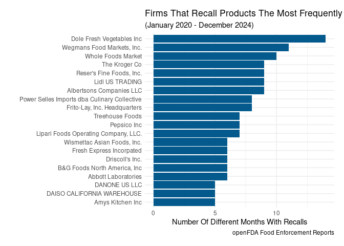<!-- -->

## Analyzing Listeria And Salmonella Recalls

### How many Listeria and Salmonella recalls occured each month?

The following chart displays Listeria and Salmonella recalls by month.
There appears to have been a rather large listeria outbreak in February
of 2023, and another smaller outbreak in December of 2021. In 2022-2024
the Salmonella outbreaks appear to be regularly occurring in May.

``` r
df %>% filter(reason_for_recall_category == "Listeria Contamination" | 
                reason_for_recall_category == "Salmonella Contamination") %>% 
  ggplot() + geom_bar(mapping = aes(x = recall_initiation_month), fill = "#045a8d" ) + 
  facet_grid(reason_for_recall_category~recall_initiation_year) + 
  theme_light() + 
  labs(title = "Number Of Food Recalls By Month", 
       subtitle = "(January 2020 - December 2024)",
       caption = "openFDA Food Enforcement Reports",
       x = "Month", 
       y = "Number Of Recalls") + 
  theme(axis.text.x = element_text(angle = 90), 
        plot.margin = unit(c(0.5, 0.5, 0.5, 0.5), "cm"))
```

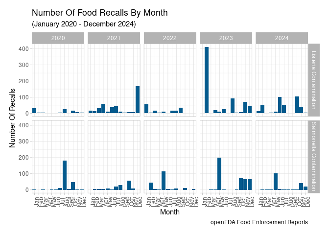<!-- -->

### What product categories were recalled for Salmonella during 2022-2024?

I was interested in exploring the trend found regarding the spike of
Salmonella recalls in the years 2022-2024. I decided to examine what
product categories are contributing to those recalls. Oddly *Spices &
Seasonings* topped the list followed by the more predictable categories.

``` r
df %>% filter(recall_initiation_year %in% c(2022, 2023, 2024) & 
                reason_for_recall_category == "Salmonella Contamination") %>% 
  count(product_category) %>% mutate(product_category = as.factor(product_category)) %>% 
  ggplot() + geom_col(mapping = aes(x = n, y = fct_reorder(product_category, n)), fill = "#045a8d") + 
  theme_minimal() + 
  labs(title = "Product Categories Recalled For Salmonella", 
       subtitle = "(January 2022 - December 2024)",
       caption = "openFDA Food Enforcement Reports",
       x = "Count", 
       y = "Product Category") + 
  theme(plot.margin = unit(c(0.5, 0.5, 0.5, 0.5), "cm"))
```

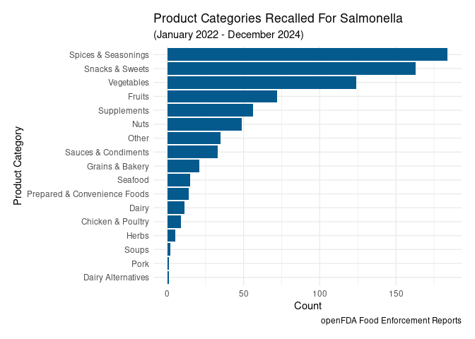<!-- -->

### Function to convert a string to a data frame of words

As of this analysis, I did not possess knowledge in Natural Language
Processing, so I could only do a basic analysis of the product
descriptions. Basically I took all of the rows that matched a set of
filters and converted them into a single string. I then created a data
frame consisting of all of the individual words from that string, as
well as a field containing the number of occurrences of each word. I
then sorted the words by the number of occurrences, and manually removed
irrelevant words.

The following `str_to_df()` function that I created adds all of the
individual words in a string to a vector, converts that vector to a data
frame, and returns the data frame.

``` r
str_to_df <- function(s1) {
  v <- ""
  str_start <- 1
  
  for (i in str_start:nchar(s1)) {
    if(substr(s1, i, i) == " ") {
      v <- append(v, trimws(substr(s1,str_start, i)))
      str_start <- i + 1
    }
    if(i == nchar(s1)) {
      v <- append(v, trimws(substr(s1,str_start, i)))
    }
  }
  
  v <- v[-1]  
  
  df1 <- data.frame(word = v) %>% filter(!word == "") %>% 
    mutate(word = str_to_title(word))
  
  return(df1)
}
```

### What Spices & Seasonings contributed to the Salmonella recalls during 2022-2024?

I filtered the results to just include the years 2022-2024, the reason
for recall being *Salmonella Contamination*, and the product category
being *Spices & Seasonings*. I collapsed those results into a single
string, consisting of all of the rows of product descriptions. I then
used the `str_to_df()` function that I created earlier to convert that
string into a data frame consisting of all of the words. I counted the
occurrences of each word, sorted the data in descending order by the
occurrences, and filtered out some irrelevant words. For simplicity I
only plotted the top 10 most occurring words in the word cloud. In the
word cloud, larger words and darker colors indicate a higher frequency
of that word in the data.

It seems breader mixes were one of the main contributors to Salmonella
recalls during 2022-2024.

``` r
s1 <- paste(pull(df %>% filter(recall_initiation_year %in% c(2022, 2023, 2024) & 
                reason_for_recall_category == "Salmonella Contamination" &
                product_category == "Spices & Seasonings"), product_description), 
            collapse = " ") %>% str_replace_all("[^[:alnum:]]", " ")

df1 <- str_to_df(s1) %>% count(word) %>% arrange(desc(n)) %>% 
  filter(!word %in% c("00", "Bag", "50", "X1", "X2", "Box", "Case", "X3", "30", 
                      "For", "25", "Savory", "Foods")) %>% 
  top_n(10, n)

wordcloud(df1$word, df1$n, 
          scale = c(4, 1), 
          colors = colorRampPalette(c("#03045e", "#0077b6", "#00b4d8"))(10),
          ordered.colors = TRUE)
```

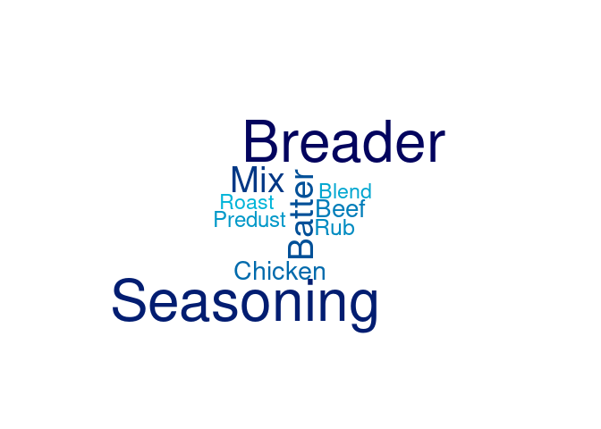<!-- -->

### What Snacks & Sweets contributed to the Salmonella recalls during 2022-2024?

Similarly, I decided to explore some of the Snacks & Sweets that
contributed to the Salmonella recalls in 2022-2024.

It seems Quaker had to recall a lot of products during this time period.
Chocolate, Fudge, Peanut, and likely Peanut Butter products appeared to
have been recalled at a high frequency during this time period.

``` r
s1 <- paste(pull(df %>% filter(recall_initiation_year %in% c(2022, 2023, 2024) & 
                                 reason_for_recall_category == "Salmonella Contamination" &
                                 product_category == "Snacks & Sweets"), product_description), 
            collapse = " ") %>% str_replace_all("[^[:alnum:]]", " ")

df1 <- str_to_df(s1) %>% count(word) %>% arrange(desc(n)) %>%
  filter(!word %in% c("Oz", "In", "Net", "Wt", "And", "1", "Upc", "6", "Plastic", 
                      "Packaged", "Case", "8", "Are", "Boxes", "7", "Count", "2", 
                      "Individually", "Wrapped", "Paperboard", "Item", "The", 
                      "12", "16", "5", "0", "With", "3", "Bult", "Product", "S", 
                      "Variety", "Pack", "4", "14", "Cup", "77232", "8oz", "Then", 
                      "15", "84", "Not", "At", "For", "Snack", "8ct", "Of", "Per", 
                      "48", "Clear", "Bulk", "Ge", "Lid", "1ct", "Available")) %>% 
  top_n(17,n)

wordcloud(df1$word, df1$n, 
          scale = c(4, 1), 
          colors = colorRampPalette(c("#03045e", "#0077b6", "#00b4d8"))(19),
          ordered.colors = TRUE)
```

<!-- -->

### What Vegetables contributed to the Salmonella recalls during 2022-2024?

Finally, I examined the types of vegetables that contributed to the
Salmonella recalls during 2022-2024. Topping this list were Onions, in
particular diced ones it seems, followed by cucumbers. I categorized
cucumbers as vegetables even though they could probably have been
classified as a fruit as well.

``` r
s1 <- paste(pull(df %>% filter(recall_initiation_year %in% c(2022, 2023, 2024) & 
                                 reason_for_recall_category == "Salmonella Contamination" &
                                 product_category == "Vegetables"), product_description), 
            collapse = " ") %>% str_replace_all("[^[:alnum:]]", " ")

df1 <- str_to_df(s1) %>% count(word) %>% arrange(desc(n)) %>% 
  filter(!word %in% c("1", "5", "Fresh", "Lb", "4", "W", "Ctn", "2", "Oz", "8", 
                      "Zipper", "Zip", "3", "Item", "With",  "In", "The", "Ylw", 
                      "Case",  "Select", "Upc", "Net", "On", "Wt", "Farms", 
                      "Product", "11", "Skin", "6", "9", "And", "Bix", "Cross", 
                      "Packaged", "Valley", "A", "Plastic", "To", "Tray", "Of", 
                      "Per", "S", "Slicer", "Ct", "Distributed", "Mexico", 
                      "Ready", "Refrigerated", "Vegetable", "Box", "Frsh", 
                      "Keep", "Peak", "Serve", "Set", "Super", "16", "5lb", 
                      "Individual", "Small", "24", "Bu", "Bulk", "By", "Large")) %>% 
  top_n(10, n)


wordcloud(df1$word, df1$n, 
          scale = c(4, 1), 
          colors = colorRampPalette(c("#03045e", "#0077b6", "#00b4d8"))(10),
          ordered.colors = TRUE)
```

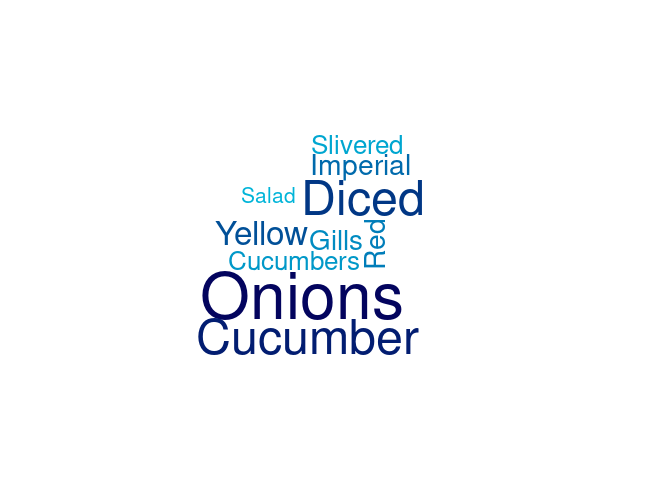<!-- -->

### What product categories contributed to the Listeria recalls in February of 2023?

Earlier I noticed a large number of Listeria recalls in February of
2023. I decided to explore that individual month to see what contributed
to those recalls.

``` r
df1 <- df %>% filter(recall_initiation_year == 2023, 
              recall_initiation_month == "Feb",
              reason_for_recall_category == "Listeria Contamination")
```

First I wanted to know if multiple firms recalled their products during
that month, or if it was just a few firms. As it turns out most of the
recalls originated from the *Fresh Ideation Food Group*.

``` r
df1 %>% count(recalling_firm)
```

    ## # A tibble: 3 × 2
    ##   recalling_firm                                                n
    ##   <chr>                                                     <int>
    ## 1 FRESH IDEATION FOOD GROUP, LLC dba Fresh Creative Cuisine   409
    ## 2 Jan Fruits, Inc.                                              1
    ## 3 Lidl US TRADING                                               1

Most of the products recalled during this month were *Chicken & Poultry*
and *Prepared & Convenience* Foods.

``` r
df1 %>% count(product_category) %>% mutate(product_category = as.factor(product_category)) %>% 
  ggplot() + geom_col(mapping = aes(x = n, y = fct_reorder(product_category, n)), fill = "#045a8d") + 
  theme_minimal() +
  labs(title = "Listeria Contamination Product Categories", 
       subtitle = "(February 2023)",
       caption = "openFDA Food Enforcement Reports",
       x = "Number Of Recalls", 
       y = "Product Category") + 
  theme(plot.margin = unit(c(0.5, 0.5, 0.5, 0.5), "cm"))
```

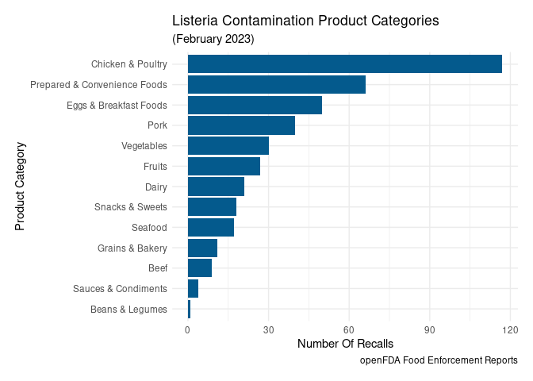<!-- -->

### What Chicken & Poultry products were recalled in February of 2023?

To get a better idea of what *Chicken & Poultry* products were recalled,
I created a word cloud consisting of words from the product descriptions
of these products. I removed the following irrelevant words from the
data frame.

``` r
df1 <- df1 %>% filter(product_category == "Chicken & Poultry")

s1 <- paste(pull(df1, product_description), collapse = " ") %>% 
  str_replace_all("[^[:alnum:]]", " ")

df1 <- str_to_df(s1) %>% count(word) %>% arrange(desc(n))

category_remove <- df1[c(1:8,11,15:20,22:24,28,30,41,45,47,49,51,54:55,58,
                         61:62,64,72:73,77), 1]
category_remove
```

    ##  [1] "Keep"         "Refrigerated" "Serving"      "Single"       "Net"         
    ##  [6] "Oz"           "Wt"           "Fresh"        "5"            "6"           
    ## [11] "Label"        "7"            "White"        "Go"           "Quick"       
    ## [16] "To"           "9"            "8"            "Orchard"      "3"           
    ## [21] "Case"         "Of"           "Fe"           "Sante"        "4"           
    ## [26] "75"           "Black"        "Moonshine"    "Red"          "Roasted"     
    ## [31] "Super"        "Chunky"       "Marble"       "Tan"

It seems most of the products linked to the Listeria recalls during this
month were various sandwiches and salads containing Chicken & Poultry.
The *Prepared & Convenience* category likely contained similar products.
These products could have been categorized in that category, however
when categorizing the data I wanted to sub-divide that somewhat generic
category in order to gain additional insights.

``` r
df1 <- df1 %>% filter(!word %in% category_remove)

df1 <- df1[c(1:25), ]

wordcloud(df1$word, df1$n, 
          scale = c(4, 1), 
          colors = colorRampPalette(c("#03045e", "#0077b6", "#00b4d8"))(25),
          ordered.colors = TRUE)
```

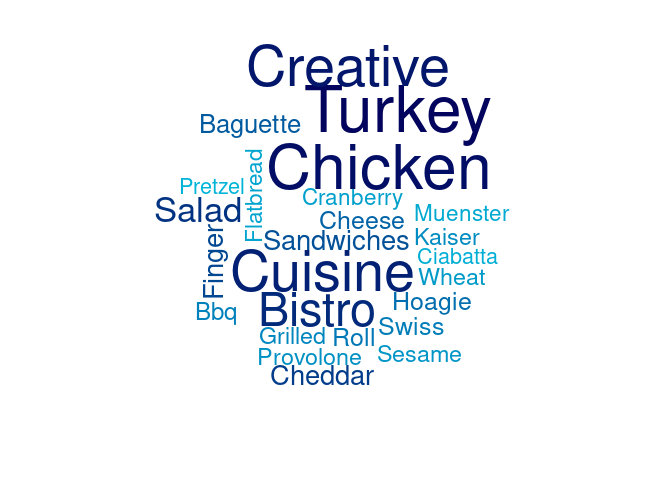<!-- -->

### What product categories contributed to the Listeria recalls in 2023?

After gaining an understanding of what caused the Listeria recalls in
February of 2023, I decided to examine the year as a whole to see if
those recalls affected the overall numbers for the year. When viewing
the data for the whole year it appeared that the leading cause of
recalls was *Snacks & Sweets*, instead of *Chicken & Poultry* products
like in February. The *Chicken & Poultry* recalls that occurred in
February appear to be mostly limited to that single firm, and not an
indication of a wider-spread listeria outbreak in that product category.

``` r
df1 <- df %>% filter(recall_initiation_year == 2023, 
                     reason_for_recall_category == "Listeria Contamination") 

df1 %>% count(product_category) %>% 
  mutate(product_category = as.factor(product_category)) %>% 
  ggplot() + geom_col(mapping = aes(x = n, y = fct_reorder(product_category, n)), fill = "#045a8d") + 
  theme_minimal() +
  labs(title = "Listeria Contamination Product Categories", 
       subtitle = "(January 2023 - December 2023)",
       caption = "openFDA Food Enforcement Reports",
       x = "Number Of Recalls", 
       y = "Product Category") + 
  theme(plot.margin = unit(c(0.5, 0.5, 0.5, 0.5), "cm"))
```

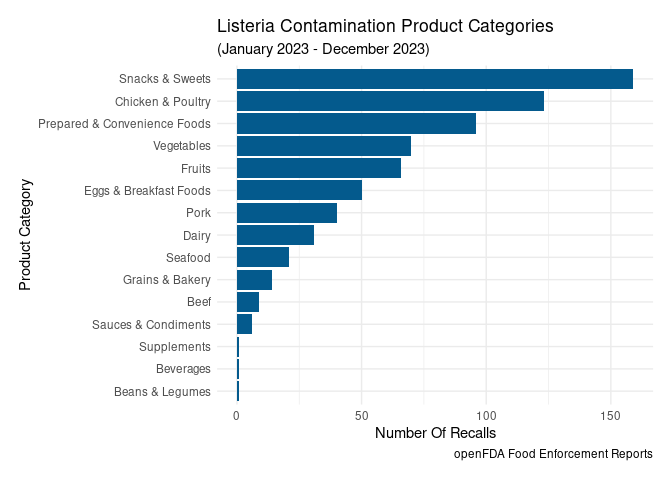<!-- -->

### What Snacks & Sweets contributed to the Listeria recalls in 2023?

To get a better understanding of what Snacks & Sweets contributed to the
Listeria recalls in 2023, I filtered the data by that product category,
created a data frame consisting of all of the words contained in the
product descriptions, and counted the occurrences of those words. I
removed the following irrelevant words from the resulting data frame.

``` r
df1 <- df1 %>% filter(product_category == "Snacks & Sweets")

s1 <- paste(pull(df1, product_description), collapse = " ") %>%
  str_replace_all("[^[:alnum:]]", " ")

df1 <- str_to_df(s1) %>% count(word) %>% arrange(desc(n))

category_remove <- df1[c(1:5,7:8,10:11,13:21,23,26,30:37,39:42,47:50,53:58,
                         61:67,69,71:74,76:77,82,84:90,92:95), 1]
category_remove
```

    ##  [1] "Upc"          "1"            "0"            "91404"        "Pack"        
    ##  [6] "Premium"      "Single"       "And"          "3"            "Quart"       
    ## [11] "Pint"         "6"            "In"           "Gallon"       "Oz"          
    ## [16] "5qt"          "Sizes"        "5"            "8"            "4"           
    ## [21] "Net"          "Wt"           "Keep"         "Refrigerated" "Serving"     
    ## [26] "Mini"         "7"            "9"            "Fresh"        "12"          
    ## [31] "Cup"          "Go"           "S"            "Super"        "10"          
    ## [36] "2"            "Creative"     "Cuisine"      "On"           "Qt"          
    ## [41] "Based"        "Brand"        "Cut"          "Delight"      "Dessert"     
    ## [46] "Fl"           "Flavor"       "N"            "Pre"          "Quick"       
    ## [51] "Slices"       "Soft"         "The"          "15162"        "Bistro"      
    ## [56] "Black"        "Pints"        "Serve"        "All"          "Cups"        
    ## [61] "Flavors"      "Food"         "Heart"        "Life"         "Round"       
    ## [66] "Service"      "Trio"         "15340"

After removing those words from the results, I created a word cloud
consisting of the top 29 most commonly occurring words. *Parve* products
seem to have topped the list. These appear to be products that do not
contain meat or dairy. Since these are desserts, it leads me to believe
that the dairy substitute that was being used in the products was prone
to Listeria contamination during this time frame. Another anomaly on
this list was the word *Wilcox*.

``` r
df1 <- df1 %>% filter(!word %in% category_remove)

df1 <- df1[c(1:29), ]

wordcloud(df1$word, df1$n,
          scale = c(4, 1), 
          colors = colorRampPalette(c("#03045e", "#0077b6", "#00b4d8"))(29),
          ordered.colors = TRUE
)
```

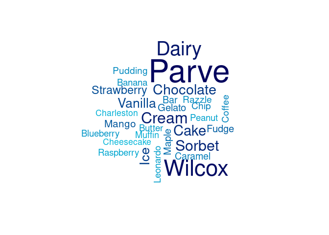<!-- -->

It seems *Wilcox* is a manufacturer that creates ice cream products.
They had to recall 53 of their products in 2023. This likely contributed
to the spike in Listeria recalls that occured in that year.

``` r
df %>% filter(str_detect(product_description, "Wilcox") == TRUE,
              recall_initiation_year == 2023) %>%
  select(recalling_firm, product_description)
```

    ## # A tibble: 53 × 2
    ##    recalling_firm   product_description                                         
    ##    <chr>            <chr>                                                       
    ##  1 WILCOX ICE CREAM Wilcox Premium Strawberry in 1.5QT, Quart, Pint, 3 Gallon, …
    ##  2 WILCOX ICE CREAM Wilcox Premium Peanut Butter Fudge Swirl in 1.5QT, Quart, P…
    ##  3 WILCOX ICE CREAM Wilcox Yogurt - Maple Cream;  Pint (UPC 04372600698)        
    ##  4 WILCOX ICE CREAM Wilcox Yogurt - Black Raspberry;  Pint (UPC 04372600695)    
    ##  5 WILCOX ICE CREAM Wilcox Premium Chocolate; 4 oz Cup; UPC 04372600402;  Wilco…
    ##  6 WILCOX ICE CREAM Wilcox SUPER PREMIUM Salted Caramel Brownie; 1.5 QT (UPC 04…
    ##  7 WILCOX ICE CREAM Wilcox Premium Sea Salt Caramel Turtle in 1.5QT, Quart, and…
    ##  8 WILCOX ICE CREAM Wilcox Premium Peppermint in 1.5QT, Quart, Pint, and 3 Gall…
    ##  9 WILCOX ICE CREAM Wilcox SUPER PREMIUM Super Java; 1.5 QT (UPC 04372601516) a…
    ## 10 WILCOX ICE CREAM Wilcox Premium Coffee; 4 oz Cup; UPC 04372600403;  Wilcox P…
    ## # ℹ 43 more rows

### What product categories contributed to the Listeria recalls in 2020-2024?

Finally, I decided to look at what product categories were recalled the
most often during the years 2020-2024. As it turns out *Vegetables*
topped this list, with *Snacks & Sweets* coming in second.

``` r
df1 <- df %>% filter(reason_for_recall_category == "Listeria Contamination") 

df1 %>% count(product_category) %>% mutate(product_category = as.factor(product_category)) %>% 
  ggplot() + geom_col(mapping = aes(x = n, y = fct_reorder(product_category, n)), fill = "#045a8d") + 
  theme_minimal() +
  labs(title = "Listeria Contamination Product Categories", 
       subtitle = "(January 2020 - December 2024)",
       caption = "openFDA Food Enforcement Reports",
       x = "Number Of Recalls", 
       y = "Product Category") + 
  theme(plot.margin = unit(c(0.5, 0.5, 0.5, 0.5), "cm"))
```

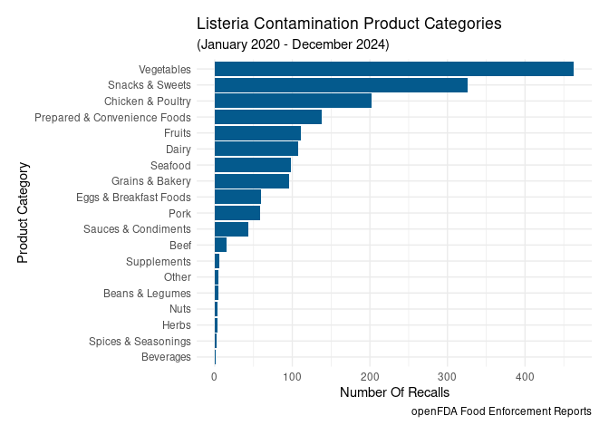<!-- -->

### What Vegetables contributed to the Listeria recalls in 2020-2024?

I filtered the product category to only show the Vegetables, converted
all of the matching records into a single string, converted that string
into a single data frame consisting of all of the individual words, and
counted the occurrences of each word. I removed the following irrelevant
words from the resulting data frame.

``` r
df1 <- df1 %>% filter(product_category == "Vegetables")

s1 <- paste(pull(df1, product_description), collapse = " ") %>% 
  str_replace_all("[^[:alnum:]]", " ")

df1 <- str_to_df(s1) %>% count(word) %>% arrange(desc(n))

category_remove <- df1[c(1:4,6:11,13:15,18:22,24,28:34,36:48,50:52,56:59,62,64:66,
                         70,72:73,75,77,80:82,84:100,102:104,107:108,110:111,
                         113:116, 118:120), 1]
category_remove
```

    ##  [1] "Upc"          "Product"      "Oz"           "In"           "Packed"      
    ##  [6] "Net"          "Packages"     "Plastic"      "Wt"           "And"         
    ## [11] "Case"         "5oz"          "Clamshell"    "8"            "Per"         
    ## [16] "5"            "12"           "By"           "0"            "S"           
    ## [21] "Bags"         "Sku"          "Bag"          "10"           "6"           
    ## [26] "Marketside"   "A"            "Of"           "Fresh"        "7"           
    ## [31] "Baby"         "Keep"         "Spring"       "9"            "2"           
    ## [36] "Refrigerated" "Container"    "1"            "Brand"        "12oz"        
    ## [41] "4"            "Distributed"  "With"         "50"           "10oz"        
    ## [46] "85316"        "8oz"          "16oz"         "Farm"         "71430"       
    ## [51] "Sweet"        "Serving"      "Blend"        "Single"       "3"           
    ## [56] "1lb"          "Ca"           "Clear"        "The"          "W"           
    ## [61] "11"           "16"           "Box"          "Bulk"         "Foods"       
    ## [66] "13"           "6oz"          "9oz"          "Bar"          "Farms"       
    ## [71] "Is"           "Little"       "On"           "Super"        "Food"        
    ## [76] "200g"         "Inc"          "Nature"       "Kitchen"      "Lb"          
    ## [81] "Customer"     "Dependent"    "To"           "11oz"         "3oz"         
    ## [86] "7oz"          "Cut"          "Frozen"       "G"

I noticed this quite frequently while I was categorizing the data.
Packaged salad mixes and kits are frequently recalled due to Listeria
contamination.

``` r
df1 <- df1 %>% filter(!word %in% category_remove)

df1 <- df1[c(1:33), ]

wordcloud(df1$word, df1$n, 
          scale = c(4, 1), 
          colors = colorRampPalette(c("#03045e", "#0077b6", "#00b4d8"))(33),
          ordered.colors = TRUE
          )
```

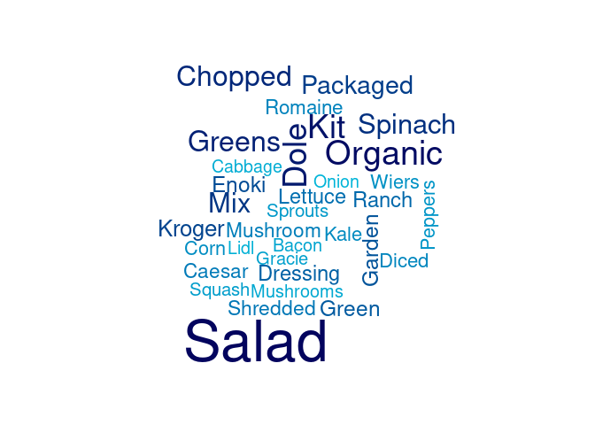<!-- -->

### Do Listeria or Salmonella recalls occur seasonally?

There is a slight trend in the years 2022-2024 for Salmonella recalls to
happen in the spring. The years 2021-2023 showed a slight trend of
Listeria recalls occurring in the Winter months. Observing more than
five years would likely be necessary to discover any clear seasonal
trends for the different recalls.

``` r
df %>% filter(reason_for_recall_category == "Listeria Contamination" | 
                reason_for_recall_category == "Salmonella Contamination") %>% 
  group_by(recall_initiation_year, season, reason_for_recall_category) %>% count() %>% 
  ggplot() + geom_col(mapping = aes(x = recall_initiation_year, y = n, fill = season), 
                      color = "white", position = "dodge") + 
  theme_light() +
  labs(title = "Listeria And Salmonella Food Recalls Per Season", 
       subtitle = "(January 2020 - December 2024)",
       caption = "openFDA Food Enforcement Reports",
       x = "Year", 
       y = "Number Of Recalls",
       fill = "Season") + 
  theme(plot.margin = unit(c(0.5, 0.5, 0.5, 0.5), "cm"),
        legend.position = "bottom") + facet_grid(reason_for_recall_category~.)
```

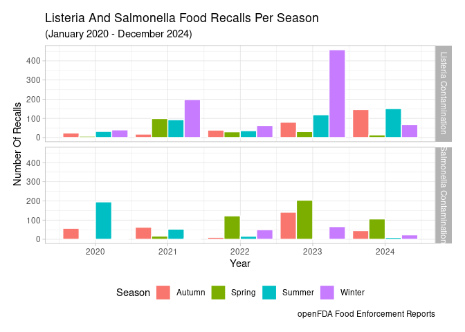<!-- -->

### What are the most common undeclared allergens?

I was curious the products that contained the most undeclared allergens.
This ended up being the *Snacks & Sweets* product category by quite a
large margin.

``` r
df %>% filter(reason_for_recall_category == "Undeclared Allergens") %>% 
  mutate(product_category = as.factor(product_category)) %>% 
  ggplot() + geom_bar(mapping = aes(y = fct_rev(fct_infreq(product_category))), fill = "#045a8d") + 
  theme_minimal() +
  labs(title = "Product Categories Recalled For Undeclared Allergens", 
       subtitle = "(January 2020 - December 2024)",
       caption = "openFDA Food Enforcement Reports",
       x = "Number Of Recalls", 
       y = "Product Category",
       fill = "Season") + 
  theme(plot.margin = unit(c(0.5, 0.5, 0.5, 0.5), "cm"))
```

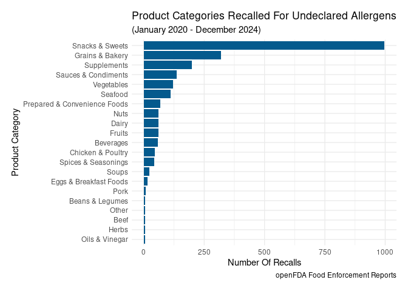<!-- -->

### What Snacks & Sweets were recalled for containing undeclared allergens?

I filtered the data to just include *Undeclared Allergens* in the
`reason_for_recall` field, and *Snacks & Sweets* in the
`product_category` field. From that filtered data I collapsed the
`reason_for_recall` records into a single string, converted that string
into a data frame consisting of all of the individual words, counted the
occurrences of each word, and sorted the results in descending order. I
removed the following irrelevant words from the resulting data frame.

``` r
s1 <- paste(pull(df %>% filter(reason_for_recall_category == "Undeclared Allergens" &
                                 product_category == "Snacks & Sweets"), reason_for_recall), 
            collapse = " ") %>% str_replace_all("[^[:alnum:]]", " ")

df1 <- str_to_df(s1) %>% count(word) %>% arrange(desc(n))


category_remove <- df1[c(1:2,4,6:12,14:15,18:19,21,24:25,28,30,31:35,37,39:41,
                         43:44,46:53,55:56), 1]
category_remove
```

    ##  [1] "Undeclared"  "The"         "And"         "Not"         "Of"         
    ##  [6] "Allergen"    "Contains"    "In"          "Allergens"   "Contain"    
    ## [11] "Product"     "Products"    "May"         "Statement"   "Label"      
    ## [16] "Is"          "5"           "Firm"        "On"          "Ingredients"
    ## [21] "Declare"     "Or"          "Does"        "But"         "Ingredient" 
    ## [26] "To"          "6"           "Declared"    "Declares"    "List"       
    ## [31] "That"        "Was"         "Following"   "40"          "A"          
    ## [36] "Inspection"  "C"           "Fd"          "Potentially" "Found"

After removing the irrelevant words from the data frame, I plotted the
top 17 most frequently occurring words as a word cloud.

Milk tops the list followed by Soy, Nuts, and Wheat. While I was
categorizing the reasons for recall, I noticed that a lot of products
claiming to be gluten-free actually contained gluten. Yellow dye was a
common undeclared item I noticed as well. The various nut allergies
people have probably explains why so many of the recalls were due to
various nuts being undeclared, or the result of cross contamination
during production. Lecithin appears to be a food additive that can
trigger allergic reactions in individuals with sensitivities or
allergies to soy.

``` r
df1 <- df1 %>% filter(!word %in% category_remove)

df1 <- df1[c(1:17), ]

wordcloud(df1$word, df1$n, 
          scale = c(4, 1), 
          colors = colorRampPalette(c("#03045e", "#0077b6", "#00b4d8"))(17),
          ordered.colors = TRUE
)
```

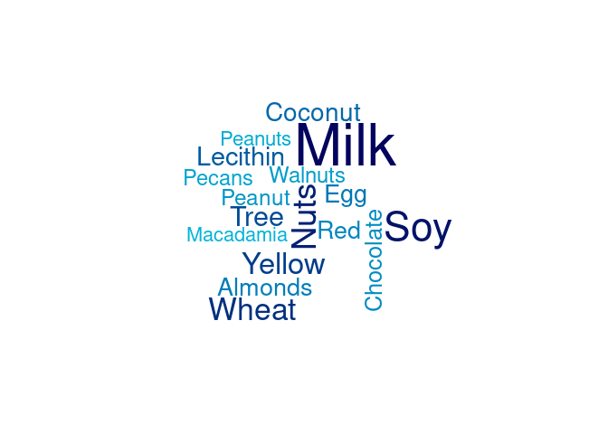<!-- -->

## Summary

The following were some of the key insights I gained from exploring this
data:

- The years 2021-2023 showed a slight trend for Listeria recalls to
  occur in the Winter months.
- There is a slight trend in the years 2022-2024 for Salmonella recalls
  to happen in the spring.
- Firms located in Illinois topped the list for Salmonella recalls.
- Firms located in Maryland topped the list for Listeria recalls.
- Snacks & Sweets are recalled most frequently

The following are some additional important insights I gained from
exploring this data:

- Spices & Seasonings contributed the most to the Salmonella recalls
  during 2022-2024
  - Breader Mixes contributed to many of the Salmonella recalls during
    this period.
  - Chocolate, Fudge, Peanuts, Onions, and Cucumbers also contributed to
    the Salmonella recalls during this period.
- Packaged salad mixes and kits are frequently recalled due to Listeria
  contamination.
- Firms located in California, Illinois, New York, and Ohio were in the
  top 10 lists for both Salmonella and Listeria recalls.
- Texas, being a large state like California, I would expect to be in
  the top 10 lists for both Salmonella and Listeria recalls, however
  they were only in the Salmonella top 10 list.
- Most of the Undeclared Allergens occur in the Snacks & Sweets
  category.
  - Milk, Soy, Nuts, and Wheat are some of the undeclared allergens that
    showed up the most often.

Some purchasing decisions customers might make based on these insights
could be:

- There were several companies that regularly experienced recalls. As a
  customer, perhaps avoid purchasing at risk products from these
  companies during the seasons when recalls happened in past years.
  - In the Winter months, avoid prepackaged salad mixes or kits from
    these companies.
  - During the Spring, avoid purchasing spices or seasonings, in
    particular breader mixes from these companies. Various snacks &
    sweets (that contain chocolate, fudge, or peanuts), or onions and
    cucumbers are also at risk products during this time.
- If you have serious food allergies be wary of the snacks & sweets food
  category. Milk, soy, nuts, and wheat seem to be undeclared often. If
  you have a gluten sensitivity, know that there are many products
  claiming to be gluten free that actually contain gluten.
  - Creating a list of firms who repeatedly fail to declare certain
    allergens may be advisable if you have a serious allergy.

## Further Analysis

Further more detailed analysis could be conducted to identify trends for
particular products. For instance:

- When is ice cream most likely to be recalled?
- What firms recall the most ice cream?
- What regions have the most ice cream recalls?  
- etc.

Analyzing data over a longer time frame would likely help forecast
recalls with more accuracy. Although there were clusters of years in
which Listeria or Salmonella recalls appeared to follow a seasonal
trend, as a whole there appeared to be too much variation between the
years to identify clear trends.
