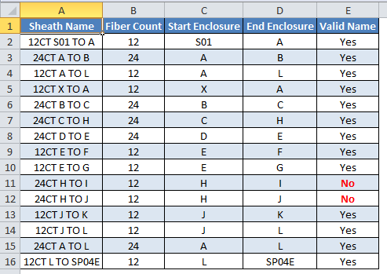
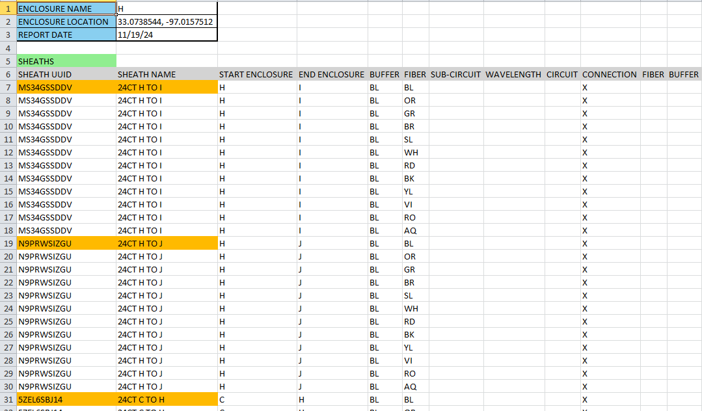
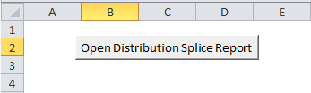

# Sheath Name Checker
## Overview of macro
A significant part of my time when I worked at Charter Communications was spent quality checking
other designers' projects.  Fiber-To-The-Home projects in particular required 
a lot of time to check due to their scale.  Many of these projects would consist of designing 
all of the plant for several hundred customers.  The splice enclosures and fiber sheaths had a
particular naming convention that we were supposed to follow.  Quality checking this manually
in the software was very time consuming since you would have to click on hundreds of sheaths to
verify their naming.  The count was supposed to match the fiber count of the sheath and the two
enclosures that the sheath connects two were supposed to be a part of the naming as well.


The following image is an example of the output that my macro created.  The distribution splice
report was one I manually created for testing and development purposes.  These were exported
from our Magellan software as an Excel worksheet.


If you look at rows 11 and 12 you can see that they do not have a valid name.  Both of these
are named as if they are 24-count sheaths, however the macro detected that they are 12-count sheaths.


Here is a simplified version of what a distribution splice report would typically look like.
These were exported from our software as Microsoft Excel documents.  Each splice enclosure would
be on a separate tab, and the sheaths connected to the splice enclosure, as well as the individual 
splices made in the splice enclosure, would be shown.


Using these documents, you could determine the start enclosure and end enclosure, as well as count
how many fibers are in each sheath.  **24CT H TO I** and **24CT H TO J** both have 12 fibers yet they
are misnamed as having 24 fibers.
<br>

This macro proved invaluable in my own designs, in eliminating naming errors, and vastly reduced
the time required to quality check large fiber designs.

## Code explanation
When the user opens my macro-enabled workbook they are presented with a simple button
to open a Distribution Splice Report.


Clicking this button executes the `Main` module from my macro.  The` Main()` procedure in this
module creates a new instance of the `SpliceReport` class module, validates that the 
distribution splice report is valid, and if so parses it.
 
```vb
Sub Main()
    Dim sp As New SpliceReport
    sp.OpenSpliceReport
    
    If Not sp.Validate Then
        Exit Sub 'End application if a valid distribution splice report was not selected
    End If
    
    sp.Parse 'This sub procedure will extract the data from the distribution splice report
    
End Sub
```

### Class Modules
#### Sheath class
Before exploring the `SpliceReport` class, I created another class named `Sheath`
to store information about the individual sheaths.  This class just consists of 
getter and setter procedures to store and retrieve various sheath parameters.
```vb
Private m_name As String
Private m_UUID As String
Private m_StartEnclosure As String
Private m_EndEnclosure As String
Private m_FiberCount As Long
Private m_ValidName As Boolean

Property Get Name() As String
    Name = m_name
End Property

Property Let Name(value As String)
    m_name = value
End Property

Property Get UUID() As String
    UUID = m_UUID
End Property

Property Let UUID(value As String)
    m_UUID = value
End Property

Property Get StartEnclosure() As String
    StartEnclosure = m_StartEnclosure
End Property

Property Let StartEnclosure(value As String)
    m_StartEnclosure = value
End Property

Property Get EndEnclosure() As String
    EndEnclosure = m_EndEnclosure
End Property

Property Let EndEnclosure(value As String)
    m_EndEnclosure = value
End Property

Property Let FiberCount(value As Long)
    m_FiberCount = value
End Property

Property Get FiberCount() As Long
    FiberCount = m_FiberCount
End Property

Property Let ValidName(value As Boolean)
    m_ValidName = value
End Property

Property Get ValidName() As Boolean
    ValidName = m_ValidName
End Property
```
<br>

#### SpliceReport class
All of the logic for parsing the distribution splice report is contained within the 
`SpliceReport` class.  I declare a couple variables at the beginning of this class. The
`m_Sheaths` variable is a collection, in which I store all of the sheath objects.  The sheath objects 
each contain attributes of a physical fiber sheath.  I create a new instance of this collection
when this class is instantiated.  The `OpenSpliceReport()` procedure displays a file chooser dialog
and sets the `m_Path` and `m_SpliceReport` variables.  When the `SpliceReport` class is terminated, 
I made sure to close the workbook containing the distribution splice report as well.  

```vb
Private m_Path As String
Private m_Sheaths As Collection 'Sheath objects
Private m_SpliceReport As Workbook

Private Sub Class_Initialize()
    Set m_Sheaths = New Collection
End Sub

Private Sub Class_Terminate()
    If Not m_SpliceReport Is Nothing Then
        m_SpliceReport.Close (False)
    End If
End Sub

Sub OpenSpliceReport()
    Dim fd As FileDialog, FileWasChosen As Boolean

    Set fd = Application.FileDialog(msoFileDialogFilePicker)

    fd.Filters.Clear
    fd.Filters.Add "Excel Workbook", "*.xlsx"
    fd.Filters.Add "Excel Macro-Enabled Workbook", "*.xlsm" 'Only add the filter needed
    fd.Filters.Add "Excel 97- Excel 2003 Workbook", "*.xls"
    fd.FilterIndex = 1

    fd.AllowMultiSelect = False

    fd.InitialFileName = Environ("UserProfile") & "\Downloads"
    fd.Title = "Select Distribution Splice Report"

    FileWasChosen = fd.Show

    If FileWasChosen = False Then
        Exit Sub
    Else
        m_Path = CStr(fd.SelectedItems(1))
        Set m_SpliceReport = GetObject(m_Path)
    End If

End Sub
```
<br>

If you refer back to the `Main` module explained earlier, after the splice report 
is opened it is then validated.  If the `Validate()` procedure returns *FALSE* the 
macro ends, otherwise the distribution splice report is parsed.  Aside from checking
if a valid Excel document was loaded, this procedure does some basic checking to 
ensure that cell A1 in each of the tabs contains the string *ENCLOSURE NAME*, which 
should be the case for a valid distribution splice report.

```vb
Function Validate() As Boolean
    'Function returns true if a valid distribution splice report was selected
    'Prevents errors from trying to parse an invalid document
    Dim ReturnValue As Boolean

    'Check if file was selected
    If m_Path = "" Then
        ReturnValue = False
        MsgBox "No file was selected"
    Else
        ReturnValue = True
    End If

    'Check if able to load Excel document
    If m_SpliceReport Is Nothing Then
        ReturnValue = False
        If m_Path <> "" Then
            MsgBox "Unable to open document"
        End If
    Else
        'Check if valid distribution splice report
        Dim ws As Worksheet
        For Each ws In m_SpliceReport.Worksheets
            If ws.Cells(1, 1) <> "ENCLOSURE NAME" Then
                ReturnValue = False
                MsgBox "Unable to recognize distribution splice report"
                Exit For
            End If
        Next
    End If

    Validate = ReturnValue
End Function
```
<br>

If the file opened is valid, the `Parse()` procedure is then executed.  This procedure
iterates through each of the splice enclosure tabs or worksheets in the workbook.  If you refer
back to the previous image of a distribution splice report, the start of each sheath is filled 
the color orange.  I check for this color, and add the row number to the `SheathRows` collection
each time a new sheath name is found.  Once all rows containing new sheaths are identified, new sheath
objects are created and added to the `m_Sheaths` collection.  This procedure uses several other 
procedures which will be explained in more detail later: `SheathInCollection()`, `CalcFiberCount()`, and 
`ValidateSheathName()`.  Finally the results are displayed by calling the `DisplayResults()` procedure.

```vb
Sub Parse()
    Dim ws As Worksheet, SheathObject As sheath

    For Each ws In m_SpliceReport.Worksheets
        Dim SheathRows As Collection, iterator As Integer, RowNumber As Variant

        'Search for individual sheaths
        Set SheathRows = New Collection
        For iterator = 7 To ws.Range("A1").SpecialCells(xlCellTypeLastCell).Row
            Select Case ws.Cells(iterator, 1).Interior.Color
            Case 47871 'orange
                SheathRows.Add iterator
            Case 9498256 'green
                Exit For
            End Select
        Next iterator

        For Each RowNumber In SheathRows
            If Not SheathInCollection(CStr(ws.Cells(RowNumber, 1).value)) Then
                Set SheathObject = New sheath
                SheathObject.UUID = CStr(ws.Cells(RowNumber, 1))
                SheathObject.Name = CStr(ws.Cells(RowNumber, 2))
                SheathObject.StartEnclosure = CStr(ws.Cells(RowNumber, 3))
                SheathObject.EndEnclosure = CStr(ws.Cells(RowNumber, 4))
                SheathObject.FiberCount = CalcFiberCount(ws, CLng(RowNumber))
                SheathObject.ValidName = ValidateSheathName(SheathObject)
                m_Sheaths.Add SheathObject
            End If
        Next
    Next 'Worksheet

    DisplayResults

End Sub
```
<br>

The `CalcFiberCount()` function is passed the row number that the sheath starts on from
the `Parse()` procedure.  The function then iterates downwards, and checks each cell until it either
finds a new sheath, which would be filled the color orange `47871`, or a different section, which are filled 
green `9498256`.
```vb
Function CalcFiberCount(ws As Worksheet, RowNumber As Long) As Long
    'Calculates the number of fibers in the sheath
    Dim ReturnValue As Long, iterator As Long
    ReturnValue = 1

    For iterator = RowNumber + 1 To ws.Range("A1").SpecialCells(xlCellTypeLastCell).Row
        If ws.Cells(iterator, 1).Interior.Color = 47871 Or ws.Cells(iterator, 1).Interior.Color = 9498256 Then
            Exit For
        End If
        If ws.Cells(iterator, 1) <> "" Then
            ReturnValue = ReturnValue + 1
        End If
    Next iterator
    CalcFiberCount = ReturnValue
End Function
```
<br>

To avoid adding duplicate sheaths to the `m_Sheaths` collection, I created the `SheathInCollection()` function. 
This checks to make sure a sheath with the same UUID, which is passed to this function as a string from
the `Parse()` procedure, does not already exist in the collection.
```vb
Function SheathInCollection(SheathUUID As String) As Boolean
    'Search for UUID in sheath collection
    Dim ReturnValue As Boolean, iterator As Long
    ReturnValue = False

    For iterator = 1 To m_Sheaths.Count
        If m_Sheaths.Item(iterator).UUID = SheathUUID Then
            ReturnValue = True
            Exit For
        End If
    Next iterator

    SheathInCollection = ReturnValue
End Function
```
<br>

The sheath name is validated in the `Parse()` procedure by passing it to the `ValidateSheathName()`
function.  This function ensures that the sheath name follows enterprise naming standards.  MSTs are 
a type of Fiber-To-The-Home tap, whose sheaths had a specific way of naming, so this function had to account for those
as well.  This function uses the `FiberCount` variable, which was calculated in the `CalcFiberCount()` function, as well
as the identified starting and ending enclosure names, to confirm that the sheath name follows
enterprise naming standards.  The `m_ValidName` variable for the sheath objects are set to either *TRUE* or
*FALSE* in the `Parse()` procedure based on the results of this function.
```vb
Function ValidateSheathName(SheathObject As sheath) As Boolean
    'Determine if naming follows enterprise naming
    Dim ReturnValue As Boolean, MSTCount As String
    
    ReturnValue = False
    
    If CLng(SheathObject.FiberCount) < 100 Then
        MSTCount = "0"
    End If
    
    If CLng(SheathObject.FiberCount) < 10 Then
        MSTCount = MSTCount + "0"
    End If
    
    MSTCount = MSTCount + CStr(SheathObject.FiberCount)

    Select Case SheathObject.Name
    Case CStr(SheathObject.FiberCount) + "CT " + SheathObject.StartEnclosure + " TO " + SheathObject.EndEnclosure
        ReturnValue = True
    Case CStr(SheathObject.FiberCount) + "CT " + SheathObject.EndEnclosure + " TO " + SheathObject.StartEnclosure
        ReturnValue = True
    Case MSTCount + "CT_" + SheathObject.StartEnclosure
        ReturnValue = True
    Case MSTCount + "CT_" + SheathObject.EndEnclosure
        ReturnValue = True
    End Select

    ValidateSheathName = ReturnValue
End Function
```
<br>

The final procedure `DisplayResults()` creates a new workbook, displays information
about all of the sheaths contained in the `m_Sheaths` collection, and formats everything.
An example of the output can be found at the beginning of this document.
```vb
Sub DisplayResults()
    'This sub-routine will display the sheath information in a new workbook
    Dim CurrentRow As Long, iterator As Long, ShadedRows As Boolean, wk As Workbook
    
    ShadedRows = False
    CurrentRow = 2
    Set wk = Workbooks.Add(1)
    wk.Worksheets(1).Name = "Sheath Report"
    wk.Worksheets(1).Cells.Interior.Color = 16777215
    wk.Worksheets(1).Cells(1, 1).value = "Sheath Name"
    wk.Worksheets(1).Cells(1, 2).value = "Fiber Count"
    wk.Worksheets(1).Cells(1, 3).value = "Start Enclosure"
    wk.Worksheets(1).Cells(1, 4).value = "End Enclosure"
    wk.Worksheets(1).Cells(1, 5).value = "Valid Name"

    For iterator = 1 To m_Sheaths.Count
        wk.Worksheets(1).Cells(CurrentRow, 1) = m_Sheaths.Item(iterator).Name
        wk.Worksheets(1).Cells(CurrentRow, 2) = CStr(m_Sheaths.Item(iterator).FiberCount)
        wk.Worksheets(1).Cells(CurrentRow, 3) = m_Sheaths.Item(iterator).StartEnclosure
        wk.Worksheets(1).Cells(CurrentRow, 4) = m_Sheaths.Item(iterator).EndEnclosure
        If m_Sheaths.Item(iterator).ValidName = True Then
            wk.Worksheets(1).Cells(CurrentRow, 5).value = "Yes"
        Else
            With wk.Worksheets(1).Cells(CurrentRow, 5)
                .Font.Color = 255
                .Font.Bold = True
                .value = "No"
            End With
        End If
        
        If ShadedRows = True Then
            wk.Worksheets(1).Range(Cells(CurrentRow, 1), Cells(CurrentRow, 5)).Interior.Color = 15853276
        End If
        ShadedRows = Not ShadedRows
        CurrentRow = CurrentRow + 1
    Next iterator

    With wk.Worksheets(1).Range("A1:E" + CStr(CurrentRow - 1))
        .Borders.LineStyle = xlContinuous
        .Borders.Weight = xlThin
    End With

    With wk.Worksheets(1).Range("A1:E1")
        .Font.Color = 16777215
        .Font.Bold = True
        .Interior.Color = 12419407
    End With

    With wk.Worksheets(1).Columns("A:E")
        .EntireColumn.AutoFit
        .HorizontalAlignment = xlCenter
    End With
    
End Sub
```

## Conclusion
This is one of several macros that I created to reduce time required to complete quality 
checks, as well as to ensure my own designs did not contain mistakes.  I really enjoyed designing 
and sharing these macros with others while working at Charter Communications.  I was able to achieve a level of
accuracy in my quality checks and design work that would not have been possible without using them.
I shared these macros with other designers, as well as my supervisor and manager, which resulted in increased
production and fewer rejections for those who used them.  Seeing the benefits that these macros had,
not only for me, but for other designers who I shared them with, led me to become more interested in
data analysis, and explore it further as a possible career change.

